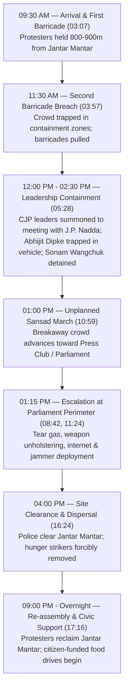

# Detailed Study Notes — 20th July 2026 CJP Sansad March & Jantar Mantar Protest

## 1. Executive Summary

- **Title**: 20th July 2026 BJP Called CJP Supporters Pakistani, Then Police Stopped Their March to Parliament
- **Creator / Presenter**: [[Aditya Kakkar]]
- **Published Date**: 2026-07-21
- **Source Link**: [YouTube Video](https://www.youtube.com/watch?v=6UHQFMc2-c4&t=1s)
- **Primary Subject**: Eyewitness reportage, tactical analysis, and political commentary on the 20 July 2026 protest organized by the Cockroach Janta Party (CJP) at Jantar Mantar and the subsequent attempt to march to the Indian Parliament in New Delhi.

### Overview of Events
On 20 July 2026, thousands of student protesters and activists organized by the CJP gathered at Jantar Mantar, New Delhi, demanding educational reforms, systematic prevention of exam paper leaks, and accountability from Union Education Minister Dharmendra Pradhan. The demonstration escalated when police enforced heavy multi-layered barricading, network jamming, tear gas deployment, and baton charges to block protesters from marching toward Parliament. 

The video presents an eyewitness breakdown of police containment tactics, media narratives framing protesters as "Pakistani elements," parliamentary reactions, and the subsequent overnight reclamation of the protest site by students supported by civic food drives.

---

## 2. Event Timeline & Containment Architecture

---

## 3. Chronological Section Breakdown

### 00:00 – 00:28 | Initial Footage of Police Action
- Video opens with raw footage showing police officers striking student protesters with batons (`00:11`).
- Eyewitness narration highlights police targeting young protesters and striking individuals from behind as they attempt to retreat.

### 00:29 – 01:19 | Eyewitness Allegations & Sarcastic Critique
- The speaker sarcastically offers an "apology" to Prime Minister Narendra Modi, Home Minister Amit Shah, BJP President J.P. Nadda, and the Delhi Police for having participated in what state-aligned media characterized as a "Pakistani crowd" (`00:29`).
- Specific eyewitness allegations of police force against peaceful demonstrators include:
  - Male police officers physically stepping on female protesters' chests (`00:29`).
  - Baton strikes directed at the heads of demonstrators, resulting in severe head lacerations (`00:29`).
  - A 12-year-old girl suffering head injuries during the crowd action (`00:29`).
  - Sonam Wangchuk's wife being forcibly dragged and pulled by her hair by police personnel (`00:29`).

### 01:20 – 02:29 | Narrative Control, Expired Munitions, & Media Framing
- **Narrative Manipulation**: The speaker describes how police forces initiated baton charges while students were seated or standing peacefully (`00:54`). When frustrated students retaliated or pushed back, police personnel immediately produced handheld video cameras (`01:20`) to record the retaliation, creating selective media footage to portray the protest as violent (`00:54`).
- **Expired Tear Gas**: Protesters recovered used tear gas canisters deployed by law enforcement with printed expiration dates of December 2025 (`12/25`) (`01:37`), demonstrating the deployment of outdated riot control munitions against citizens.
- **Crowd Size Downplaying**: While eyewitnesses estimated the crowd between 50,000 and 100,000 individuals across Central Delhi, official police communications and mainstream media outlets reported attendance at 5,000 to 10,000 to minimize public impact (`02:01`).
- **Media Angle**: News networks (specifically referencing NDTV) broadcasted angles framing the demonstration as having a "Pakistani angle" or foreign-backed infiltration (`02:01`).

### 02:30 – 03:06 | Public Impact & Media Accountability
- **Traffic Gridlock**: Heavy police blockades across Central Delhi caused gridlock, stranding commuters and office-goers for hours on routes that normally take minutes (`02:30`).
- **Media Criticism**: The speaker strongly criticizes mainstream broadcast networks and state-aligned digital commentators ("Godi YouTubers"), asserting that independent digital coverage has eclipsed traditional prime-time television viewership (`03:07`).

### 03:07 – 04:44 | Eyewitness Navigation: The Barricade System
- **Arrival at 09:30 AM**: Arriving near Jantar Mantar, the presenter was forced to disembark vehicles 800 to 900 meters away due to perimeter blockades (`03:07`).
- **Containment Traps**: Police established multi-layered perimeter barricades:
  - **First Barricade**: Thousands of citizens were held back outside the 900m mark. Once allowed through after initial pushing, they encountered a second barricade (`03:34`).
  - **Second Barricade (2-Hour Hold)**: Police locked thousands of protesters in the narrow corridor between the first and second barricades for over two hours (`03:57`). Protesters attempting to stand or move forward were met with baton strikes.
  - **Barricade Removal**: Protesters eventually pulled back and moved several police barricades to force passage toward Jantar Mantar (`03:57`).

### 04:45 – 05:27 | Tactical Fragmentation Strategy
- **Isolation Chambers**: Police avoided allowing the crowd to consolidate at Jantar Mantar. Instead, they sealed off Jantar Mantar's internal core and split incoming protesters into isolated pockets of 2,000 to 3,000 people across connecting avenues, Connaught Place (CP), and Metro stations (`04:45`, `05:14`).
- **Metro Blockades & Gridlock**: Access points at Connaught Place and surrounding arterial roads were locked down, preventing incoming student groups from reaching the main protest staging ground (`05:14`).

### 05:28 – 06:25 | Leadership Neutralization & Delays
- **De-facto Detention of Leadership**:
  - CJP leader Abhijit Dipke was immobilized inside his vehicle surrounded by crowd barriers at Jantar Mantar (`05:28`).
  - CJP representatives, including Saurav Das, were summoned to meet BJP National President J.P. Nadda at 12:00 PM. They were kept waiting inside the meeting facility until 02:30 PM (`05:28`), leaving the 50,000-person crowd on the streets without coordinated leadership for hours.
- **Sonam Wangchuk**: Climate activist and CJP figure Sonam Wangchuk was detained by authorities early in the day, while his wife was assaulted during the police action (`05:58`).

### 06:26 – 07:20 | Unidentified Personnel & Assault on Hunger Strikers
- **Plainclothes Personnel**: Multiple individuals in civilian clothing carrying police batons were documented striking protesters (`05:58`, `06:26`). When questioned by protesters on camera regarding their identity and lack of mandatory official name tags, the individuals refused to identify themselves (`06:26`).
- **Violence against Hunger Strikers**: Protesters who had been participating in a 21-day hunger strike at Jantar Mantar were forcibly removed from their ground mats, stepped on by police boots, and hit with batons while offering zero physical resistance (`06:43`).

### 07:21 – 08:41 | Official Denials vs. Field Reality
- **Contradictory Police Statements**: Official Delhi Police social media handles posted statements denying that any baton charges (*lathi charge*) had occurred. Eyewitness video recordings directly contradict these official claims (`07:01`, `08:13`).
- **Tactical Masking**: Armed personnel were observed removing their official name tags or putting them inside pockets upon instruction (`07:21`).
- **Stones & Projectiles**: Reports emerged of a truck delivering stones near the venue at 05:00 AM (`07:21`). While limited instances of stone-pelting by rogue elements occurred, eyewitnesses noted that fellow student protesters actively intervened to stop individuals carrying sticks or stones (`07:21`, `14:10`).
- **Core Demands**: The central demands of the protest were emphasized: educational accountability, robust measures against recurring exam paper leaks, and systemic administrative transparency (`07:55`).

### 08:42 – 10:48 | Information Control & Parliamentary Disruption
- **Signal Jamming & Internet Shutdowns**: Police deployed signal jammers and instituted localized mobile internet blackouts within a 2 km radius of Jantar Mantar (`08:42`, `09:01`). Cellular networks remained open for voice calls, but data upload speeds were throttled to prevent live streaming and real-time video uploads to social media (`09:01`).
- **Sonam Wangchuk Hospital Guard**: Sonam Wangchuk was held in hospital care under police guard, with requests for discharge denied (`09:24`).
- **Parliamentary Reaction**: Leader of the Opposition Mallikarjun Kharge raised the issue of police violence against students during the active session of Parliament (`10:18`). The parliamentary session faced heavy disruption and was subsequently adjourned (`10:18`).

### 10:49 – 13:25 | Breakaway March to Parliament & Armed Standoff
- **Unplanned Advance**: Around 01:00 PM, learning that CJP leadership was detained or held in negotiations, a breakaway crowd of thousands bypassed barriers and marched toward Parliament via the Press Club roundabout (`10:59`).
- **Security Response at Parliament Perimeter**:
  - Police panic ensued as the crowd reached the outer perimeter of Parliament (`10:59`).
  - Law enforcement fired tear gas into the crowd (`11:24`).
  - Armed security officers at the outer security gates unholstered service firearms and pointed them directly at student protesters (`11:24`).
- **Analysis of Security Action**: The presenter acknowledges that protecting Parliament is a national security mandate, but argues that deploying lethal firearms and pointing weapons at unarmed students protesting 30 days for educational reform represents an unconstitutional failure of state governance (`11:56`, `12:46`).

### 13:26 – 15:26 | Democratic Principles & Accountability
- **Public Servant Mandate**: The presenter argues that elected officials are public servants ("servants, not kings") and that demanding accountability for paper leaks is a fundamental patriotic right (`13:26`, `13:49`).
- **Electoral Warning**: The video warns the governing party of severe political consequences in upcoming state (Uttar Pradesh) and general elections if public grievances are dismissed with national security labels (`10:01`, `15:27`).

### 15:27 – 17:15 | Dispersal, Regional Comparisons, & Re-assembly
- **Regional Stability Context**: The presenter explicitly rejects calls to emulate violent overthrows seen in smaller states (e.g., Nepal, Bangladesh), arguing that destabilizing India's constitutional framework damages the nation for decades (`14:25`, `15:27`).
- **Post-Clearance Resurgence**:
  - By 04:00 PM, police forcibly cleared Jantar Mantar, dismantling tents and evicting all remaining protesters (`16:24`).
  - Following the clearance, Sonam Wangchuk issued a written message from hospital confirming the continuation of his hunger strike (`16:56`).
  - CJP leadership issued a public call to reclaim Jantar Mantar until Union Education Minister Dharmendra Pradhan resigns (`17:16`).

### 17:16 – 19:09 | Citizen Support & Sustained Protest
- **Overnight Reclamation**: By late evening on 20 July, thousands of students returned and successfully reoccupied Jantar Mantar (`17:16`).
- **Civic Food Drives**: Citizens across Delhi funded supply chains via food delivery platforms (Zomato/Swiggy), delivering pizzas, burgers, rolls, and water packages to sustain protesters through the rain (`17:16`, `17:41`).
- **Political & Medical Aid**: Opposition figures and legal support teams arrived to assist injured students (`17:41`).
- **Closing Pledge**: The creator commits to ongoing independent coverage and financial support for food supplies for the student movement (`18:38`).

---

## 4. Key Comparative Matrices

### Table 1: Official State Claims vs. Eyewitness Field Evidence

| Metric / Event Topic | Official Police / Media Stance | Eyewitness & Video Field Evidence | Timestamp Citation |
| :--- | :--- | :--- | :--- |
| **Baton Charge (Lathi Charge)** | Denied via official police tweets; claimed no force was used. | Verified video footage of police striking seated/retreating students. | `00:11`, `07:01` |
| **Crowd Size** | Reported at 5,000 to 10,000 protesters. | Estimated at 50,000+ spread across CP, Jantar Mantar, & Sansad Marg. | `02:01`, `05:14` |
| **Protester Identity** | Framed by broadcast channels (NDTV) as "Pakistani elements". | Verified Indian students protesting exam paper leaks and education reforms. | `00:29`, `02:01`, `13:26` |
| **Riot Control Munitions** | Standard non-lethal crowd control deployed. | Tear gas canisters deployed were expired (marked expiry `12/25`). | `01:37` |
| **Personnel Identification** | Standard uniformed police deployment. | Plainclothes individuals carrying batons without mandatory name tags. | `05:58`, `06:26` |
| **Internet Status** | Standard operational network conditions. | Localized data shutdown and jammer deployment within a 2 km radius. | `08:42`, `09:01` |

---

### Table 2: Key Stakeholders & Roles

| Stakeholder / Entity | Role / Position | Key Actions & Impact on 20th July 2026 | Timestamp Citation |
| :--- | :--- | :--- | :--- |
| **Cockroach Janta Party (CJP)** | Organizing political/student entity | Called the Jantar Mantar protest and Sansad March for educational reform. | `00:15`, `04:45` |
| **[[Aditya Kakkar]]** | Independent creator & eyewitness reporter | Documented ground reality, barricades, police actions, and user support. | `00:29`, `03:07`, `18:38` |
| **Sonam Wangchuk** | Climate activist & CJP aligned figure | Detained by police early; wife assaulted; continued hunger strike from hospital. | `00:29`, `05:58`, `16:56` |
| **Abhijit Dipke** | CJP Leader | Trapped inside vehicle by police barriers at Jantar Mantar during protest. | `05:28`, `05:58` |
| **Saurav Das** | CJP Representative | Summoned to meeting with J.P. Nadda; held in negotiation hold for 2.5 hours. | `05:28`, `10:49` |
| **J.P. Nadda** | BJP National President | Held CJP leadership in prolonged meeting while police contained streets. | `05:28` |
| **Mallikarjun Kharge** | Leader of Opposition (Parliament) | Raised police violence against students in Parliament, leading to adjournment. | `10:18` |
| **Dharmendra Pradhan** | Union Minister of Education | Targeted by protest; resignation demanded as primary condition for clearance. | `17:16`, `18:38` |
| **Delhi Police & Security Forces** | State Law Enforcement | Executed multi-tier barricades, signal jamming, tear gas, and baton charges. | `01:20`, `04:45`, `11:24` |

---

## 5. Direct Translated Quotes

> *"Look at that! Police are beating students! Look at how they are hitting the kids! Look at that—chasing them from behind and lathi-charging the children!"* (`00:11`)  
> — **Eyewitness Footage Audio**

> *"Before starting this video, I want to apologize to PM Modi, Amit Shah, J.P. Nadda, and the Delhi Police. I am so sorry, because yesterday I was part of a 'Pakistani crowd', and the Delhi Police did the exact right thing with that Pakistani crowd. Male police stepped on young women's chests with their boots, struck their heads with batons, and fractured their skulls. A 12-year-old girl's head was split open. Sonam Wangchuk's wife was dragged away by her hair."* (`00:29`)  
> — **[[Aditya Kakkar]]**

> *"They turned a non-violent protest into a violent one. Children were sitting peacefully; you launched a baton charge against them. They were standing quietly with zero issues. And the moment they retaliated, you pulled out your cameras to record them and turn it into a national sensation."* (`00:54`)  
> — **[[Aditya Kakkar]]**

> *"The expiry date on these tear gas shells being fired at us reads 12/25. At least bring non-expired munitions to use against us!"* (`01:37`)  
> — **Protester / [[Aditya Kakkar]]**

> *"Where are your name tags? Where is your nameplate? Please answer us. You are standing here in plain civilian clothes—how are we supposed to know you are an officer? Why do you have a baton in your hand?"* (`05:58`, `06:26`)  
> — **Student Protesters to Plainclothes Officers**

> *"I am speaking about the future of lakhs of students, and today thousands of children have gathered at Jantar Mantar for that cause. A lathi charge has taken place there; the government is trying to strike them down and suppress them!"* (`10:18`)  
> — **Mallikarjun Kharge (in Parliament)**

> *"The ruler is not a king sitting on a throne—he is a public servant. We are the sovereign citizens. The country exists for us. His duty is to serve us. We shouldn't have to beg, but even when we demand accountability from our servants, pointing guns at us is completely unjustifiable."* (`13:49`)  
> — **[[Aditya Kakkar]]**

> *"Delhi Police and the Central Government should listen clearly: We are not moving. We are not afraid. We have returned to Jantar Mantar and we will not budge until Dharmendra Pradhan resigns. Jai Hind, Jai Bharat!"* (`17:16`)  
> — **CJP Official Statement**

---

## 6. Terminology & Entity Directory

- **Cockroach Janta Party (CJP)**: A political/student movement organization leading protests against educational administrative failures and exam paper leaks in India.
- **Sansad March**: A planned protest procession marching from public demonstration grounds (Jantar Mantar) toward the Indian Houses of Parliament (Sansad Bhavan).
- **Jantar Mantar**: The designated official protest site in New Delhi, located approximately 2 km from the Parliament building.
- **Lathi Charge**: A tactical crowd control maneuver employed by Indian law enforcement involving organized baton strikes.
- **Paper Leak**: The unauthorized pre-examination distribution of standardized national competitive exam test papers, affecting millions of Indian students.
- **Godi Media / YouTubers**: Colloquial term used to describe media channels or digital influencers alleged to align uncritically with state or ruling party messaging.
- **Signal Jamming**: The intentional deployment of electronic countermeasures to disrupt cellular data transmission (4G/5G) within a localized geographical perimeter.

---

## 7. Metadata & Source Links

- **Original Raw Capture**: [[01_RAW/SOURCE/20th july 2026BJP Called CJP Supporters Pakistani, Then Police Stopped Their March to Parliament.md]]
- **Parent Navigation Map**: [[03_MOC/yt-moc|📺 YouTube Map of Content]]
