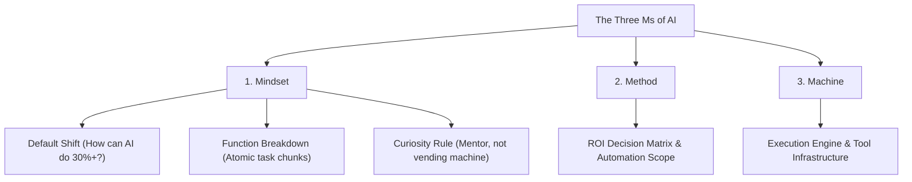
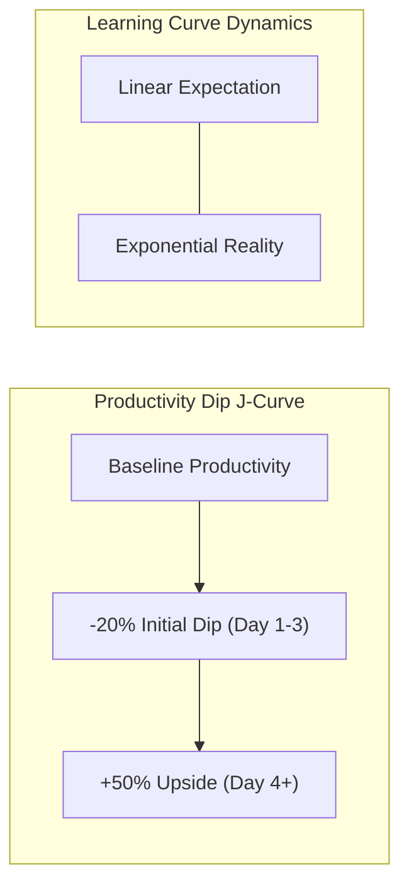
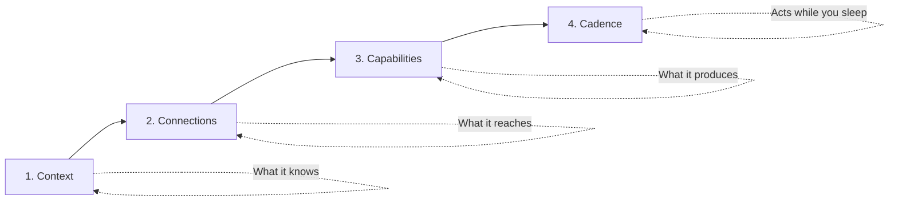
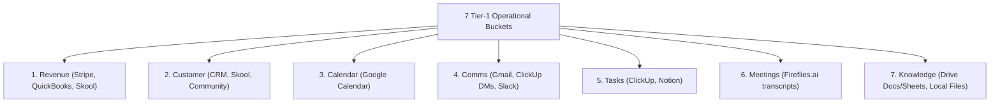
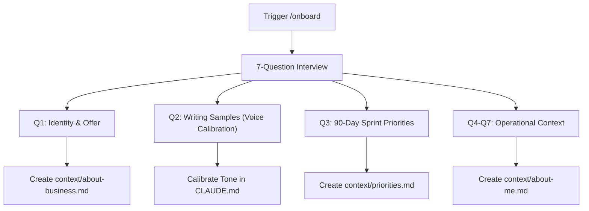
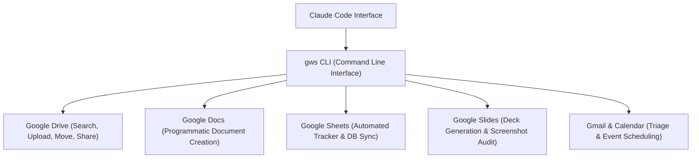
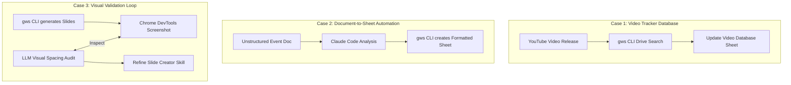

---
id: 8d4b2e10-4f3a-4c28-91b7-a50d2e8b1932
title: "Build & Sell Claude Code Operating Systems (2+ Hour Course) - Part 1"
type: literature-note
status: learning
domain: ai
source_type: youtube
created: 2026-08-12
updated: 2026-08-19
review: 2026-08-30
confidence: 95
version: 1
aliases:
  - "Claude Code Operating System Part 1"
  - "AIOS Walkthrough Part 1"
tags:
  - yt
  - ai
  - tools
  - productivity
  - implementation
owner_moc: Prompt Engineering MOC
sources:
  - "[[01_RAW/SOURCE/Build & Sell Claude Code Operating Systems (2+ Hour Course).md]]"
  - "https://www.youtube.com/watch?v=bCljOfCH8Ms"
related: []
schema_version: 4
part: "1 of 5"
segment_timestamps: "0:00 - 1:06:00"
---

# Build & Sell Claude Code Operating Systems (2+ Hour Course) — Part 1

## Overview

- **Source Title**: Build & Sell Claude Code Operating Systems (2+ Hour Course)
- **Creator**: [[Nate Herk | AI Automation]]
- **Watch URL**: [YouTube Link](https://www.youtube.com/watch?v=bCljOfCH8Ms)
- **Published Date**: 2026-05-01
- **Segment Coverage**: Part 1 of 5 (`0:00 - 1:06:00`)
- **Primary Domain**: AI Automation, Agentic Workflows, System Architecture

### Executive Summary

Part 1 of this masterclass establishes the architectural foundation and conceptual framework for constructing a personal AI Operating System (AIOS) inside Claude Code (and compatible IDE environments like VS Code or Codex). Nate Herk outlines the transition from simple chat assistants to an integrated intelligence layer sitting directly above your files, communications, and business toolchains. 

The core operating philosophy rests on two foundational mental frameworks: **The Three Ms of AI** (Mindset, Method, Machine) and **The Four Cs of an AIOS** (Context, Connections, Capabilities, Cadence). The course walks step-by-step through setting up a tool-agnostic local repository, running a 7-question onboarding scaffold, integrating ClickUp via token-efficient API endpoints, conducting diagnostic health audits (`/audit` and `/level-up`), and deploying the Google Workspace CLI (`gws`) for zero-overhead document, sheet, and slide automation.

---

## High-Fidelity Chronological Breakdown

### 1. Introduction & The AI Operating System Concept (0:00 - 3:30)

#### 1.1 Definition of an AIOS
- An operating system (OS) traditionally acts as the invisible system layer between user hardware and software applications.
- An **AI Operating System (AIOS)** adds an intelligence layer on top of your OS via an agentic environment (such as Claude Code inside VS Code).
- Rather than constantly context-switching across browser tabs, CRMs, and chat apps, the operator manages the entire business execution loop from a single unified terminal interface.

#### 1.2 Key Advantages of Intelligence-Augmented Workspaces
1. **Full Contextual Awareness**: Sees local files, project communications, and database entries simultaneously.
2. **Actionable Interoperability**: Does not merely read data—it interacts with APIs, executes scripts, and mutates external states.
3. **Superior Recall**: Eliminates "work about work" (searching for misplaced documents across Slack, Google Drive, or email).
4. **Tool Agnosticism**: Built on a durable architectural layer underlying specific LLM models, SDKs, or IDE wrappers. Moving between tools (e.g., from Claude Code to Codex or Antigravity) takes minutes because the file structure and markdown context remain constant.

> *"When we add intelligence on top of our operating system, we have an AI that can see all of our files, all of our communication, everything important going on in the business... It can find it quicker than you can because you're a human and you use a brain and you forget things."* (1:30)

---

### 2. The Three Ms of AI Framework (3:30 - 11:30)

The Three Ms define the cognitive, tactical, and technological paradigm required for leverage: **Mindset**, **Method**, and **Machine**.



#### 2.1 The Mindset Tier (3 Core Habits)
1. **The Default Shift**: Before performing any repetitive task, ask: *"How can AI do this, or at least handle 30% to 75% of it?"* Leverage is rarely binary (0% or 100%); every task has a leverage percentage.
2. **Function Breakdown**: Deconstruct large jobs (e.g., "producing a YouTube video") into discrete atomic sub-functions (ideation → scripting → slide deck build → packaging → description update → comment triage). Each automated chunk becomes a modular, reusable building block for other workflows.
3. **The Curiosity Rule**: Treat AI as a mentor, not a vending machine. Avoid accepting code or outputs without understanding *why* it was generated. Question edge-case behaviors and design trade-offs.

#### 2.2 Productivity Curves: The J-Curve & Exponential Learning



| Metric / Concept | Linear Expectation | Exponential Reality | Operational Takeaway |
|---|---|---|---|
| **Productivity Dip** | Immediate gains from Day 1 | 20% output drop during initial onboarding (Days 1–3) | Temporary productivity loss is required to achieve 50%–300% long-term efficiency gains. |
| **Learning Curve** | Steady, linear progression | Lagging performance early on, followed by exponential curve inflection (Day 3+) | Most operators abandon AI systems during the early dip gap before breaking even. |

---

### 3. The Four Cs of an AIOS (11:30 - 15:00)

The Four Cs form the sequential construction pipeline for an AI Operating System. Each phase builds upon the previous stage.



| Pillar | Definition | Implementation Example | Verification Metric |
|---|---|---|---|
| **1. Context** | What the AI knows about you, your business, offer, voice, and quarterly goals. | Core markdown files in `context/` (`about-me.md`, `about-business.md`, `priorities.md`). | AI answers questions like an executive partner rather than a generic LLM. |
| **2. Connections** | What external data sources, APIs, and databases the AI can read and write to. | ClickUp API, Google Workspace CLI (`gws`), Slack, Fireflies transcripts, Stripe. | AI retrieves real-time internal data without manual copy-pasting. |
| **3. Capabilities** | Custom SOPs packaged into executable recipes/skills (`skill.md`). | Client onboarding skill, slide deck generator, ticket routing workflow. | Executing complex multi-step processes via a single natural language trigger. |
| **4. Cadence** | Autonomous background execution and scheduled loops operating without human input. | Cloud routines, night-shift summaries, periodic CRM syncs. | System executes tasks asynchronously while your laptop is closed. |

---

### 4. Mapping Your Tools (15:00 - 20:30)

Before wiring integrations, map your core business operations across the **7 Tier-1 Operational Buckets**:



| Bucket | Purpose / Focus | Nate's Primary Tools | Connection Mechanism |
|---|---|---|---|
| **1. Revenue** | P&L tracking, expense auditing, sales growth | Skool, Stripe, QuickBooks | API / Webhooks / Browser Automation |
| **2. Customer** | User feedback, CRM profile, community health | Skool, YouTube comments | Platform APIs / Scrapers |
| **3. Calendar** | Availability, time-blocking, meeting scheduling | Google Workspace (Calendar) | `gws` CLI / Google Calendar API |
| **4. Comms** | Internal & external communications | Gmail, ClickUp Chat, Slack | `gws` CLI / ClickUp API / Slack API |
| **5. Tasks** | Sprint goals, task assignment, deadlines | ClickUp, Notion | ClickUp REST API V2 |
| **6. Meetings** | Call summaries, action items, transcript logs | Fireflies.ai | Fireflies GraphQL / API |
| **7. Knowledge** | SOPs, video transcripts, raw assets, sheets | YouTube Transcripts, Google Drive, Local | Local filesystem / `gws` CLI |

---

### 5. Repository Setup & VS Code Architecture (20:30 - 29:00)

#### 5.1 System Folder Structure
The template repository provides a standardized workspace directory structure:

```text
AIOS-Workspace/
├── .claude/
│   └── skills/                  # Custom executable skills / recipes
│       ├── audit/
│       │   └── skill.md
│       ├── level-up/
│       │   └── skill.md
│       └── onboard/
│           └── skill.md
├── context/                      # Business & personal context files
│   ├── about-business.md
│   ├── about-me.md
│   └── priorities.md
├── archives/                     # Deprecated or stale context files
├── decisions/                    # Immutable log of architectural decisions
├── references/                   # API docs & reference sheets (e.g., 3-ms.md, clickup-api.md)
├── CLAUDE.md                     # Master system prompt & project directory guide
└── .env                          # Secret key store (API tokens, API credentials)
```

#### 5.2 The Master Control Plane (`CLAUDE.md`)
- `CLAUDE.md` acts as the master system prompt for Claude Code.
- Defines the agent's identity (*"You are Nate's personal AIOS thought partner"*).
- Maps where files live and dictates rules for loading skills, updating context files, and maintaining token efficiency.

#### 5.3 Skill Architecture (`skill.md`)
A **skill** is an executable markdown file detailing an SOP for a recurring workflow.
- **Header Metadata**: Name, description, operational parameters.
- **Execution Phases**: Sequential step-by-step instructions.
- **Self-Correction & Evolution**: When a skill encounters an API error or edge-case, the agent updates the `skill.md` file to prevent future failures.

---

### 6. The Onboarding Skill (`/onboard`) (29:00 - 36:30)

The `/onboard` command initiates a 7-question interactive interview that populates initial Day-1 context files.



#### Key Onboarding Files Generated
1. `context/about-business.md`: Documents target audience (ICP), pricing models, service offerings, and core value proposition.
2. `context/about-me.md`: Stores owner profile, personal working style, pain points, and preferences.
3. `context/priorities.md`: Tracks quarterly milestones, sprint goals, and high-impact leverage points.

---

### 7. Connecting ClickUp: API vs. MCP Architecture (36:30 - 47:30)

#### 7.1 Architecture Comparison: REST API Endpoints vs. MCP Servers

```mermaid
flowchart TD
    subgraph MCP Server Route
        M1["MCP Server"] --> M2["Exposes ALL 100+ Endpoints"]
        M2 --> M3["High Token Consumption"]
    end
    
    subgraph REST API + Reference Sheet Route (Recommended)
        R1["ClickUp REST API V2"] --> R2["Local Reference Doc (clickup-api.md)"]
        R2 --> R3["Targeted Call via Curl/Fetch"]
        R3 --> R4["Token-Efficient Execution"]
    end
```

| Dimension | Model Context Protocol (MCP) | Direct REST API Endpoints (Recommended) |
|---|---|---|
| **Setup Complexity** | Plug-and-play via MCP configuration | Requires initial API endpoint research pass |
| **Token Overhead** | **High**: Loads tool definitions into context window on every turn | **Low**: Reads reference markdown file only when executing task |
| **Control & Permissions** | Exposes full capabilities (risks accidental broad mutations) | Granular control via targeted HTTP calls |
| **Security Best Practice** | Shared account API keys | Dedicated service account (e.g., `UPP AI` ClickUp user) with restricted scopes |

#### 7.2 Integration Step-by-Step
1. **Dedicated Service Account**: Create a dedicated bot user in ClickUp (e.g., `UPP AI`) to manage API permissions independently of personal owner credentials.
2. **Secure Token Storage**: Generate a personal API token in ClickUp Settings → API. Store inside `.env` (`CLICKUP_API_TOKEN=...`). Never expose tokens in chat history.
3. **Reference File Scaffolding**: Command Claude Code to perform a one-time research crawl of ClickUp API V2 documentation, creating `references/clickup-api.md`.
4. **Validation Test**: Execute a test snapshot call to verify team workspace ID, endpoint resolution, and task querying capabilities.

---

### 8. Health Diagnostics: Audit & Level Up Skills (47:30 - 51:30)

#### 8.1 The `/audit` Skill
Scans the current AIOS workspace against the Four Cs framework and returns a numerical rating out of 100 with prioritized remediation gaps.

```text
Four Cs Health Score Breakdown:
- Context: 18/25
- Connections: 16/25
- Capabilities: 10/25
- Cadence: 10.5/25
Total Score: 54.5 / 100 (Day 1 Baseline)
```

#### 8.2 The `/level-up` Diagnostic Interview
To identify high-leverage automation targets, `/level-up` poses 5 diagnostic questions:

1. **Drudgery Audit**: *"What manual task did you perform 3+ times this past week?"*
2. **Smart Intern Test**: *"What task could a smart intern handle, but you did yourself because explaining it felt too slow?"*
3. **Constraint / Scale Test**: *"If 500 new clients signed up tomorrow, what part of your operations would break first?"*
4. **Growth Lever**: *"What operational process would yield 500 new clients if run on autopilot?"*
5. **System Bottleneck**: *"Where are tasks stalling due to manual handoffs?"*

---

### 9. Google Workspace CLI (`gws`) Deep Dive (51:30 - 1:06:00)

The **Google Workspace Command Line Interface (`gws`)** is a lightweight, open-source tool developed by Google that exposes Drive, Docs, Sheets, Slides, Gmail, and Calendar via unified CLI commands.



#### 9.1 Key Advantages of `gws` CLI over APIs / MCPs
- **Unified Single Interface**: Replaces 6 separate API integrations with one binary tool.
- **Zero Token Overhead**: Uses native CLI commands instead of polluting LLM context with heavy OpenAPI schemas.
- **Auto-Discovery**: Automatically syncs when Google releases new endpoints without code updates.
- **Built-in Workflow Recipes**: Ships with 100+ pre-built multi-step skills (e.g., converting markdown to formatted docs, building sheets from templates).

#### 9.2 Real-World Case Studies Demonstrated



1. **Automated Video Database**: Automatically tracks uploaded YouTube videos, pulling summaries, thumbnail links, and resource files into a master Google Sheet.
2. **Doc-to-Tracker Transformation**: Analyzes raw meeting/event planning documents and programmatically constructs a color-coded Google Sheet with status dropdowns and assignee tags.
3. **Visual Slide Deck Generation & Screenshot Validation**: Generates Google Slides decks programmatically, captures slide screenshots via Chrome DevTools, inspects layout spacing visually, and self-corrects formatting errors automatically.

#### 9.3 Setup Procedure for `gws` CLI
1. **Google Cloud Console Project**: Create a new GCP project (e.g., `claude-code-gws`).
2. **OAuth Consent Screen**: Configure internal/external OAuth credentials.
3. **Credentials Export**: Download OAuth Client ID JSON credentials and place in `~/.config/gws/client_secret.json`.
4. **API Activation**: Enable APIs for Drive, Docs, Sheets, Slides, Gmail, and Calendar.
5. **Authentication**: Execute `gws auth login` to authenticate the CLI locally.

---

## Technical Summary & Command Reference

### Executive Skill Commands Introduced in Part 1

| Command | Purpose | Output / Artifact |
|---|---|---|
| `/onboard` | Executes 7-question initial intake | Populates `context/about-business.md`, `about-me.md`, `priorities.md` |
| `/audit` | Evaluates four Cs health score | Generates health report and gap remediation list |
| `/level-up` | Conducts bottleneck interview | Identifies next custom skill candidate to build |
| `gws auth login` | Authenticates Google Workspace CLI | Enables Drive, Docs, Sheets, Slides terminal automation |

---

## Verbatim Quotes & Key Takeaways

### Core Architectural Principles
- **Tool Agnosticism**: *"Build things to be tool-agnostic because tools change every 6 months... We are building the durable layer that sits underneath all these tools and buzzwords."* (2:26)
- **Mindset over Motivation**: *"Mindset isn't motivation. It's the lens that finds the leverage percentage."* (8:19)
- **Mentor vs. Vending Machine**: *"Treat AI as a mentor, not a vending machine. Vending machines take a coin and give you something. Mentors ask questions, push back, and make you sharper."* (8:19)

---

## Source & File Metadata Connections

- **Original Capture Source**: `[[01_RAW/SOURCE/Build & Sell Claude Code Operating Systems (2+ Hour Course).md]]`
- **Master Directory Prompt**: `[[CLAUDE.md]]`
- **Reference Schemas**: `[[references/3-ms.md]]`, `[[references/clickup-api.md]]`
