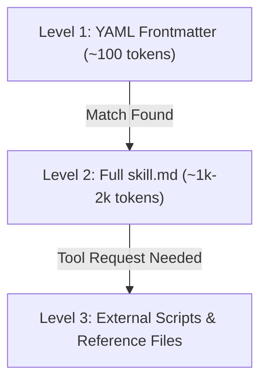
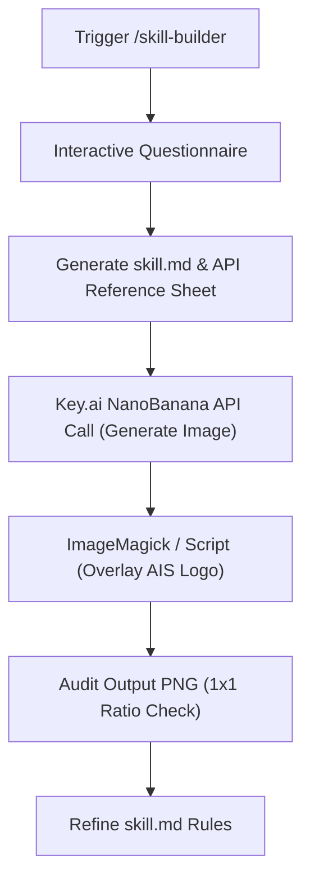

---
id: b47c91d2-3a8e-4f12-b921-1d7e8290fa41
title: "Build & Sell Claude Code Operating Systems (2+ Hour Course) - Part 2"
type: literature-note
status: learning
domain: ai
source_type: youtube
created: 2026-08-12
updated: 2026-08-19
review: 2026-08-30
confidence: 95
version: 1
aliases:
  - "Claude Code Operating System Part 2"
  - "Building Custom Agent Skills Part 2"
tags:
  - yt
  - ai
  - tools
  - productivity
  - implementation
owner_moc: Prompt Engineering MOC
sources:
  - "[[01_RAW/SOURCE/Build & Sell Claude Code Operating Systems (2+ Hour Course).md]]"
  - "https://www.youtube.com/watch?v=bCljOfCH8Ms"
related: []
schema_version: 4
part: "2 of 5"
segment_timestamps: "1:06:00 - 1:35:30"
---

# Build & Sell Claude Code Operating Systems (2+ Hour Course) — Part 2

## Overview

- **Source Title**: Build & Sell Claude Code Operating Systems (2+ Hour Course)
- **Creator**: [[Nate Herk | AI Automation]]
- **Watch URL**: [YouTube Link](https://www.youtube.com/watch?v=bCljOfCH8Ms)
- **Segment Coverage**: Part 2 of 5 (`1:06:00 - 1:35:30`)
- **Primary Focus**: Capabilities, Skill Anatomy, Parallel Agent Execution, Progressive Context Loading, 6-Step Skill Building Framework, Live Infographic Skill Build

---

## High-Fidelity Chronological Breakdown

### 1. Capabilities & Building Skills Overview (1:06:00 - 1:08:11)

#### 1.1 The Definition of Capability
- **Capabilities** represent the third C of the Four Cs framework. While Context gives knowledge and Connections give data reach, Capabilities dictate what an AIOS can *produce* and *execute*.
- Primary mechanism: **Building Skills**—reusable, executable SOP recipes packaged inside `.claude/skills/`.

#### 1.2 Identifying Skill Candidates (The Weekly Task Audit)
To convert daily drudgery into skills, run this exercise:
1. Write down every manual action taken on Monday, Tuesday, and throughout the week.
2. Circle recurring tasks, high-friction tasks, or tasks you dislike.
3. Bring those circled items to Claude Code and say: *"I have this manual process [describe process]. Help me turn this into an automated skill."*

---

### 2. Live Demo: Parallel Agent Execution & Leverage (1:08:11 - 1:13:58)

#### 2.1 Parallel Execution Demo
Nate demonstrates triggering four independent sub-agents simultaneously in VS Code, executing distinct skills in parallel:

```mermaid
flowchart TD
    User Prompt --> A1["Agent 1: /morning-coffee"]
    User Prompt --> A2["Agent 2: /pulse-check"]
    User Prompt --> A3["Agent 3: Excalidraw Visualizer"]
    User Prompt --> A4["Agent 4: YouTube Comment Scraper"]
    
    A1 --> O1["Calendar & ClickUp Daily Schedule"]
    A2 --> O2["Quarterly Milestone Status & Follow-ups"]
    A3 --> O3["Editable Excalidraw Architecture Diagram"]
    A4 --> O4["Comment Sentiment & Topic Priority Analysis"]
```

1. **`morning-coffee`**: Pulls Google Calendar availability and ClickUp priorities, building an optimized daily time-block schedule.
2. **`pulse-check`**: Audits active quarterly projects, identifying bottleneck items requiring manual owner follow-up.
3. **Excalidraw Diagram Generator**: Programmatically constructs editable `.excalidraw` diagram files comparing local vs. closed-source LLMs without spelling or rendering artifacts.
4. **YouTube Comment Analysis**: Scrapes recent video comments via API, categorizing viewer feedback, technical questions, and requested topics.

> *"I've been recording now this video for about 6 minutes. Just think about if I would have done all four of those things myself, how much context switching I would have done and how long that would have taken me."* (1:10:58)

---

### 3. Anatomy & Architecture of a Skill (1:13:58 - 1:21:40)

#### 3.1 File Structure & Frontmatter Schema
A skill lives inside `.claude/skills/<skill-name>/` or globally in `~/.claude/skills/<skill-name>/`.

```text
.claude/skills/excalidraw-diagram/
├── skill.md                     # Executable markdown brain (YAML + Workflow SOP)
├── references/                  # Reference documents & JSON specs
└── scripts/                     # Python / JS execution scripts
```

```yaml
---
name: excalidraw-diagram
description: Generates clean, editable Excalidraw architectural diagrams from concept prompts.
---
```

#### 3.2 Context Loading Architecture: Self-Contained vs. Referenced

```mermaid
flowchart TD
    subgraph Option A: Self-Contained
        A1[".claude/skills/infographic/"] --> A2["skill.md"]
        A1 --> A3["scripts/"]
        A1 --> A4["references/"]
    end
    
    subgraph Option B: Decoupled / Global Reference (WAT Architecture)
        B1[".claude/skills/idea-mining/skill.md"] -. Points to .-> B2["references/youtube-channel.md"]
        B1 -. Points to .-> B3["scripts/analyze-yt.py"]
    end
```

- **WAT Framework Alignment**:
  - **Workflows (W)** = `skill.md` SOP instructions.
  - **Agents (A)** = Claude Code execution loop.
  - **Tools (T)** = Custom scripts (`.py`, `.js`) or reference files (`.md`, `.json`).

#### 3.3 Progressive Context Loading (Token Efficiency)
To prevent context rot and excessive token drain, Claude Code uses a 3-tier loading mechanism:



| Level | Scope Loaded | Token Cost | Action Triggered |
|---|---|---|---|
| **Level 1** | Name & Description YAML frontmatter | ~100 tokens | Scanned on every prompt to identify relevant skills. |
| **Level 2** | Full `skill.md` workflow text | ~1,000–2,000 tokens | Loaded only when the skill is explicitly or implicitly invoked. |
| **Level 3** | Associated scripts and reference docs | Variable (On-demand) | Read or executed only when specific workflow steps require them. |

---

### 4. The 6-Step Skill Building Framework (1:21:40 - 1:25:50)


1. **Name & Trigger**: Define canonical skill name and exact natural language / slash command triggers.
2. **One-Sentence Goal**: Specify the exact expected output file or system mutation.
3. **Step-by-Step SOP**: Detail the manual process, decisions, and logic order.
4. **Reference Files**: Attach style guides, brand assets, schemas, and API documentation.
5. **Rules & Guardrails**: Add explicit constraints based on historical failure edge-cases.
6. **Feedback Loop**: Execute, audit output, give feedback, and update `skill.md` iteratively.

---

### 5. Live Skill Build: Educational Infographic Generator (1:25:50 - 1:32:14)

Nate builds a custom `infographic-builder` skill live using the `/skill-builder` meta-skill:



#### Iterative Refinement Process
- **Iteration 1**: Generated an image, but the logo overlay had a solid white background box and incorrect aspect ratio.
- **Feedback Pass**: Updated `skill.md` rules to require a 1:1 aspect ratio constraint and transparent PNG logo compositing.
- **Iteration 2**: Produced a publication-ready 1:1 infographic with correct branding, valid typography, and crisp visual layout.

---

### 6. Debugging & Global vs. Project Skills (1:32:14 - 1:35:30)

#### 6.1 Diagnostic Symptom-to-Fix Matrix

| Failure Symptom | Underlying Root Cause | Corrective Action |
|---|---|---|
| Executing wrong steps or incorrect order | Ambiguous workflow phrasing in `skill.md` | Rewrite step-by-step SOP with explicit step numbers. |
| Inconsistent tone, voice, or style | Missing domain style guide | Add reference markdown doc and link in `skill.md`. |
| Repeating same mistake across runs | Missing edge-case guardrail | Add explicit `NEVER` rule in `Rules` section. |
| Excessive API tool searching | LLM re-crawling documentation on every run | Hardcode API endpoints into reference doc or skill file. |
| Skill triggers inappropriately | Overly broad YAML description | Restrict description or set `disable-model-invocation: true`. |

#### 6.2 Project vs. Global Skill Storage
- **Project Skills**: `.claude/skills/<skill-name>/` — Isolated to specific repo/workspace.
- **Global Skills**: `~/.claude/skills/<skill-name>/` — Available across all projects on your machine (e.g., universal front-end design skill, corporate voice skill).

---

## Verbatim Quotes & Key Takeaways

- **Leverage defined**: *"With Claude skills or any agent skills for that matter, you have way more leverage than if you were doing this by yourself."* (1:08:39)
- **SOPs for Agents**: *"They're basically SOPs for your AI agents. The same way where you would train a human employee by letting them read through an SOP... you just train an agent on it."* (1:13:27)
- **Token Efficiency of Local Markdown**: *"Processing markdown files for your agent is so much quicker and cheaper than actually making API calls or HTTP requests."* (1:24:59)

---

## Metadata Links

- **Source File**: `[[01_RAW/SOURCE/Build & Sell Claude Code Operating Systems (2+ Hour Course).md]]`
- **Part 1 Reference**: `[[01_RAW/PROCESS/detailed-study-notes-build-sell-claude-code-operating-systems-part-01.md]]`
