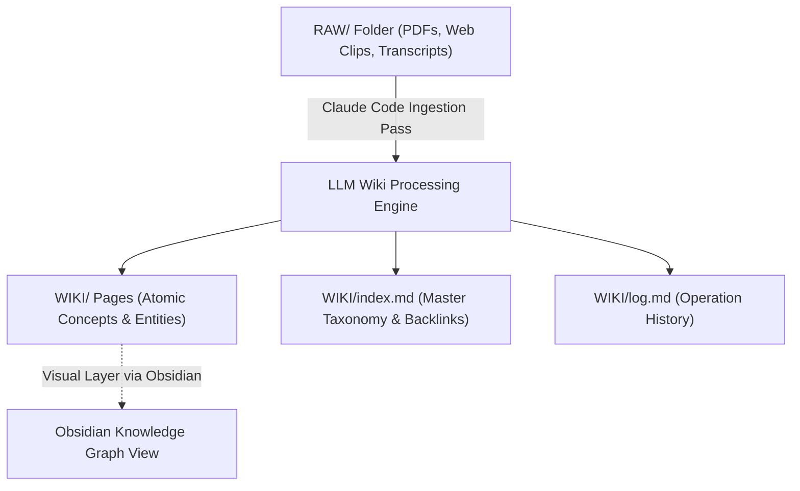
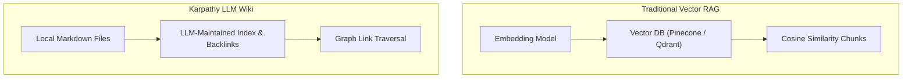
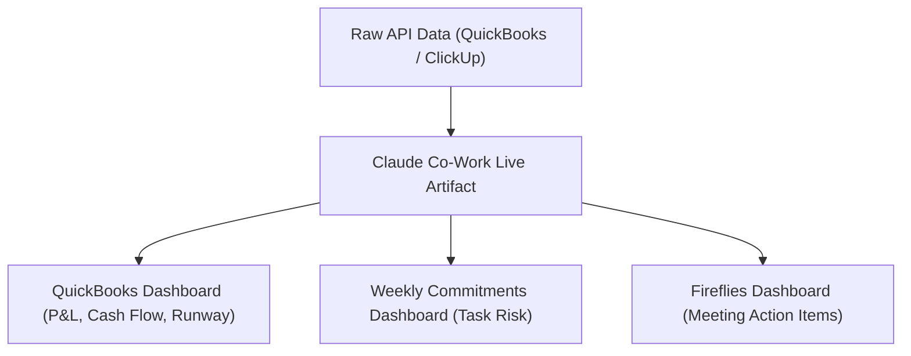
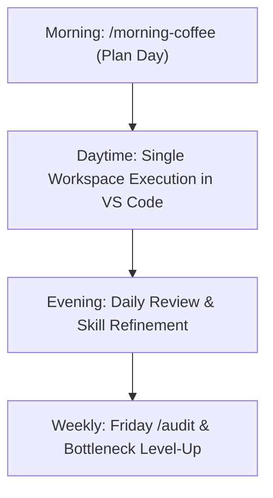
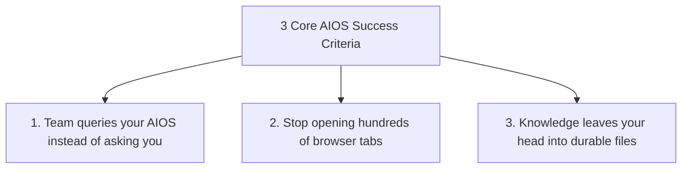

---
id: d98b12e3-5f4a-4b19-a83c-2e104768f921
title: "Build & Sell Claude Code Operating Systems (2+ Hour Course) - Part 4"
type: literature-note
status: learning
domain: ai
source_type: youtube
created: 2026-08-12
updated: 2026-08-19
review: 2026-08-30
confidence: 95
version: 1
aliases:
  - "Claude Code Operating System Part 4"
  - "Karpathy LLM Wiki and Dashboards Part 4"
tags:
  - yt
  - ai
  - tools
  - productivity
  - implementation
owner_moc: Prompt Engineering MOC
sources:
  - "[[01_RAW/SOURCE/Build & Sell Claude Code Operating Systems (2+ Hour Course).md]]"
  - "https://www.youtube.com/watch?v=bCljOfCH8Ms"
related: []
schema_version: 4
part: "4 of 5"
segment_timestamps: "2:05:00 - 2:32:00"
---

# Build & Sell Claude Code Operating Systems (2+ Hour Course) — Part 4

## Overview

- **Source Title**: Build & Sell Claude Code Operating Systems (2+ Hour Course)
- **Creator**: [[Nate Herk | AI Automation]]
- **Watch URL**: [YouTube Link](https://www.youtube.com/watch?v=bCljOfCH8Ms)
- **Segment Coverage**: Part 4 of 5 (`2:05:00 - 2:32:00`)
- **Primary Focus**: Karpathy's LLM Wiki Knowledge Architecture, Live Artifact Dashboards, POC Mindset, Daily Execution Loop, System Success Criteria

---

## High-Fidelity Chronological Breakdown

### 1. Karpathy's LLM Wiki Knowledge Architecture (2:05:00 - 2:23:33)

#### 1.1 The Concept of an LLM-Maintained Knowledge Base
- Proposed by Andrej Karpathy: Replaces complex vector databases and chunking pipelines with a flat directory of human-readable, cross-linked Markdown files.
- Instead of raw similarity search, the LLM maintains structural `index.md` files, entity relationship pages, and operational `log.md` logs.

#### 1.2 Web Clipping & Ingestion Protocol
1. Capture web articles, papers, or YouTube transcripts using **Obsidian Web Clipper**.
2. Save raw unformatted content directly to `RAW/`.
3. Command Claude Code: *"Ingest [file] into the wiki."*
4. Claude Code extracts key entities, creates linked concept pages in `WIKI/`, updates `index.md`, and logs the operation in `log.md`.

#### 1.3 Architecture Comparison: Karpathy LLM Wiki vs. Traditional RAG

| Dimension | Karpathy LLM Wiki | Traditional Semantic Vector RAG |
|---|---|---|
| **Underlying Infrastructure** | Plain text Markdown files in local directory | Vector DB, embedding models, chunking pipeline |
| **Retrieval Mechanism** | Structural `index.md` traversal & backlink navigation | Cosine similarity matching over text chunks |
| **Token Efficiency** | **95% Token Reduction**: Reads concise index files first | High: Ingests multiple raw chunk embeddings |
| **Maintenance** | Run periodic LLM health check / lint | Re-embed entire corpus when data updates |
| **Scalability Limit** | Optimal for 100s to 1,000s of documents | Scales to millions of enterprise documents |

---

### 2. Dashboards with Claude Artifacts & POC Mindset (2:23:33 - 2:27:30)

#### 2.1 Live Artifact Dashboards
- Claude Co-Work provides an interactive visual dashboard environment powered by React/HTML artifacts.
- Nate demonstrates real-time visual dashboards connecting to QuickBooks (revenue, net profit, cash on hand, runway analysis), ClickUp commitments (at-risk tasks, completion rates), and Fireflies meeting transcripts.

#### 2.2 Proof of Concept (POC) Mindset
- **Rule of POC**: Never build a complex, custom React web app dashboard until you have proven utility using lightweight Claude Artifacts.
- If an operator checks a 5-minute Claude Artifact dashboard four times a day, only then allocate resources to build a dedicated web app dashboard.

---

### 3. Daily Execution Loop & System Success Criteria (2:27:30 - 2:32:00)

#### 3.1 The Daily & Weekly Cadence Loop

#### 3.2 System Key Performance Indicators (Success Criteria)

1. **Team Query Shift**: Coworkers reach out directly to your AIOS (via ClickUp/Slack service accounts) for instant, accurate business answers.
2. **Tab Consolidation**: The operator works almost exclusively inside VS Code / Claude Code without switching across browser tabs.
3. **Headspace Liberation**: Ideas, meeting notes, and deadlines are offloaded into the system, eliminating mental clutter.

---

## Verbatim Quotes & Key Takeaways

- **Obsidian Visual Layer**: *"Obsidian giving me this visual layer doesn't change anything fundamentally about how my AIOS actually uses the data... but it is nice to have that visual layer."* (2:05:33)
- **Token Efficiency**: *"One user turned 383 scattered files into a compact wiki and dropped token usage by 95% when querying with Claude."* (2:11:11)
- **The POC Mindset**: *"Build something that's super easy and lightweight enough that it proves yes or no. Don't waste time investing into something that might not be proven yet."* (2:26:58)

---

## Metadata Links

- **Source File**: `[[01_RAW/SOURCE/Build & Sell Claude Code Operating Systems (2+ Hour Course).md]]`
- **Part 1 Reference**: `[[01_RAW/PROCESS/detailed-study-notes-build-sell-claude-code-operating-systems-part-01.md]]`
- **Part 2 Reference**: `[[01_RAW/PROCESS/detailed-study-notes-build-sell-claude-code-operating-systems-part-02.md]]`
- **Part 3 Reference**: `[[01_RAW/PROCESS/detailed-study-notes-build-sell-claude-code-operating-systems-part-03.md]]`
