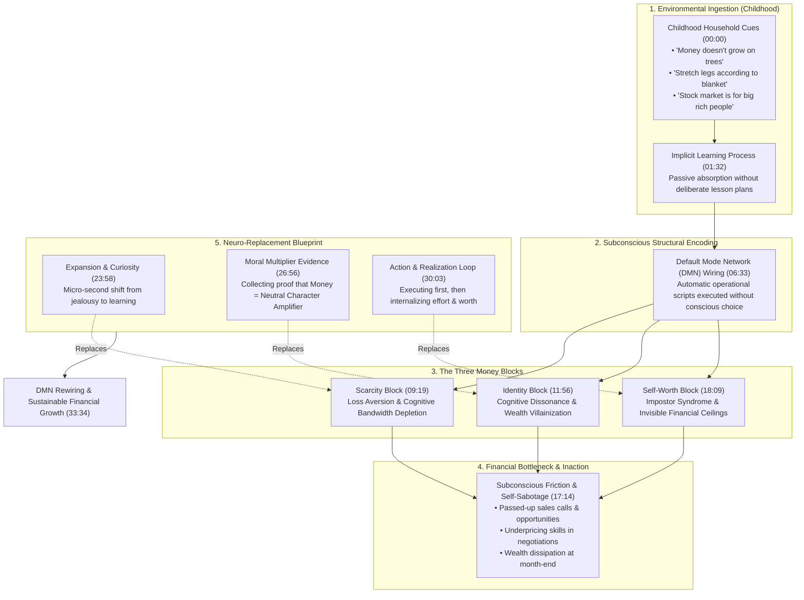
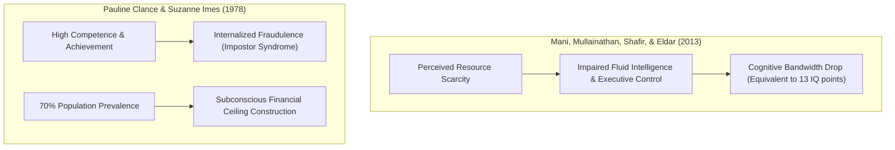
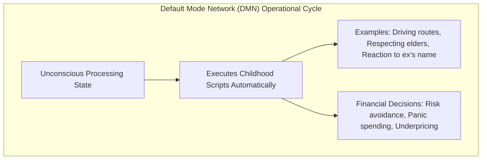
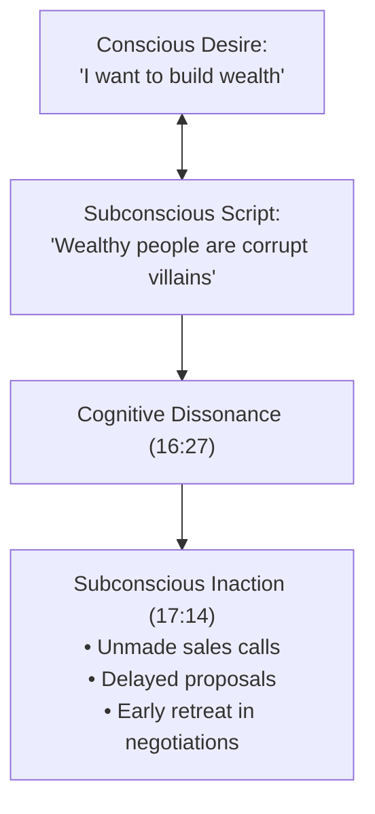
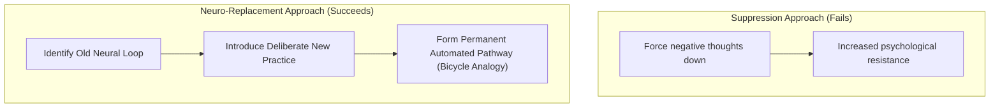
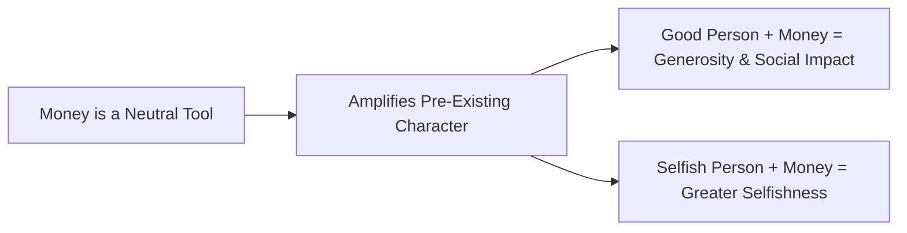
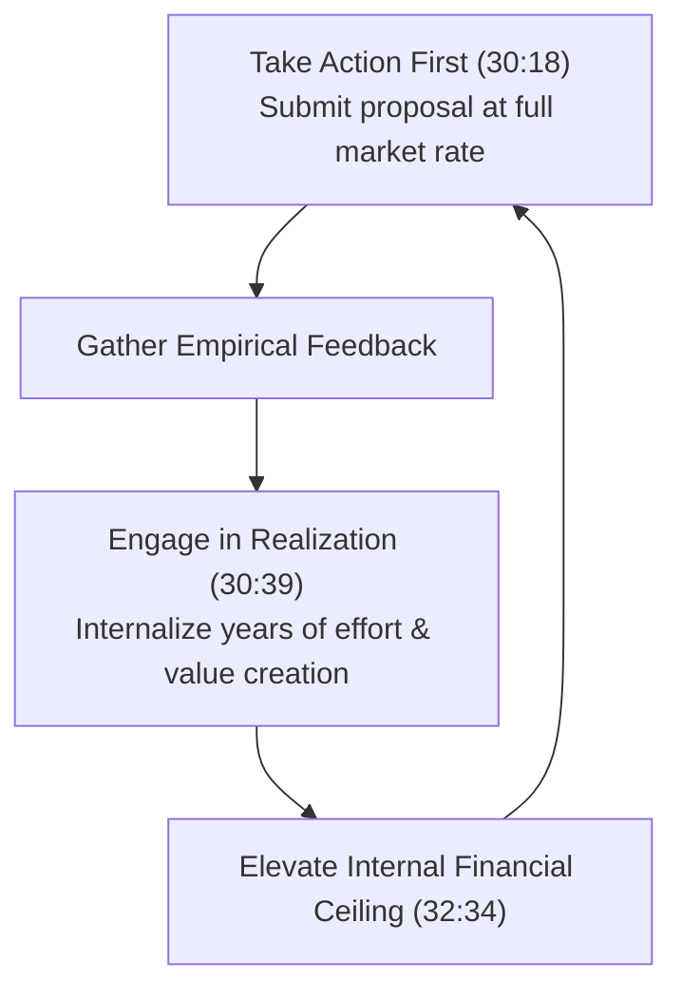

---
id: f47ac10b-58cc-4372-a567-0e02b2c3d479
title: "Detailed Study Notes - Building WEALTH Is Easier Than YOU THINK !!"
type: literature-note
status: learning
domain: business
source_type: youtube
created: 2026-07-30
updated: 2026-08-19
review: 2026-08-30
confidence: 98
version: 2
aliases:
  - "Building Wealth Is Easier Than You Think Comprehensive Study Notes"
  - "Him-eesh Madaan Money Psychology Exhaustive Guide"
tags:
  - yt
  - business
  - self-improvement
  - beginner
  - case-study
  - example
owner_moc: YouTube MOC
sources:
  - "[[01_RAW/SOURCE/Building WEALTH Is Easier Than YOU THINK !!.md]]"
related: []
schema_version: 4
---

# Comprehensive Detailed Study Notes — Building WEALTH Is Easier Than YOU THINK !!

## Overview & Metadata

- **Document Type**: Comprehensive Literature Note & In-Depth Learning Synthesis
- **Source Video Title**: Building WEALTH Is Easier Than YOU THINK !!
- **Creator / Speaker**: [[Him-eesh Madaan]]
- **Watch Link**: [YouTube Source Video](https://www.youtube.com/watch?v=PXceNfsR2qo)
- **Published Date**: June 14, 2026
- **Processing Date**: July 30, 2026
- **Video Duration**: 34 minutes 21 seconds
- **Primary Domain**: Behavioral Economics, Money Psychology, Neuroscience, Self-Efficacy

---

### Executive Summary

In this exhaustive lecture, motivational speaker, corporate trainer, and author [[Him-eesh Madaan]] addresses why hard work and technical skill frequently fail to translate into long-term financial abundance. He argues that financial trajectory is governed primarily by subconscious money conditioning established during early childhood through a psychological phenomenon called **Implicit Learning**.

These early environmental messages are encoded into the brain's **Default Mode Network (DMN)** as **Money Blocks**—subconscious barriers that dictate how an individual earns, saves, invests, negotiates, and handles risk. Madaan identifies three major Money Blocks that sabotage financial growth:

1. **The Scarcity Block**: Treating money as a scarce survival resource rather than an expanding growth tool, which scientifically degrades **Cognitive Bandwidth** (Mani et al., 2013).
2. **The Identity Block**: Suffering from **Cognitive Dissonance** caused by cultural and media villainization of wealth, leading to subconscious self-sabotage and inaction.
3. **The Self-Worth Block**: Underpricing services and capping earnings due to **Impostor Syndrome** (Clance & Imes, 1978) and self-imposed **Financial Ceilings**.

To dismantle these barriers, Madaan presents a practical, neuroscience-backed **Neuro-Replacement Blueprint**. Because old neural pathways cannot be forcefully suppressed, they must be actively replaced through deliberate practice: shifting from scarcity to curiosity, gathering empirical evidence that "money multiplies morality," and executing an **Action & Realization Loop** to elevate financial self-worth.

---

## Master Architecture & Conceptual Framework



---

## Detailed Empirical Case Studies & Behavioral Research

### 1. Case Study: The Nirma Story (Karsanbhai Patel) (01:47 – 03:44)

Karsanbhai Patel’s journey from a rural farming background in Gujarat to building a multi-thousand-crore enterprise provides a prime real-world case study on overcoming inherited money blocks.


#### Comparative Economics: Surf vs. Nirma

| Analytical Dimension | Branded Detergent (Surf) | Nirma (Karsanbhai Patel) |
| :--- | :--- | :--- |
| **Retail Price** | ₹13 / kg (01:53) | ₹3 / kg (1/4th of market leader price) (02:43) |
| **Manufacturing Setup** | Corporate factories | 10x10 ft residential room experiments (02:16) |
| **Target Audience** | Upper-middle class | Mass middle-class & lower-income households |
| **Distribution Model** | Established retail channels | Direct-to-consumer via bicycle after office hours (02:16) |
| **Underlying Mindset** | Corporate market dominance | Problem-solving; rejection of failure anxiety (03:04) |
| **Valuation / Impact** | Multinational enterprise | Over ₹7,000 Crore business group (03:31) |

*Core Insight*: Patel explicitly highlighted that coming from a family with zero prior business experience served as a hidden advantage: **no one had conditioned him with the fear of business failure**, nor had anyone taught him to treat money as a scarce item to hoard rather than a reward for solving a widespread social problem (03:04).

---

### 2. Empirical Research & Scientific Studies



#### A. Scarcity & Cognitive Bandwidth Depletion (2013) (10:55)
- **Researchers**: Mani, Mullainathan, Shafir, and Eldar (Harvard University, Princeton University, and University of Warwick).
- **Core Finding**: Experiencing financial or resource scarcity heavily taxes the human brain's processing capacity, reducing what researchers term **Cognitive Bandwidth**.
- **Mechanisms**: Scarcity forces the brain into continuous, involuntary intrusive thoughts about immediate survival. This severely degrades fluid intelligence, impulse control, long-term strategic planning, and creative problem-solving.
- **Critical Nuance**: The cognitive drop occurs not only in objectively impoverished individuals but also in financially secure individuals who suffer from a *perceived* scarcity mindset (11:24). Once installed in childhood, this mental state persists even when bank balances grow.

#### B. Impostor Syndrome & Invisible Financial Ceilings (1978) (19:58)
- **Researchers**: Psychologists Pauline R. Clance and Suzanne A. Imes.
- **Core Finding**: High-achieving, qualified professionals frequently suffer from an inability to internalize their success, attributing achievements to luck, timing, or deception.
- **Prevalence**: Studies show that approximately **70% of people** experience Impostor Syndrome at least once in their careers (20:17).
- **Financial Impact**: In finance, Impostor Syndrome establishes an invisible **Financial Ceiling**. Earning above this ceiling causes internal subconscious discomfort, triggering self-sabotaging behaviors (e.g., failing to invoice, over-delivering for free, underpricing bids, or spending money impulsively to return to a 'comfortable' lower balance) (20:45).

---

## Detailed Section-by-Section Analysis (With Timestamps)

### Section 1: Hidden Money Blocks & Childhood Implicit Learning (00:00 – 01:46)


#### 1. The Childhood Household Money Audit (00:00)
Madaan initiates the session with an interactive self-audit. If a viewer experienced more than two of the following common household statements during childhood, their money mindset is actively blocked:
1. *"Money doesn't grow on trees for you to pick whenever you feel like it."* (00:00)
2. *"Son, stretch your legs only as far as your blanket covers."* (Limiting ambitions to current means) (00:00)
3. *"Learn to save every penny; it will come in handy during hard times."* (Focus on future crisis rather than growth) (00:00)
4. *"Never take a loan or borrow money from anyone; borrowing is a evil habit."* (00:00)
5. *"The stock market and investing are gambling for rich people; stay far away from them."* (00:22)
6. *"When you earn money yourself, only then will you realize how hard it is to make a single rupee."* (00:22)

#### 2. The Walking Analogy & Implicit Learning Mechanics (00:42)
- Madaan poses a fundamental question: *When did you sit down and consciously decide, 'Today I will learn how to walk; first left foot, then right foot'?*
- Walking, talking, eating, social behavior, and emotional reactions were never learned through structured lesson plans. Children simply observed adults in their environment, their brain processed the patterns, and the motor/behavioral routines became automatic (01:01).
- **Implicit Learning**: In cognitive psychology, implicit learning refers to the acquisition of complex information in an incidental manner, without awareness of what has been learned. 
- *Application to Money*: During childhood, the brain passively absorbs fundamental financial paradigms:
  - How much money is possible or permissible for our family to earn?
  - Is money a source of joy and freedom, or a trigger for marital fight and chronic anxiety?
  - Is wealth safe or dangerous? (01:32)

---

### Section 2: Global Wealth Data & The Middle-Class Trap (03:45 – 06:04)

- **Podcasting & Guest Observations**: Madaan notes that across dozens of interviews with top entrepreneurs, one common thread emerges: the exact moment their external wealth exploded coincided with an internal reframing of their relationship with money (04:08).
- **Personal Bottleneck Experience**: Early in his career, Madaan experienced an income plateau. Despite acquiring skills, working longer hours, and avoiding lavish expenses, his account balance remained stagnant at month-end. Money entered but slipped away through unexpected expenses. He initially assumed hard work was the fix, but studying neuroscience revealed that subconscious programming was actively bleeding his resources (04:22, 04:46).
- **Self-Made Wealth Statistics**:
  - **Global Benchmark**: 67% of global billionaires are self-made, meaning they did not inherit their wealth (03:31).
  - **Indian Benchmark**: 66% of wealthy Indian entrepreneurs are self-made, having started from middle-class or resource-constrained backgrounds (03:59).
  - *Conclusion*: Two out of three wealthy individuals broke out of the exact same limiting financial environments. The differentiator was breaking their internal Money Blocks (05:16).

---

### Section 3: The Neuroscience of Money Blocks & Default Mode Network (06:05 – 09:18)



#### 1. The Water Pipeline Analogy (06:02)
A human mind functions like a residential water pipeline. If debris, rust, and silt collect inside the pipe, water flow drops. If the obstruction becomes severe, water stops entirely. Money Blocks—composed of childhood fears, past failures, negative remarks, and limiting beliefs—act as debris inside the mental pipeline, restricting the flow of financial abundance (06:33).

#### 2. The Default Mode Network (DMN) (06:33)
- The DMN is a network of interconnected brain regions (including the medial prefrontal cortex and posterior cingulate cortex) that becomes active when an individual is not focused on an explicit external task.
- **Everyday DMN Examples**:
  - Driving home from work without consciously thinking about when to turn or brake (07:03).
  - Automatically adopting a respectful posture and tone when an elderly person enters the room (07:03).
  - Experiencing a spike of irritation or anxiety upon hearing an ex-partner's name mentioned in passing (07:21).
  - Raising your vocal pitch during an argument without consciously deciding to yell (07:21).
- **DMN & Financial Sabotage**: When presented with an investment opportunity, a career transition, a sales negotiation, or a price quote, the conscious mind tries to evaluate the numbers. However, the subconscious DMN evaluates the situation using childhood scripts. If the DMN associates money with stress or villainy, it triggers fear, causing the individual to freeze, make excuses, or abandon the opportunity (08:01, 08:27).

---

### Section 4: Deep Dive into the 3 Money Blocks

```mermaid
grid
  caption The 3 Subconscious Money Blocks
  subgraph Block1["1. Scarcity Block (09:19)"]
    direction TB
    S_Root["Root: 'Money is limited & hard'"]
    S_Beh["Behavior: Loss aversion, fear of risk"]
    S_Sci["Science: Cognitive Bandwidth Drop"]
  end
  subgraph Block2["2. Identity Block (11:56)"]
    direction TB
    I_Root["Root: 'Rich people are corrupt'"]
    I_Beh["Behavior: Inaction, unmade sales calls"]
    I_Sci["Science: Cognitive Dissonance"]
  end
  subgraph Block3["3. Self-Worth Block (18:09)"]
    direction TB
    W_Root["Root: 'I am not enough'"]
    W_Beh["Behavior: Underpricing, self-doubt"]
    W_Sci["Science: Impostor Syndrome"]
  end
```

---

#### Money Block 1: The Scarcity Block (09:19 – 11:55)

- **Primary Symptoms**:
  - Feeling a physical tightening in the chest or stomach upon hearing about a friend's promotion or financial success (09:15).
  - Reacting to a new opportunity with immediate fear of loss rather than excitement for gain (09:15).
  - Fear of asking for higher compensation in job interviews or underpricing freelance services (09:19).
- **Subconscious Root**: Childhood exposure to money battles, constant reminders of scarcity (*"We can't afford that"*, *"Free stuff shouldn't be left behind"*, *"If we don't grab it, someone else will"*) (10:10).
- **Cognitive Impact**: The brain categorizes money strictly as a **survival resource** to be hoarded rather than a **growth tool** to be deployed (10:55).

---

#### Money Block 2: The Identity Block (11:56 – 18:08)

#### The Two-Person Psychological Experiment (12:12)
Madaan presents two contrasting character profiles:
- **Persona A**: Works a government job, wakes up at 8 AM, commutes in crowded local transport, returns at 9 PM, sacrifices all personal desires so his children can study, and worries constantly about neighborhood opinions.
- **Persona B**: Son of a wealthy businessman running a motorcycle dealership, wears designer clothing, owns a luxury watch, alternates between intensive work, luxury vacations, and late-night parties.

*Experimental Result*: Over 90% of audiences automatically judge Persona B as morally inferior or corrupt (12:42).

#### The Three Causes of Wealth Villainization
1. **Family Self-Defense Mechanism**: When family members fail to achieve financial success, they protect their self-esteem by vilifying those who did: *"Money corrupts people"*, *"Rich people become arrogant"*, *"He bought a new car; he must be doing something illegal"* (13:11, 13:36).
2. **Cultural Distortion of Noble Values**: Generosity, simplicity, and sacrifice are noble values. However, culture often distorts them by labeling financial ambition as greed, spending on comfort as foolish display, and investing as reckless gambling (15:14).
3. **Media & Cinematic Stereotyping**: For decades, Indian cinema and television consistently portrayed the antagonist as a wealthy industrialist, builder, or landlord, while depicting the hero as poor, humble, and financially struggling (15:45). This repeated pairing created a neural shortcut: **Wealth = Villainy** (16:00).



---

#### Money Block 3: The Self-Worth Block (18:09 – 22:11)

- **Primary Symptoms**: Improving technical skills to a high level but demanding rates below market value; viewing luxury items or high income as something reserved for "other people" (18:22, 18:41).
- **Subconscious Root**: Childhood experiences where achievements were met with caution, criticism, or comparison rather than celebration:
  - *"Don't celebrate too much, or you'll attract the evil eye (nazar lag jayegi)."* (18:47)
  - *"Winning once means nothing; you have to prove it repeatedly."* (18:47)
  - *"Look at your cousin/friend; see how much better they performed."* (19:13)
- **Result**: The child internalizes a core belief: *"I am not enough."* (19:36).
- **The Financial Ceiling Mechanism**: Impostor Syndrome establishes an internal threshold. Earning above this threshold triggers neurological discomfort, forcing the individual to decline opportunities, procrastinate, or spend money erratically to drop back into their psychological safety zone (20:45, 21:12).

---

## The Neuro-Replacement Blueprint (22:12 – 34:05)



### 1. The Neuroscience of Re-Parenting & Replacement (22:23)
- **Re-Parenting**: Adults cannot alter past childhood conditioning, but they can assume responsibility for re-parenting their DMN by intentionally instilling updated financial beliefs (22:23).
- **The Bicycle Analogy**: When learning to ride a bicycle, balancing is difficult and falling is common. With repetition, the brain constructs a dedicated neural pathway, rendering bicycle riding effortless and automatic decades later (22:47).
- **The Law of Replacement**: Subconscious beliefs **cannot be suppressed** by sheer willpower (*"I will not think negatively about money"*). They must be **replaced** by building alternative, higher-priority neural pathways (23:11, 23:26).

---

### 2. Strategy 1: Breaking Scarcity Through Expansion & Curiosity (23:58 – 26:55)

- **The Micro-Second Shift**: When observing someone else's financial success, arrest the automatic threat/jealousy response within micro-seconds. Immediately replace it with genuine curiosity: *"How did they accomplish this? What strategy, skill, or discipline can I learn from them?"* (24:20, 25:53).
- **Case Study: Raja Nayak's Transformation (24:59)**:
  - Growing up in extreme poverty with only ₹50 in his pocket, Raja Nayak watched the movie *Trishul*, starring Amitabh Bachchan.
  - Instead of absorbing scarcity, Nayak focused on the narrative of building wealth from scratch. He asked: *"If it is possible for him to build wealth from zero, why not me?"*
  - Guided by expansion rather than scarcity, Nayak launched business ventures and built an enterprise generating **₹100 Crore annually** (25:26).
- **Him-eesh Madaan’s Personal Transformation (2016–2017) (25:53)**:
  - When new creators and coaches began gaining rapid traction on YouTube, Madaan initially felt a surge of jealousy and threat (*"I've been working hard for years; why are they growing so fast?"*) (26:00).
  - Recognizing that jealousy harms the host while inspiration empowers it, Madaan consciously shifted from scarcity to expansion: *"What are they doing better? What skills am I missing? If they are putting in effort and winning, I should celebrate it so I can apply the same principles."* (26:20). Releasing this block unlocked unprecedented business growth and consistency (26:40).

---

### 3. Strategy 2: Resolving Identity Blocks via Moral Multiplier & Evidence (26:56 – 30:02)



- **The Moral Multiplier Principle**: Money possesses no intrinsic moral alignment; it acts strictly as an amplifier of an individual's existing character (28:08).
  - If a person is inherently compassionate, money enables them to fund charities, create employment, and help society.
  - If a person is inherently selfish, money enables greater selfishness (28:08).
- **Empirical Evidence Collection**: To dismantle the DMN's "wealth = villainy" script, actively expose the brain to counter-examples of ethical, high-integrity wealthy individuals:
  - **Public Figures**: Khan Sir (affordable education), Alakh Pandey (PhysicsWallah founder democratizing education), Zakir Khan, Sandeep Maheshwari (29:11, 29:28).
  - **Personal Circles**: Generous mentors, dedicated doctors charging fair fees, or honest business leaders (28:44).

---

### 4. Strategy 3: Elevating Self-Worth via Action & Realization (30:03 – 34:04)



- **Action Precedes Confidence**: Waiting for internal confidence before taking financial risks is a logical fallacy. Action must be taken first; confidence develops as a byproduct of realization (29:56, 30:18).
- **The Action & Realization Loop**:
  1. **Action**: Submit the contract proposal or job bid at full market value without self-discounting.
  2. **Realization**: Consciously review the years of skill acquisition, late-night study, sacrifices, and value delivered (30:39).
- **Madaan’s University Chief Guest Experience (31:23)**:
  - While serving as Chief Guest at a major university event in Delhi alongside senior professors, startup founders, and politicians, Madaan experienced a wave of Impostor Syndrome (*"Why are these highly accomplished leaders giving me so much respect?"*) (31:38).
  - A team member provided the critical Realization: *"Sir, they are respecting 10 years of non-stop dedication, late-night book reading, creating courses, taking risks, and serving your audience."* (32:03).
  - Internalizing this realization permanently shattered Madaan's self-worth block, aligning his self-perception with his impact (32:34).

---

## Summary Table of Key Concepts & Timestamp Index

| Section / Topic | Start Time | Key Psychological / Neuroscientific Concept | Primary Takeaway |
| :--- | :--- | :--- | :--- |
| **Childhood Audit** | 00:00 | Household Scripts | 6 common limiting money statements introduced during childhood. |
| **Implicit Learning** | 01:32 | Non-Conscious Encoding | Money relationships are absorbed passively without formal lesson plans. |
| **The Nirma Story** | 01:47 | Entrepreneurial Mindset | Karsanbhai Patel built a ₹7,000 Cr business by solving problems, unburdened by fear of failure. |
| **Self-Made Wealth Stats** | 03:31 | Economic Mobility | 67% of global billionaires and 66% of Indian wealthy entrepreneurs are self-made. |
| **Default Mode Network** | 06:33 | DMN Subconscious Control | Automatic brain routines execute childhood money scripts during key financial decisions. |
| **Scarcity Block** | 09:19 | Cognitive Bandwidth Drop | Perceived scarcity shrinks fluid intelligence and future planning capacity (Mani et al., 2013). |
| **Identity Block** | 11:56 | Cognitive Dissonance | Villainizing wealth creates internal conflict, leading to subconscious inaction. |
| **Self-Worth Block** | 18:09 | Impostor Syndrome & Ceilings | Childhood comparison creates financial ceilings, causing underpricing (Clance & Imes, 1978). |
| **Neuro-Replacement** | 22:12 | Law of Replacement | Old neural pathways cannot be suppressed; they must be replaced via repeated practice. |
| **Expansion Mindset** | 23:58 | Micro-Second Shift | Shift from jealousy to curiosity (Raja Nayak's ₹100 Cr business journey). |
| **Moral Multiplier** | 26:56 | Character Amplification | Money is neutral; it amplifies pre-existing character. Collect evidence of ethical wealth. |
| **Action & Realization** | 30:03 | Self-Worth Elevation | Action precedes confidence; internalize effort and value to permanently raise financial ceilings. |

---

## Verbatim Translated Direct Quotes

> *"Just as you never sat down one day to make a conscious, analytical decision to start walking—first left foot, then right foot—you simply observed adults, your brain processed the environment, and one day you walked. The exact same implicit learning process occurred with money."* (00:42) — **Him-eesh Madaan**

> *"Because no one in my family had ever done business before me, I had a massive hidden advantage: there was no prior example of business failure to scare me. Nobody had taught me that money is something to hold back out of fear; money is simply the natural result of solving a problem."* (03:04) — **Karsanbhai Patel (Founder, Nirma)**

> *"Scarcity taxes cognitive bandwidth. When individuals experience perceived scarcity—whether of money, time, or resources—their fluid intelligence, executive control, and long-term planning capacity drop significantly."* (10:55) — **Mani, Mullainathan, Shafir, & Eldar (2013 Research Study)**

> *"You cannot force-stop or suppress a subconscious belief by sitting quietly and telling yourself not to think it. You can only replace an old belief by building new, repeated neural pathways through deliberate action."* (23:11) — **Him-eesh Madaan**

> *"Money multiplies morality. Money is an amplifier of human character—if you are a compassionate person who cares about people, money allows you to care for and help far more people."* (28:08) — **Him-eesh Madaan**

---

## Master Glossary & Entity Registry

### Glossary of Core Terminology

- **Implicit Learning (01:32)**: The non-conscious acquisition of complex behavioral patterns and beliefs directly from environmental observation.
- **Default Mode Network (DMN) (06:33)**: The brain network active during passive or default states, responsible for automatic behaviors, habitual reactions, and subconscious scripts.
- **Money Blocks (06:33)**: Subconscious mental obstructions, inherited fears, and limiting beliefs that restrict financial acquisition, retention, and growth.
- **Scarcity Mindset (09:48)**: A psychological state rooted in the belief that resources are fixed and limited, leading to loss aversion and panic-driven decisions.
- **Cognitive Bandwidth (10:55)**: The mental capacity allocated to reasoning, decision-making, impulse control, and strategic future planning.
- **Identity Block (12:42)**: A subconscious conflict where wealth is equated with moral corruption or villainy, causing self-sabotaging inaction.
- **Cognitive Dissonance (16:27)**: The psychological stress experienced when holding two contradictory beliefs simultaneously (e.g., desiring wealth while believing rich people are bad).
- **Impostor Syndrome (19:58)**: A psychological condition where successful individuals view their achievements as unearned fraudulence.
- **Financial Ceiling (20:45)**: An internal psychological limit above which earning or holding money triggers subconscious anxiety and self-sabotage.
- **Moral Multiplier (28:08)**: The framework asserting that money acts as a neutral multiplier of an individual's pre-existing moral character.
- **Neuro-Replacement (23:11)**: The process of replacing unwanted neural pathways with new behavioral loops through deliberate, repeated practice.
- **Action & Realization Loop (30:39)**: The cycle of taking bold financial action first, followed by consciously internalizing one's effort and value to raise self-worth.

### Entity Registry

- **Him-eesh Madaan**: Corporate trainer, keynote speaker, author of *The Manifestation Blueprint*, and performance coach.
- **Karsanbhai Patel**: Founder of Nirma Group; pioneer of mass-market consumer detergents in India.
- **Nirma Group**: Multi-billion dollar Indian industrial conglomerate established in 1969.
- **Raja Nayak**: Industrialist who overcame poverty to establish a ₹100 Crore enterprise after being inspired by the movie *Trishul*.
- **Mani, Mullainathan, Shafir, & Eldar**: Behavioral scientists behind the landmark 2013 Princeton/Harvard study on scarcity and cognitive bandwidth.
- **Pauline Clance & Suzanne Imes**: Clinical psychologists who first conceptualized Impostor Syndrome in 1978.
- **Khan Sir**: Renowned Indian educator known for affordable large-scale education.
- **Alakh Pandey**: Founder of PhysicsWallah, India's democratized ed-tech unicorn.
- **Zakir Khan**: Popular Indian stand-up comedian and writer.
- **Sandeep Maheshwari**: Prominent Indian motivational speaker and entrepreneur.

---

## Source Provenance & File Links

- **Source File**: `[[01_RAW/CAPTURE/Building WEALTH Is Easier Than YOU THINK !!.md]]`
- **Staging Workspace**: `01_RAW/PROCESS/detailed-study-notes-building-wealth-is-easier-than-you-think.md`
- **Target Vault Location**: `02_NEW-KNOWLEDGE/detailed-study-notes-building-wealth-is-easier-than-you-think.md` (Pending Approval)
