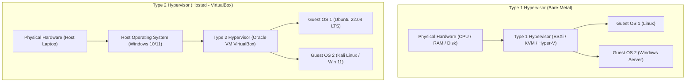
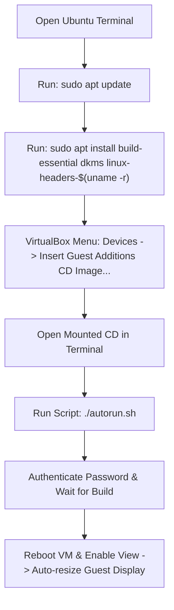
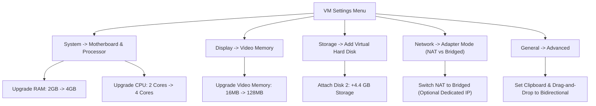

# Detailed Study Notes — College First Year Secret Skill: Virtual Machines + VirtualBox Tutorial

## Executive Summary & Overview

- **Source Video**: [College First Year Secret Skill | Virtual Machines + VirtualBox Tutorial](https://www.youtube.com/watch?v=evW_qDGHpcQ&list=WL&index=14)
- **Channel / Creator**: [[Not Your College]]
- **Instructor / Guest**: Sarang Kale (Senior Software Engineer at Sheryians Coding School)
- **Host**: Not Your College Host
- **Publication Date**: 2026-06-08
- **Topic**: Virtualization Fundamentals, Type 1 vs. Type 2 Hypervisors, Oracle VM VirtualBox Installation, Ubuntu Linux 22.04 LTS Guest Setup, VirtualBox Guest Additions Configuration, and VM Hardware Resource Allocation.

### High-Level Summary
This comprehensive tutorial introduces virtualization concepts for computer science students and beginners. It demonstrates how to transform a single physical laptop host into multiple isolated virtual environments using Oracle VM VirtualBox (a Type 2 Hypervisor). The lesson covers hypervisor architecture (Type 1 bare-metal vs. Type 2 hosted), step-by-step installation of Oracle VM VirtualBox on Windows, downloading and installing Ubuntu 22.04 LTS Linux, installing VirtualBox Guest Additions for display auto-resizing and host-guest integration, and dynamic resource modification (RAM, CPU cores, video memory, secondary virtual storage, network adapters, and bidirectional shared clipboard/drag-and-drop).

---

## Technical Architecture & Core Concepts

### Hypervisor Classification: Type 1 vs. Type 2

Virtualization relies on a software or firmware layer known as a **Hypervisor** (or Virtual Machine Monitor). The hypervisor abstracts physical hardware resources (CPU, RAM, Storage, Network) and allocates them to isolated guest operating systems running as Virtual Machines (VMs).



#### Detailed Comparison Table

| Attribute / Feature | Type 1 Hypervisor (Bare-Metal) (04:49) | Type 2 Hypervisor (Hosted) (05:37) |
|---|---|---|
| **Architecture Layer** | Installs directly on physical hardware (`Hardware -> Hypervisor -> Guest OS`). | Installs on top of a host Operating System (`Hardware -> Host OS -> Hypervisor -> Guest OS`). |
| **Performance & Latency** | High performance, minimal overhead, low latency access to physical hardware. | Higher overhead due to host OS abstraction layer; slightly slower execution. |
| **System Overhead** | Minimal OS overhead; dedicated enterprise virtualization kernel. | Requires host OS resources (Windows/macOS/Linux background processes). |
| **Primary Use Cases** | Enterprise datacenters, cloud platforms (AWS, GCP, Azure), production server clusters. | Desktop testing, software development, malware analysis, learning Linux/ethical hacking. |
| **Example Software** | VMware ESXi, Proxmox VE, KVM, Microsoft Hyper-V (bare-metal mode). | Oracle VM VirtualBox, VMware Workstation / Fusion, Parallels Desktop. |
| **Tutorial Classification** | Not used in desktop setup. | **Oracle VM VirtualBox is a Type 2 Hypervisor** running on Windows host (06:10). |

---

## Detailed Section Breakdown & Chronological Log

### 1. Introduction & Motivation (00:00 - 01:05)
- **Concept**: Running a complete second computer system inside a single laptop without partitioning physical drives or dual-booting.
- **Key Applications**:
  - Safely learning Linux commands without risking host OS failure.
  - Setting up isolated environments for Cybersecurity, Ethical Hacking (e.g., running Kali Linux), and Web Development.
  - Testing software across multiple operating systems.

> *"If I tell you that you have one laptop, we can make two laptops inside it."* (00:00) — *Host*

---

### 2. Virtualization Core Principles (01:05 - 02:39)
- **Virtual Machine (VM)**: A software-based representation of a physical computer that executes an operating system and application programs just like a physical machine.
- **Resource Allocation Requirement**: Every virtual machine must be assigned specific virtualized hardware components from the host machine:
  1. **RAM (Random Access Memory)**: Dedicated system memory allocated to guest OS.
  2. **CPU (Central Processing Unit)**: Virtual CPU cores allocated for processing instructions.
  3. **Disk Storage**: Virtual hard disk file (`.vdi` / `.vmdk`) representing physical hard drive space.
  4. **Network Adapters**: Virtual network interface cards (NICs) handling connectivity.

> *"VirtualBox has a very prestigious name in the tech world... Hypervisor."* (02:11) — *Sarang Kale*

---

### 3. Installing Oracle VM VirtualBox on Windows Host (02:39 - 03:50)
- **Step-by-Step Installation**:
  1. Navigate to browser and search for `VirtualBox Download` (or visit `https://www.virtualbox.org/wiki/Downloads`).
  2. Click **Windows hosts** link to download the `.exe` installer.
  3. Run installer executable and accept Windows UAC elevation prompt (`Yes`).
  4. Follow Wizard setup (`Next -> Next -> Next -> Install`).
  5. Accept network interface reset prompt (installer briefly resets network adapters to install VirtualBox Bridged/NAT drivers).
  6. Click `Finish` to launch Oracle VM VirtualBox Manager.

---

### 4. Downloading Ubuntu 22.04 LTS Linux ISO (03:50 - 07:51)
- **Guest OS Selection**: Ubuntu Linux Desktop.
- **Version Recommendation**: **Ubuntu 22.04 LTS (Long Term Support)** (06:31).
  - *Why 22.04 LTS over latest releases?* LTS releases offer long-term stability, tested driver support, and guaranteed compatibility with VirtualBox guest extensions without unexpected kernel panics or graphical glitches.
- **Download Instructions**:
  1. Search for `Ubuntu 22.04 LTS Desktop Download` (or `https://releases.ubuntu.com/jammy/`).
  2. Select **Desktop Image** (`.iso` file format).
  3. Save to local storage (e.g., `Downloads/ISO/`).

---

### 5. Creating & Provisioning Virtual Machine in VirtualBox (07:51 - 09:59)


#### Step-by-Step VM Creation Wizard:
1. Open VirtualBox Manager -> Click **`New`** icon (07:51).
2. **Name**: `Ubuntu` (VirtualBox auto-detects Type: `Linux`, Version: `Ubuntu 64-bit`).
3. **Folder**: Keep default virtual machine storage directory.
4. **ISO Image**: Click `Other...` -> select downloaded `ubuntu-22.04.x-desktop-amd64.iso` file.
5. **CRITICAL CONFIGURATION**: Check **`Skip Unattended Installation`** (08:10).
   - *Rationale*: Skipping unattended setup avoids automated background installer scripts that can lock default root credentials or fail to prompt for custom user accounts and regional settings.
6. **Hardware Provisioning**:
   - **Base Memory (RAM)**: Set to **`2048 MB` (2 GB)** (Minimum operating requirement for Ubuntu Desktop is 1 GB; 2 GB ensures smooth installation).
   - **Processors**: Set to **`2 CPU Cores`**.
7. **Virtual Hard Disk Provisioning**:
   - Select `Create a Virtual Hard Disk Now`.
   - **Disk Size**: Set to **`30 GB`** (Minimum disk requirement for Ubuntu Desktop is 20 GB; 30 GB allows space for guest software packages and updates).
8. Click **`Finish`**.

---

### 6. Step-by-Step Ubuntu Linux GUI Installation (09:59 - 14:04)

1. **Booting the VM**: Select `Ubuntu` VM in left menu -> Click **`Start`** (Green Arrow) (09:59).
2. **GRUB Boot Menu**: Use Down Arrow key to select `Try or Install Ubuntu` -> Press `Enter` (10:27).
3. **Installer Language**: Select `English` -> Click **`Install Ubuntu`** (10:58).
4. **Keyboard Layout**: Select `English (US)` -> Click `Continue`.
5. **Updates and Other Software**: Select **`Minimal Installation`** (11:18).
   - *Rationale*: Minimal installation installs only the core OS and web browser, reducing installation time and saving virtual disk space.
6. **Installation Type**: Select **`Erase disk and install Ubuntu`** (11:49).
   - *Safety Note*: This only formats the isolated 30 GB virtual hard disk file (`.vdi`), leaving the host Windows system completely untouched.
   - Click `Install Now` -> Click `Continue` on write partition confirmation popup.
7. **Time Zone Selection**: Click location map on `India` (`Asia/Kolkata`) -> Click `Continue` (12:04).
8. **User Account Creation**:
   - **Your name**: e.g., `Sarang` (12:29).
   - **Computer's name**: `sarang-VirtualBox`.
   - **Pick a username**: `sarang`.
   - **Choose a password**: Set secure password -> Confirm password.
   - Select `Log in automatically`.
   - Click `Continue`.
9. **File Copy & Package Installation**: Wait for background file extraction and installation progress bar to complete (12:54).
10. **Reboot**: Click **`Restart Now`** when prompted (13:23).
11. **Remove Installation Media Prompt**: When message `Please remove the installation medium, then press ENTER` appears, press `Enter` (13:47).
12. System boots cleanly into desktop environment.

---

### 7. VirtualBox Guest Additions Installation & Display Auto-Resizing (14:04 - 19:40)

#### The Problem (14:04)
Initially, Ubuntu executes inside a fixed, low-resolution window (e.g., 800x600 / 1024x768). Resizing the host VirtualBox application window does not adjust the Ubuntu display resolution.

#### The Solution: VirtualBox Guest Additions
VirtualBox Guest Additions consists of device drivers and system applications that optimize guest OS performance and display capabilities.



#### Terminal Execution Commands

| Step | Command (15:05 - 16:48) | Purpose / Description |
|---|---|---|
| 1 | `sudo apt update` | Resynchronizes package index files from Ubuntu repositories. |
| 2 | `sudo apt install build-essential dkms linux-headers-$(uname -r)` | Installs GNU C/C++ compilers (`build-essential`), Dynamic Kernel Module Support (`dkms`), and matching Linux kernel header files required to compile VirtualBox guest kernel modules. |
| 3 | `./autorun.sh` | Executes the shell script inside the mounted VirtualBox Guest Additions ISO image directory (`/media/<user>/VBox_GAs...`) (19:04). |

#### Step-by-Step Execution:
1. Open Ubuntu Terminal (`Ctrl + Alt + T`).
2. Run update command:
   ```bash
   sudo apt update
   ```
   Enter user password when prompted.
3. Run prerequisites installation command:
   ```bash
   sudo apt install build-essential dkms linux-headers-$(uname -r)
   ```
   Press `Y` to confirm disk space usage.
4. Mount Guest Additions ISO: In VirtualBox top menu bar, click **`Devices`** -> **`Insert Guest Additions CD image...`** (18:00).
5. Open Terminal inside the mounted CD folder: Right-click inside CD folder window -> `Open in Terminal` (18:26).
6. Run autorun shell script:
   ```bash
   ./autorun.sh
   ```
7. Authenticate prompt -> Wait for driver kernel modules to compile until output displays `Press Return to close this window` (19:12).
8. Press `Enter` -> Close terminal.
9. Shut down / Restart VM: Click VirtualBox top menu `Machine` -> `Reset` (or close window -> `Power off the machine` -> Start VM) (20:11).
10. Log in -> In VirtualBox top menu, select **`View`** -> **`Auto-resize Guest Display`** (21:18).
11. Maximizing or dragging VirtualBox window now dynamically auto-resizes Ubuntu screen resolution to match full host display.

---

### 8. Advanced VM Hardware & Resource Customization (24:36 - 30:55)

*Prerequisite*: VM must be **Power Off** (Shut Down) before modifying RAM and CPU core settings (25:31).



#### Hardware Configuration Settings Reference

| Category | Setting Field | Default / Initial Value | Reconfigured Value (25:30 - 28:04) | Function / Benefits |
|---|---|---|---|---|
| **System** | Base Memory (RAM) | 2048 MB (2 GB) | **4096 MB (4 GB)** (27:43) | Enhances multitasking performance and eliminates OS stuttering. |
| **System** | Processor Cores | 2 Cores | **4 Cores** (25:31) | Accelerates application execution and compile speeds inside guest OS. |
| **Display** | Video Memory | 16 MB | **128 MB** (25:56) | Provides maximum VRAM for smooth desktop UI rendering and window scaling. |
| **Storage** | Virtual Disk Attachments | 1 Disk (30 GB) | **2 Disks (30 GB + 4.4 GB)** (26:25) | Demonstrates adding secondary virtual hard drives for extra storage or partitions. |
| **Network** | Adapter 1 Mode | NAT (Network Address Translation) | NAT / **Bridged Adapter** (27:08) | **NAT**: Safe internet access using Host IP.<br>**Bridged**: Assigns VM a distinct physical IP address on local router network. |
| **General** | Shared Clipboard | Disabled | **Bidirectional** (28:04) | Allows seamless copy-pasting of text between Host Windows OS and Guest Linux OS. |
| **General** | Drag and Drop | Disabled | **Bidirectional** (28:20) | Allows dragging files directly between Windows host desktop and Ubuntu guest desktop. |

---

## Technical Terms & Reference Glossary

| Term | Timestamp | Definition |
|---|---|---|
| **Virtual Machine (VM)** | 01:05 | A software-based simulation of a physical computer system that executes operating systems and software applications in isolation. |
| **Hypervisor** | 02:11 | A hardware virtualization software layer that creates, manages, and allocates physical system resources (CPU, RAM, Storage) to virtual machines. |
| **Type 1 Hypervisor** | 04:49 | A bare-metal hypervisor that runs directly on underlying physical hardware without requiring a host operating system (e.g., VMware ESXi, KVM). |
| **Type 2 Hypervisor** | 05:37 | A hosted hypervisor that installs as an application on top of an existing host operating system (e.g., Oracle VM VirtualBox, VMware Workstation). |
| **ISO Image** | 06:31 | An archive file containing an exact sector-by-sector copy of an optical disc, commonly used to distribute operating system installers. |
| **Ubuntu LTS** | 06:51 | Long Term Support release of Ubuntu Linux, published every two years and guaranteed 5 years of stability and security updates. |
| **Guest Additions** | 14:04 | A bundle of VirtualBox kernel drivers and utilities installed inside guest OS to enable auto-resize displays, shared clipboard, and shared folders. |
| **DKMS** | 16:16 | Dynamic Kernel Module Support; a framework allowing Linux kernel modules to be automatically recompiled when kernel updates occur. |
| **NAT (Network Address Translation)** | 27:08 | Default VirtualBox networking mode where guest VM traffic is routed through the host machine's IP address. |
| **Bridged Networking** | 27:08 | VirtualBox networking mode where guest VM connects directly to host physical network adapter, acquiring its own independent LAN IP address. |

---

## Key Speaker Quotes

> *"VirtualBox is a hypervisor... If you want to learn about it, stay tuned with me in this video."* (00:21) — *Host*

> *"If you want to learn hacking or cybersecurity in the future, this tutorial will help you immensely. Creating a virtual machine is the very first step for ethical hacking."* (00:50) — *Host*

> *"Type 1 Hypervisor runs directly on your hardware... while in Type 2 Hypervisor, you run an operating system over hardware, and then run the hypervisor software on top of that OS."* (05:20) — *Sarang Kale*

