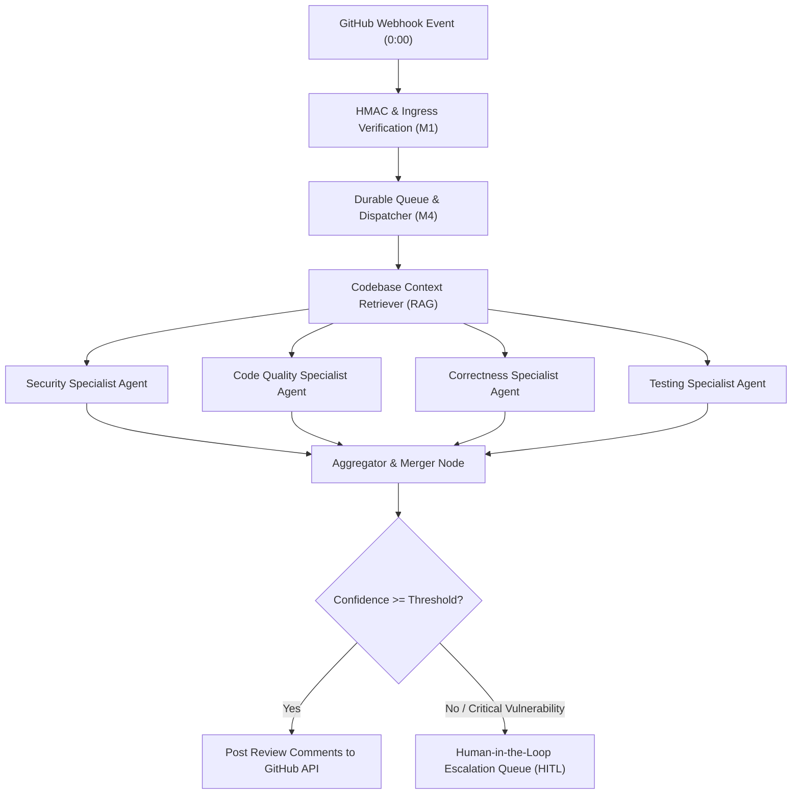
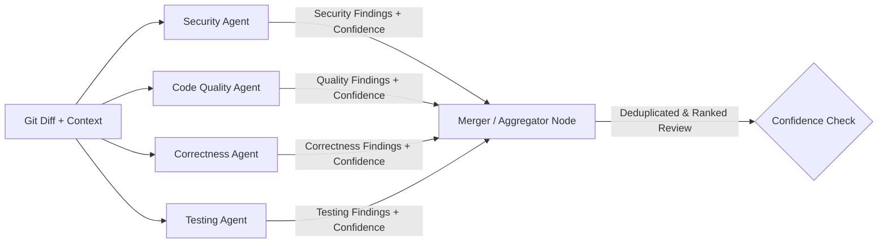
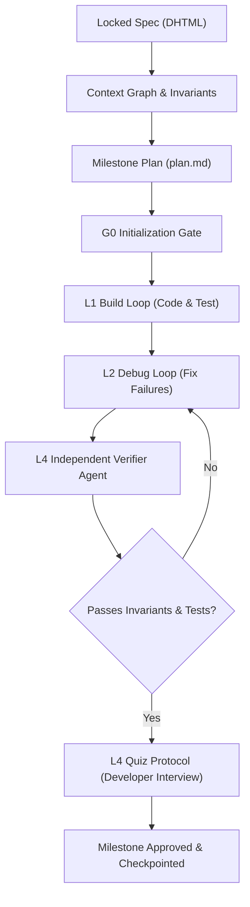

# Detailed Study Notes - Designing & Building PR Review Multi Agent System (3 Hours Build)

## Executive Summary & Metadata

- **Title**: Designing & Building PR Review Multi Agent System (3 Hours Build)
- **Creator**: [[Ayush Singh]]
- **Watch Link**: [YouTube Video](https://www.youtube.com/watch?v=RiN02OXjeeQ)
- **Original Source File**: `[[01_RAW/SOURCE/Designing & Building PR Review Multi Agent System (3 Hours Build).md]]`
- **Core Domain**: AI System Design, Agentic Software Engineering, Multi-Agent Orchestration, Code Review Automation, Reliability Engineering.

### System Overview
This comprehensive 3-hour masterclass covers the first-principles system design, architectural design, and production implementation of an autonomous **AI Pull Request (PR) Review Multi-Agent System**. Instead of relying on naive "LLM + RAG" wrapper patterns—which fail in production due to lack of selectivity, high hallucination rates, missing rationale, and zero evidence grounding—this course establishes a production-grade multi-agent architecture using **LangGraph**, **TimescaleDB / TigerData**, **FastAPI**, **PGVector**, and the **Genesis Development Ritual**.

---

## 1. Paradigm Shift: Beyond Naive LLM + RAG (0:00 - 5:48)

### 1.1 The Failure of Basic LLM Code Reviewers (0:05 - 0:32)
A typical demo-grade AI code reviewer simply extracts a Git diff (`git diff`), injects it into a prompt (e.g., *"Find errors in this code"*), adds simple RAG over repo files, and posts generated comments.

```
Naive Pipeline: Git Diff --> Simple RAG (Repo Context) --> LLM Prompt --> Unfiltered PR Comments
```

**Why Naive LLM + RAG Fails in Production**:
1. **Lack of Selectivity**: Generates noisy, trivial style nitpicks while missing deep architecture or logic bugs.
2. **Human Fatigue Inversion**: Humans receive dozens of low-value comments, increasing cognitive load rather than reducing it.
3. **No Evidence Grounding**: The LLM outputs claims without proving *why* a line is buggy or providing exact file/line citations.
4. **Lack of Retries & Fallbacks**: API timeouts or model hallucinations break the entire integration loop.

### 1.2 How Senior Engineers Review Pull Requests (1:03 - 2:40)
To build a production agent, engineers must observe how human senior developers handle code reviews:
- **Selectivity**: Prioritizing high-impact issues (security, business logic, architectural consistency) over mechanical style checks.
- **Multiple Mindsets (Separate Concerns)**: Evaluating code simultaneously from different perspectives (Security, Quality, Correctness, Test Coverage, Performance).
- **Evidence Requirement**: Providing concrete rationale, line references, and test proofs for every finding.
- **Fatigue & Consistency**: Human review quality degrades from PR #1 to PR #20 in a single day. The AI system exists to reclaim senior developer attention while maintaining uniform review quality.

### 1.3 Mapping Human Review to Multi-Agent Components (2:20 - 5:48)

| Human Reviewer Action | Multi-Agent System Component | Engineering Implementation |
|---|---|---|
| Recalling repo rules & past PRs | **Retriever / RAG Layer** | PGVector + TimescaleDB semantic code search |
| Thinking with separate mindsets | **Specialist Agents** | Security, Quality, Correctness & Testing Agents |
| Grounding claims with evidence | **Confidence & Rationale Node** | Structured JSON schema output with score & rationale |
| Resolving conflicting reviews | **Aggregator / Merger Node** | LangGraph fan-in node filtering & deduplicating findings |
| Escalating dangerous changes | **Human-in-the-Loop (HITL) Gate** | Priority escalation queue & approval gate |



---

## 2. First-Principles System Design Framework (6:05 - 34:18)

System design for AI-native software follows a strict 5-move template to map manual human mess into robust machine architecture.

### Move 1: Map the Mess (Document Manual Process Today) (6:39 - 9:55)
Observe the existing human process without AI:
- A developer opens a PR $\rightarrow$ Slack/GitHub notifications sent $\rightarrow$ Senior engineer context-switches $\rightarrow$ Senior engineer manually reads Git diff, searches related files, checks architectural invariants $\rightarrow$ Senior engineer leaves comments or approves.
- **Failure Modes of Human Process**: Context-switching overhead, delays of days/weeks per PR, review fatigue (10th PR quality drops relative to 1st PR), inconsistent enforcement of guidelines across teams.
- **Core Mission Statement**: The AI PR Review Agent does *not* replace human judgment; it reclaims senior engineer attention by automating mechanical context retrieval and preliminary review.

### Move 2: Define Precise Triggers & Output Contracts (9:55 - 14:11)
- **Triggers**: Must be precise and deterministic (e.g., GitHub Webhook `pull_request.opened` or `pull_request.synchronize` events). Vague triggers like "any incoming email or message" are prohibited.
- **Output Contracts**: Structured PR reviews (inline code line comments + summary review body).
- **Security Redaction Rule**: If a critical zero-day or secret leak is detected, do **not** post it publicly on an open PR comment. Escalate privately via Slack/webhook to security team to prevent public exploitation `(13:41)`.

### Move 3: Component Assignment (14:11 - 15:56)
Assign each sub-task to the correct technological paradigm:

| Task Type | Assigned Component / Technology |
|---|---|
| Ingress, Authentication, Routing | Deterministic Code (FastAPI, HMAC SHA-256) |
| Async Job Queueing & Deduplication | Redis / ARQ Durable Queue |
| Semantic Context Retrieval | Vector Database (TimescaleDB / PGVector) |
| Reasoning, Analysis, Tone & Translation | Large Language Models (OpenAI GPT-4o / Claude Sonnet) |
| Review Merger & Orchestration State | LangGraph State Graph |
| Immutable Audit Logging | TimescaleDB Hypertables |

### Move 4: Autonomy Spectrum & Consequence of Error (15:56 - 27:05)

#### The 5 Levels of System Autonomy

| Level | Description | Target Use Case |
|---|---|---|
| **L1: Full Automation** | Autonomous execution without human oversight | Routine, low-stake, reversible tasks (e.g., style nitpicks) |
| **L2: Human Review Output** | System drafts output; human verifies before dispatch | High-reputation output, sensitive external communication |
| **L3: Human Exception Handling** | System handles 90% easy cases; human handles hard/low-confidence cases | **AI PR Review Agent (Selected Model)** |
| **L4: Human Decides, System Prepares** | System gathers all context/scores; human makes decision | Financial loans, medical diagnoses, legal approvals |
| **L5: Full Human with AI Assist** | Human performs action with inline AI assistance | Writing core security algorithms from scratch |

#### Consequence vs. Reversibility Matrix `(26:06)`
- **Low Consequence / High Reversibility**: Stylistic comment formatting error (Annoying, but harmless).
- **High Consequence / Low Reversibility**: Merging a database migration that corrupts production schema, or missing a critical SQL injection vulnerability (Catastrophic).
- **System Maturity Principle**: Start with high human involvement (HITL gates). As evaluation benchmarks prove accuracy, gradually decrease human override requirements over time `(27:05)`.

### Move 5: Failure-Mode Analysis & Reliability Engineering (17:08 - 24:39)

AI systems fail in two distinct directions: **Engineering Failures** (infrastructure) and **LLM Failures** (cognition).

```
                       2x2 Failure Mode Matrix
┌──────────────────────────────────────┬──────────────────────────────────────┐
│ KNOWN KNOWNS                         │ KNOWN UNKNOWNS                       │
│ - API Rate Limits / Timeouts         │ - Model Hallucination Rates          │
│ - Webhook Retries & Duplicates       │ - RAG Vector Mismatch / Slice Misses │
│ Mitigation: Retries, Exponential     │ Mitigation: Fact-checker Layer,      │
│ Backoff, Circuit Breakers `(20:25)`  │ Confidence Scores, Citation Rule     │
├──────────────────────────────────────┼──────────────────────────────────────┤
│ UNKNOWN KNOWNS                       │ UNKNOWN UNKNOWNS                     │
│ - Feedback Loop Poisoning            │ - Orchestration Deadlocks            │
│ - Prompt Drift Over Time             │ - Subtle 90/10 "Almost Right" Errors │
│ Mitigation: Feedback Decay, Min      │ Mitigation: Random Audits, Model     │
│ Evidence Thresholds `(21:29)`        │ Rotation, Synthetic Boundary Testing │
└──────────────────────────────────────┴──────────────────────────────────────┘
```

#### Detailed Failure Modes & Mitigations

1. **Hallucination Protection**: Mandatory citation requirement (`(file:line)`), minimum evidence threshold, and fact-checking layer `(18:53)`.
2. **Model & Prompt Drift**: Continuous evaluation datasets, alert thresholds, periodic prompt maintenance `(19:52)`.
3. **API & Webhook Resilience**: Circuit breakers on dead services, graceful degradation on partial data retrieval, exponential backoff retries `(20:25)`.
4. **Feedback Loop Poisoning**: Filtering bad reviews from junior engineers before saving to feedback vector stores; applying exponential decay to outdated feedback `(21:29)`.
5. **Orchestration Deadlock**: Handling incomplete parallel agent outputs in the merger node with fallback defaults and timeout bounds `(22:09)`.
6. **Subtly Wrong Outputs (90/10 Problem)**: Flagging low-confidence outputs, running periodic random human audits, and evaluating against synthetic adversarial test sets `(23:47)`.

---

## 3. Cognitive Design & Multi-Agent Architecture (1:05:00 - 2:21:32)

### 3.1 Specialist Agents & Concern Separation
Instead of one monolithic prompt, the system routes the Git diff and codebase context to four specialized parallel agents:



1. **Security Specialist Agent**: Scans for OWASP Top 10 vulnerabilities, SQL injection, cross-site scripting (XSS), unhandled authorization checks, secret leaks, and insecure HMAC handling.
2. **Code Quality Specialist Agent**: Evaluates modularity, DRY principles, naming conventions, design patterns, cognitive complexity, and refactoring opportunities.
3. **Correctness & Logic Agent**: Checks boundary conditions, off-by-one errors, null dereferences, state mutations, and business logic flaws.
4. **Testing Specialist Agent**: Verifies that new code is accompanied by corresponding unit/integration tests and regression coverage.

### 3.2 Aggregator / Merger Node Protocol
The Merger Node performs three critical operations:
- **Deduplication**: Merges overlapping findings between Security and Correctness agents.
- **Conflict Resolution**: If Quality agent requests a refactor that Correctness agent flags as breaking, the Merger evaluates priority based on severity.
- **Score Calculation & Filtering**: Computes overall PR review confidence score. Filters out findings with confidence below configured threshold ($\text{Confidence} < 80\%$).

---

## 4. Database Strategy & Database Invariants (TimescaleDB / TigerData) (2:21:32 - 3:05:28)

### 4.1 Database Selection Trade-offs
Rather than maintaining three separate database clusters (Relational DB + Vector DB + Time-series DB), the architecture uses **TimescaleDB (TigerData)**, unifying PostgreSQL, Timescale Hypertables, and PGVector into a single production engine.

```
                    Unified Storage Architecture (TimescaleDB / TigerData)
┌────────────────────────────────────────────────────────────────────────────────────────┐
│ PostgreSQL Core Engine                                                                 │
├──────────────────────────────┬──────────────────────────────┬──────────────────────────┤
│ Hypertables (Time-Series)    │ PGVector Extension           │ Relational Tables        │
│ - Append-only agent events   │ - Code chunk embeddings      │ - PR Metadata & Users    │
│ - Audit logs & telemetry     │ - Vector distance search     │ - HITL Queue & Reviewers │
│ - Invariant: No Updates/Del  │ - Strict dimension matching  │ - System Invariants      │
└──────────────────────────────┴──────────────────────────────┴──────────────────────────┘
```

### 4.2 Database Invariants & Hypertable Triggers `(2:56:02)`
- **Immutable Event Spine (`agent_events`)**: Every LLM call, agent finding, and HITL decision is stored in an append-only hypertable.
- **Hypertable Limitation & Trigger Choice**: PostgreSQL query rewrite rules (`CREATE RULE`) do **not** work on TimescaleDB hypertables because hypertables partition data across underlying chunk tables.
- **Database-Enforced Invariant**: Immutability is enforced using PostgreSQL `BEFORE UPDATE OR DELETE` triggers that raise explicit exceptions:

```sql
-- Database Trigger Enforcing Immutable Event Logs
CREATE OR REPLACE FUNCTION prevent_agent_events_mutation()
RETURNS TRIGGER AS $$
BEGIN
    RAISE EXCEPTION 'agent_events hypertable is append-only. UPDATE and DELETE operations are strictly forbidden.';
END;
$$ LANGUAGE plpgsql;

CREATE TRIGGER trg_prevent_agent_events_mutation
BEFORE UPDATE OR DELETE ON agent_events
FOR EACH ROW EXECUTE FUNCTION prevent_agent_events_mutation();
```

- **Truncate Edge Case `(3:03:28)`**: `BEFORE DELETE` triggers do *not* catch SQL `TRUNCATE` commands. A separate `BEFORE TRUNCATE` trigger is required to protect audit logs from truncation attacks.

### 4.3 PGVector Dimension Matching Invariant `(3:04:40)`
PGVector enforces exact dimensional alignment at the schema level. If the environment configuration specifies `EMBEDDING_DIM=256` (e.g., Matryoshka embeddings) while the PostgreSQL column is defined as `vector(1536)` (OpenAI default), database inserts will fail immediately. Schema definitions and environment variables must be kept in sync.

---

## 5. The Genesis Development Ritual (4:04 - 5:48 & 2:21:32 - 2:34:30)

The **Genesis Development Ritual** is a verification-first development methodology that prevents AI coding agents from generating unmaintainable spaghetti code.



### 5.1 Artifacts of the Genesis Harness

1. **`DHTML` (Locked Specification)**: Defines cognitive jobs, input/output contracts, autonomy levels, failure tolerances, and milestone demo commands.
2. **`context_graph`**: Maps system invariants (non-negotiables) and code dependency graphs so changes to one file automatically trigger relevant regression test runs.
3. **`implementation_notes`**: Maintains live state across agent sessions, tracking active loops, current milestones, open blockers, and live production state.
4. **`plan.md` & `loops.md`**: Detailed step-by-step milestone execution plans, token budgets, and loop definitions (Build Loop, Debug Loop, Research Loop).

### 5.2 The L4 Independent Verifier & Quiz Protocol `(2:36:45 - 2:45:52)`
- **Independent Verifier**: Once an agent finishes building a milestone, a separate, fresh agent instance (L4 Verifier) is spawned. It receives *only* the goal, success criteria, and invariants—never the builder's execution logs.
- **Quiz Protocol**: Before a milestone is marked complete, the verifier quizzes the human engineer on architectural trade-offs, security ordering, and edge cases to guarantee complete comprehension.

---

## 6. Complete Implementation Walkthrough (M1 to M5) (2:20:23 - 3:10:05)

### Milestone 1 (M1): Webhook Ingress & Verification (2:20:23 - 2:47:39)

#### Ingress Contract & HMAC Security Invariant
Every incoming GitHub Webhook must be verified using HMAC SHA-256 before parsing payload data.

```python
# backend/webhook_receiver/app.py
import hmac
import hashlib
from fastapi import FastAPI, Request, HTTPException, Header, status

app = FastAPI(title="PR Review Agent Ingress")

GITHUB_WEBHOOK_SECRET = "your_env_webhook_secret_key"

def verify_github_signature(payload_body: bytes, signature_header: str):
    if not signature_header or not signature_header.startswith("sha256="):
        raise HTTPException(
            status_code=status.HTTP_400_BAD_REQUEST,
            detail="Missing or malformed X-Hub-Signature-256 header."
        )
    expected_signature = "sha256=" + hmac.new(
        GITHUB_WEBHOOK_SECRET.encode("utf-8"),
        payload_body,
        hashlib.sha256
    ).hexdigest()
    
    if not hmac.compare_digest(expected_signature, signature_header):
        raise HTTPException(
            status_code=status.HTTP_400_BAD_REQUEST,
            detail="HMAC signature verification failed."
        )

@app.post("/webhook/github")
async def github_webhook_ingress(
    request: Request,
    x_hub_signature_256: str = Header(None),
    x_github_delivery: str = Header(None)
):
    body = await request.body()
    
    # Invariant: Verify HMAC signature before any JSON parsing or processing
    verify_github_signature(body, x_hub_signature_256)
    
    try:
        payload = await request.json()
    except Exception:
        # Invariant: Authenticated request with malformed JSON returns 400 Bad Request
        raise HTTPException(
            status_code=status.HTTP_400_BAD_REQUEST,
            detail="Malformed JSON body."
        )
        
    event_type = request.headers.get("X-GitHub-Event")
    if event_type != "pull_request":
        return {"status": "ignored", "reason": f"Event {event_type} not handled"}
        
    # Idempotency check using delivery ID
    if is_duplicate_delivery(x_github_delivery):
        return {"status": "deduplicated", "delivery_id": x_github_delivery}
        
    # Queue job for processing
    enqueue_pr_review_job(payload, x_github_delivery)
    return {"status": "queued", "delivery_id": x_github_delivery}
```

#### Key Architecture Principles Validated in M1:
- **400 Bad Request vs 500 Internal Error**: If an authenticated webhook contains malformed JSON, return `400 Bad Request` rather than leaking server stack traces (`500`).
- **Processing Order**: HMAC verification $\rightarrow$ JSON parsing $\rightarrow$ Idempotency check $\rightarrow$ Job queueing.

---

### Milestone 2 (M2): Database & Vector Infrastructure (2:48:36 - 3:05:34)

#### Schema Definition (SQL Hypertables & PGVector)

```sql
-- Enable Extensions
CREATE EXTENSION IF NOT EXISTS timescaledb;
CREATE EXTENSION IF NOT EXISTS vector;

-- 1. Immutable Agent Events Hypertable
CREATE TABLE agent_events (
    event_id UUID PRIMARY KEY DEFAULT gen_random_uuid(),
    delivery_id VARCHAR(255) NOT NULL,
    agent_name VARCHAR(100) NOT NULL,
    event_type VARCHAR(50) NOT NULL,
    payload JSONB NOT NULL,
    confidence_score NUMERIC(5, 2),
    created_at TIMESTAMPTZ NOT NULL DEFAULT NOW()
);

-- Convert to Timescale Hypertable partitioned by time
SELECT create_hypertable('agent_events', 'created_at');

-- 2. Code Base Vectors Table for RAG
CREATE TABLE code_embeddings (
    chunk_id UUID PRIMARY KEY DEFAULT gen_random_uuid(),
    repo_name VARCHAR(255) NOT NULL,
    file_path TEXT NOT NULL,
    start_line INT NOT NULL,
    end_line INT NOT NULL,
    content TEXT NOT NULL,
    embedding vector(1536), -- Must match EMBEDDING_DIM env var exactly
    created_at TIMESTAMPTZ NOT NULL DEFAULT NOW()
);

CREATE INDEX idx_code_embeddings_vector ON code_embeddings 
USING ivfflat (embedding vector_cosine_ops) WITH (lists = 100);
```

---

### Milestone 3 (M3): Traceability & Observability (3:00:14)
- **Agent Event Logging**: Every execution step within LangGraph nodes logs state inputs, prompt tokens, completion tokens, latency, model used, and intermediate confidence scores to `agent_events`.
- **Cost Dashboard**: Real-time token economics tracking (OpenAI GPT-4o input/output costs vs Claude Sonnet costs per PR).

---

### Milestone 4 (M4): LangGraph Multi-Agent Orchestration & Durable Queue (3:00:45)

#### LangGraph State Graph Workflow

```python
# orchestrator/graph.py
from typing import TypedDict, List, Annotated
import operator
from langgraph.graph import StateGraph, END

class PRReviewState(TypedDict):
    pr_id: int
    repo_name: str
    diff_text: str
    code_context: List[str]
    security_findings: List[dict]
    quality_findings: List[dict]
    correctness_findings: List[dict]
    testing_findings: List[dict]
    final_findings: List[dict]
    overall_confidence: float
    requires_hitl: bool

# Node Functions
def retrieve_code_context(state: PRReviewState):
    # Perform PGVector similarity search on files affected by diff
    context = vector_search_context(state["repo_name"], state["diff_text"])
    return {"code_context": context}

def run_security_agent(state: PRReviewState):
    findings = analyze_security(state["diff_text"], state["code_context"])
    return {"security_findings": findings}

def run_quality_agent(state: PRReviewState):
    findings = analyze_quality(state["diff_text"], state["code_context"])
    return {"quality_findings": findings}

def run_correctness_agent(state: PRReviewState):
    findings = analyze_correctness(state["diff_text"], state["code_context"])
    return {"correctness_findings": findings}

def run_testing_agent(state: PRReviewState):
    findings = analyze_testing(state["diff_text"], state["code_context"])
    return {"testing_findings": findings}

def merge_and_score(state: PRReviewState):
    all_findings = (
        state["security_findings"] + 
        state["quality_findings"] + 
        state["correctness_findings"] + 
        state["testing_findings"]
    )
    merged, confidence = filter_and_deduplicate(all_findings)
    
    # Escalate if security vulnerability found or confidence < 80%
    has_critical_security = any(f["severity"] == "CRITICAL" for f in merged)
    requires_hitl = (confidence < 0.80) or has_critical_security
    
    return {
        "final_findings": merged,
        "overall_confidence": confidence,
        "requires_hitl": requires_hitl
    }

# Build LangGraph State Machine
builder = StateGraph(PRReviewState)

builder.add_node("retriever", retrieve_code_context)
builder.add_node("security_agent", run_security_agent)
builder.add_node("quality_agent", run_quality_agent)
builder.add_node("correctness_agent", run_correctness_agent)
builder.add_node("testing_agent", run_testing_agent)
builder.add_node("merger", merge_and_score)

builder.set_entry_point("retriever")

# Fan-out to parallel specialist agents
builder.add_edge("retriever", "security_agent")
builder.add_edge("retriever", "quality_agent")
builder.add_edge("retriever", "correctness_agent")
builder.add_edge("retriever", "testing_agent")

# Fan-in to merger node
builder.add_edge("security_agent", "merger")
builder.add_edge("quality_agent", "merger")
builder.add_edge("correctness_agent", "merger")
builder.add_edge("testing_agent", "merger")

def route_after_merger(state: PRReviewState):
    if state["requires_hitl"]:
        return "hitl_escalation_queue"
    return "post_github_review"

builder.add_conditional_edges("merger", route_after_merger, {
    "hitl_escalation_queue": END,
    "post_github_review": END
})

graph = builder.compile()
```

---

### Milestone 5 (M5): HITL Escalation Queue & Production Hardening (3:06:00 - 3:10:05)
- **Escalation Queue**: PR reviews marked `requires_hitl=True` land in a reviewer web dashboard. Senior engineers inspect agent rationales, approve or modify inline comments, and post reviews with one click.
- **Capacity Planning**: Queue prioritization ensures high-priority business PRs are reviewed first, capping human escalations to match team bandwidth.

---

## 7. Key Takeaways & Direct Quotes (3:08:00 - 3:10:05)

### Core Architectural Axioms
1. *"An automated reviewer exists to solve exactly one problem: reclaiming senior engineer attention by automating the mechanical part of the review."* `(36:54)`
2. *"If your AI system has an error with catastrophic consequence, full autonomy is a design failure. Autonomy must be earned by system maturity."* `(16:12)`
3. *"Verification-first development means you never trust build logs or agent claims. You spawn independent verifiers and enforce system invariants at the database level."* `(2:37:13)`

---

## 8. Controlled Domain Glossary

- **Idempotency Key**: Unique token (`X-GitHub-Delivery`) ensuring retried webhooks do not trigger duplicate processing `(8:58)`.
- **Hypertable**: A TimescaleDB abstraction that automatically partitions time-series data across underlying PostgreSQL tables while maintaining a single unified query interface `(2:51:16)`.
- **Fan-Out / Fan-In**: An orchestration pattern where a single state branches into multiple parallel specialist execution nodes (fan-out) before converging into an aggregator node (fan-in) `(2:20)`.
- **Genesis Ritual**: A methodology enforcing locked specifications (`DHTML`), context invariant graphs, and L4 verifier checkpoints to guide AI coding assistants safely `(4:04)`.
