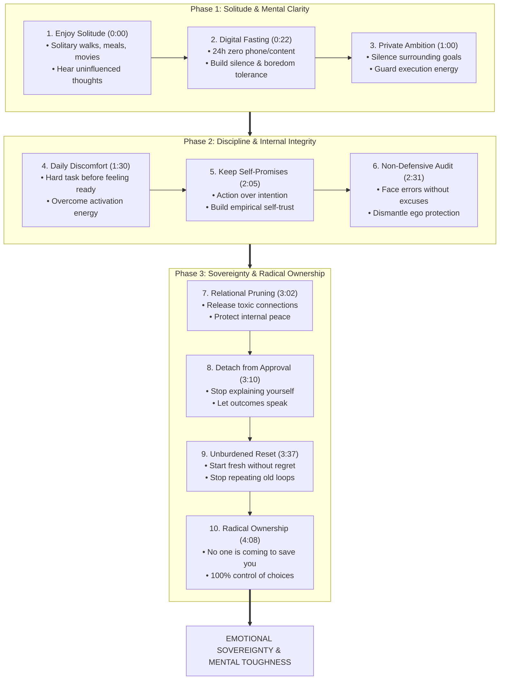

# Detailed Study Notes — Doing These 10 Things Alone Will Change Your Life

## Executive Summary & Metadata

- **Source Title**: Doing These 10 Things Alone Will Change Your Life
- **Creator**: [[The Inspire Path]]
- **Watch Link**: [YouTube Video](https://www.youtube.com/watch?v=poAYEHHwZF4)
- **Original Capture**: [[01_RAW/SOURCE/Doing These 10 Things Alone Will Change Your Life.md]]
- **Core Thesis**: True emotional independence, mental strength, self-discipline, and self-trust are cultivated not through external guidance or social validation, but through deliberate, unassisted solitary practices. By intentionally facing silence, digital fasting, private ambition, daily discomfort, non-defensive self-audit, relational pruning, and radical accountability alone, individuals dismantle external dependencies, quiet social conditioning, and take complete ownership of their lives.

---

## 📊 Comprehensive Matrix of 10 Solo Transformation Practices

| # | Solo Practice | Core Behavioral Mechanism | Psychological & Neurological Impact | Key Obstacle Overcome | Timestamp |
| :-: | :--- | :--- | :--- | :--- | :-: |
| **1** | **Enjoy Your Own Company** | Engage in solitary activities (walks, meals out, movies) without external companions | Decouples happiness from social presence; surfaces uninfluenced self-identity | Fear of loneliness & social awkwardness | `(0:00 - 0:22)` |
| **2** | **24-Hour Digital Fast** | 1 full day of zero phone/social media/content consumption | Resets dopamine baseline; restores boredom tolerance & mental clarity | Compulsive impulse for constant stimulation | `(0:22 - 1:00)` |
| **3** | **Keep Goals Private** | Complete silence regarding major goals & ambitions | Prevents premature dopamine reward from verbal praise; conserves execution energy | Need for social validation & approval | `(1:00 - 1:30)` |
| **4** | **Daily Discomfort Action** | Execute 1 difficult/avoided task daily before feeling emotionally ready | Overcomes activation energy friction; builds empirical proof of resilience | Friction paralysis & emotional resistance | `(1:30 - 2:05)` |
| **5** | **Keep Promises to Yourself** | 100% behavioral follow-through on self-directed commitments | Strengthens subconscious self-trust & self-respect through action | Chronic self-betrayal & excuses | `(2:05 - 2:31)` |
| **6** | **Non-Defensive Self-Audit** | Objectively examine mistakes without making excuses or protecting ego | Dismantles ego defense mechanisms; unlocks true self-awareness & self-correction | Fragile ego & defensive rationalization | `(2:31 - 3:02)` |
| **7** | **Relational Pruning** | Cut ties with unsupportive, disrespectful, or unaligned individuals | Preserves mental peace; eliminates emotional drain & friction | Fear of loss, nostalgia & social guilt | `(3:02 - 3:10)` |
| **8** | **Accept Misunderstanding** | Stop trying to explain, justify, or convince others of your path | Eliminates self-erasure; shifts focus to proof through real outcomes | People-pleasing & need to be understood | `(3:10 - 3:37)` |
| **9** | **Decoupled Resetting** | Start over completely without dwelling on past failures or regret | Decouples identity from past mistakes; breaks repetitive failure loops | Sunk cost fallacy & historical guilt | `(3:37 - 4:08)` |
| **10** | **Radical Ownership** | Take 100% responsibility for current state, choices, and future outcomes | Destroys victim mindset; activates full agency and internal locus of control | Externalizing blame to circumstances/others | `(4:08 - 4:18)` |

---

## 🧩 Architectural Mindset Diagram

---

## Comprehensive Deep-Dive Section Breakdown

### 1. Learn to Enjoy Your Own Company `(0:00 - 0:22)`
- **Behavioral Protocol**: Intentionally take yourself out on solo outings—go for a walk in nature, dine at a restaurant alone, or go to the cinema by yourself without holding a phone or relying on social company.
- **Core Psychological Mechanism**: Dependent happiness occurs when an individual relies on external companionship to fill an internal void. Solitude must not be confused with loneliness:
  - *Loneliness* is the painful feeling of isolation and lack of connection.
  - *Solitude* is the intentional state of being alone, creating the mental space required to hear your uninfluenced inner voice away from social expectations and noise.
- **Key Risk / Obstacle**: Fear of awkwardness or societal perception when being seen alone in public settings.
- **Actionable Implementation**: Schedule one "solo date" per week (60–90 minutes) with no digital devices or companions.
- **Key Timestamp Citation**: `(0:00 - 0:22)` — *"Being alone doesn't have to mean being lonely. It's the only time when you can finally hear your own thoughts and understand who you really are without anyone else's influence."*

---

### 2. Spend One Day Without Your Phone `(0:22 - 1:00)`
- **Behavioral Protocol**: Perform a complete 24-hour digital fast. Turn off your mobile device, avoid social media scrolling, turn off notifications, and consume zero background content (podcasts, videos, articles).
- **Core Psychological Mechanism**: Constant digital stimulation acts as an anesthetic for boredom, anxiety, and deep thought. The brain becomes wired to seek immediate dopamine rewards whenever uncomfortable silence arises. A 24-hour fast resets baseline dopamine receptors and restores friction tolerance and emotional equilibrium.
- **Key Risk / Obstacle**: High initial restlessness, phantom vibration syndrome, and compulsive urge to check notifications within the first 3–4 hours.
- **Actionable Implementation**: Designate one weekend day per month as a complete "Analog Day." Keep a physical journal to write thoughts when urges to scroll arise.
- **Key Timestamp Citation**: `(0:53 - 1:00)` — *"The moment you become comfortable with silence, you stop needing constant distraction to feel okay. And that's where real freedom begins."*

---

### 3. Keep Your Biggest Goals Private `(1:00 - 1:30)`
- **Behavioral Protocol**: Keep your most ambitious plans, projects, fitness targets, or business initiatives completely confidential. Do not post them on social media or announce them to friends and family.
- **Core Psychological Mechanism**: Neuroscientifically, announcing a goal triggers social praise and congratulations, releasing dopamine as if the goal has already been achieved. This creates a psychological illusion of completion, draining the drive and hunger required to execute the actual work.
- **Key Risk / Obstacle**: The psychological desire for social validation and external encouragement before doing the work.
- **Actionable Implementation**: Practice the "Silent Execution Rule": work on a project for at least 90 days before disclosing its existence to anyone.
- **Key Timestamp Citation**: `(1:30)` — *"The less you seek validation for what you're going to do, the more energy you have to actually do it."*

---

### 4. Do One Hard Thing Daily Before You Feel Ready `(1:30 - 2:05)`
- **Behavioral Protocol**: Select one high-friction, uncomfortable, or avoided task daily (e.g., intensive workout, cold exposure, making a difficult phone call, initiating complex deep work) and execute it immediately without waiting for motivation.
- **Core Psychological Mechanism**: Confidence is built empirically, not through positive self-talk. It is earned every time you prove to yourself that you can endure discomfort. The hardest barrier is almost always *activation energy*—the initial friction of getting started. Once action begins, momentum takes over and normalizes difficulty.
- **Key Risk / Obstacle**: Waiting for "feeling ready" or emotional motivation before starting.
- **Actionable Implementation**: Implement the "5-Second Rule" or "First 10-Minute Rule": start the avoided hard task immediately for 10 minutes regardless of mood.
- **Key Timestamp Citation**: `(1:47)` — *"Confidence isn't built by staying comfortable. It's built every time you prove to yourself that you can handle discomfort."*

---

### 5. Learn to Keep Promises to Yourself `(2:05 - 2:31)`
- **Behavioral Protocol**: Align daily behavior strictly with self-directed commitments. If you promise yourself you will wake up at 6:00 AM, complete a workout, or write for 30 minutes, execute it without exception.
- **Core Psychological Mechanism**: Self-trust is the cornerstone of self-confidence. The subconscious mind does not evaluate intentions; it evaluates actions. Repeatedly breaking self-directed promises destroys internal credibility, creating self-doubt and identity as an unreliable person.
- **Key Risk / Obstacle**: Making overly ambitious promises, failing, and falling into cycles of self-criticism.
- **Actionable Implementation**: Set small, non-negotiable micro-commitments daily. Start with 1–2 commitments per day that you fulfill with 100% reliability.
- **Key Timestamp Citation**: `(2:05 - 2:31)` — *"Self-confidence isn't built by positive thinking. It's built by trust, and the easiest way to lose that trust is by breaking the promises you make to yourself. The brain doesn't judge you by your intentions. It judges you by your actions."*

---

### 6. Watch Your Own Mistakes Without Defending Yourself `(2:31 - 3:02)`
- **Behavioral Protocol**: Conduct unemotional, non-defensive self-audits when mistakes occur. Refrain from shifting blame to circumstances, making excuses, or defending your ego when criticized or when encountering failure.
- **Core Psychological Mechanism**: The ego's natural defense mechanism is to deflect accountability through rationalization and blame shifting. However, every excuse shields the root vulnerability, ensuring that the underlying problem persists. Self-awareness requires observing personal errors with dispassionate objectivity.
- **Key Risk / Obstacle**: Ego vulnerability, shame, and defensive reactions when confronted with mistakes.
- **Actionable Implementation**: Perform an After-Action Review (AAR) after any failure or mistake: write down (1) What happened, (2) What was my contribution, and (3) What will I do differently, without mentioning external blame.
- **Key Timestamp Citation**: `(2:31 - 3:02)` — *"Every excuse protects the same problem that keeps holding them back... face them, learn from them, because you can't fix what you refuse to face."*

---

### 7. Let Go of People Who No Longer Belong in Your Life `(3:02 - 3:10)`
- **Behavioral Protocol**: Decisively distance yourself from or cut ties with individuals who disrespect your boundaries, bring toxicity into your life, or fail to support your growth, regardless of shared history.
- **Core Psychological Mechanism**: Relational inertia often forces people to maintain unaligned connections out of guilt or nostalgia. However, holding onto toxic or unsupportive relationships acts as a persistent drag on mental peace and emotional bandwidth.
- **Key Risk / Obstacle**: Guilt, fear of confrontation, and the sunk-cost fallacy regarding long-term friendships or family ties.
- **Actionable Implementation**: Conduct a quarterly relational audit: identify relationships that consistently drain your peace or undermine your values, and step back emotionally and physically.
- **Key Timestamp Citation**: `(3:10)` — *"Sometimes the people you refuse to leave behind become the very reason you never move forward."*

---

### 8. Accept That Not Everyone Will Understand You `(3:10 - 3:37)`
- **Behavioral Protocol**: Stop explaining, arguing, or defending your lifestyle, career choices, or personal philosophy to critics, family members, or acquaintances who misunderstand you.
- **Core Psychological Mechanism**: The urge to be universally understood stems from a need for social inclusion. Attempting to gain approval from everyone leads to compromise, cognitive dissonance, and loss of identity. Your path and results should serve as your only explanation.
- **Key Risk / Obstacle**: People-pleasing tendencies and anxiety triggered by disapproval or criticism.
- **Actionable Implementation**: Adopt the "No Defense Protocol": when met with unsolicited criticism or misunderstanding, respond with neutral acknowledgment ("I understand your perspective") without justifying your position.
- **Key Timestamp Citation**: `(3:37)` — *"If you spend your life trying to be understood by everyone, you'll eventually lose yourself. So, instead of trying to convince everyone, let your results explain what words never could."*

---

### 9. Start Over Without Looking Back `(3:37 - 4:08)`
- **Behavioral Protocol**: When a business fails, a relationship ends, or a goal collapses, wipe the slate clean and restart immediately without dwelling on past mistakes or lost time.
- **Core Psychological Mechanism**: Fixating on past errors keeps identity bound to past failures, locking individuals into repetitive self-fulfilling prophecies. Restarting is not a sign of failure; it is the deliberate refusal to let the past dictate future trajectory.
- **Key Risk / Obstacle**: Remorse over lost time, financial loss, or past investment (sunk cost fallacy).
- **Actionable Implementation**: Establish a "Zero-Point Reset": treat today as Day 1 of your new trajectory, focusing 100% of cognitive bandwidth on present actions.
- **Key Timestamp Citation**: `(3:37 - 4:08)` — *"Starting over isn't about forgetting your past. It's about refusing to let it decide your future... starting over isn't failure. Sometimes it's the only way to stop repeating the same life."*

---

### 10. Take Full Responsibility for Your Life `(4:08 - 4:18)`
- **Behavioral Protocol**: Eliminate all victim mindset statements. Accept 100% ownership over your financial situation, physical health, emotional well-being, and future, regardless of past unfairness or external events.
- **Core Psychological Mechanism**: Blaming external factors (upbringing, economy, past trauma, other people) hands over your agency to external circumstances. Realizing that **"no one is coming to save you"** shifts your locus of control entirely inward, unleashing personal power.
- **Key Risk / Obstacle**: Comfort in victimhood and externalizing fault to avoid uncomfortable accountability.
- **Actionable Implementation**: Adopt the Extreme Ownership Creed: whenever a problem arises, ask yourself first, *"What could I have done to prevent this, and what can I do right now to fix it?"*
- **Key Timestamp Citation**: `(4:08 - 4:18)` — *"Stop blaming your past, your circumstances, or other people for the life you're living. Instead, take ownership of your choices, your failures, your future because no one is coming to save you. And the moment you accept that, you finally take control of your life."*

---

## 🎙️ Complete Verbatim Quotation Bank

1. `(0:00 - 0:22)` — *"Doing these 10 things alone will completely change the way you live your life. Number one, learn to enjoy your own company... Being alone doesn't have to mean being lonely. It's the only time when you can finally hear your own thoughts and understand who you really are without anyone else's influence."*
2. `(0:22 - 1:00)` — *"One day without your phone will teach you patience, self-control, and how to find peace without needing constant distraction. Because the moment you become comfortable with silence, you stop needing constant distraction to feel okay. And that's where real freedom begins."*
3. `(1:00 - 1:30)` — *"Talking about your goals feels productive, but in reality, it's one of the fastest ways to lose momentum. Because every conversation, every compliment... gives your brain a taste of success before you've actually earned it."*
4. `(1:30 - 2:05)` — *"Confidence isn't built by staying comfortable. It's built every time you prove to yourself that you can handle discomfort."*
5. `(2:05 - 2:31)` — *"Self-confidence isn't built by positive thinking. It's built by trust, and the easiest way to lose that trust is by breaking the promises you make to yourself. The brain doesn't judge you by your intentions. It judges you by your actions."*
6. `(2:31 - 3:02)` — *"Most people never grow because they're too busy protecting their ego... every excuse protects the same problem that keeps holding them back. So, instead of running from your mistakes, face them."*
7. `(3:02 - 3:10)` — *"Holding on to someone who no longer respects you, supports you, or brings you peace doesn't save the relationship. It only costs you your peace... sometimes the people you refuse to leave behind become the very reason you never move forward."*
8. `(3:10 - 3:37)` — *"Not everyone will understand you, and their understanding isn't a requirement for your success. If you spend your life trying to be understood by everyone, you'll eventually lose yourself."*
9. `(3:37 - 4:08)` — *"Starting over isn't about forgetting your past. It's about refusing to let it decide your future... starting over isn't failure. Sometimes it's the only way to stop repeating the same life."*
10. `(4:08 - 4:18)` — *"Stop blaming your past, your circumstances, or other people for the life you're living. Instead, take ownership of your choices, your failures, your future because no one is coming to save you. And the moment you accept that, you finally take control of your life."*

---

## Provenance & Vault Links

- **Source Location**: `[[01_RAW/SOURCE/Doing These 10 Things Alone Will Change Your Life.md]]`
- **Working Draft Path**: `01_RAW/PROCESS/detailed-study-notes-doing-these-10-things-alone-will-change-your-life.md`
- **Owner Map of Content**: `[[03_MOC/yt-moc|📺 YouTube Map of Content]]`
