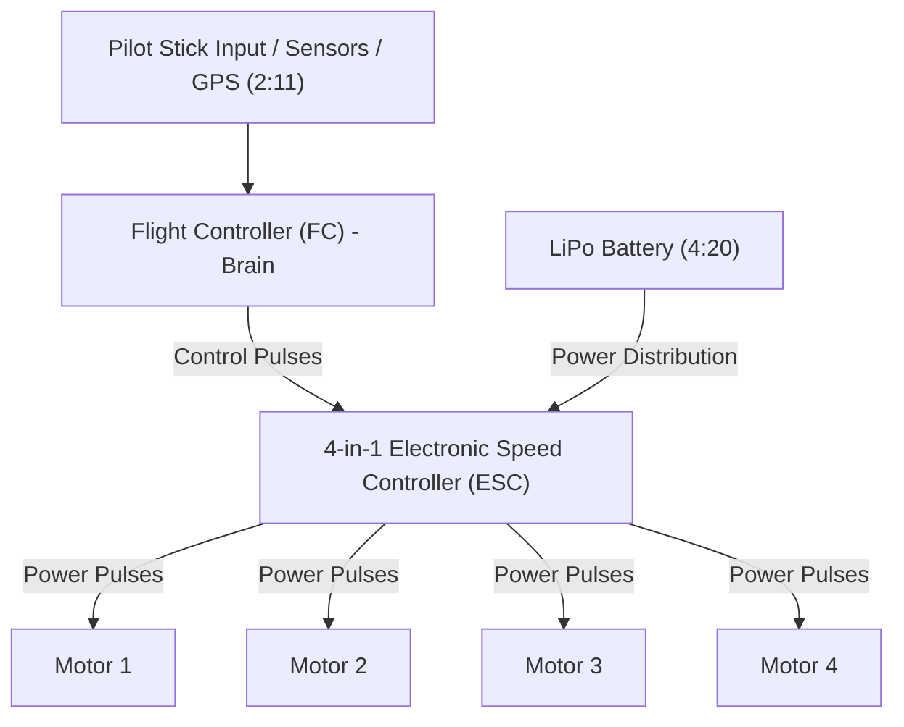
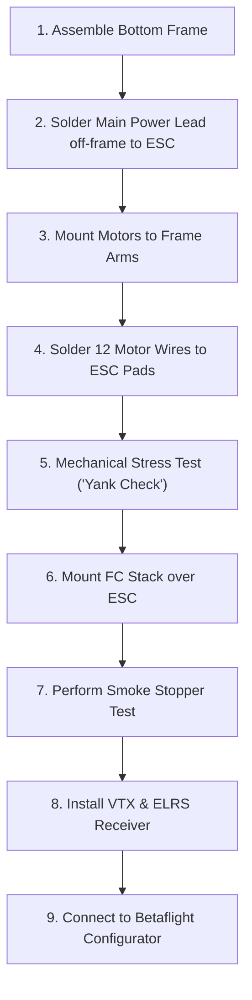

# Detailed Study Notes — FPV for Normal People

## Executive Summary
- **Title**: FPV for Normal People
- **Creator**: [[NickFPV]]
- **Watch Link**: [YouTube (vSHrY5xJsxg)](https://www.youtube.com/watch?v=vSHrY5xJsxg)
- **Participants**: Nick (Instructor), Trevor (Beginner Student), Max (Friend)
- **Overview**: First-Person View (FPV) drone flying is notorious for having one of the steepest learning curves in tech hobbies due to complex component compatibility, custom soldering, firmware flashing, and manual flight physics. This guide breaks down the complete end-to-end pipeline to take an absolute beginner from zero knowledge to building, configuring, and flying a 5-inch 6S freestyle FPV quadcopter.

---

## 1. Frame Selection & Geometries (0:42 – 1:54)

The frame is the central backbone of the drone. It dictates component dimensions, stack mounting sizes, and flight responsiveness. Choosing frame geometry is the mandatory first decision when building a custom quad.

### Frame Geometry Comparison

| Geometry | Motor Placement | Primary Flying Style | Flight Characteristics & Responsiveness |
| :--- | :--- | :--- | :--- |
| **X Frame** | Motors evenly spaced | All-round / General | Most balanced flight behavior across all axes (0:29 – 1:11). |
| **Dead Cat** | Front arms angled back | Cinematic | Pushes front propellers out of camera field of view (1:11). |
| **Stretched X** | Motors extended lengthways | Racing | Increased pitch axis responsiveness for fast forward acceleration (1:18). |
| **Squished X** | Motors extended widthways | Freestyle | Increased roll axis responsiveness; optimal for flips, rolls, and acrobatics (1:20 – 1:41). |

*Selection for Build*: **Squished X** frame geometry (chosen to match Trevor's goal of learning freestyle acrobatics).

---

## 2. Electronics: The Stack (FC & ESC) (1:54 – 3:04)

The center of the drone houses "the stack", consisting of two primary circuit boards mounted vertically.

### Stack Board Responsibilities
1. **Flight Controller (FC)** (Top Board):
   - Serves as the central computing unit ("the brain").
   - Processes pilot stick commands, accelerometer sensor data, and GPS telemetry to orchestrate flight physics (2:11).
2. **Electronic Speed Controller (ESC)** (Bottom Board):
   - Converts DC power from the battery into high-frequency power pulses to control motor RPM accurately (2:11).
   - Distributes electrical power across the entire quad.
   - Modern FPV builds integrate four individual ESC channels onto a single board, called a **4-in-1 ESC** (2:42).

*Hardware Selected*: **SpeedyBee F405 Mini Stack** (1:41).

---

## 3. Motors Sizing & KV Ratings (3:04 – 4:12)

### Deciphering Motor Numbers (e.g., `2004`)
Motor size designations consist of four digits:
- **First two digits**: Stator diameter in millimeters (e.g., `20` = 20mm diameter).
- **Last two digits**: Stator height in millimeters (e.g., `04` = 4mm height) (3:04).

### Sizing Trade-Offs
- **Under-sized motors**: Quad becomes underpowered, forcing motors to work at continuous maximum limit, rapidly draining battery power (3:04).
- **Over-sized motors**: Adds excessive weight without proportional flight performance benefit (3:32).

### Motor KV Rating
- **Definition**: KV represents the theoretical RPM a motor will spin per **1 Volt** of applied voltage without load (3:44).
- **Reference Standard**: Utilize motor/propeller/LiPo lookup matrices (such as Oscar Liang's motor table) to match voltage cell count with KV (3:56).

*Selected Specs*: **2004 size motors** at **1700 KV** (optimized for 6S LiPo power) (4:12).

---

## 4. LiPo Battery System (4:12 – 5:26)

FPV drones rely on **Lithium Polymer (LiPo)** chemistry because of their exceptionally high discharge rates and low weight-to-power ratio (4:20).

### Key Battery Specifications

| Metric | Symbol / Unit | Technical Definition & Rules | Chosen Spec for Build |
| :--- | :--- | :--- | :--- |
| **Cell Count** | **S Rating** (e.g., 6S) | Voltage rating; number of physical 4.2V cells connected in series. Higher cell count delivers faster discharge rate and higher total power (4:47). | **6S** (25.2V fully charged) (5:00) |
| **Capacity** | **mAh** (milliamp-hours) | Energy storage capacity ("fuel tank"). Higher mAh increases flight time but adds physical weight (5:00). | **1300 mAh** (sweet spot for 5-inch quad) (5:15) |
| **Discharge Rate** | **C Rating** (e.g., 100C) | Maximum safe rate at which the battery can deliver current. Freestyle flying requires high burst current (5:15). | **100C or higher** (5:15) |

---

## 5. Propeller Specifications (5:26 – 6:32)

Propeller sizing notation dictates aerodynamics and flight behavior.

### Reading Propeller Numbers (e.g., `5x3x3`)
1. **Diameter** (1st number): Propeller diameter in inches (e.g., 5-inch). Defines overall drone size classification (5:45).
2. **Pitch** (2nd number): Distance prop travels forward per revolution. Higher pitch = higher top speed and aggressive authority, but higher battery drain (6:00).
3. **Blade Count** (3rd number): Number of blades per propeller.
   - **Tri-blade (3 blades)**: The industry standard baseline balance between grip and efficiency (6:16).
   - Higher blade count increases grip in dirty air but decreases motor efficiency (6:16).

---

## 6. Video Transmission Systems (VTX) & Antennas (6:32 – 10:28)

The VTX and camera capture real-time video on the quad and transmit the live feed wirelessly to the pilot's FPV goggles (6:32).

### Comparison of the 4 FPV Video Ecosystems

| System | Video Resolution / Quality | Latency Characteristics | Cost Tier | Ecosystem Flexibility |
| :--- | :--- | :--- | :--- | :--- |
| **Analog** | Low / Grainy & Staticky (7:29) | Variable / Low | Very Cheap (7:29) | Highly Open / Standard (6:53) |
| **DJI (Digital)** | Ultra-High / Action-cam grade (7:45) | Variable / Dynamic | Very Expensive (8:01) | Closed / Proprietary (7:45) |
| **HDZero** | Digital High Def | Fixed, Constant, Ultra-Low (8:01) | Moderate - High | Open / Preferred by Racers (8:01) |
| **Walksnail** | Digital High Def (8:18) | Low - Moderate | Moderate | Flexible VTX options (8:18) |

### Antenna Polarization Rules
- **Types**: Right-Hand Circular Polarized (**RHCP**) vs. Left-Hand Circular Polarized (**LHCP**) (8:45).
- **Mandatory Rule**: Antennas on the drone VTX and FPV goggles **MUST MATCH** polarization types (9:02).
- **Convention**: Analog pilots typically use RHCP; Digital pilots typically use LHCP (9:08).

*Selected System*: **DJI O4 Air Unit** VTX & Camera paired with **DJI Goggles 3** (integrated LHCP antennas) (8:34 – 9:32).

---

## 7. Control Receiver (RX) Links (10:28 – 11:10)

The receiver board receives wireless flight control signals from the pilot's handheld radio transmitter, translates them, and sends command signals to the FC (9:32).

### Control Link Comparison
1. **ExpressLRS (ELRS)**: Open-source, low cost, exceptional range, superior RF penetration. **Highly recommended for all beginners** (10:10).
2. **TBS Crossfire**: Premium, expensive, long-range protocol; too bulky for Tiny Whoops (9:45).
3. **DJI Control Link**: Proprietary protocol requiring DJI Remote Controller 3; moderate penetration (10:01).

*Selected RX*: **ExpressLRS (ELRS)** Receiver (10:10).

---

## 8. Required Tools & Support Gear ("Hidden Costs") (11:10 – 12:16)

Total component and gear budget is approximately **$600** (11:57).

### Essential Toolkit & Accessories Checklist
- [ ] **Spare Parts & Props**: Crashing is guaranteed; spare props are mandatory (10:45).
- [ ] **Soldering Iron**: High-wattage iron required for thick power lead pads (10:45).
- [ ] **Dedicated LiPo Balance Charger**: Required to balance cell voltages safely (USB charging is not supported for raw LiPos) (11:01).
- [ ] **Radio Transmitter**: **RadioMaster Pocket** (ELRS version recommended for beginners) (11:01).
- [ ] **Metric Allen Keys**: 1.5mm, 2.0mm, 2.5mm, 3.0mm hex keys (11:15).
- [ ] **Bench Tools**: Fine tweezers, needle-nose pliers, wire strippers, heat shrink tubing, small adjustable wrench (11:15).
- [ ] **FPV Goggles**: Matched to chosen video ecosystem (DJI Goggles 3) (11:34).
- [ ] **Smoke Stopper**: An inline current-limiting fuse connected during initial bench power-up to prevent short-circuit damage (11:34 – 11:50).

---

## 9. Physical Assembly & Bench Testing Protocol (12:16 – 16:16)

### Key Assembly Rules
- **Off-Frame Soldering**: Solder battery leads and main capacitors to the ESC board prior to mounting inside the frame to maximize working space (12:38).
- **Soldering Thermal Technique**: Use the **side of the iron tip** rather than the point to maximize surface contact area and thermal energy transfer (14:07 – 14:19).
- **Mechanical Stress Check**: Firmly tug/yank every soldered motor joint post-soldering to ensure connections survive high-impact crashes (14:33 – 14:41).

### The Smoke Stopper Safety Protocol (14:45 – 15:33)
Never plug a fresh LiPo battery directly into a new build for the first time.
1. Connect the **Smoke Stopper** inline between the LiPo battery and the drone's power lead (15:10).
2. Listen for the dual boot chime sequence:
   - **Chime 1 (`D-D-D`)**: Indicates the ESC board has initialized properly.
   - **Chime 2 (`D-D`)**: Indicates the Flight Controller has initialized and established communication with the ESC (14:56 – 15:04).
3. If the fuse trips or warning light illuminates, immediately disconnect power to investigate short circuits (15:16).

---

## 10. Software Setup & Simulator Training (16:16 – 18:59)

### Betaflight Configuration
1. Connect Flight Controller to PC via USB.
2. Flash latest Betaflight firmware target.
3. Place quad on a flat, level table and execute **Accelerometer Calibration** to establish true baseline horizon (16:17 – 16:31).

### Simulator Training Protocol
- Beginners **MUST** log simulator hours prior to real-world flight (17:05).
- **Sim vs. Real Life Physics**:
  - Simulators feel slightly more "floaty" in air resistance (17:33).
  - Real life quadcopter flight exhibits significantly heavier gravity, instantaneous throttle response, and intense power (17:37, 18:53).

### Maiden Flight Protocol
- Hover index finger over the **Arm / Disarm switch** at all times during flight (17:51).
- Perform first flight in a wide-open, obstacle-free grass field (18:07).
- If control is lost or quad becomes disoriented, **disarm immediately** to cut power and prevent runaway damage (17:51).

---

## 11. Glossary & Entity Tracking

- **Accelerometer**: Internal sensor measuring directional acceleration, calibrated in Betaflight to maintain level flight.
- **Betaflight**: Industry-standard open-source flight controller firmware and configuration software.
- **C-Rating**: Battery discharge multiplier indicating maximum instantaneous current delivery.
- **Disarm**: Critical safety switch function on the radio transmitter that immediately cuts power to all motors.
- **ELRS (ExpressLRS)**: High-performance, open-source RC control protocol offering ultra-low latency and extreme range.
- **ESC (Electronic Speed Controller)**: Power electronics board regulating motor speed via pulse-width modulation.
- **Flight Controller (FC)**: Processing board managing sensor integration, PID loops, and motor control output.
- **KV**: Motor speed constant representing RPM output per 1 Volt applied without load.
- **LiPo**: Lithium Polymer battery chemistry standard in high-power FPV quadcopters.
- **Smoke Stopper**: Current-limiting safety fuse placed between battery and quad during initial power-up.
- **VTX (Video Transmitter)**: Wireless transmitter broadcasting live camera feeds to FPV goggles.

---

## 12. Direct Timestamp Citations & Key Quotes

> *"Learning FPV really makes you think like, damn, this has to be one of the worst designed hobbies on the planet... But my gosh, is it fun on the other side of that learning curve."* — **Nick (0:00)**

> *"Think of the flight controller as the brain. It's the thing that takes the stick inputs, the GPS, the sensor information, and it orchestrates what the drone is going to do."* — **Nick (2:11)**

> *"The motor KV technically means the RPM the motor will spin when you give it 1 volt of power."* — **Nick (3:44)**

> *"Always match antenna polarization between your drone VTX and your goggles — RHCP to RHCP or LHCP to LHCP."* — **Nick (9:02)**

> *"If something goes wrong, just disarm it. Keep your finger hovering over your disarm switch."* — **Nick (17:51)**

---

## Metadata Links
- **Source Record**: [[01_RAW/SOURCE/FPV for Normal People.md]]
- **Owner MOC**: [[03_MOC/yt-moc|YouTube Map of Content]]
