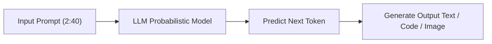
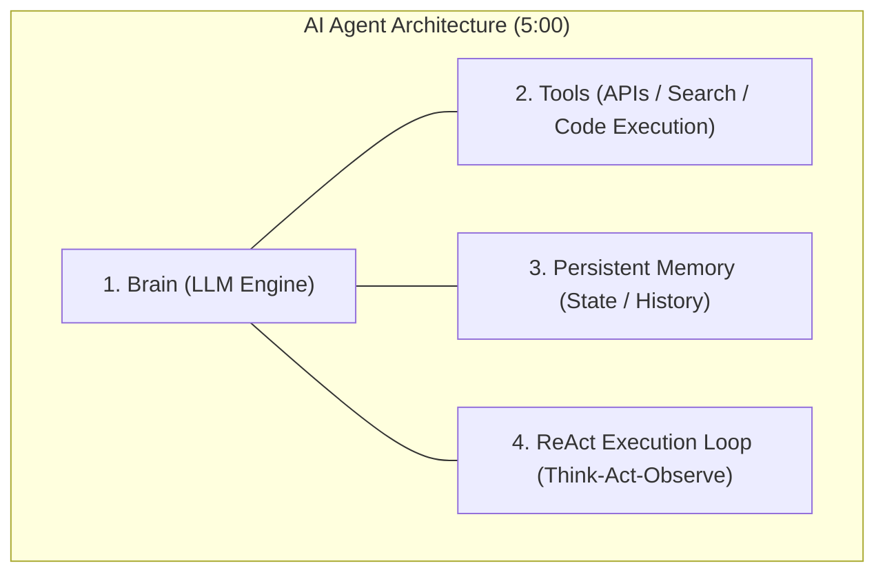
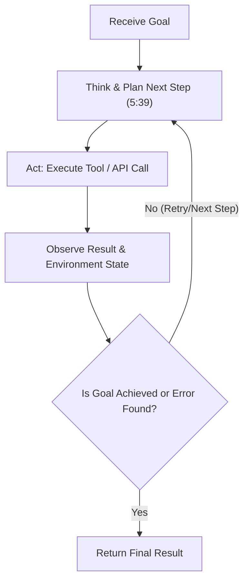
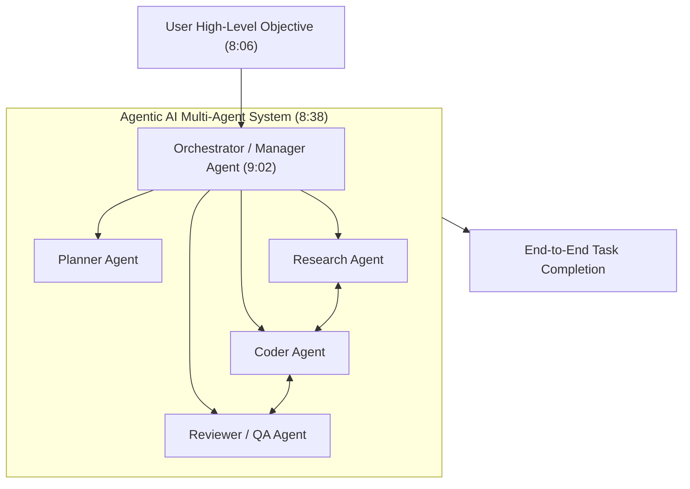
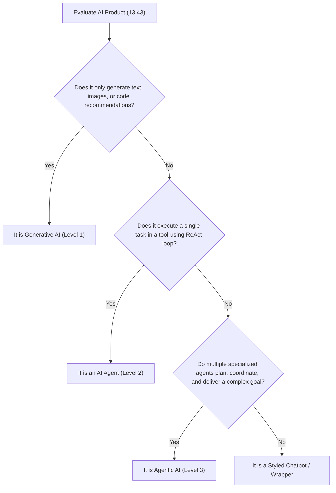

# Gen AI vs AI Agents vs Agentic AI

## Executive Overview & Source Metadata

- **Source Title**: GEN AI 🆚 AI AGENTS 🆚 AGENTIC AI
- **Creator / Speaker**: [[Neeraj Walia]]
- **Watch Link**: [YouTube Source (DLR0SN2sB4Q)](https://www.youtube.com/watch?v=DLR0SN2sB4Q)
- **Published Date**: 2026-07-25
- **Ingestion Date**: 2026-07-26
- **Core Objective**: Demystify the 2026 industry hype around AI buzzwords by establishing an architectural progression spectrum—moving from Generative AI (content prediction) to AI Agents (tool-enabled execution loops) to Agentic AI (multi-agent organizational systems).

---

## 1. The 2026 Buzzword Crisis & Diagnostic Framework (0:00 - 2:11)

In 2026, "AI Agent" and "Agentic" have become the most overused and misapplied terms across tech social media (e.g., LinkedIn bios claiming "Agentic Expert" or "AI Agent Developer"). Companies frequently relabel standard LLM wrappers or basic chatbots as "Agentic Systems" to exploit market knowledge gaps and sell re-badged software.

### The 3 Diagnostic Questions (0:00)
To immediately verify if a person or product understands the technology, ask these three diagnostic questions:

1. **Is ChatGPT an AI Agent or not?** (0:00)
   - *Answer*: Base ChatGPT is a Generative AI chatbot. It only functions as an AI Agent when executing tools like Web Search or Code Interpreter.
2. **What is the difference between Zapier automation and an AI Agent?** (0:00)
   - *Answer*: Zapier follows hardcoded, deterministic rules. An AI Agent dynamically evaluates context and decides the next step probabilistically.
3. **Are AI Agents and Agentic AI the exact same thing or different?** (0:00)
   - *Answer*: An AI Agent is an individual worker execution unit; Agentic AI is an architectural paradigm of multi-agent collaboration and planning (the entire company).

### Why Understanding the Spectrum Matters (0:52 - 1:54)

- **Career & Job Alignment** (0:52): Job descriptions requiring "Agentic AI" expect multi-agent orchestration experience (e.g., LangGraph, MCP), not basic prompt engineering.
- **Business & Financial Protection** (1:23): Companies pay substantial capital for true AI Agent systems; failing to distinguish agents from wrappers leads to purchasing or selling ineffective software.
- **Hype Filter** (1:23): Protects against predatory marketing ("Agentic Deodorant") by providing a clear technical evaluation mental model.

### The Technology Continuum: The Staircase Analogy (1:54)

Generative AI, AI Agents, and Agentic AI are **not separate or competing technologies**. They represent an evolutionary continuum where each level builds directly upon the previous layer:

$$\text{Generative AI (Brain)} \longrightarrow \text{AI Agent (Brain + Tools + Loop)} \longrightarrow \text{Agentic AI (Multi-Agent System)}$$

To make this concept intuitive, the analysis uses the **Wedding Planning ("Shaadi") Analogy** throughout all three levels.

---

## 2. Level 1: Generative AI — The Content Prediction Engine (2:11 - 4:01)

### The Metaphor: The Highly Educated Friend (2:11)
Imagine planning a wedding and consulting a highly educated, knowledgeable friend. You ask him for Mehndi decor concepts, and he generates 10 creative floral and lighting designs. You ask him for a catering menu, and he lists items from Paneer to Jalebi. However, if you instruct him to call the caterers and book them, he cannot do it. He can generate ideas and text, but cannot perform physical or digital actions.

### Technical Architecture (2:40)
Generative AI (Gen AI) functions fundamental as a **next-token prediction engine**.
- **Mechanism**: Calculates statistical probability distributions over vocabulary tokens to predict the next word, code snippet, or pixel.
- **Training Corpus**: Trained on massive internet datasets including books, Wikipedia, articles, and open-source code repositories.
- **Modalities**: Expands across text, images (*Midjourney*), video (*Sora*, *Veo*), audio, music, and software code.

### The 3 Core Limitations of Generative AI (3:06 - 3:33)

1. **No Execution Capability ("No Hands")** (3:06):
   - Can draft an email, but cannot click "Send".
   - Can suggest flight itineraries, but cannot reserve seats or process payments.
   - Can write code snippets, but cannot compile, test, or execute them in a terminal.
2. **Stateless Core ("Goldfish Memory")** (3:30):
   - The underlying LLM core is fundamentally stateless. Every new prompt session evaluates inputs from scratch without inherent persistent memory.
3. **High Confidence with Zero Guarantee (Hallucination)** (3:33):
   - Generates incorrect or fabricated statements with authoritative confidence. Never explicitly refuses due to internal uncertainty.

> *"AI will not replace your job; but a person using AI to automate their workflow will replace you."* (3:33)

---

## 3. Level 2: AI Agents — Brain + Hands + Memory + Loop (4:01 - 7:49)

### The Metaphor: The Dedicated Wedding Planner (4:01)
Instead of asking an educated friend, you hire a professional Wedding Planner with a budget of ₹2 Lakhs for 200 guests. The planner operates autonomously:
1. **Perceives & Thinks**: Analyzes budget constraints (₹2L) and guest count (200).
2. **Acts**: Searches local caterer directories and contacts vendors.
3. **Evaluates Results**: Rejects Option 1 (quoted ₹3L, over budget).
4. **Iterates**: Accepts Option 2 (quoted ₹1.8L, matches menu criteria).
5. **Concludes**: Reserves the caterer, pays the deposit, and returns a status report.

### Technical Anatomy of an AI Agent (5:00 - 5:39)

An AI Agent consists of **4 fundamental components**:

1. **Brain (LLM Engine)** (5:00): Uses underlying foundation models (Claude, Gemini, GPT-4) as the reasoning core. Agents do not replace LLMs; they build on top of them.
2. **Tools ("Hands")** (5:18): Equips the LLM with executable tool access—web search APIs, math calculators, email gateways, database query runners, and shell execution environments.
3. **Persistent Memory** (5:30): Retains goal states, past tool responses, intermediate outputs, and environmental feedback across step iterations.
4. **The ReAct Execution Loop** (5:39): The critical differentiator missed by 90% of basic implementations. The agent continuously evaluates state in a loop:

$$\text{Think} \longrightarrow \text{Act (Use Tool)} \longrightarrow \text{Observe (Check Output)} \longrightarrow \text{Re-think}$$

### Empirical Agent Demonstrations (6:00 - 6:37)
- **Deep Web Research**: When asked *"What's new with Apple this year?"*, the agent autonomously navigates multiple websites, cross-references source facts, verifies claims, and synthesizes a structured report.
- **IDE Code Agent (VS Code / Cursor / Cloud Code)**: When requested to build an HTML/CSS login page, the agent searches workspace directory files, reads existing source code, writes output files, executes linter checks, and fixes syntax errors iteratively.

### Busting the Zapier Myth: Static Automation vs AI Agent (7:03 - 7:49)

| Feature | Static Automation (e.g., Zapier) (7:03) | AI Agent (7:21) |
| :--- | :--- | :--- |
| **Path Structure** | Fixed, hardcoded, pre-defined workflow sequence. | Dynamic, probabilistic path determined at runtime. |
| **Error Handling** | Fails or throws an exception if inputs diverge. | Re-evaluates state, tries alternative tools or paths. |
| **Decision Engine** | Conditional `if-else` branching logic. | LLM reasoning engine evaluating goal progress. |

---

## 4. Level 3: Agentic AI — Multi-Agent Systems & Paradigms (7:49 - 11:43)

### The Metaphor: The Full Event Management Company (7:49)
Instead of a single planner, you hire a full-service Event Management Agency. You provide one high-level prompt: *"My wedding is on Feb 19th with 500 guests. Manage everything."*

The agency operates via specialized departments:
- **Head Manager (Orchestrator)**: Deconstructs the goal into sub-projects.
- **Catering Team**: Manages food supply and menu execution.
- **Decor Team**: Sets up stage lighting at 6:00 PM.
- **Logistics & DJ Team**: Coordinates arrival after decor setup at 7:00 PM. Switches to indoor backup dynamically if rain occurs.

### Definition & The 4 Architectural Pillars (8:06 - 9:18)

**Agentic AI** is an architectural paradigm that coordinates networks of specialized AI agents to solve complex, non-deterministic objectives without step-by-step human intervention.

1. **Automated Goal Planning** (9:02): The system automatically decomposes large goals into structured task DAGs (Directed Acyclic Graphs).
2. **Multi-Agent Specialization** (9:18): Separate specialized agents handle dedicated sub-tasks (e.g., frontend developer agent, backend agent, API integration agent, code reviewer agent).
3. **Orchestration & Routing** (9:48): A central orchestrator handles inter-agent communication, task sequencing, timing constraints, and artifact passing.
4. **High Autonomy** (9:48): Operates asynchronously end-to-end based on high-level objectives.

### Real-World Case Studies (10:00 - 10:54)
- **Devin**: Autonomous AI Software Engineer capable of planning, repository research, coding, debugging, and testing whole features.
- **Emergent.sh**: Multi-agent software generation engine that breaks down full-stack app requests into database schemas, backend services, frontend components, and styling pipelines sequentially.

### Realities & Technical Limitations of Agentic AI (10:54 - 11:43)
- **Non-Deterministic Multi-Agent Conflicts**: Agents can get stuck in inter-agent negotiation loops or misinterpret handoffs.
- **Cascading Error Propagation**: A minor bug generated by a research agent compounds when passed down to coding and review agents.
- **High API Token Consumption**: Multi-agent execution loops consume exponentially more LLM tokens per task, leading to high operational costs.
- **40-Year Academic Roots**: The theoretical concept of "Intelligent Autonomous Agents" originated in 1980s–1990s computer science research; Generative AI provided the missing cognitive engine to make it practical.

---

## 5. Comprehensive Comparison Table & Myth Busting (11:43 - 14:41)

### Generative AI vs AI Agent vs Agentic AI

| Dimension | Level 1: Generative AI | Level 2: AI Agent | Level 3: Agentic AI |
| :--- | :--- | :--- | :--- |
| **Analogy** | Educated Friend (2:11) | Dedicated Wedding Planner (4:01) | Full Event Management Agency (7:49) |
| **Core Nature** | Content Prediction Machine (2:40) | Individual Autonomous Worker (5:00) | Multi-Agent System / Paradigm (9:02) |
| **Components** | Foundation LLM (Text/Image/Code) | LLM + Tools + Memory + ReAct Loop | Multiple Specialized Agents + Orchestrator |
| **Execution** | Passive Generation (Text only) | Tool Execution via API calls | Autonomous Task Decomposition & Assembly |
| **Memory** | Stateless Core | Task Context & Execution History | Shared Context & Inter-Agent Artifact State |
| **Failure Mode** | Hallucinations with high confidence | Infinite tool retry loops | Cascading error propagation across agents |
| **Example** | ChatGPT, Claude, Midjourney | VS Code Copilot, Search Agent | Devin, Emergent.sh, AutoGen, LangGraph |

### The 5 Big Industry Myths Busted (11:43 - 12:50)

1. **Myth 1: "ChatGPT is an AI Agent."** (11:43)
   - *Reality*: Base ChatGPT is a standard LLM Chatbot. It enters agentic mode only when explicitly invoking web search, code interpreters, or custom GPT actions.
2. **Myth 2: "AI Agent and Agentic AI are identical terms."** (12:05)
   - *Reality*: An AI Agent is a single worker unit; Agentic AI refers to the full multi-agent organizational paradigm.
3. **Myth 3: "Zapier workflows are AI Agents."** (12:27)
   - *Reality*: Zapier uses hardcoded static automation paths. Agents make dynamic runtime decisions using LLM reasoning loops.
4. **Myth 4: "Agentic AI means AGI has been achieved."** (12:50)
   - *Reality*: AGI remains distant. Current Agentic systems suffer from high error rate compounding, cost overheads, and context drift.
5. **Myth 5: "Agentic AI is strictly for software engineers."** (12:50)
   - *Reality*: Applicable across creators, businesses, students, and freelancers for workflow automation.

### Career & Market Opportunities (12:50 - 13:43)
- **Students & Aspiring Engineers** (13:11): Focus on **Model Context Protocol (MCP)**, **LangGraph**, and **Agent Orchestration Frameworks** (CrewAI, AutoGen). Move beyond basic prompt engineering.
- **Working Professionals** (13:43): Identify the top 20% repetitive tasks in daily work (reports, data entry, customer follow-ups) and build agentic workflows for operational efficiency.
- **Businesses** (13:43): Implement autonomous 24/7 customer support, invoice parsing, and dynamic lead management systems.

---

## 6. The 3-Second Quick Detection Framework (13:43 - 14:16)

When evaluating any AI software product in the market, run this 3-second evaluation decision tree:

---

## Summary Formula

$$\text{AI Agent} = \text{Brain (LLM)} + \text{Hands (Tools)} + \text{Memory} + \text{Execution Loop}$$

$$\text{Agentic AI} = \text{Goal} + \text{Automated Planning} + \text{Multi-Agent Collaboration} + \text{Orchestration}$$

---
