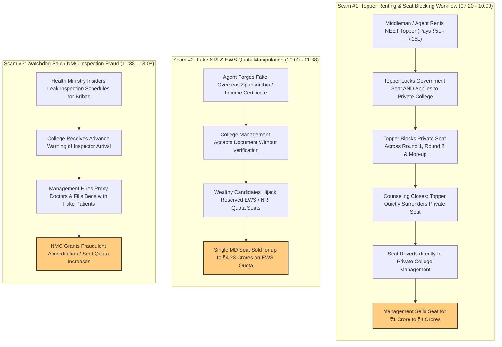
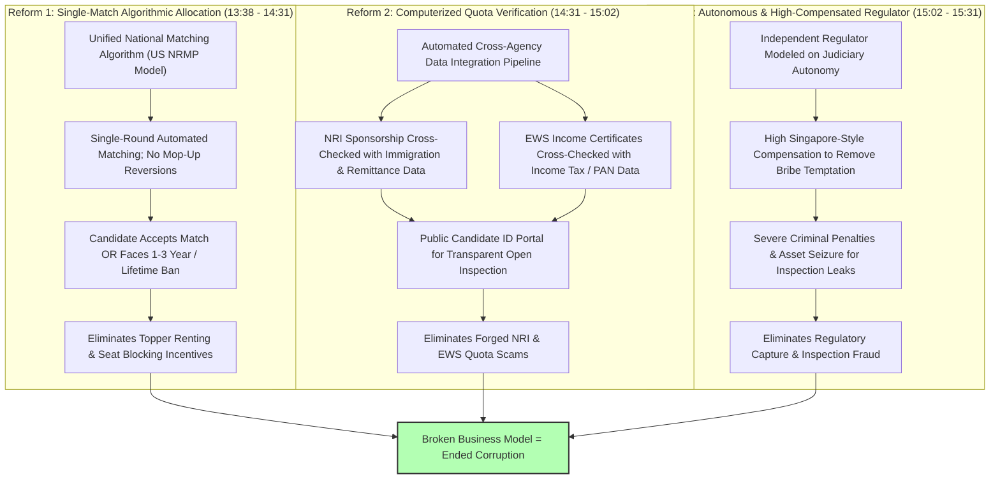

# Detailed Study Notes — How Medical Mafia Turned Doctor Shortage into a ₹4000 CR Business

## 📌 Overview & Source Metadata
- **Video Title**: End of Modi Regime? | How Medical Mafia turned Doctor Shortage into a ₹4000 CR Business?
- **Creator / Channel**: [[Think School]]
- **Watch URL**: [YouTube Link](https://www.youtube.com/watch?v=NX4SkUO_HYQ&t=553s)
- **Primary Focus**: Economic case study analyzing India's medical education crisis, artificial scarcity of MBBS/PG seats, systemic seat-mafia rackets (Topper Renting, NRI/EWS Quota Manipulation, Watchdog Inspection Fraud), and proposed algorithmic/institutional governance solutions.

---

## 💡 Executive Summary (00:10 - 02:11)
Public outcry and political protests following NEET paper leaks—including Sonam Wangchuk's 20-day hunger strike demanding the resignation of Education Minister Dharmendra Pradhan—focus on surface-level political symbols rather than structural causes. The core driver of India's medical crisis is a **multi-thousand-crore industry operating on artificial seat scarcity**. 

While India suffers a massive deficit of 2.81 million allopathic doctors and critical specialists, over 11 lakh qualified NEET candidates are rejected annually simply because seats do not exist. Private college management, corrupt ministry officials, and middlemen exploit this artificial bottleneck to convert student desperation into black-market transactions worth **₹1 Crore to ₹4 Crores per medical seat**.

---

## 📊 Pipeline Diagram 1: India's Healthcare Bottleneck & Elimination Pipeline

```mermaid
flowchart TD
    subgraph S1 ["Population Demand & Target Gap (03:31 - 04:52)"]
        P["India Population: 1.46 Billion"] --> ReqAllopathy["WHO Standard (1:1000) = 1.46M Doctors"]
        P --> TargetDev["Developed Goal (3:1000) = 4.20M Doctors"]
        Current["Current Allopathic Doctors: 1.39M"] --> Deficit["2.81 Million Allopathic Doctor Deficit"]
    end

    subgraph S2 ["NEET Qualification & Scarcity Bottleneck (05:42 - 06:32)"]
        NEET["13+ Lakh Candidates Qualified NEET (2024)"] -->|"Artificial Scarcity Gate"| MBBSSeats["Under 2 Lakh Total MBBS Seats Available"]
        MBBSSeats --> Rejection["11+ Lakh Eligible Students Rejected Annually"]
    end

    subgraph S3 ["Post-Graduate Specialist Bottleneck (05:00 - 06:54)"]
        MBBSGrads["1.18 Lakh MBBS Graduates"] -->|"3:2 Training Ratio"| PGSeats["Only 2 Specialist Seats per 3 Doctors"]
        PGSeats --> Elimination["33% Qualified Doctors Eliminated from Specialization"]
        Elimination --> DeficitSurgeons["34-Year Deficit: General Surgeons"]
        Elimination --> DeficitCardio["82-Year Deficit: Cardiologists"]
    end

    style Deficit fill:#ff9999,stroke:#333,stroke-width:2px
    style Rejection fill:#ff9999,stroke:#333,stroke-width:2px
    style Elimination fill:#ff9999,stroke:#333,stroke-width:2px
```

---

## 🩺 Section 1: India's Doctor Shortage Crisis — Official Metrics vs Ground Reality (03:31 - 06:54)

### 1.1 Statistical Manipulation of Doctor-to-Population Ratios (03:31 - 04:52)
The World Health Organization (WHO) prescribes a baseline ratio of **1 doctor per 1,000 people (1:1000)**.
- **Official Government Claim**: India officially reports a doctor-to-population ratio of **1:800** (or ~1.23 doctors per 1,000 people).
- **The Statistical Flaw**: The government counts AYUSH practitioners (Ayurveda, Yoga & Naturopathy, Unani, Siddha, and Homeopathy) alongside allopathic doctors.
- **True Allopathic Ratio**: Removing AYUSH practitioners collapses the allopathic doctor ratio to **0.7 – 0.8 per 1,000 people**.
- **Developed Economy Benchmark**: NITI Aayog member Dr. V.K. Paul highlights that 1:1000 is an acceptable threshold only for low-income developing nations. A developed India requires **3.0 allopathic doctors per 1,000 people**.

### 1.2 Comprehensive Doctor Ratio & Capacity Matrix
| Metric / Threshold Scenario | Ratio per 1,000 People | Required Allopathic Doctors (1.46B Population) | Current Active Pool | National Deficit / Deficit Duration |
| :--- | :--- | :--- | :--- | :--- |
| **WHO Minimum Baseline** | 1.0 per 1,000 | 1,460,000 | ~1,390,000 | ~70,000 deficit |
| **Official Government Figure** (Includes AYUSH) | 1.23 per 1,000 (1:800) | Statistically Compliant | Includes non-allopathic | **Masked Deficit** |
| **Actual Allopathic Reality** | 0.7 – 0.8 per 1,000 | 1,460,000 | ~1,390,000 | Severe deficit in emergency/surgery |
| **Developed Country Goal** (Dr. V.K. Paul) | 3.0 per 1,000 | 4,200,000 | 1,390,000 | **2,810,000 doctor shortage** |
| **General Surgeons Capacity** | Critical Shortage | N/A | Deficient | **34 years** to reach sufficiency |
| **Cardiologists Capacity** | Critical Shortage | N/A | Deficient | **82 years** to reach sufficiency |

### 1.3 Global Comparison: Annual Medical Graduates per 100,000 Population (05:42 - 06:07)
India produces significantly fewer medical graduates per capita than major developed countries:
- **India**: **4.1** per 100,000
- **United States**: **8.5** per 100,000 (2.07x India)
- **Germany**: **12.0** per 100,000 (2.92x India)
- **United Kingdom**: **13.1** per 100,000 (3.19x India)
- **Denmark**: **21.2** per 100,000 (5.17x India)

### 1.4 The Post-Graduate Specialist Bottleneck (05:00 - 06:54)
- **2024 NEET Disconnect**: 13+ lakh students passed NEET (qualifying as medically capable), but fewer than 2 lakh MBBS seats existed, forcing **11+ lakh capable students out of medical education**.
- **PG Seat Ratio**: For every 3 MBBS doctors trained, only 2 post-graduate specialist training seats exist.
- **Elimination Rate**: **33% of trained MBBS doctors** are blocked from specializing due to structural seat limits rather than academic performance.

---

## 💰 Pipeline Diagram 2: Comprehensive Architecture of the 3 Medical Seat Scams

---

## 💸 Section 2: Financial Dynamics & Black Market Pricing

### 2.1 Medical Seat Legal vs Black Market Rate Card (07:20 - 08:00)

| Admission Channel / Seat Type | Score / Rank Requirement | Official Tuition Fees | Black Market Premium / Rate Card Price |
| :--- | :--- | :--- | :--- |
| **Government Quota Seat** | Top NEET Rank | ₹3 Lakhs – ₹5 Lakhs total | N/A (Merit Allocated) |
| **Private College Quota** | Average NEET Score | ₹50 Lakhs – ₹1 Crore total | Official Private Rates |
| **Management Black Market (MBBS)** | Minimum / Low Score | Bypassed Scorecard | **₹1 Crore per seat** |
| **PG Specialist (MD Radiology / Derm)** | Minimum / Low Score | Bypassed Scorecard | **₹3 Crores – ₹4 Crores per seat** |
| **Fraudulent EWS Quota Purchase** | Fake Income Cert | Intended for Low Income | **Up to ₹4.23 Crores paid** |

### 2.2 Documented Enforcement Rackets & Case Evidence (09:46 - 11:38)
- **Telangana Private College Racket (2023)**: 12 private medical colleges caught systematically selling blocked topper seats for over **₹100 Crores**.
- **Karnataka Trust Scam (2021)**: Educational trusts exposed selling 185 government-quota seats for **₹100 Crores** within a **₹400 Crore seat-blocking network**.
- **EWS Quota Infiltration**: Enforcement Directorate (ED) investigations confirmed **145 EWS seats** in deemed universities were purchased by multi-millionaires.
- **Forged NRI Certificates**: Approximately **18,000 MBBS and PG seats** across India are currently held under fake NRI sponsorship documentation.
- **CBI Inspection Raids**: Over **40 medical colleges across 10 states** obtained operational licenses or expanded seat quotas using bribed NMC surprise inspection leaks.

---

## 🛠️ Pipeline Diagram 3: Proposed Algorithmic & Governance Reform Architecture

---

## 🏛️ Section 3: Institutional & Algorithmic Reform Matrix (13:08 - 16:42)

Protests demanding individual political resignations fail because a corrupt system will grind down any honest administrator. Reform requires replacing human discretion with automated, tamper-proof systems.

| Reform Pillar | Current Systemic Vulnerability | Proposed Technological / Governance Reform | Global Reference Model |
| :--- | :--- | :--- | :--- |
| **1. Seat Counseling & Matching** | Multi-round counseling creates time gaps allowing toppers to block and surrender seats to management. | **National Single-Match Algorithmic System**: Single-round matching algorithm with zero mop-up seat reversions. Mandatory seat acceptance enforced by 1–3 year or lifetime bans for abandonment. | US NRMP (National Resident Matching Program) algorithm |
| **2. Quota Authenticity Verification** | Manual verification by private college clerks allows forged NRI sponsorships and fake EWS certificates. | **Automated Cross-Agency API Verification**: Direct computerized validation of NRI sponsorships against immigration/passport databases and EWS credentials against Income Tax/PAN records. All candidate quota IDs published online. | Integrated Tax & Immigration Automated Verification |
| **3. Regulatory Body Governance** | NMC surprise inspection dates and inspector names are leaked by ministry insiders for bribes. | **Autonomous High-Compensated Regulator**: Independent body isolated from political executive control, featuring high Singapore-style compensation and severe criminal sanctions for inspection compromise. | Judicial Autonomy & Singapore Public Service Model |

---

## 🗣️ Key Takeaways & Direct Quotes (with Timestamps)

- **Root Cause vs Symptom** `(01:29)`:
  > *"While most people think that the NEET paper leak is the problem, our entire medical education system is so corrupt that the paper leak is only a symptom. The actual culprit is a system that is so sophisticatedly corrupt that today it has become a multi-thousand-crore industry."*

- **The Math of Artificial Scarcity** `(05:42)`:
  > *"In 2024, more than 13 lakh students qualified NEET. Every one of them was capable of becoming a doctor. But do you know how many MBBS seats were waiting for them? Not even 2 lakh seats. So 11 lakh students were rejected not because they weren't good enough, but because the seats simply didn't exist."*

- **The Systemic Incentive Law** `(13:38 - 16:25)`:
  > *"A bad system will beat a good person every single time. You cannot have an honest man lead a corrupt system... We don't need a better man at the wheel. We need a machine that doesn't need a better man."*

- **Business Model Interdiction** `(15:31 - 15:55)`:
  > *"As long as a medical seat is worth 4 crore rupees, someone will keep inventing new ways to sell it because it's a great business model. So to break corruption, we need to attack the business model."*

---

## 🔗 Metadata Links
- **Source File**: [[01_RAW/SOURCE/End of Modi Regime  How Medical Mafia turned Doctor Shortage into a ₹4000 CR Business.md]]
