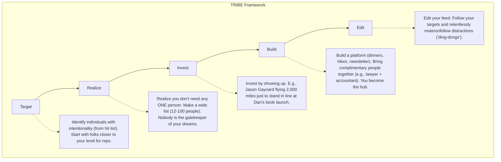

---
id: 2f281e02-4b36-4c4c-851f-506be0cb291d
title: "Detailed Study Notes: How to Make Rich Friends"
type: literature-note
status: learning
domain: self-improvement
source_type: youtube
created: 2026-08-17
updated: 2026-08-19
review: 2026-08-30
confidence: 90
version: 1
aliases:
  - "How to Make Rich Friends"
tags:
  - yt
  - transcript
  - self-improvement
  - business
  - strategy
owner_moc: Study MOC
sources:
  - "[[01_RAW/SOURCE/How to Make Rich Friends.md]]"
related: []
schema_version: 4
---

# Detailed Study Notes: How to Make Rich Friends

## Core Claim
The most effective way to solve problems is to shift from asking "how do I solve this?" to "who has already solved this?" Building genuine, value-driven relationships with successful people can exponentially accelerate your progress, allowing you to inherit solutions rather than relying on slow trial and error.

## Explanation

Networking often feels sleazy because it is approached transactionally. However, true networking is about building a "Tribe" with intention and adding value without expecting immediate returns. As Dan Martell notes, a single relationship helped him go from a troubled past (jail and rehab by 17) to getting investments from Mark Cuban and spending a week with Richard Branson.

### The Shift: Think in People, Not Problems
Instead of trial and error, inherit the solutions of those who have already figured it out. 
> "Every problem you have, somebody else out there has already solved it. If you build that relationship with them, then you get to inherit the solution." — referencing Ben Hardy's philosophy.

- **Create a "Hit List" (2-minute exercise)**: Write out 5 specific goals (e.g., get health in check, figure out money, create media) and identify a specific person who has already achieved each goal. 
  - *Examples given*: Allan Dick (Health), Garrett Gunderson (Money), Keith Ferrazzi (Networking), Austin Keen (Wake surfing), Sam Gadets (Media).
- **Proximity is power**: Move to where the people who have solved your problems live. Often, "the solution to problems are caught, not taught." 
  - *Examples given*: Software in San Francisco, Media in Austin, Music in Nashville, Finance in NYC.

### 4 "Invisible Showstoppers" (Behavioral Mistakes)
These actions subtly ruin your chances of building relationships before they even begin. The worst part is no one will ever tell you that you blew it.
1. **Flaking / Being Late**: Top performers need reliable people who have 100% follow-through. 
   - *Example*: A guy approached Dan at the gym in a full suit and asked for advice. Dan invited him to a Tuesday founders' hike. The guy agreed but never showed up. Because he failed this filter, Dan decided to move on. 
   - *Fix*: Only commit when you are 100% sure; text them if you cannot make it.
2. **Neediness**: Treating someone like they have "magical fairy dust" and acting like a fanboy/fangirl makes them uncomfortable. 
   - *Fix*: Act like a peer. Maintain personal space—keep at an arm's length, lean back, stand to their side.
3. **The Instant Ask**: Asking for a favor immediately guarantees a 'no' and makes future 'yeses' harder. 
   - *Fix*: Give first and create value ahead of time. Don't ask "Do you want me to edit a video?"; instead, just edit the video and send it to them.
4. **Transactional Nature**: Helping solely to get something in return ("keeping score"). High-level people can feel this desperation.
   - *Fix*: Be intentional and play the long game. View relationships like Gary V does: as long-term investments rather than tit-for-tat transactions.
   - *Example of unseen reputation damage*: Dan was considering partnering with "Bobby", but his friend "Mike" warned him that Bobby constantly talks behind people's backs. Dan immediately dropped the partnership, and Bobby never knew why.

### 3 Mindset Blockers ("Head Trash")
These are internal lies you tell yourself that block you from reaching out.
1. **"Who am I to take their time?"**: You might be comparing your "chapter 2" to their "chapter 27." Do not tie your inherent value to your achievements. As long as you are doing the work, you are just them a few years prior. Dan reminds us that he had 70,000 followers just 3 years before hitting 12 million—he's the exact same person.
2. **"I have no value to add"**: Everyone has something to offer. Even being someone's biggest cheerleader or celebrating their wins is immensely valuable. 
   - *Example*: Dan's best friend Marty holds that title because he was always there to genuinely celebrate Dan's wins when others stopped caring. Buy their book first, be the first to leave a comment.
3. **"They are different"**: Successful people are normal humans who have simply been executing for a longer period. 
   - *Example*: Joe Rogan noting that even mega-celebrities like Kim Kardashian go to the bathroom. Stop putting them on a pedestal. Be kind and curious, but treat them as human.

### The T.R.I.B.E. Framework
A systematic approach to activating your network and getting reps:

### Tactical Outreach Steps
When reaching out to high-level individuals, never "freestyle." Do not use AI to write these outreaches; the goal is to say something an AI bot could never say.
1. **Do your homework:** Consume their content to find what Jason Gaynard calls "uncommon commonalities" (e.g., "My dad's a pilot, your dad's a pilot").
2. **Show up in their world:** Follow and genuinely comment on their social media. Ensure your profile isn't a random string of numbers.
3. **Ask for specific advice (No Pitch):** Reach out referencing specific research. Ask a highly targeted question that cannot be answered by a simple Google search. 
   - *Bad example*: "How do I start an AI company?"
   - *Good example*: "I'm debating between using Grok Build or Codex—do you have an opinion?" 
   - *Pro Tip*: Include your cell phone number in the email to make it easy for them to just tap and call you while driving.
4. **Follow up with action:** When they give advice, immediately act on it. Reply back saying, "I tried Grok Build and built this app. Thank you." This proves you value their time.
5. **Volunteer and Help Their Team:** Offer your skills to help them or their team to gain proximity and trust. 
   - *Example*: When Dan moved to SF, he volunteered for Cassie (who ran large events) by reaching out to speakers on her behalf. This allowed him to network with top entrepreneurs while adding massive value to her. Alternatively, ask if their team members (e.g., Sam or Arturo) need an introduction.
6. **Maintain the connection:** Be the first to celebrate their milestones. When friends hit 1M followers on YouTube, Dan is the first to comment, screenshot, and text them.

## Related
- [[Networking Principles]]
- [[Mentorship Strategies]]

## Source
- [[How to Make Rich Friends]] (Source Transcript)
