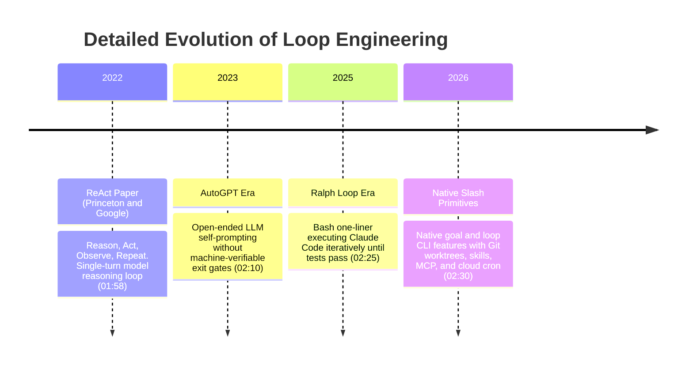
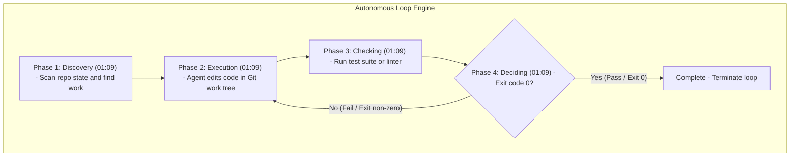

# Detailed Study Notes — I Stopped Prompting Claude Code. Now Loops Do It For Me (Loop Engineering)

## Executive Summary

This study note provides an exhaustive, line-by-line technical reference and architectural blueprint for **Loop Engineering** in Agentic AI, synthesized from the deep-dive video by [[Builders Central]]. 

The document details the fundamental paradigm shift away from manual, turn-by-turn interactive prompting (`Human -> Prompt -> Agent -> Response -> Human -> Prompt`) to autonomous, harness-driven loop design (`Human -> Design System -> Loop Prompts Agent -> Agent Executes -> Loop Verifies -> Loop Prompts Again -> Task Complete`).

Industry pioneers—such as **Boris Cherny** (creator of Claude Code at Anthropic) and **Peter Steinberg** (creator of Open Canvas / Open Claw, now at OpenAI)—emphasize that engineering leverage has moved up the stack. Instead of manually writing individual prompts, developers now engineer autonomous control systems using isolated Git work trees, project skills, Model Context Protocol (MCP) connectors, and disk-based persistent memory to execute self-correcting loops until machine-verifiable exit criteria pass.

---

## 🎯 Key Takeaways, Core Axioms & Direct Quotes

### Core Paradigm Statements

> *"I don't prompt Claude anymore. I have loops that are running. They're the ones that are prompting Claude. My job is to write loops."*  
> — **Boris Cherny**, Creator of Claude Code at Anthropic `(00:12)`

> *"You shouldn't be prompting coding agents anymore. You should be designing loops that prompt your agents."*  
> — **Peter Steinberg**, Creator of Open Canvas / Open Claw at OpenAI `(00:17)`

> *"You're no longer the assembly line worker at a factory. You're the one who owns the factory. You don't type the next instruction. You design the system that types the instructions for you."*  
> — **Builders Central**, Factory Owner Analogy `(00:38)`

> *"A script says do step A, then step B, then step C—a fixed sequence with no decisions. A loop on the other hand says look at the current state, decide what to do, do it, check the result, and decide if we need to do another round. This is actually a lot closer to a tiny engineering process than a bash script."*  
> — **Builders Central**, Script vs. Loop Distinction `(01:42)`

> *"The model forgets everything between runs. Its context window is wiped clean, but the repo doesn't forget, and that's the trick. You put state in files. The agent reads them, does work, updates them, and the next run picks up exactly where you left off."*  
> — **Builders Central**, Memory Primitive Axiom `(05:30)`

> *"A loop running unattended is also a loop making mistakes that go unattended. The goal is not an agent that works mysteriously overnight. The goal is a narrow automation with a clear finish line, a verification step, and a human at the end who actually reads what it shipped."*  
> — **Builders Central**, Risk Governance Rule `(09:39)`

---

## 📜 Complete Chronological Transcript Breakdown (00:00 - 10:07)

### Segment 1: The End of Manual Prompting (00:00 - 00:38)
- **Transcript Context**: For two years, value extraction from coding agents followed a manual turn-by-turn pattern: user writes prompt, waits, reads response, writes next prompt, and waits again `(00:00)`.
- **Key Shift**: Industry leaders Boris Cherny (built Claude Code at Anthropic) and Peter Steinberg (creator of Open Canvas / Open Claw, now OpenAI) went viral stating that manual prompting is obsolete. The developer's primary role is now writing loops that prompt agents `(00:12, 00:17)`.
- **Public Reaction**: Millions of views led to confusion ("What does that even mean?"), giving rise to the formal discipline of **Loop Engineering** `(00:38)`.

### Segment 2: The Factory Owner Mental Model (00:38 - 01:09)
- **Mental Model**: Developers are no longer assembly line workers typing sequential instructions; they are factory owners designing the assembly line system that types instructions automatically `(00:38)`.
- **Structural Comparison**:
  - *Old Model*: `You -> prompt -> agent -> response -> you -> prompt -> agent -> response` `(00:44)`.
  - *New Model*: `You -> design loop -> loop prompts agent -> agent works -> loop checks -> loop prompts again -> done` `(00:44)`.
- **Video Roadmap**: 1) What a loop is, 2) The 5 primitives, 3) Real coding agent loop demos, 4) Financial/ROI rules `(01:09)`.

### Segment 3: Defining the Loop & Script vs. Loop (01:09 - 01:58)
- **4-Step Loop Definition**: A loop consists of 4 repeating steps: **Discovery $\rightarrow$ Execution $\rightarrow$ Checking $\rightarrow$ Deciding** `(01:09)`.
- **Script vs. Loop Distinction**:
  - *Script*: Linear, static execution ($A \rightarrow B \rightarrow C$) with zero decision points `(01:42)`.
  - *Loop*: Inspects current state, determines appropriate action, executes, verifies outcome, and decides if further iteration is needed. Resembles a micro-engineering process rather than a static shell script `(01:42)`.

### Segment 4: Lineage & History of Agentic Loops (01:58 - 02:30)
- **2022 (ReAct Paper)**: Princeton & Google paper defining Reason, Act, Observe, Repeat. Single model, single loop, human in loop `(01:58)`.
- **2023 (AutoGPT Era)**: Open-ended goal loops without deterministic feedback gates. Spun endlessly, failed to complete work, caused widespread skepticism ("agents are a toy") `(02:10)`.
- **2025 (Ralph Loop)**: A Bash one-liner running Claude iteratively until local tests passed. Hacky but effective proof-of-concept `(02:25)`.
- **2026 (Native Slash Commands)**: `/goal` and `/loop` primitives integrated directly into agent CLIs as first-class features `(02:30)`.

### Segment 5: The 5 Building Blocks / Primitives (02:30 - 03:35)
- **1. Trigger**: Signal starting the loop (schedule, webhook, `/goal` command) `(02:40)`.
- **2. Work Trees**: Isolated Git branches preventing concurrent agents from stepping on shared files `(02:49)`.
- **3. Skills**: Project conventions, stack guidelines, and incident post-mortems read every run `(02:53)`.
- **4. Connectors**: MCP tools connecting agents to GitHub, Slack, Linear, databases `(03:06)`.
- **5. Memory**: Persistent state stored on disk (`to-do.md`). Solves context window wipes between runs `(03:15, 05:30)`.

### Segment 6: Claude Code Slash Commands (`/goal` vs `/loop`) (03:35 - 05:00)
- **`/goal` (Finish-Line Driven)**: Keeps agent working until a verifiable condition is met (`/goal all tests pass`). Stops automatically on success `(03:35)`.
- **Measurability Rule**: Goal condition MUST return binary pass/fail (e.g., `npm test`). Subjective goals like `"make code better"` fail because "better" is unmeasurable, leading to infinite loops or premature victory declarations `(04:09)`.
- **`/loop` (Clock-Driven)**: Runs a prompt on a recurring schedule. Does not stop automatically; runs on intervals until killed `(04:23)`.

### Segment 7: Case Study 1 — `/goal` OTP & Phone Validation Demo (05:00 - 06:07)
- **Repository**: Indian phone validation & OTP utility TypeScript library `(05:00)`.
- **Failures**: 5 unit test failures across 2 files (`phone-validation.test.ts` & `otp-generation.test.ts`). OTP returning 5 digits instead of 6, and 3 instead of 4 `(05:17)`.
- **Execution**: Triggered `/goal all tests pass`. Agent inspected code, identified 4 commented bug locations, applied fixes, and re-tested `(05:40)`.
- **Outcome**: **15 tests passed, 4 fixes applied in 26 seconds** `(05:40)`.

### Segment 8: Case Study 2 — Scheduled Morning Daily Triage Loop (06:07 - 07:45)
- **Objective**: Morning triage loop determining builds on fire and task priorities `(06:07)`.
- **Memory Primitive**: Local `to-do.md` preserving yesterday's 3 items across context wipes `(06:17)`.
- **Skill File (`daily-triage-skill`)**: Reads GitHub issues (`bug`/`enhancement`), checks CI build status, surfaces failing CI tests at position #1, caps items at 10, appends timestamp `(06:37)`.
- **Execution**: Agent ran `gh` CLI commands, detected a reintroduced OTP expiration bug from a breaking PR, and updated `to-do.md` `(07:02)`.

### Segment 9: Cloud Scheduling & Routine Automation (07:45 - 09:34)
- **Cloud Schedule**: Configured `/loop` for 9:00 AM IST daily in cloud mode. Runs automatically even when developer laptop is closed `(07:51)`.
- **Mindset**: Developer writes skill once, schedules loop once, and wakes up to an updated `to-do.md` ready for action `(08:08)`.

### Segment 10: Process vs. Automation & Abstraction Stack (09:34 - 09:39)
- **Automation vs. Loop**: Automation executes rigid linear steps ($A \rightarrow B \rightarrow C$). A loop inspects state, evaluates outcomes, and decides next steps dynamically `(09:34)`.
- **3-Layer AI Evolution**: Prompt Engineering $\rightarrow$ Context Engineering $\rightarrow$ Loop Engineering `(09:05)`.
- **Leverage Shift**: Leverage has moved from prompt crafting to system design `(09:15)`.

### Segment 11: Risk Management, Warnings & ROI Rules (09:39 - 10:06)
- **Warning**: Unattended loops make unattended errors that burn money `(09:39)`.
- **Human Guardrail**: Loops require narrow automation, verifiable stop conditions, and a human reviewing shipped outputs `(09:47)`.

### Segment 12: Progressive Adoption Roadmap (10:06 - 10:07)
- **Roadmap**: Start with a 3-minute watching loop on measurable goals $\rightarrow$ add a skill $\rightarrow$ schedule it `(10:06)`.
- **Resource**: Free `daily-triage-skill` file shared in video comments `(10:07)`.

---

## ⌛ Historical Lineage & Evolution (01:58 - 02:30)



---

## 🔄 The 4-Step Loop Control Engine Architecture (01:09 - 01:42)



| Phase | Name | Operation | Mechanism / Example |
| :--- | :--- | :--- | :--- |
| **1** | **Discovery** `(01:09)` | Scans environment for pending work or failures. | Detects failing unit test or open GitHub issue labeled `bug`. |
| **2** | **Execution** `(01:09)` | Modifies codebase using skills and context. | Agent edits source code files within an isolated Git branch. |
| **3** | **Checking** `(01:09)` | Runs independent machine evaluation. | Executes `npm test` or `pytest` to verify changes objectively. |
| **4** | **Deciding** `(01:09)` | Evaluates check results to decide next action. | Exit code 0 $\rightarrow$ terminate loop; non-zero $\rightarrow$ inject errors into next turn. |

---

## ⚙️ The 5 Primitives of Loop Engineering (02:30 - 03:35)

```text
┌────────────────────────────────────────────────────────────────────────┐
│                        LOOP PRIMITIVES ARCHITECTURE                    │
├───────────────┬────────────────────────────────────────────────────────┤
│ 1. TRIGGER    │ Schedule / Cron, Webhook, CLI Slash Commands (/goal)   │
├───────────────┼────────────────────────────────────────────────────────┤
│ 2. WORK TREES │ Isolated Git Branches (2 Agents = 2 Branches = 0 Conflict)│
├───────────────┼────────────────────────────────────────────────────────┤
│ 3. SKILLS     │ Domain Knowledge & Conventions (.claude/skills/...)   │
├───────────────┼────────────────────────────────────────────────────────┤
│ 4. CONNECTORS │ MCP Tools (GitHub API, Slack, Linear, CI/CD, DB)       │
├───────────────┼────────────────────────────────────────────────────────┤
│ 5. MEMORY     │ Disk State Persistence (to-do.md, progress.md)         │
└───────────────┴────────────────────────────────────────────────────────┘
```

| Primitive | Name | Function | Detailed Mechanics |
| :--- | :--- | :--- | :--- |
| **1** | **Trigger** `(02:40)` | Activation signal initiating the loop. | Cron schedules, webhooks, or manual slash commands (`/goal`, `/loop`). |
| **2** | **Work Trees** `(02:49)` | Git worktree isolation. | Allocates separate Git branches per active agent, ensuring zero file collisions. |
| **3** | **Skills** `(02:53)` | Project-specific rules & guidelines. | Markdown instruction files loaded on every run defining stack patterns and rules. |
| **4** | **Connectors** `(03:06)` | Model Context Protocol (MCP). | Integrates external systems (GitHub issues, Slack alerts, CI status, databases). |
| **5** | **Memory** `(03:15)` | Disk-based state persistence. | Saves state to files (`to-do.md`) to maintain continuity across context wipes. |

---

## 🔀 Slash Command Specifications (`/goal` vs `/loop`) (03:35 - 04:50)

```text
                              PARADIGM COMPARISON
                              
  FINISH-LINE LOOP (/goal)                        CLOCK-DRIVEN LOOP (/loop)
 ┌─────────────────────────┐                     ┌─────────────────────────┐
 │ Driven by Finish Line   │                     │ Driven by Clock Schedule│
 │ Condition-Driven        │                     │ Time-Interval Driven    │
 │ Stops Automatically     │                     │ Runs Indefinitely       │
 │ Requires Measurable Goal│                     │ Requires Idempotent Prompt│
 └───────────┬─────────────┘                     └───────────┬─────────────┘
             │                                               │
             ▼                                               ▼
  "all tests pass" (npm test)                      "every morning at 9 AM IST"
```

| Dimension | Finish-Line Loop (`/goal`) `(03:35)` | Clock-Driven Loop (`/loop`) `(04:23)` |
| :--- | :--- | :--- |
| **Primary Driver** | Goal-driven (verifiable state). | Clock-driven (recurring interval). |
| **Termination** | Stops automatically when condition evaluates to true. | Runs indefinitely until manually terminated. |
| **Verification Gate** | Requires a binary pass/fail verification command (`npm test`). | Requires idempotent, non-destructive prompts. |
| **Valid Goal Example** | `/goal all tests pass` `(03:40)` | `/loop every day at 9:00 AM run daily triage` `(07:45)` |
| **Invalid Goal Example** | `/goal make the code better` (Unmeasurable $\rightarrow$ spins forever) `(04:15)` | `/loop fix bugs` (Unscoped execution) |

---

## 🛠️ Hands-On Case Studies

### Case Study 1: Finish-Line Loop (`/goal`) — OTP Utilities (05:00 - 06:07)
- **Repo**: Open-source Indian phone validation & OTP utilities TypeScript package.
- **Failures**: 5 failing tests across `phone-validation.test.ts` & `otp-generation.test.ts` (OTP returning 5 digits instead of 6, and 3 instead of 4).
- **Execution**: Triggered `/goal all tests pass`. Agent read source code, identified 4 commented bug locations, applied code fixes, and verified via `npm test`.
- **Result**: **15 tests passed, 4 fixes applied in 26 seconds** `(05:40)`.

### Case Study 2: Daily Triage Loop (`/loop` + Skill + Memory) (06:07 - 09:34)
- **Objective**: Morning triage loop checking CI failures and GitHub issues at 9:00 AM IST.
- **Components**:
  - *Memory*: `to-do.md` tracking active task diffs `(06:17)`.
  - *Skill*: `daily-triage-skill` querying `gh` CLI for `bug`/`enhancement` issues and surfacing failing CI runs at top `(06:37)`.
  - *Connectors*: `gh` CLI integration `(07:02)`.
  - *Trigger*: Cloud schedule running daily at 9:00 AM IST `(07:51)`.
- **Result**: Detected reintroduced OTP expiration bug from a breaking PR, rewritten `to-do.md`, and surfaced actionable triage list before developer started work `(07:33)`.

---

## 📈 Evolution of AI Engineering Layers (08:34 - 09:34)

```text
┌────────────────────────────────────────────────────────────────────────┐
│                        AI ENGINEERING ABSTRACTION                      │
├───────────────────┬────────────────────────────────────────────────────┤
│ 1. Prompt Eng.    │ Optimize single-turn prompts for isolated responses│
├───────────────────┼────────────────────────────────────────────────────┤
│ 2. Context Eng.   │ Retrieve and inject optimal RAG context into window│
├───────────────────┼────────────────────────────────────────────────────┤
│ 3. Loop Eng.      │ Design self-correcting systems that prompt agents  │
│                   │ and verify outcomes deterministically              │
└───────────────────┴────────────────────────────────────────────────────┘
```

| Layer | Focus | Engineering Responsibility |
| :--- | :--- | :--- |
| **Layer 1: Prompt Eng.** | Single-turn response optimization. | Crafting precise text prompts for single LLM calls. |
| **Layer 2: Context Eng.** | Window context management. | Assembling optimal files, RAG context, and system prompts. |
| **Layer 3: Loop Eng.** | System & workflow orchestration. | Designing stateful loops, skills, worktrees, connectors, and verification gates. |

---

## 🛡️ Risk Management & 5-Step Progressive Adoption (09:39 - 10:07)

- [ ] **Step 1: 3-Minute Watching Loop** `(10:06)` — Run short, supervised `/goal` commands on simple targets (`all tests pass`, `zero lint errors`). Watch live.
- [ ] **Step 2: Codify a Skill** `(10:06)` — Standardize project conventions into `.claude/skills/`.
- [ ] **Step 3: Implement Disk Memory** `(05:30)` — Establish `to-do.md` for state persistence across context window resets.
- [ ] **Step 4: Connect Systems via MCP** `(03:06)` — Configure connectors to integrate GitHub, Linear, or CI pipelines.
- [ ] **Step 5: Schedule Clock-Driven Loops** `(10:06)` — Deploy daily `/loop` schedules once local execution is verified.

---

## 📚 Complete Glossary & Entity Attribution

### Glossary of Technical Terms
- **Loop Engineering**: The discipline of designing automated systems, skills, triggers, and memory structures that iteratively prompt AI agents and verify outcomes deterministically.
- **Finish-Line Loop (`/goal`)**: A loop that runs continuously until a machine-verifiable condition returns exit code 0.
- **Clock-Driven Loop (`/loop`)**: A loop that executes on a defined schedule regardless of system state.
- **Work Trees**: Isolated Git working directories preventing file collisions across concurrent agent instances.
- **Memory Primitive**: Disk-based files (`to-do.md`) used to persist knowledge across stateless context window resets.

### Entity Attribution
- **Boris Cherny** `(00:12, 09:15)`: Creator of Claude Code at Anthropic.
- **Peter Steinberg** `(00:17)`: Creator of Open Canvas / Open Claw at OpenAI.
- **Builders Central** `(00:04)`: Technical educator and author of the Loop Engineering breakdown.

---

## 🔗 Metadata & Source Links
- **Source Video**: [YouTube — I Stopped Prompting Claude Code. Now Loops Do It For Me (Loop Engineering)](https://www.youtube.com/watch?v=yaJAMagc_sE)
- **Raw Transcript Archive**: [[01_RAW/SOURCE/I Stopped Prompting Claude Code. Now Loops Do It For Me (Loop Engineering).md]]
- **Parent Navigation Map**: [[03_MOC/ai-ml-moc|🤖 AI & Machine Learning Map of Content]]
