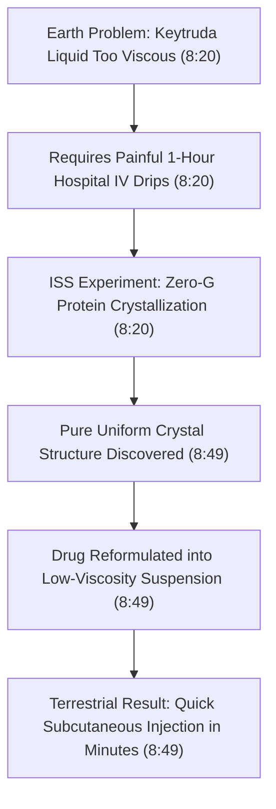

# Detailed Study Notes — Inside ₹12,00,000Cr Space Station !

## 📖 Ingestion & Contextual Overview

This document serves as an exhaustive, high-fidelity study note created from the technical video titled **"Inside ₹12,00,000Cr Space Station !"** presented by **[[Tech Burner]]** ([YouTube Watch Link](https://www.youtube.com/watch?v=7kkpylsOPLQ)).

The International Space Station (ISS) represents humanity's most expensive and complex engineering endeavor—a $150 Billion USD (₹12,00,000 Crore INR) orbital laboratory operating 400 km above Earth. This study note details the station's modular assembly history, orbital mechanics, life-support logistics (closed-loop water recovery and oxygen generation), zero-gravity manufacturing via 3D printing, protein crystallization for cancer therapeutics, space agriculture, and terrestrial technological spinoffs.

---

## 📽️ Section 1: Modular Assembly, Financials & Orbital Mechanics (0:00 - 1:57)

### 1. Physical Specifications & Financial Investment (0:00 - 0:40)

- **Physical Scale (0:40)**: The ISS spans **109 meters (356 feet)** in length—equivalent to the size of an entire American football field (including end zones).
- **Total Station Mass (0:40)**: The structure has a total mass of **445 metric tons (approximately 445,000 kg / 980,000 lbs)**.
- **Financial Cost (1:35)**: Total cumulative cost to construct, deploy, and maintain the ISS is estimated at **$150 Billion USD** (approximately **₹12,00,000 Crore INR**), funded across an international coalition of space agencies (NASA, Roscosmos, ESA, JAXA, and CSA).
- **Core Purpose (0:00)**: Serves as a microgravity laboratory where experiments are conducted across molecular biology, material science, human physiology, fluid physics, and astronomy that are impossible to replicate under Earth's 1-g gravitational pull.

### 2. Historical Assembly Timeline & Logistics (0:40 - 1:35)

- **Modular Transport Strategy (0:40)**: Due to the immense size and mass of the ISS, no single rocket possessed the payload capacity to launch the entire station into orbit simultaneously. 
- **136+ Space Missions (0:40)**: Between 1998 and 2011, over **136 dedicated space missions** (utilizing US Space Shuttles and Russian Proton/Soyuz rockets) were executed to transport individual structural modules, pressurized habitats, solar array trusses, and robotic arms into orbit.
- **Manual EVA Connections in Zero-G (1:03)**: Astronauts conducted hundreds of spacewalks (Extravehicular Activities or EVAs) in zero gravity to manually connect electrical wiring, fluid conduits, structural berthing mechanisms, and solar panels.
- **Key Assembly Milestones (1:03)**:
  - **November 1998 (*Zarya*)**: Russia launched the *Zarya* Functional Cargo Block, providing initial electrical power and propulsion.
  - **December 1998 (*Unity*)**: NASA launched the *Unity* (Node 1) module aboard Space Shuttle *Endeavour*, marking the first physical connection between Russian and US hardware in space.
  - **November 2000 (Expedition 1)**: The first permanent crew (Commander Bill Shepherd, Sergei Krikalev, Yuri Gidzenko) docked aboard the station, establishing continuous human occupancy.
  - **2011 (Final Assembly Completion)**: Official completion of major assembly operations after more than 10 years of active space construction.

### 3. Orbital Velocity, Trajectory & Decommissioning Plan (1:35 - 1:57)

- **Orbital Altitude (1:35)**: Maintains a Low Earth Orbit (LEO) at an average altitude of **400 kilometers (250 miles)** above Earth's surface.
- **Orbital Velocity (1:35)**: Travels at a speed of **27,600 kilometers per hour (approx. 7.66 km/s or 17,150 mph)** relative to the Earth's center.
- **Orbital Period (1:35)**: At 27,600 km/h, the station completes one full revolution around the planet every **90 minutes** (16 complete orbits per 24-hour day).
- **Continuous Human Occupancy (1:57)**: Inhabited non-stop without a single day of vacancy since **November 2, 2000** (over 25 consecutive years of human space presence).
- **Crew Rotation Schedule (1:57)**: Houses a permanent baseline crew of **6 to 7 astronauts and cosmonauts**, with crew handovers and rotations taking place every 6 months.
- **Decommissioning Timeline (1:35)**: Scheduled for official retirement in **2030**, after which the station will be safely de-orbited into the South Pacific Ocean Uninhabited Area (Point Nemo).

---

## 📉 Section 2: Microgravity Living & Daily Operational Regimen (1:57 - 3:26)

### 1. Zero-Gravity Equipment Management & Fastening (1:57 - 2:14)

- **Microgravity Dynamics (1:57)**: Because the station is in continuous free-fall around Earth, gravity is effectively zero ($10^{-6} g$), causing unanchored items to float freely.
- **Physical Anchoring Protocols (1:57)**: All handheld items, laptop computers, scientific samples, dining packages, and hand tools are physically secured to structural walls using:
  - Heavy-duty **Velcro strips** attached to equipment surfaces.
  - **Bungee cords and mechanical straps**.
  - **Rare-earth magnets** on metal workbenches.
- **Absence of Terrestrial Logistics (0:40)**: In orbit, simple mistakes (such as dropping a screw or stripping a bolt) cannot be resolved via terrestrial quick-commerce services (e.g., Blinkit) or local hardware stores.

### 2. Omnidirectional Sleeping Mechanics & Cabin Design (2:14 - 2:50)

- **Orientation Neutrality (2:14)**: In microgravity, the vestibular system does not perceive "up" or "down". Astronauts can sleep horizontally, vertically, upside-down relative to module walls, or suspended in mid-air.
- **Private Crew Quarters (2:39)**: Each astronaut has a small private sleeping cabin approximately the size of a telephone booth.
- **3D Spatial Layout (2:39)**: Cabins are arranged across all four walls of the habitat module (deck, overhead, port, and starboard) to maximize volumetric efficiency.
- **Tethered Sleeping Bags (2:14 - 2:50)**: Sleeping bags are physically tied to module walls. This prevents astronauts from drifting into instrument panels or air circulation vents during sleep and provides tactile contact mimicking a bed.

### 3. Circadian Rhythms & Compulsory Exercise Regimen (2:50 - 3:26)

- **16 Day/Night Cycles per 24 Hours (2:50)**: Due to its 90-minute orbital period, the station passes into Earth's shadow every 45 minutes, exposing astronauts to **16 sunrises and 16 sunsets daily**.
- **Regulated Circadian Schedule (3:06)**: Crew operations follow Coordinated Universal Time (UTC) with a strict daily schedule:
  - **10 hours** of structured scientific work, station maintenance, and payload operations.
  - **8 hours** of scheduled sleep.
  - **2 hours** of compulsory physical conditioning.
  - **1 weekend day** off per week.
- **Physiological Atrophy & Osteoporosis Prevention (3:06 - 3:26)**:
  - In microgravity, the absence of gravitational load causes human bone density to degrade at a rate of **1% to 1.5% per month** (similar to rapid osteoporosis) alongside severe skeletal muscle atrophy.
  - To counteract bone and muscle loss, astronauts undergo **2 hours of mandatory exercise daily** using specialized hardware:
    - **T-2 Treadmill**: Equipped with bungee harness straps to pull the astronaut down onto the belt.
    - **ARED (Advanced Resistive Exercise Device)**: Uses vacuum cylinders to simulate heavy free-weight barbell squats, deadlifts, and bench presses up to 260 kg (600 lbs) in zero-g.
- **Solar Energy Storage (3:26)**: Large photovoltaic solar arrays generate electrical power during orbital daylight, charging onboard Lithium-Ion battery banks to power life support while passing through Earth's shadow.

---

## 🧬 Section 3: Closed-Loop Environmental Control & Life Support Systems (ECLSS) (4:16 - 7:13)

### 1. Economic Motivation & Water Recovery System (WRS) (4:16 - 5:56)

- **Payload Launch Cost (4:16)**: Transporting fresh water from Earth to orbit via cargo rockets costs between **$10,000 and $25,000 USD per liter** (approx. ₹10 Lakhs to ₹25 Lakhs per liter).
- **Deployment of the WRS (4:16)**: In 2008, NASA launched the **$250 Million USD** (₹2,000 Crore) Water Recovery System (WRS) aboard Space Shuttle *Endeavour* (STS-126).
- **Earth Laboratory Validation Protocol (4:35 - 4:51)**:
  - When the WRS was first installed, astronauts did not consume the recycled water immediately.
  - Samples of recycled liquid (derived from astronaut urine, sweat, and atmospheric condensate) were collected in sealed containers and returned to Earth via Space Shuttle.
  - NASA toxicologists and microbiologists conducted rigorous laboratory testing for months to confirm the complete elimination of pathogens, heavy metals, and urea.
  - Upon proving the recycled water achieved **100% purity—exceeding United States EPA municipal drinking water standards**—Houston Mission Control authorized onboard consumption.
- **Closed-Loop Recycling Efficiency (4:51 - 5:10)**: The system achieves over **98% water recovery** from cabin atmospheric humidity, perspiration, and urine distillation.
- **Multi-Stage Purification Mechanism (5:40 - 5:56)**:
  1. **Urine Processor Assembly (UPA)**: Uses vapor compression distillation to separate pure water vapor from urine brine.
  2. **Water Processor Assembly (WPA)**: Passes wastewater through particulate filters and dual-series bed multifiltration uncompressed media.
  3. **High-Temperature Catalytic Reactor**: Heats water to 130°C (265°F) under high pressure to oxidize trace organic contaminants.
  4. **Post-Treatment Polishing**: Uses microbial check valves and UV disinfection to eliminate microbes, taste, and odor. Continuous automated sensors measure total organic carbon (TOC) and electrical conductivity.

### 2. Oxygen Generation via Electrolysis & Carbon Dioxide Scrubbing (5:56 - 7:13)

- **ECLSS Oxygen Generation System (OGS) (5:56 - 6:32)**:
  - Ships carry no bulky compressed oxygen tanks for primary consumption.
  - Uses electrical power from solar arrays to perform **water electrolysis**, splitting purified recycled water ($\text{H}_2\text{O}$) into Oxygen ($\text{O}_2$) and Hydrogen ($\text{H}_2$) gas:
    $$\text{2 H}_2\text{O (l)} \xrightarrow{\text{Electrical Energy}} \text{2 H}_2\text{ (g)} + \text{O}_2\text{ (g)}$$
  - Breathable Oxygen ($\text{O}_2$) is vented directly into the cabin atmosphere, while Hydrogen ($\text{H}_2$) is processed through the Sabatier reactor or vented overboard.
- **Carbon Dioxide ($\text{CO}_2$) Removal & Air Scrubbing (6:32 - 6:55)**:
  - Exhaled carbon dioxide must be scrubbed to prevent hypercapnia (carbon dioxide toxicity).
  - Uses the **CDRA (Carbon Dioxide Removal Assembly)** equipped with synthetic zeolite molecular sieves that continuously adsorb and desorb $\text{CO}_2$, maintaining a safe, Earth-like 21% $\text{O}_2$ atmosphere at 101.3 kPa pressure.

```mermaid
flowchart TD
    subgraph Water Recovery System WRS (4:16)
        A["Astronaut Urine & Sweat (4:51)"] --> B["Vapor Compression Distillation (5:40)"]
        B --> C["Catalytic Oxidation & UV Polishing (5:40)"]
        C --> D["100% Pure Potable Water (5:10)"]
    end

    subgraph Oxygen Generation ECLSS (5:56)
        D --> E["OGS Electrolysis Cell (6:13)"]
        E --> F["Oxygen Gas O2 to Cabin Atmosphere (6:13)"]
        E --> G["Hydrogen Gas H2 Venting / Sabatier (6:13)"]
    end

    subgraph Atmospheric Control (6:32)
        H["Astronaut Respiration"] --> I["Exhaled CO2 Gas (6:32)"]
        I --> J["Zeolite CO2 Molecular Scrubbers CDRA (6:32)"]
        J --> K["Earth-Safe Breathable Atmosphere (6:55)"]
        F --> K
    end
```

---

## 🛠️ Section 4: Zero-Gravity Manufacturing & Medical Breakthroughs (7:13 - 9:21)

### 1. Teletransmitted Digital CAD Manufacturing & Zero-G 3D Printing (7:13 - 8:20)

- **The Ratcheting Socket Wrench Case Study (7:13)**:
  - ISS Commander Barry "Butch" Wilmore required a specific ratcheting socket wrench to tighten bolts for an onboard science experiment, but the tool was missing from station inventory.
  - Traditional supply logistics would require waiting months for a commercial resupply rocket launch at a cost of hundreds of thousands of dollars.
- **Digital CAD Transmission Workflow (7:36)**:
  - NASA engineers partnered with **Made In Space**, the company that built the Additive Manufacturing Facility (AMF) 3D printer for the ISS.
  - Engineers on Earth designed the 3D CAD model for the socket wrench in ground labs and compiled it into a digital G-code instruction file.
  - NASA ground control transmitted the digital design file directly to the ISS server via satellite uplink.
- **In-Space Production (7:36 - 7:58)**:
  - Commander Wilmore selected the file on the ISS computer network and sent it to the station's zero-gravity 3D printer.
  - Within **4 hours**, the printer manufactured a fully functional, plastic ratcheting socket wrench using extrusion technology optimized for zero gravity.
- **Strategic Impact of Zero-G Manufacturing (7:58)**:
  - Enables **instant on-demand tool fabrication** during critical maintenance emergencies.
  - Eliminates transit waiting times and massive launch payload transport fees.
  - Dramatically reduces the physical spare parts inventory required to be stored inside space station modules.


### 2. Microgravity Protein Crystallization & Cancer Immunotherapy (8:20 - 9:21)

- **Keytruda (Pembrolizumab) Case Study (8:20)**:
  - Pembrolizumab (brand name *Keytruda*) is a highly effective monoclonal antibody cancer immunotherapy drug manufactured by Merck.
  - **Earth Limitations**: On Earth, gravity causes convection currents and thermal sedimentation during protein crystal growth, resulting in dense, irregular liquid formulations. Patients were forced to endure **painful, multi-hour intravenous (IV) infusion drips** in hospitals.
- **Zero-Gravity Crystallization Discovery (8:20 - 8:49)**:
  - In microgravity, the absence of buoyancy-driven convection allows protein molecules to organize into pristine, uniform, highly ordered crystal suspensions.
  - Experiments conducted inside the ISS National Laboratory allowed scientists to map the precise high-resolution crystal structure of Pembrolizumab.
- **Terrestrial Medical Transformation (8:49 - 9:21)**:
  - Utilizing crystal structure data obtained from ISS space experiments, pharmaceutical researchers successfully reformulated Keytruda into a highly concentrated, low-viscosity suspension.
  - Rather than spending hours connected to a hospital IV drip, cancer patients can now receive the drug via a **simple subcutaneous (under the skin) injection taking only a few minutes**.
- **Broader Zero-G Biomedical Benefits (9:05 - 9:21)**:
  - Improves drug delivery mechanisms and target identification for complex diseases.
  - Enables accurate drug dosing and side-effect screening in microgravity prior to phase-1 terrestrial clinical trials.



---

## 🛰️ Section 5: Telemetry, Earth Observation, Agriculture & Spinoffs (9:21 - 11:14)

### 1. Live ISS Tracking & Telemetry Interface (9:21 - 9:46)

- **Companion App Telemetry (9:21)**: Public space telemetry applications provide real-time metrics broadcast directly from the station's navigation computers:
  - Live ground track mapping across Earth's latitude/longitude grid.
  - External high-definition camera feeds showing real-time orbital view of Earth.
  - Real-time velocity readout: **27,600 km/h**.
  - Current orbital altitude readout: **400 km**.
  - Automated orbital sunset/sunrise countdown timer (tracking the 90-minute cycle).

### 2. Natural Disaster Management & Space Agriculture (9:46 - 10:38)

- **Earth Observation & Disaster Tactical Response (9:46 - 10:08)**:
  - The station's 51.6-degree orbital inclination covers 90% of the world's populated landmass.
  - Crew photography and automated multispectral sensors monitor natural disasters in real time (hurricanes, typhoons, coastal floods, volcanic plumes, and forest fires), transmitting imagery to ground emergency teams.
- **Space Agriculture (*Veggie* & Advanced Plant Habitat) (10:08 - 10:38)**:
  - **August 2015 Historic Milestone**: Astronauts harvested and consumed the first space-grown crop—red romaine lettuce grown in the *Veggie* plant growth facility.
  - **Current Space Agriculture**: Astronauts cultivate radishes, chili peppers, and leafy greens using LED lighting and passive capillary watering matrices to establish food self-sufficiency for future Mars missions.

### 3. Terrestrial Health Applications & Technology Spinoffs (10:38 - 11:14)

- **Bone Health & Osteoporosis Therapeutics (10:38)**: Research into microgravity-induced bone loss led directly to the identification of molecular pathways (e.g., sclerostin inhibition), advancing treatments for terrestrial osteoporosis and bedridden patients.
- **Chronic Disease Modeling (10:38)**: Microgravity accelerates cellular aging processes, enabling accelerated drug testing for **Alzheimer's, Parkinson's disease, muscular dystrophy, asthma, and cardiovascular conditions**.
- **Everyday Technological Spinoffs (10:55 - 11:14)**: Technologies developed to solve space exploration challenges have yielded critical commercial industries on Earth:
  - **Magnetic Resonance Imaging (MRI)**: Derived from digital image processing algorithms developed for NASA planetary probes and space telemetry.
  - **GPS & Navigation Systems**: Built upon orbital tracking and satellite constellation management.
  - **Commercial Aviation & Telecommunications**: Satellite television, weather forecasting models, and lightweight structural composites.

---

## 📊 Comprehensive Data Tables

### Table 1: International Space Station Master Specifications

| Metric / Parameter | Value / Data | Source Citation |
| :--- | :--- | :--- |
| **Total Mass / Weight** | 445 Metric Tons (~445,000 kg / 980,000 lbs) | (0:40) |
| **Physical Dimensions** | 109 meters x 73 meters (Football field size) | (0:40) |
| **Orbital Altitude** | ~400 Kilometers (~250 Miles above sea level) | (1:35) |
| **Orbital Velocity** | 27,600 km/h (17,150 mph / 7.66 km/s) | (1:35) |
| **Orbital Period** | 90 Minutes (16 Orbits per 24 hours) | (1:35) |
| **Total Construction Cost** | ~$150 Billion USD (~₹12,00,000 Crore INR) | (1:35) |
| **Assembly Missions** | 136+ Space Missions (1998 – 2011) | (0:40 - 1:03) |
| **First Module Launched** | *Zarya* (Russia) – November 1998 | (1:03) |
| **First Docking Mission** | *Unity* Node 1 (USA) – December 1998 | (1:03) |
| **Continuous Human Presence** | November 2, 2000 – Present (25+ Years) | (1:57) |
| **Baseline Crew Capacity** | 6 to 7 Astronauts (6-month rotation cycles) | (1:57) |
| **Scheduled Retirement** | Year 2030 (De-orbit to Point Nemo) | (1:35) |

### Table 2: Closed-Loop ECLSS & Manufacturing Systems Matrix

| Subsystem Name | Operational Function | Economic / Logistics Impact | Key Technical Breakthrough |
| :--- | :--- | :--- | :--- |
| **Water Recovery System (WRS)** | Distills urine, sweat, and condensate into drinking water | Saves $10K–$25K per liter launch cost; WRS hardware cost $250M | Recycles >98% water; yields 100% pure water exceeding Earth tap standards (4:16 - 5:10) |
| **ECLSS Electrolysis (OGS)** | Splits recycled water ($\text{H}_2\text{O}$) into $\text{O}_2$ and $\text{H}_2$ gas | Eliminates launching heavy, pressurized oxygen tanks | Provides sustainable, infinite breathing oxygen supply for crew (5:56 - 6:32) |
| **CDRA $\text{CO}_2$ Scrubbers** | Synthetic zeolite sieves remove exhaled $\text{CO}_2$ gas | Prevents carbon dioxide toxicity in sealed cabin | Maintains Earth-like 21% $\text{O}_2$ atmosphere at sea-level pressure (6:32 - 6:55) |
| **Additive Manufacturing Facility** | Zero-g 3D printing of replacement tools and parts | Replaces months of rocket transit with 4-hour local print time | Allows instantaneous teletransmission of CAD design files from Earth (7:13 - 7:58) |
| **Zero-G Protein Crystallization** | Grows pure protein crystals without gravitational convection | Saves hospital IV infrastructure and patient hours on Earth | Reformulated Keytruda cancer drug into a fast subcutaneous injection (8:20 - 8:49) |

---

## 📚 Technical Glossary

- **ECLSS (Environmental Control and Life Support System)**: The integrated life-support architecture aboard the ISS that monitors atmospheric pressure, recycles water, generates oxygen, removes carbon dioxide, and regulates cabin temperature.
- **WRS (Water Recovery System)**: A $250M subsystem of ECLSS that processes astronaut urine, sweat, and cabin humidity into ultra-pure drinking water using vapor compression distillation and catalytic oxidation.
- **Microgravity ($10^{-6} g$)**: An environment where the net acceleration caused by gravity is extremely small, creating near-weightless conditions experienced during orbital free-fall.
- **Electrolysis**: A electrochemical process using electrical energy to drive a non-spontaneous chemical reaction—specifically splitting water ($\text{H}_2\text{O}$) into oxygen gas ($\text{O}_2$) and hydrogen gas ($\text{H}_2$).
- **Protein Crystallization**: The process of forming organized crystal matrices from protein molecules. In microgravity, the absence of buoyancy and sedimentation produces pristine, high-resolution crystals used in pharmaceutical design.
- **Subcutaneous Injection**: A medical injection administered into the cutis layer of skin directly above the muscle. Subcutaneous delivery is faster and far less painful than Intravenous (IV) infusion drips.
- **Zarya (FCA)**: The first module of the ISS, launched by a Russian Proton rocket in November 1998, providing initial electrical power, storage, and propulsion.
- **Unity (Node 1)**: The first US-built module of the ISS, launched in December 1998, serving as the connecting node between Russian and American orbital segments.

---

## 🎯 Key Takeaways & Translated Core Quotes (0:00 - 11:14)

> *"Basically, the coffee you drank today on the International Space Station becomes tomorrow's lemon soda—the closed-loop recycling technology yields 100% pure water that tested cleaner than municipal tap water on Earth."* (0:16 / 5:40) — **Tech Burner**

> *"3D printing in microgravity turns space supply chains upside-down: instead of waiting months and spending hundreds of thousands of dollars to rocket a single socket wrench into orbit, engineers on Earth simply email the CAD file and print it onboard in 4 hours."* (7:36 - 7:58) — **Tech Burner**

> *"Investments in space exploration are never wasted on space alone; the technologies engineered to keep humans alive in orbit directly yield ground-breaking cancer therapies, MRI diagnostic machines, GPS navigation, and satellite communications back on Earth."* (10:55 - 11:14) — **Tech Burner**

---

## 🔗 Related & Source Metadata

- **Source Captured File**: `[[01_RAW/SOURCE/Inside ₹12,00,000Cr Space Station !.md]]`
- **Primary MOC**: `[[03_MOC/yt-moc|YouTube MOC]]`
