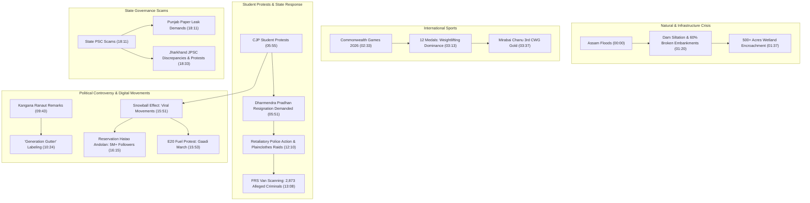

# Detailed Study Notes — Kangana Calls Gen Z "Gutter", Gen Z Asks "Aap Kaun?" & More | Midweek

## Executive Overview (00:00)

- **Source Title**: Kangana Calls Gen Z "Gutter", Gen Z Asks "Aap Kaun?" & More | Midweek
- **Creator / Channel**: [[Sarthak Goswami]] (Sunday Sarthak)
- **Watch URL**: [YouTube Video](https://www.youtube.com/watch?v=mbSGM0vx3ms)
- **Publication Date**: 2026-07-30
- **Production Credits**:
  - **Producer**: Sagar Gupta
  - **Writers**: Sarthak Goswami, Anunay, Mahesh Sharma, Abhinav Pandey, Lavanya
  - **Cinematography**: Prayas Dasgupta
  - **Lead Editors**: Niranjan Mehta, Sonu Dewansh, Amit Kumar Chakraborty, Arpan Biswas, Ritik Parida, Vishal Verma, Shubham Das, Sachin, Mayank Rawat
  - **Social Media**: Shruti Singh, Anish Verma
- **Sponsor**: Scaler (Tech upskilling platform focusing on practical AI systems development)

### Executive Summary

This episode of *Midweek* provides a comprehensive satirical analysis of major contemporary socio-political developments across India:
1. **Assam Flood Disaster**: Structural infrastructure failure, dam siltation, and wetland encroachment leading to annual flooding.
2. **2026 Commonwealth Games**: India's athletic performance in Glasgow/Edinburgh, weightlifting dominance, and debates surrounding colonial-era sporting events.
3. **CJP Student Protests & Police Crackdown**: Escalation of student protests, unparliamentary language controversies, doxxing of independent journalists, and police surveillance via Facial Recognition System (FRS) vans.
4. **Kangana Ranaut vs. Gen Z Protesters**: High-profile controversy sparked by MP Kangana Ranaut labeling Gen Z female protesters as "Generation Gutter."
5. **Digital & Grassroots Movements**: The rapid rise of viral social media movements including the "Reservation Hatao Andolan" and the "E20 Fuel Protest."
6. **State-Level Recruitment Corruption**: Allegations of paper leaks and recruitment discrepancies in the Jharkhand Public Service Commission (JPSC) and Punjab Education Ministry.

---

## Systematic Event & Analysis Flow

---

## Detailed Chronological Breakdown

### 1. Assam Flood Disaster & Infrastructure Degradation (00:00 - 02:33)

#### Scale of the Disaster (00:25)
- **Human Impact**: 75 officially confirmed fatalities, with estimates reaching nearly 100 deaths.
- **Population Affected**: Over 900,000 to 1,000,000 people impacted across 1,800+ submerged villages.
- **Agricultural Damage**: Over 37,000 hectares of farmland completely flooded.

#### Mainland Media Neglect (00:00)
- National mainstream news networks devote minimal coverage (less than 5% of airtime) to critical Northeast crises, contrasting heavy coverage of trivial mainland stories with the neglect of severe regional disasters in Assam and Manipur.

#### Root Causes of Annual Flooding (00:54 - 02:05)
1. **River Topography**: The Brahmaputra River bisects Assam, creating extreme vulnerabilities during heavy seasonal monsoon rainfalls.
2. **Aging Dam Infrastructure & Siltation**: Reservoirs across India suffer from heavy silt accumulation at the base, reducing water retention capacity by 50%.
3. **Dilapidated Embankments**: Over 60% of river embankments in Assam are structurally outdated and lack necessary maintenance, leading to frequent breaches.
4. **Wetland Encroachment**: Natural lakes and wetlands ("natural sponges") that absorb excess rainwater and recharge groundwater levels are heavily encroached upon.
   - *Example*: Municipal authorities cleared 500 acres of illegal encroachment around Hasila Lake in Goalpara district alone.

> *"If mainstream national media devoted even 5% of its focus to genuine Northeast issues instead of trivial stories, Assam would not submerge and Manipur would not burn."* (00:00) — *Sarthak Goswami*

---

### 2. Commonwealth Games 2026 & India's Performance (02:33 - 05:55)

#### Event Overview & Colonial Debate (02:50)
- The 2026 Commonwealth Games take place from July 23 to August 2, 2026.
- The Games feature former British colonies (e.g., India, Australia, England, Pakistan), sparking international debate over whether participating reinforces a colonial-era legacy.

#### India's Medal Tally Table (03:13 - 03:57)

| Athlete | Event / Category | Medal | Notes / Context | Timestamp |
|---|---|---|---|---|
| **Mirabai Chanu** | Women's 48 kg Weightlifting | **Gold** | 3rd consecutive CWG Gold medal | (03:37) |
| **Sharmila Dhangkar** | Athletics | **Gold** | Outstanding track performance | (03:37) |
| **Rishikanta Singh** | Men's 60 kg Weightlifting | **Silver** | Weightlifting discipline | (03:13) |
| **Mudu Pandi Raja** | Men's 65 kg Weightlifting | **Silver** | Weightlifting discipline | (03:13) |
| **Gyaneshwari Yadav** | Weightlifting | **Silver** | Weightlifting discipline | (03:37) |
| **Jhandu Kumar** | Para Powerlifting | **Bronze** | Para athletics category | (03:13) |

- **Total Medals**: 12 medals secured (2 Gold, 7 Silver, 3 Bronze), with over 50% earned in weightlifting disciplines.

#### Tech Sector Upskilling Context (03:57 - 05:49)
- **NASSCOM Survey Findings**: 90% of software engineers claim AI expertise based solely on basic prompt engineering with tools like ChatGPT, but only 23% possess skills required to architect and deploy functional AI products.
- **Industry Shift**: Major Indian IT services firms (TCS, Wipro, HCLTech) are shifting hiring evaluation toward candidates capable of building real-world AI systems.

---

### 3. CJP Student Protests, Media Doxxing & Police Action (05:55 - 09:43 & 11:40 - 15:53)

#### Core Student Demands (05:49)
The Centre for Justice and Peace (CJP) student protest movement presented three explicit demands to the Union Government:
1. Resignation of Union Education Minister Dharmendra Pradhan.
2. Compensation of ₹1 Crore ($10M INR) to families of deceased/affected students.
3. Written, binding guarantees protecting student protesters against criminal FIRs or retaliatory legal action.

#### Doxxing & Media Harassment (06:32 - 08:16)
- **Targeting of Independent Journalists**: Following a public social media post by BJP IT Cell head Amit Malviya containing a list of independent reporters, journalists covering student protests experienced targeted harassment.
- **Delhi University Assault**: Independent journalist Harsh Sharma was physically assaulted by two masked individuals while covering a protest at Delhi University, followed by abusive messages and threats targeting his family online.

#### The Prime Minister Slogan Controversy (08:30 - 09:40)
- **Public Outrage over Slogans**: Viral clips of female student protesters chanting unparliamentary slogans against Prime Minister Narendra Modi sparked widespread political outrage and debates over free speech boundaries.
- **Selective Outrage Critique**: Commentators highlighted hypocrisy, contrasting the official outrage over student slogans with unparliamentary and derogatory language frequently used by elected politicians in election rallies and legislative assemblies.

#### Police Crackdown & Surveillance (11:40 - 15:53)
- **Parliamentary Absence**: The NEET Paper Leak Prevention Bill was introduced and passed in Parliament in the absence of both the Prime Minister and the Home Minister.
- **Plainclothes Detentions**: Reports emerged of police officers in plainclothes and unmarked vehicles detaining student protesters from their residences without formal warrants.
- **Sakshi Legal Aid Portal**: Student advocacy groups established the *Sakshi* portal to provide legal defense for students facing police harassment.
- **Delhi Police FRS Claims**: Delhi Police stated that Facial Recognition System (FRS) vans identified 2,873 individuals with criminal backgrounds at the Jantar Mantar protest site, including 989 individuals with active criminal records and 101 murder accused.
  - *Critique*: Skepticism was raised regarding how impounded vehicles containing stones entered the secured protest zone if comprehensive FRS scanning was active.
- **Excessive Force Incidents**: Instances of plainclothes officers firing an AK-47 in Siwan, Bihar (injuring three, including a minor), lathicharges against non-violent protesters, and physical assaults on female students, running counter to Supreme Court rulings protecting peaceful protest rights.

---

### 4. Kangana Ranaut vs. Gen Z Protesters (09:43 - 11:40)

#### Statements by MP Kangana Ranaut (09:48 - 10:42)
Actor and Member of Parliament Kangana Ranaut publicly criticized young female protesters involved in the student demonstrations.

> *"Most appalling is the behavior of young Hindu women who want to imitate the lives of independent career women. Women who are truly independent make rebellious choices. I call them Generation Gutter. They are so ugly and corrupt that they cannot be homemakers either, but proudly flaunt their freedom to have drugs, drinks, or endless body counts."* (09:48 - 10:42) — *Kangana Ranaut*

#### Public Reaction & Political Disavowal (10:42 - 11:40)
- **Public Rebuttal**: Critics pointed out the hypocrisy of her statements given her own past public history and unconventional career path in Bollywood.
- **Party Distance**: Political analyst Saurav Das noted that even within her own political party, senior leaders frequently distance themselves from her individual statements, labeling them non-official personal opinions.

---

### 5. Digital Movements & State-Level Recruitment Scams (15:53 - 19:37)

#### Emergence of Secondary Digital Movements (15:53 - 16:34)
The student protests triggered a "snowball effect," inspiring spinoff social media movements:
1. **Reservation Hatao Andolan**: An Instagram-centric movement demanding reservation system reforms that acquired 5 to 6 million followers overnight.
2. **E20 Fuel Protest**: Organized by Tehseen Poonawalla and the *E20 Janata Party*, protesting against 20% ethanol-blended petrol (E20) and organizing a national car rally (*Gaadi March*) from India Gate to Parliament Street scheduled for July 31.

#### Proposed PM Modi Temple in Patna (16:49 - 17:50)
- Representatives from the transgender community in Patna, Bihar announced a proposal to construct a temple dedicated to Prime Minister Narendra Modi in gratitude for administrative representation granted in the Bihar Secretariat.
- The proposal was satirized as an example of extreme political personality cults ("devotees created before the deity").

#### State-Level Public Service Commission Scams (18:09 - 19:37)
- **Punjab**: Opposition groups demanded the resignation of Punjab Education Minister Harjot Singh Bains following allegations of paper leaks in state examinations under the Aam Aadmi Party (AAP) administration.
- **Jharkhand Public Service Commission (JPSC)**: Massive student protest marches erupted in Jharkhand over recruitment discrepancies.
  - *Allegations*: Candidates scoring as low as 40 points received official selection notifications, while candidates scoring 140+ points were omitted, pointing to systemic recruitment corruption in state PSCs.

---

## Notable Translated Quotes

> *"The government promised there would be no retaliatory action against student protesters. But while direct action was avoided, reaction swiftly followed through targeted harassment and plainclothes detentions."* (06:00) — *Sarthak Goswami*

> *"When a major financial theft at a country's holiest temple fails to outrage people, but criticism of a political leader does, the conclusion is unavoidable: they have already chosen their god, and it is not the one inside the temple."* (16:49) — *Viral Commentary / Sarthak Goswami*

---

## Controlled Metadata & Source Linking

- **Primary Source File**: `[[01_RAW/SOURCE/Kangana Calls Gen Z Gutter, Gen Z Asks Aap Kaun & More  Midweek.md]]`
- **Primary Organizing MOC**: [[General MOC]]
- **Tags**: `#reference` `#case-study`
