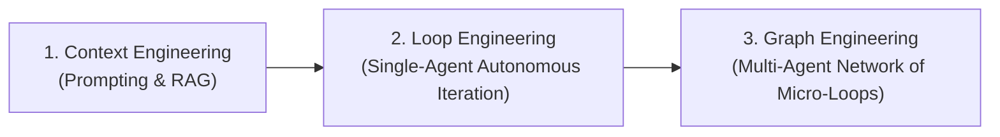
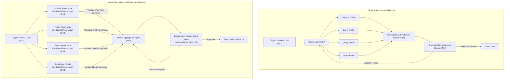
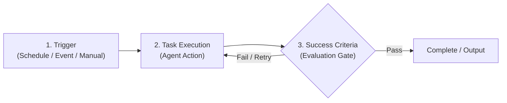
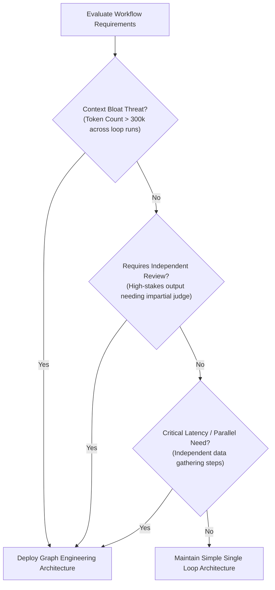

# Move Over Loop Engineering, Graph Engineering Is Now Here

- **Source**: [YouTube Video](https://www.youtube.com/watch?v=Joqh7Tui9B8)
- **Creator**: [[Chase AI]]
- **Published**: 2026-07-22
- **Ingestion Date**: 2026-07-27

---

## Executive Summary

This study note provides an in-depth synthesis of the architectural evolution from **Loop Engineering** to **Graph Engineering** in autonomous AI agent systems. 

While **Loop Engineering** centers around a single monolithic agent executing an iterative control loop with a trigger, task, and high-level evaluation gate, **Graph Engineering** decomposes complex workflows into a network (graph) of modular, specialized sub-agents. In a graph architecture, each sub-agent acts as its own autonomous micro-loop with granular success criteria. 

This note details the historical context of AI prompt and agent architecture, breaks down the technical mechanisms and mathematical trade-offs of graph engineering (mitigating context rot, accelerating execution via parallelism, and providing deterministic fault isolation), and establishes a practical decision framework for knowing when to transition from single loops to multi-agent graphs.

---

## Conceptual Lineage: Context → Loop → Graph Engineering

The design of LLM-driven applications has progressed through three major paradigms:

1. **Context Engineering (Phase 1)**: Focused on prompt structure, system instructions, few-shot examples, dynamic context retrieval (RAG), and optimizing context window utilization for a single LLM invocation.
2. **Loop Engineering (Phase 2)**: Introduced autonomous agentic control loops. Rather than a single pass, an agent runs continuously until a predefined success condition is met, maintaining memory and state across iterations.
3. **Graph Engineering (Phase 3)**: Scales loop engineering to multi-agent topologies. Instead of relying on one agent to execute multiple tasks sequentially within a growing context window, graph engineering wires together multiple specialized looping agents into a directed DAG or stateful graph.

---

## Architectural Comparison: Single Loop vs. Graph Architecture

---

## Deep Dive: Loop Engineering Primitives

Loop engineering forms the foundational building block for graph engineering. Every autonomous loop relies on three essential primitives:

### 1. Trigger (0:52)
The entry point that initializes the agent loop.
- **Autonomous Time-Based**: Cron schedules (e.g., executing every morning at 7:00 a.m.).
- **Event-Driven**: Webhooks, file changes, database mutations, or system alerts.
- **Manual Invocation**: User-initiated commands.

### 2. Task Execution (1:00)
The set of operations carried out by the AI agent. In a basic loop, the agent executes data gathering, tool calls, content generation, and synthesis in sequence within its context window.

### 3. Success Criteria & Feedback Loop (1:00)
The evaluation mechanism that inspects the agent's output against defined constraints (e.g., word count, presence of required sections, link verification, formatting rules).
- If the output satisfies criteria, the loop terminates successfully.
- If the output fails criteria, the agent receives error feedback and re-executes from the beginning.
- **State Persistence**: Storing historical run data enables long-term learning and self-improvement across iterations.

---

## Benchmark Case Study: The Daily Morning Report

To illustrate the transformation from loop to graph, the video analyzes an automated morning report system designed to summarize AI industry trends across multiple sources.

### Monolithic Single Loop Workflow (0:52 - 2:19)
1. **Trigger**: 7:00 a.m. cron job (1:41).
2. **Sequential Task Execution**: A single AI agent checks YouTube, Twitter, Reddit, and Email sequentially, extracts trending AI news, and drafts a consolidated report (1:53).
3. **Macro Evaluation**: The single agent checks if its own report meets general criteria (length, topic coverage, links included) (2:00).

#### Primary Bottlenecks of Monolithic Loops:
- **Context Bloat**: As the agent scrapes and reads raw data across 4 platforms, its context window rapidly inflates.
- **Self-Evaluation Bias**: Asking the same agent that generated a report to grade its own work leads to low evaluation rigor.
- **Sequential Latency**: Scraping platform 4 cannot start until platforms 1, 2, and 3 are completed.

### Graph Engineered Workflow (2:33 - 3:40)
1. **Trigger**: 7:00 a.m. cron job initiates parallel execution across sub-agents.
2. **Parallel Agent Execution**:
   - **YouTube Sub-Agent**: Scrapes YouTube, extracts video transcripts, and produces a domain-specific synthesis.
   - **Twitter Sub-Agent**: Scrapes Twitter feeds, filters high-engagement AI posts, and produces a domain-specific synthesis.
   - **Reddit Sub-Agent**: Queries relevant subreddits, extracts top discussions, and produces a domain-specific synthesis.
   - **Email Sub-Agent**: Parses inbox newsletters and extracts key announcements.
3. **Aggregation Node (Report Agent)**: Receives pre-synthesized data from all 4 domain agents and compiles the master report (3:05).
4. **Independent Review Node (Judge Agent)**: An isolated review agent (e.g., powered by a distinct LLM like GPT-5.6 or Claude 3.7 Sonnet) evaluates the final report against strict production standards before publishing (3:23).

---

## Detailed Comparative Analysis Matrix

| Feature / Metric | Single-Agent Loop Engineering | Graph Engineered Architecture |
| :--- | :--- | :--- |
| **Architectural Topology** | Monolithic linear loop (1:30) | Directed Graph / DAG of micro-loops (2:43) |
| **Sub-Task Handling** | Single agent performs all tasks sequentially (2:19) | Dedicated specialized sub-agents (2:43) |
| **Execution Mode & Latency** | Sequential ($O(N)$ cumulative runtime) (8:42) | Concurrent / Parallel ($O(\max(N))$ runtime) (5:51) |
| **Context Management** | High vulnerability to **context rot** & token decay (7:14) | Context isolation per node (5:32) |
| **Validation Granularity** | Macro-level validation on final aggregate output (2:00) | Micro-level validation at every node step (4:50) |
| **Evaluation Rigor** | Agent evaluates its own generated output (8:00) | Isolated, independent review / judge agent (3:23) |
| **Debuggability & Telemetry** | High noise; hard to trace exact point of failure (6:06) | Deterministic error isolation per node (5:58) |
| **Implementation Complexity** | Low infrastructure & prompt overhead (10:04) | Higher orchestration overhead (10:15) |

---

## Technical Advantages of Graph Engineering

### 1. Protection Against Context Rot (5:32)
When a single LLM context window absorbs hundreds of thousands of tokens across multiple sub-tasks (e.g., reaching 300,000–500,000 tokens during long iterative loops), model performance degrades:
- **Instruction Following Loss**: The model forgets specific constraints specified early in the prompt.
- **Hallucinations & Noise**: Unrelated context from step 1 pollutes synthesis in step 4.
- **Solution**: Graph engineering isolates context per node. The YouTube agent only sees YouTube data; its output to the Report agent is a clean, condensed summary (5:40).

### 2. Parallel Processing Speed (5:51)
In a single loop, tasks execute sequentially:
$$\text{Total Time}_{\text{Loop}} = T_{\text{YouTube}} + T_{\text{Twitter}} + T_{\text{Reddit}} + T_{\text{Email}} + T_{\text{Synthesis}}$$

In a graph architecture, retrieval sub-agents run concurrently:
$$\text{Total Time}_{\text{Graph}} = \max(T_{\text{YouTube}}, T_{\text{Twitter}}, T_{\text{Reddit}}, T_{\text{Email}}) + T_{\text{Report}} + T_{\text{Review}}$$

This yields a significant reduction in overall pipeline execution time (5:51).

### 3. Granular Quality Gates & Micro-Loops (3:55, 4:50)
In a graph, every individual node operates as its own loop with tailored success criteria:
- *YouTube Node Validation Rule*: Must return at least 5 verified sources, at least 2 paragraphs of synthesis, and an explicit "so what" practical takeaways section for every claim (5:00).
- If the YouTube scraper returns only 2 sources, only the YouTube micro-loop re-runs. The Twitter, Reddit, and Email nodes remain unaffected and do not waste tokens re-executing.

### 4. Deterministic Fault Isolation (5:58)
In monolithic loops, diagnosing why a final report failed is difficult due to mixed context logs. In graph engineering, logs and telemetry are segmented by node, allowing developers to instantly pinpoint whether a failure stemmed from API rate limits, bad parsing, or model reasoning errors at a specific step (6:06).

---

## Strategic Decision Framework: When to Use Graph Engineering

Graph engineering adds architectural and infrastructural overhead. Simple single-loop setups remain more than sufficient for standard, linear, or low-stakes tasks (7:02).

### The 3 Core Triggers for Graph Engineering (7:14 - 9:22)

1. **Context Bloat & Token Degradation (7:14)**:
   - *Condition*: Multi-step iterations cause context windows to swell into the 300k–500k token range.
   - *Resolution*: Split the workflow across specialized sub-agents to keep individual context windows clean and compact.

2. **Independent Review & High-Stakes Evaluation (7:48)**:
   - *Condition*: The output has high security, financial, or production risk, making self-evaluation inadequate.
   - *Resolution*: Implement a dedicated Review Agent node running a distinct model (e.g., GPT-5.6, Claude 3.7 Sonnet, or an adversarial prompt framework) to evaluate the primary generator's output (8:33).

3. **Execution Speed & Parallel Sub-Task Spawning (8:42)**:
   - *Condition*: Workflow involves multiple independent search or data-processing operations.
   - *Resolution*: Deploy parallel sub-agent workers. *Real-world example*: Modern agentic engines like Claude Code (Deep Research / Ultra Code dynamic workflows) spawn dozens or hundreds of sub-agents in parallel for simultaneous research, synthesis, and verification (8:53 - 9:22).

---

## Glossary of Key Terms

- **Context Rot**: The phenomenon where an LLM's recall, instruction-following accuracy, and reasoning quality degrade as its context window fills with large volumes of conversational or retrieval history.
- **Loop Engineering**: An agentic design pattern where an AI agent continuously executes a task within a feedback loop (Trigger $\rightarrow$ Task $\rightarrow$ Success Evaluation $\rightarrow$ Retry/Exit) until explicit success criteria are satisfied.
- **Graph Engineering**: An advanced agentic architecture where complex tasks are decomposed into a network (directed acyclic graph or state graph) of specialized sub-agents, each running its own micro-loop with dedicated success criteria.
- **Micro-Loop**: A localized loop within a single node of a graph architecture that validates and retries a specific sub-task without re-triggering the entire system.
- **Adversarial / Independent Review Agent**: A specialized judge node in a multi-agent graph tasked solely with evaluating generated outputs against strict domain rules before approving downstream deployment.

---

## Key Takeaways & Direct Quotes

- **Core Synthesis**: *"Graph engineering is really just an extension or an evolution of loop engineering... we have taken every single task and we've essentially turned it into an agent that's running its own version of loop engineering."* — Chase AI (0:48, 3:55)
- **Quality & Parallelism**: *"Instead of having one agent do everything, I instead have one agent doing one thing... strictly from a context raw point of view and the fact that its context window is going to be relatively clear... it means we're going to get a better output. Further, it's going to be quicker."* — Chase AI (5:32 - 5:51)
- **Pragmatic Engineering Advice**: *"If you don't know if you need it for your particular task, the answer is probably no."* — Chase AI (10:04)

---

## Metadata & Traceability

- **Source File**: `01_RAW/CAPTURE/Move Over Loop Engineering, Graph Engineering Is Now Here.md`
- **Archival Destination**: `01_RAW/SOURCE/Move Over Loop Engineering, Graph Engineering Is Now Here.md`
- **Staging Location**: `01_RAW/PROCESS/detailed-study-notes-move-over-loop-engineering-graph-engineering-is-now-here.md`
- **Target Destination**: `02_NEW-KNOWLEDGE/detailed-study-notes-move-over-loop-engineering-graph-engineering-is-now-here.md`
