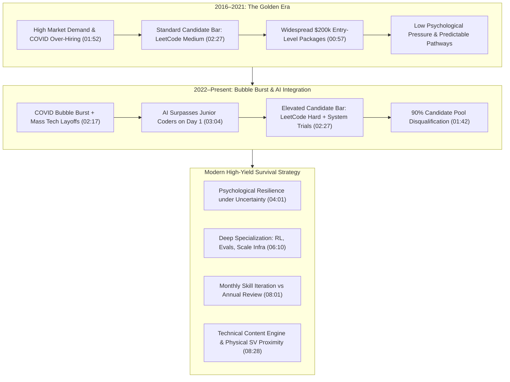

# Detailed Study Notes — Only the Strongest Minds Should Watch This Video

## Executive Overview & Thesis

This study note provides an exhaustive analysis of creator [[Singh in USA]]'s treatise on the structural transformation of the United States tech job market, the inflation of hiring standards in Silicon Valley, and the psychological fortitude required for software engineers in the post-2022 artificial intelligence era. 

The core thesis posits that the "golden era" (2016–2021)—wherein average software developers could secure high-paying US tech positions ($200k+ packages right out of undergrad) via basic LeetCode Medium preparation and standard academic credentials—is permanently over. The post-COVID over-hiring bubble correction combined with the rapid emergence of generative AI (which outperforms entry-level developers on Day 1 in coding, bug fixing, and system architecture planning) has restructured the market into a hyper-competitive, bimodal environment. Survival in today's ecosystem requires moving beyond surface-level coding to deep computer science fundamentals, specialized domain expertise (RL post-training, Model Evals, extreme-scale infrastructure), psychological tolerance for career uncertainty, and public proof-of-work engines.

---

## Comprehensive Analytical Frameworks

### 1. Structural Paradigm Shift in US Tech Hiring (2016 vs. Present)

### 2. Multi-Dimensional Hiring & Market Matrix

| Analysis Dimension | 2016–2021 "Golden Era" (00:25–01:27) | Present Market Reality (01:42–08:46) | Structural Implication & Strategic Remedy |
| :--- | :--- | :--- | :--- |
| **Applicant Distribution** | Moderate volume; average skills sufficient for placement | ~2,000 applicants per posting; ~90% categorized as average candidates (01:42) | High application volume masks talent shortages in niche fields; standing out requires specialized proof of work |
| **Interview Evaluation Bar** | LeetCode Medium problem solving | LeetCode Hard, multi-day technical trials, architectural roleplays (02:27) | Interview preparation must be executed as a full-time job alongside core work |
| **Role of AI Models** | Non-existent in production workflows | AI surpasses junior coders on Day 1 in code, system planning, & architecture (03:04) | Moving up the value chain from syntax/prompting to lower-level CS fundamentals & system design |
| **Compensation Ecosystem** | Uniform high baseline ($200k widely available) | Hyper-bimodal: $250k plateau for generalists vs $900k–$3M at OpenAI/frontier labs (05:34) | Extreme economic returns accrue to top-tier specialized talent |
| **System Reliability Standard** | Moderate availability targets | Strict 99.99% ("Four Nines") availability expectations (06:27) | High-scale infrastructure design requires deep distributed systems mastery |
| **Visa & Immigrant Buffer** | Multi-year buffer; predictable EB processing | Multi-decade EB-1/2/3 backlogs; strict 60-day H-1B grace period (07:26) | Continuous monthly skill sharpening is mandatory to ensure 60-day re-hireability |

---

## Detailed Chronological Section Breakdown

### 1. Introduction & Explicit Audience Filtering (00:00 - 00:25)
- **Speaker's Self-Characterization**: The speaker explicitly disarms viewer assumptions by characterizing himself as an average student and coder:
  - Never topped a class in school or college.
  - Never received a 5/5 rating in corporate performance reviews.
- **Audience Warning**: Advises average programmers against pursuing tech careers in the US or Silicon Valley unless they are willing to transform their mindset.
  - *Core Premise*: Silicon Valley is no longer an environment where average performance yields extraordinary life outcomes. It demands a fearless mind willing to compete under extreme pressure.

### 2. The Personal Career Arc & The "Golden Era" (00:25 - 01:27)
- **Timeline Breakdown**:
  - **2016**: Arrived in the United States as an international graduate student.
  - **2016–2019**: Launched a YouTube content channel covering US university life (specifically visiting MIT and Harvard), growing to 100,000 subscribers. Combined video production with LeetCode challenges.
  - **Internship Success**: Secured competitive software engineering internships in both his 1st and 2nd years. Internship earnings were substantial enough to pay off his total university tuition prior to graduation.
  - **2020**: Joined NCR full-time as an Android and iOS developer during the peak of the pandemic.
  - **2022**: Transitioned to Microsoft with a ~$200,000 compensation package. Subsequently left Microsoft to join Hydra DB, an early-stage open-source database startup in Silicon Valley.
- **Historical Analysis**:
  - The period between 2016 and 2021 was a "golden era" characterized by lower competitive bars, high hiring liquidity, and rapid compensation growth for average candidates. While his first year (2016) was difficult due to lack of initial opportunities, subsequent years felt surprisingly easy.

### 3. Deconstructing the US Tech Job Market (01:27 - 03:04)
- **Direct Refutation of Common Creator Narratives**:
  - *Common Claim*: "Don't come to the US because there are 2,000 applicants per job posting and it is impossible to stand out."
  - *Speaker's Counter-Analysis*: While job postings do receive thousands of applications, there is simultaneously a massive volume of specialized openings that remain unfilled because companies cannot find qualified candidates.
- **The Post-COVID Over-Hiring Bubble**:
  - In 2021–2022, tech companies over-hired aggressively. This led to a surge in computer science enrollments from students expecting automatic $200k starting packages right out of undergrad.
  - When the hiring bubble burst in 2022, thousands of average candidates were left competing for open roles.
- **Candidate Quality Breakdown**:
  - When a job posting (e.g., on X/Twitter) receives 2,000 applications within hours, approximately **90% of applicants are average candidates** who fail to meet modern technical standards.
- **Elevated Hiring Mechanics**:
  - Drawing from his experience as an interviewer, the speaker notes that standard LeetCode Medium questions are no longer sufficient.
  - Companies now enforce LeetCode Hard problems, multi-day technical trial periods, complex roleplays, and high-stress real-time architecture scenarios.

### 4. Artificial Intelligence & The Shift in Developer Value (03:04 - 04:01)
- **The Harsh Reality of AI Capabilities**:
  - Modern AI models (LLMs, reasoning engines) are demonstrably smarter than a junior-level programmer on Day 1 of their employment.
  - AI does not merely generate code snippets; it provides superior system architecture planning, superior refactoring strategies, and deeper contextual insights than entry-level engineers.
- **The "English as a Programming Language" Fallacy**:
  - While natural language interfaces allow broader access to code generation (just as Python abstracted C++, and C++ abstracted assembly/compilers), relying solely on natural language prompting is a career trap.
  - Current interview loops heavily test deep computer science fundamentals (memory models, concurrency, database internals, low-level execution) that AI can assist with but humans must understand to verify.
- **Full-Time Interview Commitment**:
  - Preparing for modern technical interviews has evolved into a full-time job requiring structured roadmaps and dedicated daily practice.

### 5. The Psychology of Uncertainty & The Amazon Package Analogy (04:01 - 05:18)
- **The Amazon Package Psychological Model**:
  - *Scenario A*: You order an Amazon package, but you have no tracking information and no idea when it will arrive.
  - *Scenario B*: You order an Amazon package, and you know with certainty it will arrive in exactly 2 days.
  - *Psychological Outcome*: Scenario A produces significantly higher levels of fear, anxiety, and dread due to **unpredictability and lack of control**.
- **Application to Silicon Valley & Career Planning**:
  - The primary driver forcing tech workers to leave Silicon Valley or return to their home countries is not hard work, but their inability to handle extreme career uncertainty.
  - Fear of sudden layoffs, visa instability, and market fluctuations causes average minds to panic and exit. Survival requires building psychological immunity to uncertainty.

### 6. Work Ethic Benchmarks, Compensation Distribution, & Specialization (05:18 - 06:27)
- **Silicon Valley Work Ethic Benchmarks**:
  - Cites software developers at high-growth startups (e.g., Gorgias) who regularly work until 4:00 a.m., work 15–16 hours per day, and display extreme obsession with their company's mission (to the point of getting company logos tattooed).
- **OpenAI Compensation Distribution Analysis**:
  - Data regarding OpenAI compensation illustrates extreme economic return for top talent:
    - **25th Percentile**: $900,000 / year
    - **Median Compensation**: $1,300,000 / year
    - **90th Percentile**: $3,000,000 / year
  - While average coders plateau around $250k, engineers who possess critical specialized skills command multi-million dollar compensation packages.
- **Domain Specialization Imperatives**:
  - Strong engineers must be willing to abandon legacy skill sets and rapidly pivot into high-demand technical domains:
    - **Reinforcement Learning (RL) Post-Training**: Fine-tuning, PPO, DPO, and alignment pipelines.
    - **Model Evaluations (Evals)**: Designing automated benchmark suites and LLM assessment infrastructure.
    - **Deep Ecosystem Mastery**: Advanced internal mechanics of frameworks (e.g., JavaScript V8 execution internals, custom database engines).
    - **Extreme-Scale Systems Engineering**: Designing distributed infrastructure capable of handling massive throughput.

### 7. Reliability Benchmarks & Immigrant Engineering Dynamics (06:27 - 08:01)
- **The "Four Nines" Infrastructure Benchmark — Anthropic Outage Case Study**:
  - Top-tier system design engineers are hired to guarantee **99.99% availability** ("Four Nines" SLA: no more than 52.56 minutes of downtime per year).
  - *Case Study*: When Anthropic's Claude experienced a 1-hour service outage, its overall system availability dropped from 99.99% down to **99.039%**.
  - *Takeaway*: Even elite infrastructure engineers at frontier AI labs struggle to maintain extreme availability under scale. Candidates must demonstrate deep mastery of scaling mechanics to compete.
- **Immigration Scrutiny & Visa Bulletin Realities**:
  - International engineers from India and China under EB-1, EB-2, EB-3, and EB-4 employment-based green card categories face decades-long wait times.
  - Current visa bulletin dates confirm that green cards will not be processed within 3 years even under EB-1 categories.
  - *The 60-Day Grace Period Constraint*: If laid off, H-1B visa holders have exactly 60 days to secure a new qualifying role or face deportation.
  - *Strategic Consequence*: Immigrant engineers cannot update their skills on an annual basis; they must sharpen their technical skillset on a **monthly basis** to remain hireable within 60 days.

### 8. Strategic Pathways: Content Engines & Physical Serendipity (08:01 - 09:05)
- **The Content Engine as a Career Accelerator**:
  - Building a public proof-of-work engine (YouTube videos, technical newsletters, open-source repositories) creates an automated recruiting pipeline.
  - *Case Example*: Technical content creators in India with modest followings (~10,000 followers) who publish content around RL post-training and Model Evals routinely receive direct outreach from Silicon Valley recruiters and are sponsored for US relocations.
- **Physical Proximity & Serendipity Optimization**:
  - Living in high-density tech hubs (Silicon Valley, San Francisco)—despite high cost of living and rent exceeding NYC—dramatically increases the probability of serendipitous opportunities ("getting lucky").
- **Final Call to Action**:
  - Success in modern tech requires competing harder, learning faster, adapting continuously, and developing an unshakeable mind.

---

## Verbatim Quotes & Key Insights

> *"I'm an average coder, never topped in a class, never got five on five in a performance review... but this video is only for the strongest mind out there who are fearless."* (00:00) — **[[Singh in USA]]**

> *"There are a lot of job applicants plus lot of openings as well which are not getting filled up either... 90% of those [2,000 applicants] are just average candidates."* (01:42 - 02:27) — **[[Singh in USA]]**

> *"AI is smarter than a junior-level programmer on day one... AI will give you better answers, even better system planning, not just better code, but even architecturally better answers. So, we don't want normal programmer who just thinks English is the next programming language."* (03:04) — **[[Singh in USA]]**

> *"When you're uncertain when something is going to happen, you're more scared, more in dread and feared of taking chance... People who cannot handle uncertainty and fear, this place is not for you."* (04:32 - 05:18) — **[[Singh in USA]]**

> *"Anthropic, Claude was down for 1 hour, the availability goes down below 99.99. It became 99.039. Even those top engineers are not able to scale that well. You have to promise those nines."* (06:27) — **[[Singh in USA]]**

> *"People in these categories who are waiting are even stronger here because they have to sharpen their skill not on a yearly basis but on a monthly basis because things change every month."* (07:53) — **[[Singh in USA]]**

---

## Comprehensive Glossary & Entity Directory

### Key Entities Mentioned
- **[[Singh in USA]]**: Tech content creator, former Microsoft engineer, software developer at Hydra DB.
- **NCR Corporation**: Enterprise technology company where the speaker worked as an Android/iOS developer (2020–2022).
- **Microsoft**: Multilateral technology corporation where the speaker worked as a software engineer ($200k package, 2022).
- **Hydra DB**: Open-source database startup in Silicon Valley where the speaker transitioned in 2022.
- **Gorgias**: E-commerce customer service automation startup cited for extreme work ethic benchmarks (15–16 hour workdays, 4:00 a.m. shifts).
- **OpenAI**: Frontier AI research lab cited for bimodal compensation metrics ($900k 25th percentile to $3M 90th percentile).
- **Anthropic**: Frontier AI safety and research lab (creators of Claude) cited for system reliability benchmarks.

### Technical Concepts & Acronyms
- **LeetCode**: Online technical interview preparation platform (Medium vs Hard difficulty distinction).
- **RL (Reinforcement Learning) Post-Training**: Machine learning technique (including RLHF/DPO) used to align foundation models post-pretraining.
- **Model Evals (Evaluations)**: Quantitative benchmark frameworks designed to evaluate LLM accuracy, safety, and reasoning across specific tasks.
- **Four Nines (99.99% Availability)**: High-availability SLA allowing maximum 52.56 minutes of total downtime per year.
- **H-1B Visa**: Non-immigrant work visa for US specialty occupations, featuring a strict 60-day post-termination grace period.
- **EB-1 / EB-2 / EB-3 / EB-4**: Employment-Based US Permanent Residency (Green Card) preference categories subject to nationality backlogs.

---

## Source Provenance & Inter-Vault Connectivity

- **Original Capture File**: [[01_RAW/SOURCE/Only the Strongest Minds Should Watch This Video.md]]
- **Watch URL**: [YouTube Video Link](https://www.youtube.com/watch?v=tYj3ibHEWD4)
- **Primary MOC**: [[03_MOC/yt-moc.md|📺 YouTube Map of Content]]
