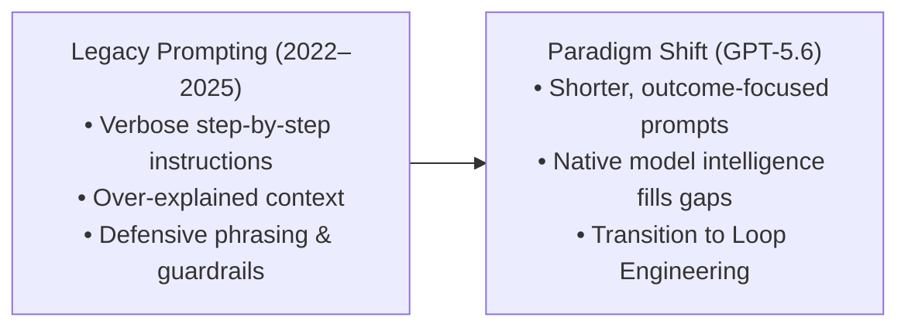
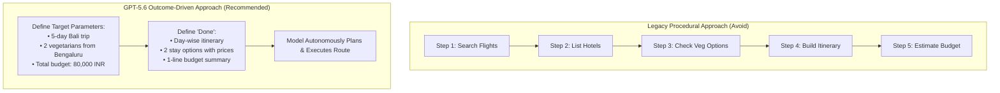
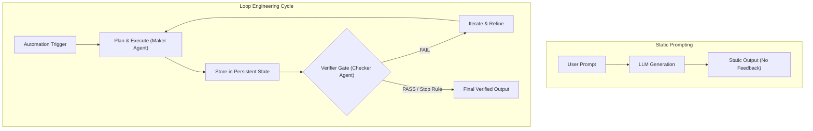
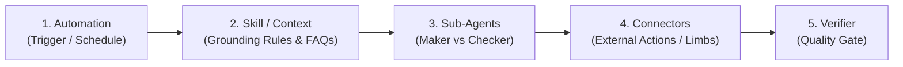

# Detailed Study Notes: OpenAI Just Changed How You Should Prompt (GPT-5.6 Rules)

## Executive Summary & Metadata

- **Video Title**: OpenAI Just Changed How You Should Prompt (GPT-5.6 Rules)
- **Creator / Presenter**: [[Ishan Sharma]]
- **Publication Date**: 2026-07-23
- **Watch URL**: [YouTube Link](https://www.youtube.com/watch?v=RW2yrxuz4pI)
- **Source Artifact**: [[01_RAW/SOURCE/OpenAI Just Changed How You Should Prompt (GPT-5.6 Rules).md]]
- **Core Subject Matter**: Official OpenAI GPT-5.6 prompting guidelines, model tier selection (Sol, Terra, Luna), reasoning effort configuration, 8-part official prompt architecture, team context integration via Miro MCP, and the transition from prompt engineering to **Loop Engineering** (agentic self-correcting loops).

---

## 1. The Fundamental Shift in Prompt Engineering (00:00 - 01:10)

For the past four years (2022–2026), prompt engineering best practices emphasized long, highly structured, multi-instruction prompts containing explicit step-by-step instructions (00:16). However, internal testing conducted by OpenAI on the **GPT-5.6 model family** reveals that legacy, highly verbose prompts actually degrade model performance and output quality (00:00).



### Key Conceptual Takeaways
- **The Unlearning Requirement**: Corporate employees and prompt engineers must unlearn legacy prompt-writing habits (00:16).
- **Native Reasoning Utilization**: GPT-5.6 possesses superior internal reasoning capabilities, enabling it to infer optimal procedural execution paths without explicit step-by-step micro-management (00:27).
- **The Systemic Horizon**: Leading AI engineers are moving away from writing static, single-shot prompts toward designing **autonomous loops**—systems that plan, execute, verify, and self-correct (00:58).

---

## 2. Deep Dive: GPT-5.6 Model Family Architecture (01:10 - 02:21)

OpenAI introduced GPT-5.6 as its most intelligent and cost-effective model architecture to date, optimized for frontend design, full-stack coding, deep research, document scripting, and complex reasoning (01:10).

Access to GPT-5.6 is available via the ChatGPT web portal, mobile applications, and the **ChatGPT Work desktop app** (available for macOS and Windows), which allows direct local environment execution, local file generation, and website building (02:06).

### Model Tier Matrix

| Model Tier | Target Workload | Cost / Speed Profile | Ideal Tasks & Capabilities | Transcript Citation |
| :--- | :--- | :--- | :--- | :--- |
| **GPT-5.6 Sol** | High-level reasoning, complex logic, multi-agent evaluation | Highest intelligence / Premium resource tier | Architecture design, deep research, strict editing, complex code generation | (01:40) |
| **GPT-5.6 Terra** | Standard daily tasks, routine coding, general business operations | Balanced cost & performance (Default workhorse) | Scripting, document writing, standard analysis, day-to-day work | (01:48) |
| **GPT-5.6 Luna** | High-volume automation, rapid text transformation, lightweight background jobs | Fastest response time / Lowest cost per token | High-throughput data extraction, simple classification, repetitive operations | (01:52) |

---

## 3. The 7-Rule GPT-5.6 Prompting Framework (02:21 - 10:05)

### Rule 1: Write Shorter Prompts ("Delete, Don't Add") (02:31)

- **Core Rule**: Reduce instruction length rather than expanding it.
- **Empirical Metric**: OpenAI's internal benchmark data demonstrates that shorter, concise prompts produce **15% higher output quality** while consuming **60% fewer tokens** (02:31).
- **Operational Strategy**: Shift mental framing from *"What more can I add?"* to *"What can I delete?"* (02:49).

> *"Delete, don't add. OpenAI found out that with GPT-5.6, less instructions gave better outputs... so you don't need to overexplain anything. Instead of thinking 'What more can I add?', it is all about 'What can I delete?' so that GPT-5.6 can use its own intelligence to bridge the gap."* — Ishan Sharma (02:31 - 02:49)

#### Team Context & Miro Model Context Protocol (MCP) (02:59 - 04:12)
- **Problem**: Fragmented AI usage across teams (researchers, writers, thumbnail designers) creates context silos and operational chaos (03:09).
- **Solution**: **Miro Flows** unifies discussions, planning, and AI assets into a single shared workspace (03:15).
- **Miro MCP Integration**: Model Context Protocol (MCP) connects AI models (e.g., Claude, ChatGPT) directly into Miro. This provides AI assistants with persistent, ambient background context regarding team decisions and project planning without requiring manual prompt context re-injection (03:32).

---

### Rule 2: Lead with an Outcome, Not the Steps (04:12)

- **Core Rule**: Do not instruct the model on *how* to perform a task step-by-step; define what *success* or *done* looks like (04:12).
- **Mechanics**: GPT-5.6 autonomously plans its execution route to achieve the target outcome.



#### Comparative Prompt Analysis (04:28 - 05:07)

* **Legacy Procedural Prompt** (04:28):
  ```text
  First, search for flight options from Bengaluru to Bali, then make a list of hotels, 
  then check vegetarian options, then create a day-by-day itinerary, then estimate the budget, 
  then give me tips.
  ```
* **GPT-5.6 Outcome Prompt** (04:47):
  ```text
  Plan a 5-day Bali trip for two vegetarians from Bengaluru. Total budget is 80,000 rupees. 
  Done means a day-wise itinerary, two stay options with prices, and a one-line budget 
  breakdown at the top.
  ```
* **Impact**: The outcome-focused prompt uses 50% fewer words while producing significantly higher quality, cleanly formatted results (05:07).

---

### Rule 3: Reserve Absolute Words ("Always", "Never") (05:23)

- **Core Rule**: Reserve absolute words (*always*, *never*) strictly for critical safety constraints and non-negotiable required fields (05:23).
- **Decision Logic**: For routine operations, provide conditional decision rules defining when the model should act independently versus when it should flag the user (05:31).

#### Email Management Comparison (05:41 - 06:03)

* **Bad (Absolute Framing)**:
  > *"Always ask me before replying to any email."* (05:41)
  *Result*: Triggers constant, low-value notifications for trivial scheduling emails.
* **Good (Conditional Decision Rule)**:
  > *"Draft and send replies directly for scheduling and routine questions. Check with me only when the email involves money, a deadline change, or a commitment I haven't already made."* (05:47)
  *Result*: Executes routine tasks silently while escalating only high-stakes decisions.

---

### Rule 4: Delete "Be Concise" and Vague Tone Modifiers (06:08)

- **Core Rule**: Remove instructions such as *"be concise"*, *"keep it brief"*, *"be friendly"*, or *"be empathetic"* (06:08).
- **Rationale**: GPT-5.6 is natively built to be concise. Adding explicit brevity instructions can butcher the response by cutting critical information (06:27).
- **Replacement Rules**:
  - Replace *"be concise / be short"* $\rightarrow$ **"lead with conclusion"** (06:35).
  - Replace *"be friendly / empathetic"* $\rightarrow$ **"be direct and tactful and skip the reassurance"** (06:45).

---

### Rule 5: Define Autonomy Boundaries (06:52)

- **Core Rule**: Clearly specify what actions the model can perform freely versus what actions require explicit user confirmation (06:52).
- **Risk Mitigation**: Proactive models will either pause every 30 seconds for permission or make incorrect assumptions and overreach without explicit boundaries (07:06).
- **Prompting Trap**: Avoid repeating *"ask me first"* multiple times in a prompt; repetition triggers unnecessary permission checks during safe operations (07:20).

#### Autonomy Definition Template (07:36)
```text
Research the best AI note-taking apps for students. You can browse, compare, 
and eliminate options without asking me. Confirm with me before recommending 
anything above 500 rupees per month. Done means a comparison table plus one 
clear pick with a two line reason.
```

---

### Rule 6: Set Reasoning Effort Deliberately (07:56)

GPT-5.6 supports six discrete reasoning effort levels: `none`, `low`, `medium`, `high`, `extra high`, and `max` (07:59).

| Reasoning Effort Level | Recommended Application | Operational Characteristics | Transcript Citation |
| :--- | :--- | :--- | :--- |
| **`none`** | Direct lookups, basic formatting | Zero reasoning latency; simple input/output mapping | (07:59) |
| **`low`** | Fast, simple tasks | Low latency, lightweight problem solving | (08:08) |
| **`medium`** | **Default operational setting** | Balanced execution (e.g., GPT-5.6 Terra on medium for daily work) | (08:12) |
| **`high`** | Complex multi-step analysis | Tangible increase in logical depth and verification steps | (08:18) |
| **`extra high`** | Intricate architectural design | Deep multi-perspective evaluation and cross-validation | (08:18) |
| **`max`** | **Last resort for extreme problems** | Maximum compute allocation; never set as global default | (08:24) |

---

### Rule 7: Official 8-Part Prompt Structure (08:31)

OpenAI recommends structuring complex prompts using an explicit 8-segment architecture:

1. **Role**: Define the exact professional persona (09:04).
2. **Personality**: Define communication style, tone, and directness rules (09:10).
3. **Goal**: State the primary objective (09:16).
4. **Success Criteria**: Define exact quantitative and qualitative acceptance standards (09:20).
5. **Constraints**: State financial limits, safety guardrails, and restricted actions (09:28).
6. **Tools**: List accessible systems, APIs, browsing capabilities, or local file access.
7. **Output**: Specify format, layout, and strict word count constraints (09:35).
8. **Stop Rules**: Define mandatory escalation triggers and hard termination conditions (09:40).

#### Full Reference Example: E-Commerce Customer Service Prompt (09:04 - 09:45)

```text
[ROLE]
You handle customer complaints for my small online store.

[PERSONALITY]
Be direct and tactful. Acknowledge friction specifically. No canned reassurance, 
no fake cheerfulness.

[GOAL]
Turn this angry customer into a retained customer.

[SUCCESS CRITERIA]
The reply apologizes once, offers one concrete fix, and gives them a reason 
to order again.

[CONSTRAINTS]
No refunds above 2,000 rupees without flagging me. Never promise delivery dates 
we cannot control.

[OUTPUT]
The email under 150 words plus a one-line summary of the fix.

[STOP RULE]
If the customer threatens legal action, stop and escalate to me instead of replying.

[INPUT CONTENT]
Here is the complaint: [Paste customer email]
```

---

## 4. Loop Engineering Framework (10:05 - 13:55)

The most significant advancement in AI utilization is the transition from **Prompt Engineering** to **Loop Engineering** (10:13).



### Prompts vs. Loops Comparison (10:35)
- **Prompt**: A single, static instruction executed in one pass without validation (10:35).
- **Loop**: An autonomous system governed by a goal that continuously plans, executes, verifies against objective standards, and iterates until success is verified (10:35).

---

### The 5 Stages of a Loop (10:44)

1. **Discover**: Identify context, inputs, and environmental constraints.
2. **Plan**: Formulate an execution strategy to achieve the goal.
3. **Execute**: Perform actions (generate text, execute code, call APIs).
4. **Verify**: Test the generated output against objective Verifier Gate criteria.
5. **Iterate**: Feed validation failures back into state and re-execute.

---

### The 3 Core Pillars of a Functional Loop (10:48 - 11:44)

1. **The Verifier (Heart of the Loop)**: An objective checklist, test suite, or rule set that evaluates output quality (10:48). Without a strict verifier, loops generate hallucinations or sub-standard outputs.
2. **Persistent State**: A running log (markdown note, JSON state, document, or spreadsheet) recording past execution attempts, failures, and scores (11:12). State allows subsequent iterations to build on previous attempts rather than starting from scratch.
3. **Dual Exit Conditions**: Every functional loop requires two termination pathways (11:35):
   - **Success Exit**: All Verifier Gate criteria pass.
   - **Hard Cap Exit**: Maximum iteration limit (e.g., max 3 attempts) or time cap (e.g., 30 minutes) reached.

---

### The 5 Building Blocks of a Loop System (12:05 - 13:32)



1. **Automation**: The trigger initiating execution (e.g., cron schedule such as Sunday 9:00 AM, or an event trigger like an incoming email) (11:44).
2. **Skill / Context**: Grounding knowledge, brand guidelines, FAQs, and constraints that enable compounding quality (12:16).
3. **Sub-Agents (Role Separation)**: Separation of duties between a fast **Maker Agent** (drafting) and a strict **Checker Agent** (evaluation) (12:46). The agent that drafts must never grade its own work.
4. **Connectors**: API integrations acting as system limbs (updating sheets, sending emails, creating local files) (12:56).
5. **Verifier**: Objective evaluation gate ensuring deliverables meet quality and financial standards before release (13:03).

---

## 5. Hands-on Tutorial: Building a Loop in ChatGPT (13:55 - 16:04)

The video demonstrates building a self-correcting newsletter writing loop inside the **ChatGPT Work desktop app** using **GPT-5.6 Sol** (13:55).

### Complete Loop Prompt Specification (14:05 - 15:01)

```text
[GOAL]
Draft a 500-word newsletter issue on how AI is changing travel planning for a general audience.

[PROCESS]
Run this as a loop:
1. Draft the newsletter issue.
2. Switch roles: You are now a strict editor with no memory of writing the draft.
3. Evaluate the draft against this Verifier Gate (Pass/Fail per item):
   A. Under 500 words.
   B. Opens with a specific story or example, not a general definition.
   C. Exactly one call to action (CTA).
   D. Zero filler phrases (e.g., "in today's fast-paced world").
   E. Reader can act on at least one tip within the next 10 minutes.
4. If any item fails, rewrite the draft and rescore.

[STOP RULES]
- Stop when all 5 checks pass OR after 3 rounds, whichever comes first.
- Show me every scoreboard round by round, followed by the final verified draft.
```

### Step-by-Step Loop Execution Trace (15:01 - 15:25)

```text
================================================================================
ROUND 1 EVALUATION (Maker Drafts -> Checker Evaluates)
================================================================================
• Check A (Under 500 words): PASS (420 words)
• Check B (Specific Story Opening): FAIL (Opened with generic AI definition)
• Check C (Exactly 1 CTA): PASS
• Check D (Zero Filler Phrases): FAIL (Contained "In today's fast-paced world")
• Check E (Actionable 10-Min Tip): PASS
--------------------------------------------------------------------------------
STATUS: FAILED (2 Checks Failed) -> Triggering Rewrite Iteration 2
================================================================================

================================================================================
ROUND 2 EVALUATION (State Updated with Failed Criteria -> Maker Rewrites)
================================================================================
• Check A: PASS (445 words)
• Check B: PASS (Opened with story of traveler booking Kyoto itinerary in 3 mins)
• Check C: PASS
• Check D: FAIL (Contained "It goes without saying")
• Check E: PASS
--------------------------------------------------------------------------------
STATUS: FAILED (1 Check Failed) -> Triggering Rewrite Iteration 3
================================================================================

================================================================================
ROUND 3 EVALUATION (Final Refinement Pass)
================================================================================
• Check A: PASS (410 words)
• Check B: PASS (Story opening preserved)
• Check C: PASS (Single CTA at footer)
• Check D: PASS (Zero filler phrases)
• Check E: PASS (Actionable Google Maps AI prompt included)
--------------------------------------------------------------------------------
STATUS: VERIFIED (5/5 Checks Passed) -> Terminating Loop under Stop Rule 1
================================================================================
[OUTPUT FINAL VERIFIED DRAFT]
```

---

## 6. Glossary of Core Concepts & Terminology

- **GPT-5.6 Sol**: OpenAI's flagship tier model reserved for complex reasoning, architectural design, and strict verification tasks (01:40).
- **GPT-5.6 Terra**: OpenAI's balanced default tier model for standard daily business operations and software execution (01:48).
- **GPT-5.6 Luna**: OpenAI's high-speed, low-cost tier model for high-volume routine automation (01:52).
- **Loop Engineering**: The engineering discipline of designing recursive AI workflows with automated verifiers, state logs, and exit conditions (10:13).
- **Verifier Gate**: An objective evaluation checklist or test harness used by a checker agent to score AI deliverables (10:48).
- **Model Context Protocol (MCP)**: An open standard connecting AI models directly to external software systems (e.g., Miro), providing ambient background context (03:32).
- **Reasoning Effort**: A configurable control setting (`none` to `max`) dictating the depth of internal reasoning performed by GPT-5.6 (07:59).
- **Sub-Agent Role Separation**: Structuring AI pipelines into decoupled Maker (generator) and Checker (evaluator) roles to prevent self-grading bias (12:46).
