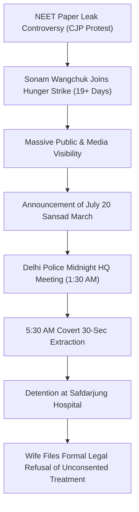

# Detailed Study Notes — Why is Safdarjung Hospital Withholding Sonam Wangchuk's Medical Report?

## Overview & Metadata
- **Video Title**: Wangchuk ki Wife ko Medical Report kyun nahi de rahe? Safdarjung ka Suspicious Khel *(English Translation: Why is Safdarjung Hospital Withholding Sonam Wangchuk's Medical Report?)*
- **Creator / Channel**: [[Aditya Kakkar]]
- **Source Link**: [YouTube Video](https://www.youtube.com/watch?v=1ogj_ykhhSo)
- **Publication Date**: 2026-07-18
- **Vault Ingestion Date**: 2026-07-23
- **Primary Domain / MOC**: [[03_MOC/yt-moc|YouTube Map of Content]]

### Executive Summary
This video provides a deep analytical breakdown of the early-morning police operation on July 18, 2026, wherein climate activist and innovator **Sonam Wangchuk** was forcibly extracted from his 19-day indefinite hunger strike at Jantar Mantar and admitted to Safdarjung Hospital. The video investigates the strategic maneuvering of Delhi Police under a newly appointed Commissioner, the legal weaponization of a Delhi High Court health monitoring order, the hospital's refusal to release blood work reports to Wangchuk's family, legal counter-measures taken by Wangchuk's wife, and a historical comparison with Narendra Modi's 2012 statements condemning the UPA government's raid on Baba Ramdev's hunger strike.

---

## Detailed Section Breakdown & Analysis

### 1. Police Extraction at Jantar Mantar & Hospital Detention (0:00 - 1:54)
- **5:30 AM Extraction (0:00)**: Delhi Police physically removed Sonam Wangchuk from the Jantar Mantar protest site in a swift, coordinated operation.
- **Hunger Strike Continuity (0:31)**: Despite government claims that Wangchuk was hospitalized due to critical medical reports, his wife confirmed that he has **not** broken his fast. He explicitly refused intravenous (IV) fluids, glucose, and oral electrolyte solutions administered by Safdarjung Hospital staff.
- **Covert Operational Logistics (0:50)**:
  - **1:30 AM Emergency Meeting**: Following the sudden replacement of the Delhi Police Commissioner, an emergency midnight strategy session was held at Delhi Police Headquarters.
  - **5:00 AM Practice Drills**: Tactical teams conducted security drills and practice runs at Jantar Mantar.
  - **30-Second Extraction Window**: Police executed a rapid 30-second raid to extract Wangchuk before student protesters could assemble or physically block police vehicles.
- **Historical Parallel — Modi in 2012 vs. Present (1:22)**:
  - In an archived 2012 clip, then-Gujarat CM Narendra Modi strongly condemned Prime Minister Manmohan Singh and the UPA government for unleashing police power against Baba Ramdev's anti-corruption hunger strike at Ramlila Maidan.
  - The video highlights the political irony: the current government under PM Modi employs nearly identical suppression tactics against non-violent hunger strikers as those condemned by Modi in 2012.

### 2. Operational Tactics, Concealment, and Force-Feeding Attempts (1:55 - 4:25)
- **Visual Concealment (2:11)**: During the extraction, police surrounded Wangchuk with white bedsheets and visual barriers to prevent photojournalists and bystanders from capturing images of him being dragged or physically handled, mitigating potential social media backlash.
- **Refusal of Force-Feeding (2:33)**: Hospital staff attempted to force-feed and administer electrolytes to Wangchuk, but he steadfastly refused to consume anything.
- **Background of the CJP Movement & NEET Leaks (2:47)**:
  - The protest was initiated by the Concerned Citizens for Justice and Peace (CJP), founded by activist **Abhijeet Dipke**, in response to systemic failures and paper leaks in the NEET exam.
  - Sonam Wangchuk joined the demonstration, lending national credibility, moral authority, and massive public visibility (videos accumulating millions of views) to what was initially a localized movement.
- **The July 20 Sansad (Parliament) March Threat (3:44)**:
  - Organizers scheduled a mass march to Parliament for July 20, 2026, coinciding with the opening of the Monsoon Session.
  - Government strategic concern: The physical presence of thousands of student protesters outside Parliament would force Opposition MPs to confront the administration directly during parliamentary debates, eliminating official pretexts of ignorance.

### 3. Media Provocations, Infiltration, and Non-Violent Resistance (4:26 - 8:45)
- **Standard Government Suppression Playbook (4:48)**:
  - The typical political strategy for handling protests involves ignoring demonstrators, avoiding direct police lathi-charges (which risk escalating public anger), and waiting for economic exhaustion to force protesters home.
  - Why this failed: Wangchuk's high public standing as an award-winning scientist, educator, and non-partisan figure rendered standard exhaustion tactics ineffective.
- **Discrediting Tactics via Media (6:36)**:
  - Pro-government media crews and YouTubers were deployed to interview young, unscripted student protesters on granular administrative details to edit and broadcast "fumble compilations" on social media.
  - Protesters counteracted this by questioning the journalists' motives directly on camera without resorting to hostility.
- **Right-Wing Provocation & CJP Discipline (7:52)**:
  - External right-wing groups entered Jantar Mantar attempting to incite religious clashes and derail the economic/education demands of the protest.
  - CJP organizers, including Abhijeet Dipke, maintained strict non-violent discipline, enduring physical altercations (including slaps) without retaliating, thereby preserving the moral high ground of the movement.

### 4. Legal Misinterpretation of HC Order & Hospital Controversies (8:46 - 12:39)
- **The PIL & High Court Directives (9:58)**:
  - A Public Interest Litigation (PIL) was filed requesting judicial oversight of Wangchuk's deteriorating health after 19 days of fasting.
  - The Delhi High Court directed state authorities to conduct daily medical monitoring and ensure appropriate healthcare.
  - **Legal Weaponization**: Delhi Police misinterpreted and stretched the court's welfare monitoring directive as authorization for forcible physical removal and hospital detention.
- **Suspicious Medical Metrics & Missing Reports (12:09)**:
  - Safdarjung Hospital claimed Wangchuk's blood potassium level plummeted from a normal 4.0 to a critical 2.0 within 24 hours—a drop deemed medically implausible under routine monitoring.
  - When Wangchuk's wife requested physical copies of the laboratory test reports, hospital administration flatly refused to provide them.

| Parameter / Milestone | Details / Claims | Timestamp Citation |
| :--- | :--- | :--- |
| **Extraction Time** | 5:30 AM at Jantar Mantar via 30-sec operation | `(0:00)` |
| **Police Planning** | 1:30 AM meeting at Delhi Police HQ following Commissioner swap | `(0:50)` |
| **Hunger Strike Duration** | 19+ consecutive days prior to extraction | `(3:13)` |
| **Disputed Potassium Metric** | Claimed drop from 4.0 to 2.0 in 24 hours; reports withheld | `(12:09)` |
| **Sansad March Target Date** | July 20, 2026 (Monsoon Session commencement) | `(3:44)` |
| **Expected March Attendance** | Projected 5,000 to 25,000 participants | `(9:41)` |

### 5. Legal Safeguards ("Ownership On") & Political Consequences (12:40 - 18:45)
- **Legal Safeguard — Family Written Declaration (14:43)**:
  - Under medical law, doctors may force-feed or administer treatment without patient consent if the patient is declared incapacitated or unconscious.
  - To block this loophole, Wangchuk's wife immediately delivered a formal, signed written notice to Safdarjung Hospital management.
  - The notice prohibited any medical procedure, IV infusion, medication, or food administration without her prior written consent and verification by an independent medical board. This exposed any violating medical personnel to immediate criminal and civil liability.
- **Demand for Independent Medical Testing (17:21)**:
  - The family announced plans to secure Wangchuk's discharge and transfer him to an independent healthcare facility of their choice for objective blood analysis.
- **Political Impact on Upcoming Elections (18:18)**:
  - The transition of public perception from "Students vs. Education Minister" to "Students vs. Ruling Party" poses significant political vulnerability for the government ahead of upcoming state elections in Uttar Pradesh and Punjab.
- **Opposition Critique (18:45)**:
  - The commentary concludes by calling out main opposition leadership (Rahul Gandhi and Congress) for failing to consolidate youth protests on the ground at Jantar Mantar, contrasting this with how Modi aggressively leveraged anti-corruption movements in 2012.

---

## Key Takeaways & Direct Quotes

### Key Takeaways
1. **Unbroken Hunger Strike**: Sonam Wangchuk has maintained his hunger strike inside Safdarjung Hospital, refusing all IV fluids, glucose, and electrolytes.
2. **Legal Overreach**: Delhi Police weaponized a Delhi High Court medical monitoring directive to justify a covert, pre-dawn physical extraction from Jantar Mantar.
3. **Withheld Medical Evidence**: Hospital authorities refused to provide blood lab reports to Wangchuk's family after claiming a precipitous drop in potassium levels.
4. **Legal Preemption**: Wangchuk's wife legally blocked unconsented force-feeding by issuing a binding written prohibition, holding doctors personally accountable for any unauthorized medical intervention.
5. **Resilient March Plans**: Organizers affirmed that the July 20 Parliament March will proceed as planned, with Wangchuk's wife representing him if his detention continues.

### Notable Quotes & Verbatim Statements
> *"It is not ended... He has not stopped his hunger strike. There is no IV, no glucose being administered. Nothing, nothing. He refused electrolytes and is continuing with his fast."* `(0:31)` — **Wangchuk's Wife**

> *"If this is a fight against corruption, everyone in government should feel uncomfortable... And Dr. Manmohan Singh, the country is no longer ready to believe that you are uninvolved. All these atrocities have occurred under your prime ministership; you are directly responsible."* `(1:22)` — **Narendra Modi (2012 Statement)**

> *"Also the march on Monday will continue, and most likely Sonam himself will join because he is fine. But if he cannot, I will represent him and the march will happen."* `(10:59)` — **Wangchuk's Wife**

---

## Source Provenance & Vault Links
- **Original Captured Transcript**: [[01_RAW/SOURCE/Wangchuk ki Wife ko Medical Report kyun nahi de rahe Safdarjung ka Suspicious Khel.md]]
- **Parent Knowledge Map**: [[yt-moc|📺 YouTube Map of Content]]
