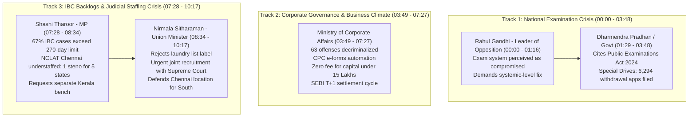

# Detailed Study Notes — War of Words Between Dharmendra Pradhan vs Rahul Gandhi in Lok Sabha

## 1. Executive Summary & Administrative Context

- **Source Title**: War Of Words Between Education Minister Dharmendra Pradhan Vs Rahul Gandhi in Lok Sabha | News Buzz
- **Channel / Creator**: [[News Buzz]]
- **Watch URL**: [YouTube Video](https://www.youtube.com/watch?v=Y4UNW4BzZDU)
- **Source Link**: [[01_RAW/SOURCE/War Of Words Between Education Minister Dharmendra Pradhan Vs Rahul Gandhi in Lok Sabha  News Buzz.md]]
- **Parliamentary Setting**: Lok Sabha (House of the People), Parliament of India, Question Hour Debate.

### Deep-Dive Executive Summary
This transcript documents an intense Question Hour session in the Lok Sabha covering two major national policy battlegrounds:
1. **Public Examination Integrity & Youth Trust**: The Opposition (led by Rahul Gandhi) confronts Education Minister Dharmendra Pradhan regarding paper leaks, commercialization of entrance tests (e.g., NEET-UG), and widespread student perception that national exams are fundamentally compromised. The Government responds by citing legacy legislative inaction, recent anti-malpractice laws, and judicial enforcement drives.
2. **Corporate Laws, Insolvency Backlogs & Judicial Staffing**: Ministry of Corporate Affairs officials detail 11 specific Ease of Doing Business (EoDB) reforms—including decriminalizing 63 offenses, waiving incorporation fees for small capital firms, and introducing SEBI T+1 settlement cycles. In response, MP Shashi Tharoor highlights severe structural delays under the Insolvency and Bankruptcy Code (IBC), where 67% of cases breach the 270-day limit due to critical staffing shortages at NCLAT Chennai. Union Minister Nirmala Sitharaman defends the reform trajectory while acknowledging recruitment challenges managed alongside the Supreme Court.

---

## 2. Structural Debate Architecture & Flowchart

---

## 3. Exhaustive Section-by-Section Analysis

### Section 1: Examination Integrity & Systemic Fraud Allegations (00:00 – 01:28)
* **Lead Speaker**: Rahul Gandhi (Leader of Opposition, Lok Sabha)
* **Target Official**: Dharmendra Pradhan (Union Minister of Education)
* **Detailed Argument Breakdown**:
  * **Ministerial Accountability**: Accuses the Education Minister of failing to accept personal responsibility for paper leaks and systemic exam vulnerabilities, claiming the Minister lacks a grasp of the structural mechanics of the crisis.
  * **Loss of Credibility Among Youth**: Asserts that millions of students across India have lost faith in competitive examinations, viewing the system as corrupted by money power where affluent candidates buy leaks and seats.
  * **Opposition Consensus**: Emphasizes that the entire Opposition shares the view that the national examination apparatus suffers from systemic failure rather than isolated glitches.
* **Verbatim Parliamentary Question**:
  > *"Number one, as this is a systemic issue, what exactly are you doing to fix this issue at a systemic level?"* — Rahul Gandhi (01:02)

---

### Section 2: Legislative Counter-Attack & Special Judicial Drives (01:29 – 03:48)
* **Lead Speaker**: Dharmendra Pradhan / Treasury Representative
* **Detailed Argument Breakdown**:
  * **Historical Contrast (UPA vs. NDA)**: Recalls that under the UPA administration in 2010, the *Prohibition of Unfair Practices in Technical Educational Institutions, Medical Educational Institutions and University Bill, 2010* was introduced but abandoned without establishing binding penal mechanisms.
  * **Statutory Enforcement**: Highlights the enactment of the *Public Examinations (Prevention of Unfair Means) Act, 2024*, which establishes stringent criminal penalties and institutional accountability for paper leaks, cheating networks, and organized crime involvement in public examinations (including NEET and NET).
  * **Special Judicial Drives**: Details targeted enforcement campaigns aimed at clearing invalid or fraudulent filings and expediting prosecution:
    * *Special Drive Phase 1*: Launched in 2017.
    * *Special Drive Phase 2*: Implemented in 2023.
    * *Quantifiable Progress*: As of **July 15, 2024**, exactly **6,294 applications for withdrawal** have been filed before various judicial courts across India.

---

### Section 3: Corporate Laws, Ease of Doing Business & Capital Markets (03:49 – 07:27)
* **Lead Speaker**: Minister of State / Ministry of Corporate Affairs
* **Detailed Policy Breakdown**:
  * **11 Ease of Doing Business Initiatives**: Highlights a comprehensive 11-point roadmap submitted in a detailed written reply to the House.
  * **Major Decriminalization Drive**: **63 major offenses** under the Companies Act have been decriminalized. Minor procedural defaults and technical non-compliances no longer carry imprisonment or criminal records, relieving businesses from fear of malicious prosecution.
  * **Central Processing Center (CPC)**: Operationalized to automate and expedite non-STPE (Straight Through Processing Endorsement) corporate e-forms, drastically reducing processing queues.
  * **Incorporation Fee Exemption**: To promote grassroots entrepreneurship, the government instituted a **₹0 fee policy for company incorporation** for all entities with an authorized capital threshold up to **₹15 Lakhs**.
  * **SEBI T+1 Trade Settlement Norms**: Responding to supplementary queries raised by MP Jagdambika Pal:
    * SEBI implemented **T+1 settlement cycles** for equity trades (settlement within 24 hours of execution).
    * Global Benchmark Comparison: Demonstrates that India's capital market infrastructure surpasses international jurisdictions (such as the US or EU markets operating on T+2, T+4, or T+6 settlement regimes).
  * **Parliamentary Decorum Request**: Requests Lok Sabha members to extend understanding toward newly appointed Ministers of State (MOS) as they present complex written statistics during Question Hour.

---

### Section 4: Insolvency Timelines & NCLAT Staffing Crisis (07:28 – 10:17)
* **Lead Speakers**: Shri Shashi Tharoor (Congress MP) vs. Smt. Nirmala Sitharaman (Union Minister of Finance & Corporate Affairs)
* **Opposition Interrogation (Shashi Tharoor)**:
  * **Statutory Deadline Breach**: Points out that **67% of pending insolvency litigation cases** under the Insolvency and Bankruptcy Code (IBC) exceed the mandatory **270-day resolution timeline**, directly causing asset value destruction.
  * **NCLAT Staffing Bottleneck**: Focuses on the National Company Law Appellate Tribunal (NCLAT) Chennai bench, which holds jurisdiction over all **5 Southern States** (Kerala, Tamil Nadu, Karnataka, Andhra Pradesh, Telangana) and **2 Union Territories** (Puducherry, Lakshadweep).
  * **Severe Administrative Deficit**: Cites reports showing the Chennai bench operates with only **one stenographer doubling as Personal Assistant** to the technical member, while the Tribunal Registrar remains stationed in New Delhi.
  * **Regional Proposal**: Demands immediate recruitment and urges the Ministry to establish a dedicated NCLAT bench for Kerala to address localized case backlogs.
* **Government Defense & Counter-Response (Nirmala Sitharaman)**:
  * **Rejection of "Laundry List" Label**: Refuses Tharoor's characterization of government policies as a "laundry list", distinguishing between passive listings and concrete structural reform milestones.
  * **Judicial Recruitment Coordination**: Confirms that filling vacancies across NCLT (National Company Law Tribunal) and NCLAT is a top priority, actively managed through periodic advertisements and recruitment drives conducted in coordination with the **Supreme Court of India**.
  * **Geographic Placement Defense**: Defends the selection of Chennai (Tamil Nadu) as the Southern appellate seat, pointing out that southern representatives cannot complain of northern bias since the bench is located in South India.
  * **Microphone Cut-Off Incident**: Experiences an unexpected microphone shutoff mid-speech, humorously observing that mic cuts affect treasury bench ministers as well as opposition members.
  * **Assurance of Urgency**: Reassures Parliament that appointments to company law tribunals are being executed with maximum urgency.

---

## 4. Comprehensive Parliamentary Data Matrix

| Policy Dimension | Issue / Metric | Parliamentary Data / Legal Framework | Timestamp | Responsible Entity |
|---|---|---|---|---|
| **Exam Security** | Systemic Integrity | Allegations of paper leaks & commercialization | (00:00 - 01:16) | Ministry of Education |
| **Statutory Reform** | Anti-Malpractice Law | Public Examinations (Prevention of Unfair Means) Act | (02:45) | Parliament of India |
| **Legacy Draft** | 2010 Draft Bill | Prohibition of Unfair Practice Bill 2010 (UPA era) | (02:45) | Ministry of HRD / Education |
| **Judicial Drives** | Special Drive Phase 1 & 2 | Launched in 2017 & 2023; **6,294 withdrawal apps** | (03:49 - 04:18) | Ministry of Law & Justice / MCA |
| **Decriminalization** | Offenses Removed | **63 major Companies Act offenses** decriminalized | (04:18 - 04:51) | Ministry of Corporate Affairs |
| **E-Governance** | Central Processing Center | CPC established for non-STPE corporate e-forms | (04:51) | Ministry of Corporate Affairs |
| **Startup Support** | Zero Incorporation Fee | Applicable for authorized capital **≤ ₹15 Lakhs** | (05:10) | MCA / Registrar of Companies |
| **Capital Markets** | Trade Settlement Cycle | **T+1 settlement** implemented by SEBI | (05:49 - 06:35) | SEBI / Finance Ministry |
| **Insolvency Delay** | Statutory Breach | **67% of cases exceed 270-day limit** under IBC | (07:28 - 07:59) | NCLT / NCLAT / MCA |
| **Tribunal Staffing** | Southern NCLAT Bench | Chennai bench covers 5 states & 2 UTs; 1 steno PA | (07:59 - 08:34) | Ministry of Corporate Affairs |
| **Judicial Selection** | Vacancy Filling | Joint recruitment pipeline with **Supreme Court** | (09:00 - 10:17) | MCA & Supreme Court |

---

## 5. Exhaustive Direct Quotes Archive

1. **Rahul Gandhi (Leader of Opposition)**:
   > *"The minister has blamed everybody except himself. Right? I don't frankly I don't even think he understands the fundamentals of what is going on here... The issue is that there are millions of students in this country who are extremely concerned at what is going on and who are convinced that the Indian examination system is a fraud. That is what is at stake here. Millions of people believe that if you are rich and if you have money you can buy the Indian examination system."* (00:00 – 00:56)

2. **Rahul Gandhi (Specific Reform Question)**:
   > *"And that is why we are asking some very simple questions to honorable minister. Number one, as this is a systemic issue, what exactly are you doing to fix this issue at a systemic level?"* (00:56 – 01:16)

3. **Ministry Representative on Decriminalization & Startup Ingestion**:
   > *"Most importantly, decriminalization of 63 major offenses. So 63 offenses have been decriminalized. And as a result of which, companies today are able to carry on their functions without the worry of compliance... Zero fee for incorporation has been brought in for companies with authorized capital up to 15 lakhs."* (04:18 – 05:10)

4. **Ministry Representative on SEBI T+1 Reforms**:
   > *"The reforms which have been brought by the SEBI, particularly in timelines which have been given for settlement of claims, is a remarkable step taken forward... They are still not able to settle claims within even a T+6, T+5, or T+4. We have even come to T+1 which is effectively being run today."* (05:49 – 06:35)

5. **Shri Shashi Tharoor on NCLAT Understaffing**:
   > *"The honorable minister has given us a kind of laundry list of initiatives, but he's overlooked a very crucial issue, sir, which is that 67% of the pending litigation cases relating to insolvency have exceeded the 270-day time frame precisely because there has been no attention paid to the staffing levels of the NCLAT, sir... South bench has one stenographer who doubles up as PA to the technical member and the registrar sits in Delhi. Sir, this is a preposterous situation."* (07:28 – 07:59)

6. **Union Minister Nirmala Sitharaman on Reform Laundry List**:
   > *"Sounds very interesting to say I've given a laundry list, but we have done so many reforms. So, we need to list it all. And I appeal to the honorable member to read it so that he can differentiate between a typical laundry list and a list of actions taken for reforming the process."* (08:34 – 09:00)

7. **Union Minister Nirmala Sitharaman on Judicial Benches & Mic Cut-Off**:
   > *"Staffing and filling up the vacancies of NCLT and NCLAT is a challenge which we are trying to meet. We are certainly conducting periodically interviews and also advertising for positions and working with the Supreme Court... Oh, Sir, my mic is off. So, it's not only the opposition members or mics which are getting off. Even mine is off, if that satisfies you."* (09:00 – 10:17)

---

## 6. Parliamentary Concepts & Terminology Glossary

- **Question Hour**: The first hour of a sitting in the Lok Sabha devoted to questions posed by MPs to ministers concerning government policy and administration.
- **Supplementary Question**: A question asked by an MP following a minister's response to clarify or probe deeper into the original query.
- **Public Examinations (Prevention of Unfair Means) Act, 2024**: Federal legislation passed by Parliament imposing strict penalties (including non-bailable imprisonment and heavy fines) for paper leaks, tampering, and organized cheating in competitive examinations.
- **Insolvency and Bankruptcy Code (IBC, 2016)**: India's consolidated bankruptcy law establishing statutory timelines (originally 180 days, extended up to 270 days) for resolving corporate insolvency.
- **NCLT & NCLAT**:
  - *NCLT*: National Company Law Tribunal, quasi-judicial body adjudicating corporate disputes and insolvency petitions.
  - *NCLAT*: National Company Law Appellate Tribunal, appellate body hearing appeals from NCLT decisions.
- **Decriminalization under Companies Act**: Converting minor criminal offenses (punishable by jail terms) into civil defaults carrying financial penalties administered by Adjudicating Officers rather than criminal courts.
- **Central Processing Center (CPC)**: A centralized back-office mechanism set up by the Ministry of Corporate Affairs to process e-forms electronically without manual intervention.
- **T+1 Settlement**: A trade settlement cycle where shares and funds are delivered within 1 business day following trade execution date (T).
