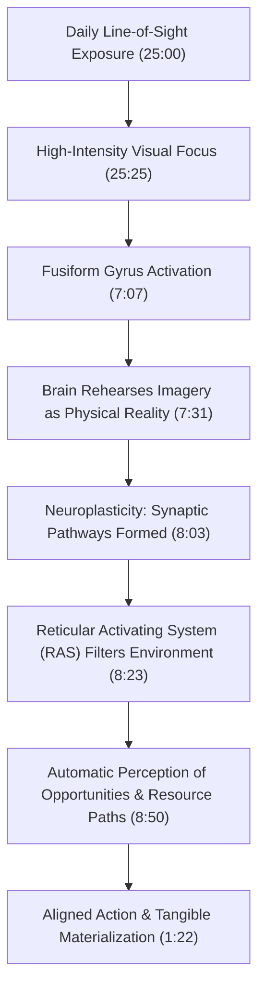
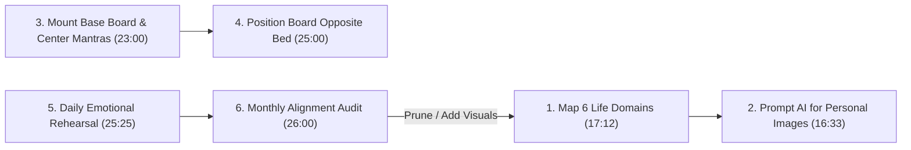

---
id: 4a2e8c9b-6d3f-4e71-8b29-1c5d9a0f3e47
title: "Detailed Study Notes - Watch This Before You Waste Another Year"
type: literature-note
status: learning
domain: self-improvement
source_type: youtube
created: 2026-07-30
updated: 2026-08-19
review: 2026-08-30
confidence: 95
version: 1
aliases:
  - "Watch This Before You Waste Another Year Study Notes"
  - "Him-eesh Madaan Vision Board Blueprint"
  - "Manifestation Blueprint Study Guide"
tags:
  - yt
  - self-improvement
  - productivity
  - checklist
  - implementation
  - case-study
  - example
owner_moc: YouTube MOC
sources:
  - "https://www.youtube.com/watch?v=2XTkHfaZGSQ"
  - "[[01_RAW/SOURCE/Watch this before you waste another Year.md]]"
related: []
schema_version: 4
---

# Detailed Study Notes — Watch This Before You Waste Another Year

## Executive Overview & Meta Data

- **Video Title**: Watch this before you waste another Year
- **Creator / Speaker**: [[Him-eesh Madaan]] (Author of *The Manifestation Blueprint*)
- **Video Source URL**: [https://www.youtube.com/watch?v=2XTkHfaZGSQ](https://www.youtube.com/watch?v=2XTkHfaZGSQ)
- **Publication Date**: February 7, 2026
- **Processing Timestamp**: July 30, 2026
- **Primary Domain**: Human Potential, Goal Achievement, Cognitive Science, Life Architecture

### Executive Summary
This document provides an exhaustive, line-by-line detailed synthesis of Him-eesh Madaan's comprehensive masterclass on designing, constructing, and maintaining a scientific Vision Board. Rejecting mystical rituals and passive daydreams, the session grounds manifestation in **empirical neuroscience** (fMRI pattern studies, Fusiform Gyrus activation, Neuroplasticity, and Reticular Activating System filtering). It analyzes psychological failure mechanisms such as the **Subconscious Rebellion Effect**, provides a step-by-step physical and AI-assisted workflow (utilizing Google Gemini and ChatGPT for personalized image generation), details a balanced 6-domain goal framework, establishes core identity mantras, and outlines mandatory post-creation routines for visual prominence and monthly cognitive audits.

---

## 1. Introduction & The "School of Life" Framework (0:00 - 2:25)

### Behind-the-Scenes & Production Setup (0:00 - 0:28)
- **Context (0:01 - 0:04)**: The video opens on set with videographer Gaurav informing Him-eesh that printed photos for the vision board demonstration are delayed by 15 minutes.
- **Decisive Action (0:04 - 0:28)**: Rather than delaying production, Him-eesh initiates the camera roll immediately ("Shot ready and camera rolling. Action"), establishing that theoretical principles will be taught while awaiting physical delivery.

### Personal Provenance & Background (0:28 - 0:54)
- **Long-term Application**: Him-eesh has practiced, tested, and validated vision board methodologies personally since 2013.
- **Empirical Validation**: In prior content, he documented visual targets created for personal housing, vehicles, travel destinations, relationships, societal contributions, and professional growth—reporting that every single visual target ultimately materialized into physical reality over time.
- **Dual Objective**: The video is structured to simultaneously teach the underlying science and demonstrate live construction on camera.

### The "School of Life Project" Definition (0:54 - 1:22)
- **Conceptual Definition**: A vision board is best understood as a "School Project"—not an academic assignment measured by standardized testing, but a practical **School of Life Project**.
- **Real-World Metrics**: It is designed to yield tangible life outcomes superior to academic grades:
  - Accelerated career milestones
  - Elite physical health and vitality
  - Dream vehicles and residential property
  - Target bank balances and wealth accumulation
  - Fulfilling, growth-oriented life partnerships

### Demystifying Manifestation (1:22 - 2:25)
- **Rejection of Superstition**: The framework explicitly excludes magic, superstitious rituals, or passive wishful thinking.
- **Triadic Methodology**: A vision board is a physical catalyst uniting three proven mental practices:
  1. **Visualization**: Active mental projection of target future states.
  2. **Affirmations**: Verbal and cognitive identity reinforcement.
  3. **Law of Attraction / Manifestation**: Subconscious cognitive tuning to detect environmental opportunities.

---

## 2. Theoretical Foundations, Architecture & Achiever Precedents (2:25 - 6:10)

### Taxonomy of Human Mindsets (2:25 - 2:58)
Humanity is divided into two distinct operating categories regarding future outcomes:

```
                          ┌───────────────────────────┐
                          │   HUMAN MINDSET SPLIT     │
                          └─────────────┬─────────────┘
                                        │
             ┌──────────────────────────┴──────────────────────────┐
             ▼                                                     ▼
┌──────────────────────────┐                         ┌──────────────────────────┐
│ 1. Passive Observers     │                         │ 2. Active Architects     │
│ "Whatever happens will   │                         │ "Whatever happens, I     │
│ be seen." (Leaves life   │                         │ must live it; therefore  │
│ to random chance)        │                         │ I design it today."      │
└──────────────────────────┘                         └──────────────────────────┘
```

Vision boards are engineered exclusively for **Active Architects**. Viewers adhering to passive chance are advised to exit the material.

### The Architectural Blueprint Principle: Baahubali Case Study (2:58 - 4:15)
- **The Historical Event (2:58 - 3:31)**: In 2013, at Ramoji Film City (Hyderabad), Arka Media Works deployed 500+ crew members in extreme dust conditions to build the 100-acre Mahishmati Kingdom set for the film *Baahubali* at a budget of ₹60 Crore ($7.2M USD).
- **The Core Question (3:31 - 3:50)**: Did this massive physical structure appear purely through unguided hard work? No. Production Designer Sabu Cyril and his design team drafted **over 1,500 detailed sketches on paper** before a single physical beam was erected.
- **Universal Axiom (3:50 - 4:15)**: *Every major creation in the world is created twice: first on paper/visual format, and second in physical reality.* This applies to skyscrapers, legislation, software applications, corporate strategies, and human life. Carrying life goals as unorganized mental thoughts guarantees structural drift.

### High-Achiever Empirical Precedents (4:15 - 5:47)

```
┌──────────────────────────────────────────────────────────────────────────┐
│                   HISTORICAL ACHIEVER PRECEDENTS MATRIX                   │
├───────────────────────┬──────────────────────┬───────────────────────────┤
│ Achiever / Leader     │ Technique Applied    │ Precise Action & Outcome  │
├───────────────────────┼──────────────────────┼───────────────────────────┤
│ Jim Carrey            │ Written Financial    │ Carried a self-written    │
│                       │ Visual Check         │ $10 Million check for     │
│                       │                      │ "acting services rendered"│
│                       │                      │ in his wallet daily. (4:37)│
├───────────────────────┼──────────────────────┼───────────────────────────┤
│ Arnold Schwarzenegger │ Mental Trophy        │ Rehearsed standing on     │
│                       │ Rehearsal            │ championship stages daily │
│                       │                      │ holding trophies. (4:37)  │
├───────────────────────┼──────────────────────┼───────────────────────────┤
│ Michael Jackson       │ Future Self Letter   │ Authored detailed letters │
│                       │                      │ describing target career  │
│                       │                      │ heights in advance. (4:37)│
├───────────────────────┼──────────────────────┼───────────────────────────┤
│ Virat Kohli           │ Mirror Identity      │ Looked in mirror, rejected│
│                       │ Confrontation        │ weak physical standards,  │
│                       │                      │ visualized elite form.(5:01)│
├───────────────────────┼──────────────────────┼───────────────────────────┤
│ Steve Harvey          │ Digital Wallpaper    │ Maintains a vision board  │
│                       │ Reinforcement        │ as active phone wallpaper │
│                       │                      │ for daily exposure. (5:18)│
├───────────────────────┼──────────────────────┼───────────────────────────┤
│ Akash Anand &         │ Physical Wall Target │ Pasted magazine cutouts   │
│ Akash Gupta           │ Display              │ & wrote "Earn ₹25 Crore"  │
│                       │                      │ on office walls. (5:18)   │
└───────────────────────┴──────────────────────┴───────────────────────────┘
```

---

## 3. Cognitive Science & Neurobiology of Visualization (6:10 - 9:34)

### The University College London (UCL) Pattern Study (6:10 - 7:07)
A scientific experiment conducted by researchers at University College London provided definitive proof of how imagination alters visual perception:

```
[Phase 1: Baseline Exposure]
26 Participants shown blurry TV visuals.
Group A: Shown visuals with hidden patterns.
Group B: Shown visuals with zero patterns.
          │
          ▼
[Phase 2: Mental Rehearsal]
All participants instructed to imagine a random visual pattern internally.
          │
          ▼
[Phase 3: Test Exposure & fMRI Monitoring]
Shown blurry clips containing ZERO hidden patterns.
Result: Participants consistently "saw" the exact pattern they had imagined.
fMRI Data: Identical brain regions activated during mental imagination and real vision.
```

### Neurobiological Mechanisms: Fusiform Gyrus & Neuroplasticity (7:07 - 8:50)

#### 1. Fusiform Gyrus Activation (7:07 - 7:31)
- Mild, vague daydreaming activates the fusiform gyrus at low thresholds.
- Vivid, detailed, emotionally resonant visualization highly activates the fusiform gyrus.
- When highly activated, the brain treats internal visual projections as external reality, triggering perceptual restructuring.

#### 2. Neuroplasticity & Thought Practice (7:31 - 8:23)
- **Soil & Seed Analogy**: The human brain represents uncultivated land. A new idea/goal is a seed. Daily visual focus represents watering the seed.
- **Synaptic Rewiring**: Repeated thoughts force neurons to fire together, constructing physical neural circuits. The brain cannot distinguish between a real sensory experience and a vividly imagined internal state; it physically rewires synaptic pathways for both.

#### 3. Reticular Activating System (RAS) Filtering (8:23 - 8:50)
- The Reticular Activating System filters billions of bits of daily sensory input.
- Daily visual exposure trains the RAS to recognize goal-relevant information, automatically highlighting decision paths, networking opportunities, and strategic resources that were previously ignored.

---

## 4. Critical Mistakes & Psychological Failure Modes (9:34 - 15:45)

### Mistake 1: Setting Aspirational but Impossible Goals (9:34 - 12:03)

#### The Mountain Trekking Analogy (9:46 - 10:31)
- A trekker begins Day 1 with high energy and a packed backpack.
- If the guide suddenly announces: *"We will climb directly to the mountain peak today without a single break,"* the trekker experiences immediate psychological paralysis and despair.
- When the guide corrects: *"Target is just Checkpoint 1,"* mental relief and focused effort return.

#### The Subconscious Rebellion Effect (10:31 - 12:01)
- Plastering wildly unrealistic targets (e.g., "buy a private jet", "earn ₹100 Crore next year", or "meet Elon Musk" when starting from zero capability) triggers internal rejection.
- **Cognitive Friction**: The subconscious mind evaluates current stage, profile, skill set, and daily actions against the goal. When an irreconcilable gap exists, it triggers the **Subconscious Rebellion Effect**.
- **Reversal of Vision Board Impact**: Instead of inspiring ambition, the board generates chronic stress, anxiety, self-doubt, and demotivation—causing the user to avoid looking at the board.
- **Remediation Protocol**: Goals must be ambitious stretch targets for your *next evolutionary version*, but realistic and plausible for your current trajectory.

```
┌──────────────────────────────────────────────────────────────────────────┐
│                   SUBCONSCIOUS REBELLION MECHANISM                       │
├──────────────────────────────────────────────────────────────────────────┤
│ Absurd Goal Set ──► Subconscious Gap Audit ──► Internal Disbelief        │
│                                                       │                  │
│ Mission Abort ◄── Stress & Anxiety ◄── Cognitive Friction ───────────────┘
└──────────────────────────────────────────────────────────────────────────┘
```

### Mistake 2: Lack of Emotional Alignment & Positive Belief (12:03 - 15:45)

#### The Childhood Promise Analogy (12:03 - 12:58)
- When a child is promised a bicycle or cricket kit by their father for achieving academic marks, the child works with eager anticipation, not desperate anxiety.
- The child continuously visualizes riding the bicycle because they possess calm belief in the fulfillment of the promise.

#### Desperation vs. Expectation (12:58 - 13:56)
- Mounting images without feeling the joyful emotion of attainment turns the vision board into static home decoration.
- Goals must be approached with positive belief and confident expectation rather than needy desperation.

#### The Radio Frequency Metaphor (13:56 - 15:14)
- The human brain operates like a radio tuner; thoughts serve as broadcast signals matching specific frequencies.
- **Job Interview Demonstration**:
  - *Negative Frequency*: Thinking "1,000 candidates are better than me" broadcasts anxiety signals, causing physical stammering, low confidence, and memory failure during the interview.
  - *Positive Frequency*: Thinking "I have prepared thoroughly and will communicate clearly" aligns internal confidence, enabling calm control and peak articulation.
- **Key Takeaway**: Technical preparation was identical in both scenarios; performance outcomes changed strictly by altering the brain's internal signal frequency.

---

## 5. Vision Board Construction Blueprint (15:45 - 17:12)

### Physical & Digital Tool Specifications

```
┌──────────────────────────────────────────────────────────────────────────┐
│                     VISION BOARD INGREDIENTS MATRIX                      │
├───────────────────┬────────────────────────────┬─────────────────────────┤
│ Ingredient        │ Specifications & Sourcing  │ Operational Function    │
├───────────────────┼────────────────────────────┼─────────────────────────┤
│ Base Board        │ Self-adhesive block board, │ Provides rigid physical │
│                   │ canvas board, or poster    │ mounting surface for    │
│                   │ board (Amazon).            │ wall installation.      │
├───────────────────┼────────────────────────────┼─────────────────────────┤
│ Mounting Hardware │ Push pins (cork/canvas) or │ Secures imagery while   │
│                   │ built-in adhesive layer.   │ allowing monthly swaps. │
├───────────────────┼────────────────────────────┼─────────────────────────┤
│ Personalized AI   │ Images generated via Google│ Renders hyper-realistic │
│ Visuals           │ Gemini or ChatGPT using    │ goals featuring your own│
│                   │ user face reference.       │ personal face/likeness. │
├───────────────────┼────────────────────────────┼─────────────────────────┤
│ Text Affirmations │ High-contrast printed text │ Centers cognitive focus │
│                   │ strips of core mantras.    │ on identity principles. │
└───────────────────┴────────────────────────────┴─────────────────────────┘
```

### AI-Assisted Image Generation Protocol (16:33 - 16:53)
- Upload personal photos to **Google Gemini** or **ChatGPT**.
- Prompt the AI to generate aspirational life scenarios (e.g., presenting on stage, sitting in a specific office, traveling, or staying fit) while preserving your actual facial features.
- Print custom visual outputs to make the vision board deeply personal and neurologically convincing.

---

## 6. The 6 Balanced Categories of Life Goals (17:12 - 23:00)

To maintain holistic life stability and prevent collapse in personal areas, vision board targets must be balanced across six core categories:

```
                                  ┌───────────────────────────┐
                                  │   6 BALANCED LIFE DOMAINS │
                                  └─────────────┬─────────────┘
                                                │
       ┌──────────────┬─────────────┬───────────┼───────────┬──────────────┐
       ▼              ▼             ▼           ▼           ▼              ▼
┌────────────┐  ┌───────────┐ ┌───────────┐┌───────────┐┌───────────┐  ┌───────────┐
│ 1. Career  │  │ 2. Rela-  │ │ 3. Health ││ 4. Society││ 5. Personal│  │ 6. Finance│
│ & Growth   │  │ tionships │ │ & Energy  ││ & Giving  ││ & Stability│  │ & Wealth  │
└────────────┘  └───────────┘ └───────────┘└───────────┘└───────────┘  └───────────┘
```

### Domain Specifications & Case Examples

#### 1. Career & Growth (17:12 - 19:11)
- Precise metric targets for business revenue, income scaling, job promotions, target officer positions (e.g., UPSC aspirants visualizing officer status), target universities, or technical skill mastery.
- *Him-eesh's Visual*: Expanding content reach, scaling media enterprises, and creating employment opportunities.

#### 2. Relationships & Family (19:11 - 19:38)
- Intentional time allocation for parents, partner/spouse, and friends.
- *Personal Reflection*: Him-eesh notes a past weakness in allocating time to friends, committing to ongoing improvement.
- *AI Note*: Recommends re-prompting AI to incorporate exact facial features of real family members for deep emotional resonance.

#### 3. Health & Physical Energy (19:38 - 19:58)
- Focuses on functional vitality, daily energy, and consistent physical movement rather than extreme bodybuilding aesthetics.
- *Core Principle*: When health is good, a person has 1,000 goals; when health fails, a person has only 1 goal—to regain health.

#### 4. Society & Philanthropic Contribution (19:58 - 21:11)
- Contributing time or financial resources to societal upliftment.
- *Him-eesh's Personal Origin*: Due to severe financial hardship in childhood, his 10th, 11th, and 12th-grade schooling was funded by loans/contributions from relatives.
- *Tangible Impact Target*: Co-funded education for 100+ students last year with his spouse Gunjan (reaching 250+ students total to date), setting higher funding targets for the current year.

#### 5. Personal Growth, Travel & Mental Stability (21:11 - 22:26)
- Hobbies, skill acquisition, travel bucket lists, and internal psychological development.
- **The Vivekananda Principle**: *"Run fast with a stable mind"* (derived from Swami Vivekananda)—pursue relentless external expansion while maintaining deep internal calm, peace, and stillness.

#### 6. Finance & Wealth Building (22:26 - 23:00)
- Distinct from Career (income generation). Focuses on net worth accumulation, savings rates, investment discipline, and financial habit control.
- *Critical Distinction*: Earning money is Career; retaining, investing, and compounding wealth is Finance.

---

## 7. Core Affirmations & Centered Life Mantras (23:00 - 24:46)

Print and mount three central identity mantras at the visual heart of the board:

```
┌──────────────────────────────────────────────────────────────────────────┐
│                       CENTERED IDENTITY MANTRAS                          │
├──────────────────────────────────────────────────────────────────────────┤
│ 1. "Man Niva, Mat Uchi" (Ardas Line)                                     │
│    └─► Humble Mind, Elevated Thinking. Keep ego at root level; keep     │
│        strategic vision grand and elevated. (23:18)                      │
│                                                                          │
│ 2. "Enjoy the Journey"                                                   │
│    └─► Achieve while already happy, rather than postponing happiness     │
│        until goals are attained. (23:48)                                 │
│                                                                          │
│ 3. "Shukr" (Gratitude)                                                   │
│    └─► Express daily thankfulness for all outcomes. View obstacles as   │
│        protective speedbreakers designed for growth. (24:16)            │
└──────────────────────────────────────────────────────────────────────────┘
```

---

## 8. Post-Creation Execution Rules (24:46 - 27:26)

### Rule 1: High-Visibility Placement (25:00 - 25:25)
- Never store the board inside a closet, drawer, or hidden digital subfolder.
- Mount it directly in your primary visual path upon waking (e.g., the wall directly opposite your bed) to ensure continuous subconscious RAS stimulation.

### Rule 2: Dedicated Daily Visualization Practice (25:25 - 26:00)
- Passive background glances are insufficient.
- Allocate dedicated daily time to sit, look at each visual, internalize the emotional state of achievement, and experience genuine pride and gratitude.

### Rule 3: Monthly Alignment Audit (26:00 - 26:55)
- Conduct a monthly audit of all mounted visuals:
  - If a goal no longer evokes emotional resonance or feels unaligned, **remove it**.
  - If new genuine aspirations emerge, **generate and attach new visuals**.
  - Keep the board 100% synchronized with your true internal state.

### Book Reference (26:55 - 27:26)
- **Book Title**: *The Manifestation Blueprint* by Him-eesh Madaan.
- Available on Amazon and major bookstores, detailing neuroscience hacks, step-by-step manifestation frameworks, and personal case studies.

---

## 9. Comprehensive Structural Data Tables

### Master Matrix of 6 Balanced Goal Domains

| Category # | Goal Domain | Primary Focus | Sourcing & Tooling | Key Case / Personal Example |
|---|---|---|---|---|
| **1** | **Career** | Income scaling, job position, skills, business growth. | Target metrics, AI visual generation. | UPSC officer visualization; business reach expansion. (17:22) |
| **2** | **Relationships** | Family time, partner bonding, friendship quality. | Personalized AI images with real faces. | Spending time with parents & friends; partner memories. (19:11) |
| **3** | **Health** | Functional fitness, vitality, daily movement. | AI fitness visual prompt. | Daily physical movement & energy (not bodybuilding). (19:38) |
| **4** | **Society** | Philanthropy, education funding, volunteering. | Action visual of sponsorship. | Funding 250+ student educations (Him-eesh & Gunjan). (19:58) |
| **5** | **Personal** | Inner stability, travel bucket list, wisdom. | Dual image: Outer growth + Inner peace. | Swami Vivekananda's "Run fast with a stable mind." (21:11) |
| **6** | **Finance** | Savings rate, investments, net worth scaling. | Financial tracking metrics. | Wealth accumulation & investment habit control. (22:26) |

### Anti-Pattern vs. Remediation Protocol

| Dimension | Common Anti-Pattern / Failure Mode | Scientific Remediation Protocol | Timestamp |
|---|---|---|---|
| **Goal Framing** | Absurd, disconnected targets causing Subconscious Rebellion. | Next-stage aspirational stretch goals that feel plausible. | (10:31) |
| **Emotional State** | Needy desperation, stress, or chronic anxiety. | Calm expectation, joyful belief, and daily gratitude (*Shukr*). | (12:58) |
| **Placement** | Stored inside folders, closets, or forgotten drawers. | Prominently mounted opposite bed in primary waking line of sight. | (25:00) |
| **Usage Pattern** | Passive background glance without emotional engagement. | Dedicated daily visual rehearsal and emotional state alignment. | (25:25) |
| **Maintenance** | Static board left untouched for years despite goal drift. | Monthly alignment audit to prune dead goals and add fresh desires. | (26:00) |

---

## 10. Mermaid Process Diagrams

### Complete Cognitive Science & Neuroplasticity Engine



### Complete Construction & Execution Lifecycle



---

## 11. Complete Verbatim & Translated Quotations Log

> *"A vision board is not an academic school project; it is a project for the School of Life, designed to yield rewards far greater than grades."* (0:54) — **Him-eesh Madaan**

> *"There are two types of people in the world: those who say 'whatever happens will be seen,' and those who say 'whatever happens, I am the one who will have to live it—so I must design it starting today.'"* (2:25) — **Him-eesh Madaan**

> *"Everything in the world is created twice—first on paper as a blueprint, and then in physical reality. Your life, your future, and your growth deserve the exact same visual design."* (3:50) — **Him-eesh Madaan**

> *"When you set goals that your mind internally knows are completely impossible for your current stage, your brain does not motivate you—it produces stress, anxiety, and subconscious rebellion."* (11:18) — **Him-eesh Madaan**

> *"Run fast, but with a stable mind. There is no harm in chasing grand ambitions, provided your internal peace, joy, and stability remain completely unshakeable."* (21:29) — **Him-eesh Madaan**

> *"Humble mind, elevated thinking (Man Niva, Mat Uchi). Keep your ego grounded at root level, but keep your strategic vision grand and elevated."* (23:18) — **Him-eesh Madaan**

---

## 12. Technical Terminology & Entity Glossary

- **Fusiform Gyrus**: A specialized region in the visual cortex activated strongly during intense visual imagination, causing the brain to process mental imagery with sensory reality.
- **Reticular Activating System (RAS)**: A neural network in the brainstem acting as a filter for sensory data, tuning focus toward subconscious priorities and visual anchors.
- **Neuroplasticity**: The structural capacity of the brain to form new neural connections and physical pathways in response to repeated thought practice.
- **Subconscious Rebellion Effect**: The psychological backlash and anxiety produced when conscious goals conflict with deep subconscious evaluations of plausibility.
- **Baahubali Set Architecture**: The case study of Sabu Cyril drafting 1,500 physical sketches before constructing a 100-acre, ₹60 Crore film set, illustrating the blueprint principle.
- **Ardas / Man Niva Mat Uchi**: Traditional Sikh prayer aphorism emphasizing extreme personal humility paired with grand, elevated intellect and vision.
- **Him-eesh Madaan**: Author of *The Manifestation Blueprint*, motivational speaker, and performance trainer.
