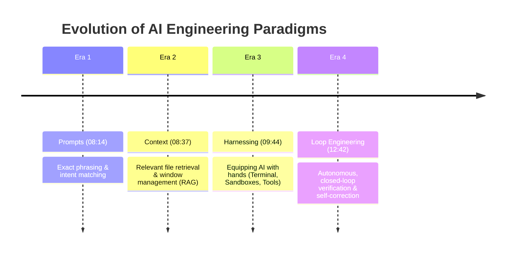
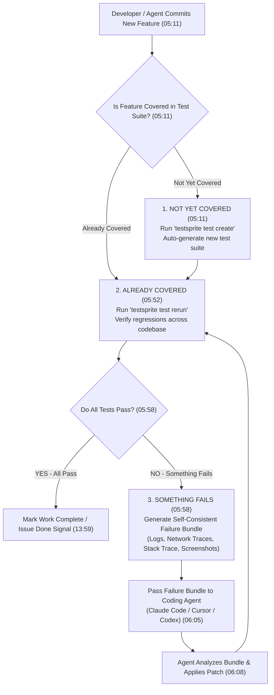
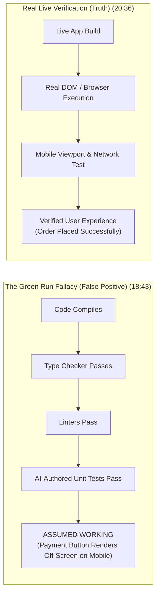
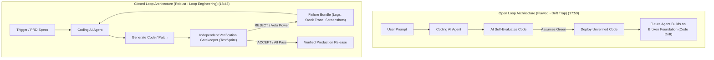
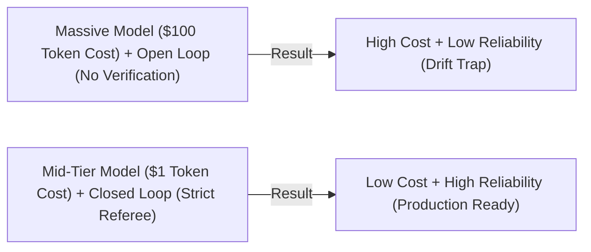

# Detailed Study Notes — What is Loop Engineering in Agentic AI

## Executive Overview

- **Title**: What is loop engineering in Agentic AI
- **Creator / Channel**: Chai aur Code (Hitesh Choudhary)
- **Watch Link**: [YouTube Video](https://www.youtube.com/watch?v=6WyrQUXfh1Y)
- **Primary Source / Tool**: [TestSprite Platform & CLI](https://www.testsprite.com/?via=chai)
- **Creator Resources**: [GitHub](https://github.com/hiteshchoudhary) | [FreeAPI Open-Source](https://freeapi.app)
- **Published Date**: 2026-07-25
- **Ingestion Date**: 2026-07-28
- **Topic**: Loop Engineering, Agentic AI, Harnessing vs Looping, AI Engineering Eras, Test-Driven Verification, TestSprite CLI, Agent Economics.

### High-Level Summary

This document provides an exhaustive, production-grade synthesis of **Loop Engineering** in Agentic AI. It traces the four historical paradigms of AI engineering (Prompts, Context, Harnessing, and Loops), explains why equipping AI agents with tools (harnessing) fails without independent qualitative verification, and details the five structural building blocks required to assemble autonomous, closed-loop agent systems. Featuring step-by-step CLI workflows with **TestSprite**, detailed breakdown of failure bundles, economic analysis of mid-tier model loops versus open-loop massive models, and architectural Mermaid diagrams, this note serves as a definitive guide for building autonomous software engineering loops.

---

## Complete Topic Breakdown & Chronological Analysis

### 1. Introduction & Context of AI Engineering Terminology (00:00 - 01:42)

- The rapid progression of AI development constantly yields new operational paradigms:
  - **Prompt Engineering**: Optimizing text input phrases for base language models.
  - **Context Engineering**: Managing information retrieval, vector search, and window boundaries.
  - **Harness Engineering (Scaffolding)**: Equipping models with external tools, sandboxes, and file system access.
  - **Loop Engineering**: Constructing autonomous, self-correcting feedback cycles that run continuously until machine-verifiable completion criteria are satisfied.
- While manual iteration loops (write code → test → fix) were previously performed by human software engineers, loop engineering automates and delegates this cycle directly to AI agents.
- **The Core Law of AI Evolution**:
  > *"Whenever AI gets better at one layer, the hard part moves one level up."* `(07:00)`

---

### 2. The Four Eras of AI Engineering (06:11 - 08:14)

AI engineering has evolved through four distinct architectural eras:



| Era / Layer | Primary Technical Focus | Core Operational Mechanism | Key Bottlenecks & Limitations |
| :--- | :--- | :--- | :--- |
| **Era 1: Prompts** `(08:14)` | Precise wording, syntax, and instructions | Crafting explicit system and user prompts to guide base LLM outputs. | Solved naturally as base models improved at intent recognition across languages. |
| **Era 2: Context** `(08:37)` | File selection, relevance, and vector retrieval | Injecting workspace files, memory stores, and baseline algorithms (`@file` syntax in Cursor/Antigravity). | Over-stuffed context introduces noise. (Analogy: Searching Zepto for bread and receiving 10,000 irrelevant products like PlayStations instead of precise matches). |
| **Era 3: Scaffolding / Harnessing** `(09:44)` | Giving AI "hands" (Tool Access) | Providing CLI tools, terminal execution, file modification capabilities, and sandboxes (e.g., Claude Code, Codex, custom image harnesses). | Lacks qualitative judgment; agents assume generated code works without verifying real end-to-end user experience. |
| **Era 4: Loop Engineering** `(12:42)` | Autonomous closed loops | Constructing automated iteration cycles governed by independent verification and machine-checkable stop conditions. | Requires an external, independent gatekeeper capable of issuing binding failure signals (veto power). |

---

### 3. The 3-Line Operational Core of Loop Engineering (02:08 - 06:11)

The foundational concept of loop engineering is encapsulated in three core operational behaviors derived from the TestSprite open-source CLI engine:



1. **Not Yet Covered (`testsprite test create`)** `(05:11)`: When a new feature or behavior is added to the repository, the testing framework automatically drafts comprehensive test cases for the uncovered logic, preventing silent feature drops or regressions by teammates.
2. **Already Covered (`testsprite test rerun`)** `(05:52)`: Executes all existing test suites across the application (authentication, payment flows, API contracts) to ensure newly added code hasn't broken existing functionality.
3. **Something Fails (`Self-Consistent Failure Bundle`)** `(05:58)`: When a test failure occurs, the harness packages all failure details (console logs, network requests, stack traces, screenshots, and root cause analysis) into a single bundle. The coding agent reads this bundle, modifies the source code, and reruns the suite autonomously until green.

---

### 4. The Manager Requirement & The Green Run Fallacy (09:44 - 12:42)

- **The Judgment Gap**: Harnessing provides tools, but AI models lack native architectural judgment. For instance, in rigid frameworks like Spring Boot or NestJS, incorrect file naming conventions cause silent system failures that standard syntax checks miss.
- **The Green Run Fallacy** `(18:43)`: A false-positive condition where internal code checks pass, giving the illusion of a working feature when the actual user experience is broken.



- **Concrete Example**: An AI agent creates a checkout payment button on an e-commerce platform. The compiler, TypeScript type-checker, and AI-written unit tests all pass with green signals. However, on a real mobile device connected to a Jio/Airtel network, the payment button renders 12 pixels off-screen, rendering checkout impossible for real human users.
- **The Solution**: AI needs an external "Manager" or strict referee that enforces real end-to-end verification rather than self-graded unit tests.

---

### 5. The 5 Structural Building Blocks of an AI Loop (14:44 - 16:54)

To construct a robust, autonomous AI loop, five essential building blocks must be integrated:

| Block | Component Name | Function & Source | Implementation & Technical Requirements |
| :---: | :--- | :--- | :--- |
| **1** | **Trigger** `(14:44)` | Loop Initiation | Cron jobs (e.g., scanning GitHub issues every 6 hours), CI/CD webhooks, or initial CLI execution commands. |
| **2** | **Goal / Stop Condition** `(15:10)` | Halting Criteria (Recursion Base Case) | Machine-checkable, explicit verification criteria derived directly from automated test suites. |
| **3** | **Actual Work** `(15:32)` | Feature Execution | Product Requirement Documents (PRD) and User Stories. The agent plans, writes code, and invokes tools across backend/frontend/database stacks. |
| **4** | **Memory** `(15:54)` | Context Retention | Multi-tiered memory architectures handling short-term conversation context, long-term state, and summarization patterns. |
| **5** | **Verification Gatekeeper** `(16:21)` | Quality Assurance & Veto Power | An independent referee with the binding authority to issue red cards (reject broken code) and trigger automatic re-execution. |

---

### 6. Defining Machine-Checkable Stop Conditions (16:54 - 17:59)

A fundamental failure in agent prompt design is supplying vague, non-verifiable objectives.

- **Vague / Open-Loop Objective (Flawed)** `(16:54)`:
  > *"Make a Swiggy checkout work."*
- **Machine-Checkable Stop Condition (Robust)** `(17:10)`:
  > *"A user can select a biryani item, proceed to checkout, pay via PhonePe UPI using test credentials, reach the order confirmation screen, and confirm the transaction record exists in the database."*
- **The Golden Rule of Stop Conditions**:
  > *"If a machine cannot independently verify your goal, you don't have a loop — just a long conversation with a timer."* `(17:30)`

---

### 7. The Open Loop vs. Closed Loop Architecture (17:59 - 18:43)

- **Open Loop (The Drift Trap)**: The AI coding agent grades its own homework without independent external verification. Unverified code is deployed, and future agent runs build new features on top of a compromised foundation, leading to total code drift and failure.
- **Closed Loop (Loop Engineering)**: An independent referee intercepts the output, subjects it to live application testing, generates failure bundles upon error, and forces the agent to self-correct prior to deployment.



---

### 8. Block 5: Verification Gatekeeper Requirements & Failure Bundles (20:36 - 24:12)

The Verification Gatekeeper is the single block in the loop possessing **Veto Power** (the authority to reject code). It must satisfy four mandatory criteria:

1. **Independent**: Must not be authored or evaluated by the coding AI itself `(21:03)`.
2. **Reality-Tested**: Tested on live application builds and real DOM browser environments, not stubbed mocks `(21:20)`.
3. **Actionable Output (Failure Bundle)**: When tests fail, it must produce a complete diagnostic package containing `(22:05)`:
   - Target browser environment and OS details.
   - Exact execution duration and timestamp breakdown.
   - Full network request/response payloads.
   - Console error stack traces.
   - High-resolution DOM screenshots.
   - Root Cause Analysis (RCA).
4. **Persistent History**: Tracks test run history across builds and acts as a strict referee holding a red card `(22:05)`.

---

### 9. Agent Economics: Smart Referee vs. Big Brain (24:12 - 27:02)

A critical architectural insight of loop engineering centers on model selection and API cost optimization:

- **Benchmark Insight**: Smaller, inexpensive LLMs (e.g., mid-tier Chinese open models, GPT-4o-mini, or $1 models) operating inside a **closed loop** match or exceed the accuracy of massive, expensive frontier models (e.g., Claude Opus, GPT-4o) operating in an **open loop** `(24:29)`.
- **Cost Substitution**: Strict external verification acts as a direct substitute for massive model token expenditure. Instead of spending $20–$100 per automated run on frontier models that lack verification, engineering teams achieve higher reliability at a fraction of the cost by pairing affordable models with a strict testing referee.



- **The Golden Rule of Loop Design**:
  > *"Prompt, context, and harness are becoming commodity infrastructure. Your system leverage lives in how strictly you evaluate output."* `(25:44)`
- **Core Takeaway**:
  > *"Your loop is only as honest as the thing that is allowed to tell it NO."* `(27:02)`

---

### 10. Practical Implementation: TestSprite CLI Command Reference (27:02 - 33:30)

#### Global Installation & Setup

```bash
# Install TestSprite CLI globally
npm install -g testsprite

# Navigate to your project repository
cd /path/to/your/project

# Run one-command setup
testsprite setup
```

#### API Key Configuration

1. Log into the TestSprite web platform.
2. Navigate to **API Keys** -> Select **New API Key**.
3. Provide project identifier (e.g., `DSA Visual`) and generate key.
4. Export key to your environment or AI agent configuration (`CLAUDE_CODE`, `CURSOR`, `ANTIGRAVITY`).

#### Operational CLI Commands

| Command | Action / Behavior | Timestamp Citation |
| :--- | :--- | :--- |
| `testsprite setup` | Initializes TestSprite configuration, project credentials, and privacy policies in the working directory. | `(03:58)` |
| `testsprite doctor` | Executes environment diagnostics (verifies CLI version, Node.js profile, auth token, and API connectivity). | `(30:28)` |
| `testsprite test create` | Scans codebase changes and automatically generates new test suites for uncovered logic. | `(05:11)` |
| `testsprite test rerun` | Re-executes existing test suites across the application to check for regressions. | `(05:52)` |
| `testsprite test failure` | Displays detailed failure bundles, stack traces, and root cause logs for broken tests. | `(04:36)` |

#### Production Blueprint for Developers `(32:06)`

```text
[Step 1: High-Context PRD & User Stories] 
       │
       ▼
[Step 2: Install Test-First Harness (TestSprite CLI)]
       │
       ▼
[Step 3: Launch Autonomous Agent Loop (Plan -> Code -> Test -> Patch)]
       │
       ▼
[Step 4: Continuous Verification until 100% Green Signal]
```

---

## Key Takeaways & Direct Quotes

### Key Takeaways

1. **Loop Engineering Definition**: The paradigm of building autonomous, self-correcting feedback loops around AI coding agents using machine-checkable stop conditions and independent verification gatekeepers.
2. **Harnessing vs. Looping**: Harnessing provides agents with tools (terminal execution, file editing, sandboxes); looping provides agents with automated, binding feedback mechanisms to iterate until verified completion.
3. **The Green Run Fallacy**: Code compilation, passing type-checkers, or green AI-authored unit tests do not guarantee functional user experience; live application testing on real viewports and networks is mandatory.
4. **Agent Economics**: Investing in a strict verification referee delivers superior reliability and lower token expenditure than relying solely on larger, unverified base models.

### Notable Verbatim Quotes

> *"Whenever AI gets better at one layer, the hard part moves one level up."* — Hitesh Choudhary `(07:00)`

> *"If a machine cannot independently verify your goal, you don't have a loop — just a long conversation with a timer."* — Hitesh Choudhary `(17:30)`

> *"Prompt, context, and harness are becoming commodity infrastructure. Your system leverage lives in how strictly you evaluate output."* — Hitesh Choudhary `(25:44)`

> *"Your loop is only as honest as the thing that is allowed to tell it NO."* — Hitesh Choudhary `(27:02)`

---

## Source & Metadata Links

- **Original Raw Capture**: [[01_RAW/CAPTURE/What is loop engineering in Agentic AI 1.md]]
- **Watch Source**: [YouTube - Chai aur Code](https://www.youtube.com/watch?v=6WyrQUXfh1Y)
- **Primary Owner MOC**: [[ai-ml-moc|AI & Machine Learning Map of Content]]
