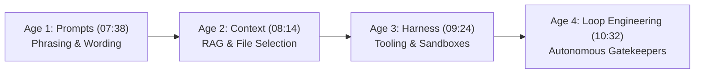
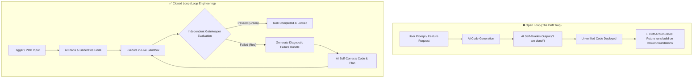

# What is Loop Engineering in Agentic AI

## Executive Summary
This comprehensive study note provides an exhaustive breakdown of **Loop Engineering** in Agentic AI, based on the deep-dive video by [[Chai aur Code]] (Hitesh Choudhary). Loop Engineering represents the 4th major paradigm shift in AI engineering—moving beyond manual prompt engineering, context selection (RAG), and basic tool scaffolding (harnesses) into autonomous, self-correcting execution loops.

The central thesis is that **AI models cannot reliably evaluate or grade their own outputs**. Achieving true software engineering autonomy requires an independent, automated verification mechanism ("Gatekeeper" or "Referee") that executes live application evaluations, detects real-world failures, and feeds structured **Failure Bundles** back to the coding agent to self-correct until all machine-verifiable test criteria pass.

---

## 🎯 Key Takeaways & Core Axioms

- **The Golden Rule of Loop Engineering (27:02)**: *"Your loop is only as honest as the thing that allows it to tell it NO."*
- **The Golden Law of AI Evolution (07:38)**: *"Whenever AI gets better at one layer, the hard part moves one level up."*
- **Shift from Prompts to Autonomous Loops (12:42)**: Stop manually feeding prompts turn-by-turn or pasting UI screenshots. Developers build autonomous loops where the AI writes its own intermediate prompts and executes multi-hour tasks overnight.
- **The Law of Stop Conditions (17:30)**: *"If a machine cannot independently verify your goal, you don't have a loop—just a long conversation with a timer."*
- **The Green Run Fallacy (19:13 - 20:36)**: Linting, type-checkers, and local unit tests passing on paper prove internal code consistency, but do not guarantee working user experience. Verification must evaluate live environments and real user interactions.
- **Smart Referee Beats Big Brain (24:29)**: Smaller, cost-effective AI models operating inside a closed, strictly verified loop consistently match or beat large, expensive frontier models running in unverified open loops.

---

## 🏛️ Deep-Dive: The 4 Evolution Ages of AI Engineering (06:11 - 10:32)

AI software engineering has evolved across four distinct architectural eras. As foundational AI models master one layer, the engineering bottleneck shifts upwards to the system architecture surrounding the AI.



### Detailed Breakdown of the 4 Eras

| Era & Timestamp | Paradigm & Core Focus | Problem Solved | Key Bottleneck / Failure Mode | Real-World Example / Tooling |
| :--- | :--- | :--- | :--- | :--- |
| **Age 1: Prompts**<br/>(07:38 - 08:14) | **Exact Phrasing & Prompt Tuning**: Crafting precise magic words and instructions. | Eliciting basic task comprehension from early LLMs. | Fragile phrasing; prompt tuning became obsolete as models improved at understanding intent. | System prompts, prompt templates, few-shot examples. |
| **Age 2: Context**<br/>(08:14 - 09:24) | **Memory & File Selection**: RAG, vector stores, and context window optimization. | Supplying domain knowledge and project source files. | **Stuffed Context Noise**: Dumped 1M tokens introduce hallucinations and irrelevant clutter (e.g. searching Zepto for bread and seeing PlayStations). | LangChain, LlamaIndex, `@file` mentions in Cursor / Antigravity. |
| **Age 3: Harness**<br/>(09:24 - 10:32) | **Giving AI "Hands" (Scaffolding)**: Tool calling, file manipulation, terminal execution. | Enabling AI to read repositories, create files, and run commands. | **Lack of Judgment**: AI executes commands but cannot verify if the resulting feature actually works for real end users. | Claude Code, OpenAI Codex, Cline, custom execution sandboxes. |
| **Age 4: Loop Engineering**<br/>(10:32 - 14:15) | **Autonomous Evaluation Loops**: Closed-loop execution guided by strict gatekeepers. | Closing the feedback loop for multi-hour autonomous task completion. | Requires independent, non-bypassable verifiers with veto power; high setup discipline needed for PRDs and test suites. | TestSprite CLI, Playwright AI agents, automated test-driven loops. |

---

## 🔄 Closed Loop vs. Open Loop Architecture (17:59 - 19:13)

Without an independent verifier, AI agent pipelines fall into the **Open-Loop Drift Trap**.



### Architectural Comparison Table

| Dimension | Open-Loop Agent Pipeline | Closed-Loop Agent Pipeline (Loop Engineering) |
| :--- | :--- | :--- |
| **Verification Source** | Self-grading (AI inspects its own code). | Independent, automated test harness with veto power. |
| **Failure Detection** | Discovered late by human developers or end users. | Caught instantly in sandbox during execution loop. |
| **Feedback Quality** | Vague text responses ("Try again, it failed"). | Structured **Failure Bundles** (screenshots, traces, logs). |
| **Developer Involvement** | High: Turn-by-turn manual prompting & screenshot pasting. | Zero: Runs autonomously overnight; notifies upon completion. |
| **System Degradation** | High: Compounding architectural drift over time. | Low: Strictly prevents regressions against existing test suites. |

---

## 🧩 The 5 Building Blocks of an AI Loop (14:44 - 20:36)

Every robust Loop Engineering system requires five foundational building blocks:

### 1. Trigger (14:44)
The initiation signal for the loop. Examples include:
- A scheduled **Cron job** (e.g. scanning GitHub repos every 6 hours for open issues).
- A **CI/CD pipeline hook** on pull request submission.
- A single developer **Start Command / PRD file**.

### 2. Goal / Stop Condition (15:10)
The explicit, machine-checkable termination criteria (the recursion base case). 

#### 💡 Vague Wish vs. Senior Machine-Checkable Stop Condition (16:54 - 17:59)

> *"A machine cannot execute a vague wish. Non-technical users ask for a generic feature; senior engineers write machine-verifiable contracts."* (16:54) — Hitesh Choudhary

- ❌ **Vague Wish (Junior / Non-Tech)**: *"Make a Swiggy checkout page work."*
- ✅ **Machine-Checkable Contract (Senior / Loop Engineer)**:
  1. User can browse food items, click `Add Biryani`, and adjust quantities (`+1`, `-1`).
  2. Quantity counter must never drop below `0`.
  3. Clicking `Checkout` navigates to payment screen with test UPI credentials (`PhonePe`).
  4. Backend database creates a pending transaction record.
  5. Upon payment success response, app renders the Order Confirmation screen.
  6. Automated browser agent verifies all elements are rendered inside visible mobile viewport bounds.

### 3. Actual Work (15:32)
The execution engine derived from Product Requirement Documents (PRDs) and User Stories. The AI agent plans implementation steps, writes code, and invokes backend/frontend tools.

### 4. Memory (15:54)
The dynamic context management layer. It handles short-term execution state, long-term codebase indexing, context truncation/summarization policies, and execution run history.

### 5. Gatekeeper / Verifier (20:36)
The single component possessing **Veto Power** (the authority to say NO and reject pull requests). It conducts live evaluations against the stop condition.

---

## 🛡️ Block 5: The Gatekeeper & The 4 Mandatory Traits (20:36 - 22:31)

The Gatekeeper acts as an un-bribable referee. To be effective, it must possess four non-negotiable traits:

| Trait | Technical Requirement | Why It Is Mandatory |
| :--- | :--- | :--- |
| **1. Independent** (21:03) | Test suite must not be generated or evaluated by the active coding AI. | Eliminates self-confirmation bias and grading loop exploits. |
| **2. Contracts vs. Reality** (21:20) | Evaluates live web/app environments on real browser viewports and networks. | Defeats the **Green Run Fallacy** where synthetic mocks pass but live UI breaks. |
| **3. Actionable Outputs** (22:05) | Emits structured diagnostic **Failure Bundles**. | Gives the AI exact debugging data (screenshots, network payloads, tracebacks). |
| **4. Persistent Track Record** (22:05) | Tracks run history and blocks code regressions. | Acts as a strict referee holding a red card against breaking existing features. |

---

## ⚠️ The Green Run Fallacy Explained (19:13 - 20:36)

A major trap in AI-assisted development is relying solely on static analysis or local unit tests:

- **Type-Checkers & Linters**: Prove syntactic and internal code consistency, but tell nothing about functional business logic.
- **AI-Generated Unit Tests**: Prove code behaves according to the AI's own assumptions, which may be fundamentally flawed.
- **The Real-World UI Reality**: 
  > *"An AI coding agent builds a Zomato payment button. The unit test passes because the `<Button>` component mounted successfully in memory. But in reality, CSS styling rendered the button off-screen on a mobile device screen! The unit test is green, but zero users can place an order. That is the Green Run Fallacy."* (19:53 - 20:13) — Hitesh Choudhary

---

## 📦 Failure Bundles & Autonomous Self-Correction (22:31 - 24:12)

When the Gatekeeper rejects an output, it generates a **Failure Bundle**—a comprehensive diagnostic artifact containing:

1. **Visual Evidence**: Viewport screenshots and DOM snapshot diffs.
2. **Network Traces**: HTTP status codes, request/response headers, latency metrics, and API payloads.
3. **Console & System Logs**: Uncaught runtime exceptions, stack traces, and framework warnings.
4. **Environment Metadata**: Browser viewport dimensions (e.g. 375x812 mobile), device type, and network connection profile (Jio/Airtel 4G simulation).

The coding AI ingests this Failure Bundle mid-build, modifies its plan, patches the source code, and re-executes the loop automatically without human intervention.

---

## 💰 Agent Economics: Smart Referee vs. Big Brain (24:12 - 26:03)

- **The Frontier Model Trap**: Relying strictly on massive, highly expensive frontier models (e.g., spending $100s/developer/month on raw reasoning tokens) in an unverified open loop still yields subtle bugs and UI breakages.
- **Closed Loop Leverage**: Empirical benchmarks demonstrate that cost-effective, mid-tier models running inside a tightly verified closed loop consistently match or outperform large unverified models.
- **Corporate Token Cost Reality**: As engineering teams scale AI usage, management will enforce strict token budgets ($5,000+/month bills). Investing in a strict test referee is far more economical than throwing raw model size at unverified workflows.

---

## 🛠️ Practical Implementation with TestSprite CLI (05:11 - 06:11 & 27:19 - 33:27)

TestSprite CLI serves as an operational example of a Gatekeeper harness in Loop Engineering.

### 3 Core Operational Behaviors (05:11 - 06:11)
1. `Not yet covered` (`testsprite test create`): Scans new PRD requirements and automatically creates new test cases for un-covered features.
2. `Already covered` (`testsprite test rerun`): Re-executes the existing test suite to verify no regressions occurred.
3. `Something fails` (`Self-consistent bundle`): Packages failure context into a diagnostic bundle for agent auto-repair.

### CLI Setup & Diagnostic Commands (28:19 - 31:47)

```bash
# 1. Global Installation
npm install -g testsprite-cli

# 2. Environment Diagnostic & Health Check
testsprite doctor

# 3. Interactive Project Setup & API Key Binding
testsprite setup

# 4. Create Tests for New Features (PRD Input)
testsprite test create

# 5. Re-run Full Suite across Agent Execution Loop
testsprite test rerun
```

---

## 📋 Prerequisites for Loop Engineering Mastery (32:06 - 32:55)

To transition from a "Prompt Engineer" to a "Loop Engineer", software developers must establish two foundational pillars:

```text
  ┌───────────────────────────────┐      ┌───────────────────────────────┐
  │     1. High-Detail PRD        │  +   │    2. Automated Test Suite    │
  │  (Unambiguous Specifications) │      │     (Live App Gatekeeper)     │
  └──────────────┬────────────────┘      └──────────────┬────────────────┘
                 │                                      │
                 └──────────────────┬───────────────────┘
                                    │
                                    ▼
                    ┌───────────────────────────────┐
                    │     True Loop Engineering     │
                    │   (Autonomous Overnight Run)  │
                    └───────────────────────────────┘
```

---

## 🔗 Related & Source Links

- **Original Transcript Source**: [[01_RAW/SOURCE/What is loop engineering in Agentic AI.md]]
- **YouTube Video Link**: [Chai aur Code — What is loop engineering in Agentic AI](https://www.youtube.com/watch?v=6WyrQUXfh1Y)
- **Primary Map of Content**: [[03_MOC/ai-ml-moc|🤖 AI & Machine Learning Map of Content]]
- **YouTube Map of Content**: [[03_MOC/yt-moc|📺 YouTube Map of Content]]
