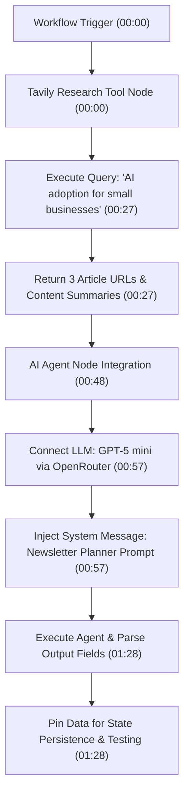

# Detailed Study Notes: Doing These 10 Things Alone Will Change Your Life 1

## Executive Summary & Metadata

- **Video Title**: Doing These 10 Things Alone Will Change Your Life (Short Breakdown)
- **Creator / Presenter**: [[The Inspire Path]]
- **Watch URL**: [YouTube Link](https://www.youtube.com/shorts/0Ujdys4LqNs)
- **Source Artifact**: [[01_RAW/SOURCE/Doing These 10 Things Alone Will Change Your Life 1.md]]
- **Core Subject Matter**: Building an automated AI system for newsletter generation utilizing a visual workflow builder, Tavily web search integration, OpenRouter API provider, GPT-5 mini model, system message prompt engineering, output field parsing, and data pinning.
- **Content Note**: Although the original video title references personal growth habits, the transcript content provides a practical engineering walk-through for automated newsletter research and topic generation.

---

## 1. System Architecture & Workflow Flowchart

The automated AI newsletter creation system processes research queries through a multi-stage workflow pipeline, feeding aggregated search results into an AI agent that extracts creative titles and structured topics.



---

## 2. Step-by-Step Pipeline Breakdown

### Step 1: Automated Research Integration with Tavily (00:00 - 00:47)

- **Trigger Initiation**: The workflow commences when the primary trigger executes (00:00).
- **Tool Selection**: A new tool node is added by selecting `Tavi` (Tavily), an AI-native search and research tool (00:00).
- **Query Configuration**: A static niche/topic search query is defined: `"AI adoption for small businesses"` (00:27).
- **Execution Consistency**: The search query parameter remains static across all automated workflow executions (00:27).
- **Search Output**: Tavily fetches and returns three distinct URLs along with summarized content covering small business AI adoption from the past week (00:27).

### Step 2: AI Agent & LLM Configuration (00:48 - 01:27)

- **Node Creation**: An AI Agent node is dragged directly into the visual workflow workspace (00:48).
- **Model Connection**: OpenRouter is selected as the LLM provider, specifically linking the `GPT-5 mini` model (00:57).
- **System Message Configuration**: The system prompt field is opened in full-screen expression view for clean formatting (00:57).
- **System Prompt Specification**:
  ```text
  You are an expert newsletter planner. You will receive three articles from the past week. 
  Your job is to come up with a creative and fun title as well as the main topics for the newsletter.
  ```
- **Execution & Field Parsing**: Running the agent evaluates the three articles against the prompt and outputs separate structured fields (titles and main topics) that can be individually dragged into downstream workflow steps (01:28).

### Step 3: Workflow State Management & Data Pinning (01:28 - 01:38)

- **Data Pinning**: Output data is explicitly pinned within the workflow environment (01:28).
- **Operational Benefit**: Pinning data prevents the need to re-run the LLM agent during subsequent testing or when modifying downstream workflow steps, saving API tokens and execution latency (01:28).
- **Full Walkthrough Call to Action**: The speaker notes that viewers can click the video play button for the complete full breakdown (01:28).

---

## 3. Configuration & Component Matrix

| Pipeline Stage | Component / Node | Model / Tool | Configuration / Query Details | Citation |
| :--- | :--- | :--- | :--- | :--- |
| **Research** | Search Tool Node | Tavily (`Tavi`) | Query: `"AI adoption for small businesses"` (Returns 3 article URLs + summaries) | (00:00 - 00:27) |
| **Model Hosting** | API Provider | OpenRouter | Multi-model routing platform connecting LLM to workflow | (00:57) |
| **Core Reasoning** | Chat LLM | `GPT-5 mini` | Selected model for lightweight, fast newsletter planning | (00:57) |
| **Agent Logic** | AI Agent Node | System Message | Prompt: `"You are an expert newsletter planner..."` (Expression mode) | (00:57) |
| **State Persistence** | Workflow Feature | Data Pinning | Pin output fields to prevent agent re-runs during downstream debugging | (01:28) |

---

## 4. Key Takeaways & Direct Quotations

### Core Takeaways
1. **Automated Research Priming**: Using dedicated AI search tools like Tavily allows agent workflows to gather fresh, contextual week-of web content automatically before invoking LLM synthesis (00:27).
2. **Modular Output Field Parsing**: Configuring the AI agent to output distinct fields (e.g. titles vs. main topics) enables flexible drag-and-drop integration with downstream newsletter tools (01:28).
3. **Efficiency via Data Pinning**: Pinning node outputs during workflow setup minimizes unnecessary API calls to language models while iteratively building and testing downstream automation steps (01:28).

### Verbatim Quotations
> *"So, I know that the first step that we want to happen after the trigger goes off is to do some research. So, I'm going to click on this plus and I'm going to type in Tavi, which is the tool that we're going to use for research."* — (00:00)

> *"All I'm saying here is that you are an expert newsletter planner. You will receive three articles from the past week. Your job is to come up with a creative and fun title as well as the main topics for the newsletter."* — (00:57)

> *"I'm also going to pin this data so we don't have to rerun our agent if something goes wrong."* — (01:28)

---

## 5. Glossary of Technical Concepts

- **Tavily (`Tavi`)**: An AI-optimized search API designed for autonomous agents to perform clean, summarized web research without raw HTML noise (00:00).
- **OpenRouter**: An API aggregator and gateway allowing workflow applications to route prompts seamlessly to various LLMs (00:57).
- **GPT-5 mini**: A lightweight, high-speed LLM model tier optimized for fast synthesis and low latency (00:57).
- **AI Agent Node**: A workflow component combining a system prompt, memory/context, and LLM model connection to process structured inputs and generate discrete outputs (00:48).
- **Expression Mode**: A feature in visual workflow builders that expands code/prompt input windows to full screen for multi-line system prompts (00:57).
- **Data Pinning**: Freezing node output payload data in memory so subsequent workflow test runs bypass upstream node execution (01:28).
