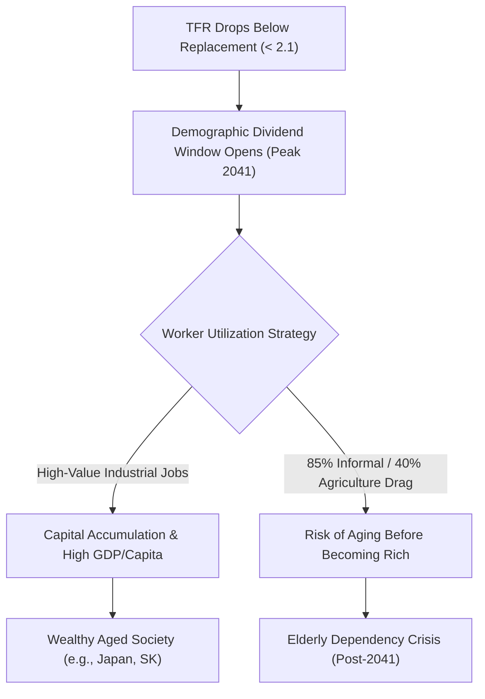

# Detailed Study Notes — Elon's Scariest Prediction: 2041 is India's Final Deadline to Escape Poverty

## 📖 Ingestion Overview
This note represents a comprehensive, high-fidelity distillation of the Think School economic case study titled *"Elon's Scariest Prediction: 2041 is India's Final Deadline to Escape Poverty"* ([YouTube Watch Link](https://www.youtube.com/watch?v=c55Z6OlVzJA)). 

The case study examines Elon Musk's warning regarding global population collapse, analyzes Total Fertility Rate (TFR) dynamics, contrasts India's demographic trajectory against Japan, South Korea, and China, and evaluates the critical 2041 deadline for India's demographic dividend.

---

## 📽️ Section 1: The Global Demographic Trap & Elon Musk's Warning (0:01 - 3:03)

### 1. Elon Musk's Warning on Population Collapse (0:01 - 1:02)
- **Core Statement (0:24)**: In 2022, Elon Musk warned: *"If people don't have more children, civilization is going to crumble. Mark my words. Population collapse is a far bigger threat to civilization than climate change."*
- **Context & Credibility (0:29 - 0:40)**:
  - Skeptics dismissed Musk when he pledged to build mass-market electric vehicles (Tesla) and orbital rockets (SpaceX). His track record of overcoming industrial impossibilities turned public skepticism on birth rates into serious concern.

### 2. The Mechanics of Total Fertility Rate (TFR) (1:02 - 1:50)
- **Definition (1:02)**: Total Fertility Rate (TFR) represents the average number of children born to a woman over her lifetime.
- **The Replacement Threshold (2.1 Rule)**:
  - **TFR >= 2.1**: National population remains stable or grows.
  - **TFR < 2.1**: National population enters mathematically guaranteed contraction.
- **India's Historical Collapse (1:15 - 1:44)**:
  - **1960**: India's TFR stood at **6.0**.
  - **2026**: India's TFR dropped to **1.9**, crashing below replacement level for the first time in Indian history.

### 3. Popular Misconception vs. Economic Reality (1:50 - 3:03)
- **Intuitive Fallacy (1:50 - 2:01)**:
  - Public assumption: With 200M in poverty, 800M on food welfare, and overloaded schools/hospitals, fewer people should automatically mean less poverty and a higher European-style standard of living.
- **Economic Reality (2:01 - 2:38)**:
  - Population decline shrinks the **working-age cohort first** while expanding the **dependent elderly cohort**, creating an unsustainable ratio of non-working consumers to productive tax-paying producers.

---

## 🛡️ Financial Safety & Insurance Interlude (3:03 - 4:35)

### 1. Vulnerability of Indian Middle-Class Families (3:03 - 3:37)
- **97% Financial Collapse Risk**: 97% of Indian middle-class families are one emergency away from financial ruin due to relying only on 6–12 months of savings without term insurance.

---

## 📉 Section 2: Comparative Case Studies — Aging Economies (4:35 - 7:06)

### 1. South Korea: The Rapid Collapse Model (4:35 - 5:08)
- **Current TFR (4:35)**: **0.75** (lowest birth rate in world history).
- **The 3-Generation Collapse Math (4:53 - 5:08)**:
  - 200 parents at TFR 0.75 produce **75 children**.
  - 75 children produce **28 grandchildren**.
  - *Result*: 200 people shrink to under 30 within three generations (an ~86% population crash).

### 2. Japan: Living with Realized Collapse (5:08 - 6:04)
- **Empirical Indicators**:
  - **9 Million Akiya (5:08)**: Empty, uninherited, unsellable homes across Japan.
  - **School Closures**: Thousands of schools closed due to zero enrollment.
  - **Diaper Crossover (5:28)**: In 2024, adult diaper sales officially surpassed baby diaper sales.
  - **Elderly Crime Epidemic (5:35)**: Seniors committing petty crimes specifically to get incarcerated to escape extreme isolation.

### 3. The Timing Paradox: "Getting Old Rich vs. Getting Old Poor" (6:04 - 7:06)
Demographers define an **Aged Society** as one where **14%+ of the population is 65 or older**. Wealth at the moment of transition dictates survival:

| Nation | Year Aged Threshold Crossed | GDP Per Capita at Threshold | Economic Maturity Status |
| :--- | :--- | :--- | :--- |
| **Japan** (6:14) | 1994 | **$39,000 – $40,000** | Got old as a **rich** nation |
| **South Korea** (6:29) | 2018 | **$33,000 – $35,000** | Got old as a **rich** nation |
| **China** (6:38) | ~2021–2024 | **$12,000 – $13,000** | Got old as a **middle-class** nation |
| **India** (6:45) | Approaching (~2040s) | **~$2,700** | Risk of getting old as a **poor** nation |

---

## ⌛ Section 3: The Demographic Dividend Engine & The 2041 Peak (7:06 - 10:22)

### 1. The Demographic Dividend Hump (7:06 - 8:39)
- **Definition (7:06 - 7:29)**: A 30-to-40-year window where worker share (percentage of working-age population 15–64) peaks, minimizing dependency ratios.
- **Historical Dividend Humps**:
  - **Japan (7:50)**: Peaked ~1990 at 70% worker share (propelled Japan to world's #2 economy).
  - **China (7:55)**: Peaked ~2010 at 74% worker share (highest in history; built global manufacturing powerhouse).
  - **South Korea (8:01)**: Peaked ~2015 (built industrial giants Samsung, Hyundai).
  - **India (8:39)**: Currently climbing; **peaks in 2041**.

### 2. The Dividend is a Loan, Not a Gift (9:05 - 10:22)
- **Mechanism**: A 25-year-old with a factory job is a tax-paying saver building national capital. A 25-year-old without a job is a dependent today and a burden tomorrow.
- **China's Dividend Conversion (9:28 - 9:56)**: China systematically moved hundreds of millions into shoe, phone, steel, and solar factories, turning labor into household savings, infrastructure, and a $3T war chest.

---

## ⚠️ Section 4: Structural Weaknesses in India's Economy (10:22 - 12:44)

### 1. Informal Sector & Agriculture Drag (10:22 - 11:11)
- **85% – 90% Informal Labor (10:22)**: No employment contract, pension, or safety net.
- **40%+ Stuck in Farming (10:22)**: Lowest productivity work available.
- **Productivity Ladder (10:48 - 11:11)**:
  - *Farmer*: ~$1,000/year.
  - *Factory Worker*: $2,000 – $4,000/year.
  - *Engineer*: $40,000/year.

### 2. Narrow Tax Base & Low Manufacturing Share (11:11 - 12:44)
- **Narrow Tax Base (11:11)**: Out of 1.4 billion people, only **2.8 crore (28 million)** pay income tax; over 1 billion live under $1,000/year.
- **Manufacturing Share (11:45)**: Manufacturing represents only **12% – 13%** of India's GDP (vs. **25%** in China at the same stage).
- **The Ticking Time Bomb (12:15)**: 600 million young Indians will turn old in 30 years. Without savings or pensions, India faces a demographic disaster of 600 million poor elderly citizens.

---

## 🎯 Section 5: Policy Imperatives & Action Plan Before 2041 (12:44 - 15:00)

### 1. Manufacturing Obsession (12:44 - 13:05)
- IT/services cannot absorb 600M workers. India requires an industrial manufacturing boom like China's in the 1980s/90s.

### 2. Skill Development Over Socio-Political Distractions (13:05 - 13:46)
- Shift focus from identity politics (caste/language) to vocational upskilling and industrial factories.

### 3. Savings & Retirement Architecture (13:46 - 14:15)
- Turn current workers into savers by establishing pension and retirement savings infrastructure before 2041.

---

## 📌 Section 6: Key Takeaways (14:15 - 15:00)

> **"The Demographic Dividend is not destiny; it is a deadline." (14:15)**

---

## 💡 Downstream Atomic Concept Candidates
- [[NODES/total-fertility-rate]]: Total Fertility Rate (TFR) dynamics, replacement thresholds (2.1), and long-term demographic mechanics.
- [[NODES/demographic-dividend-window]]: The 30-to-40-year economic peak window where working-age population relative to dependents is maximized.
- [[NODES/aging-society-threshold]]: The demography standard defining an Aged Society when 14%+ of the population reaches age 65+.
- [[NODES/three-generation-fertility-collapse-math]]: Mathematical acceleration of population contraction under sub-replacement TFR (e.g. 0.75 in South Korea).
- [[NODES/getting-old-rich-vs-getting-old-poor]]: Economic timing paradox contrasting nations crossing aging thresholds at high vs. low per capita wealth.
- [[NODES/informal-labor-economic-drag]]: Economic challenges of an 85–90% informal labor force without pensions or capital accumulation.

---

## 🔗 Related & Source Metadata
- **Source Captured File**: `[[01_RAW/SOURCE/Elon's Scariest Prediction 2041 is India's Final Deadline to Escape Poverty  Economic Case Study.md]]`
- **Primary MOC**: `[[03_MOC/yt-moc|YouTube MOC]]`
