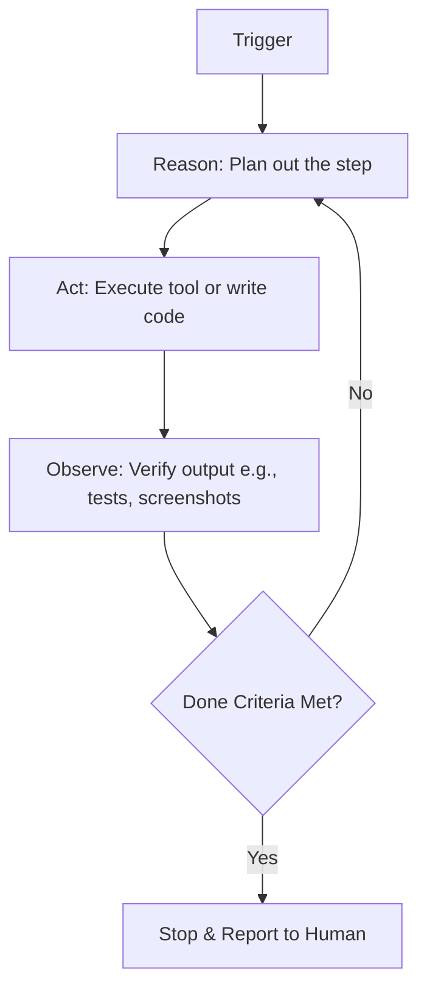

# Exhaustive Study Guide — Finally. Agent Loops Clearly Explained

This knowledge document contains the exhaustive study notes, definitions, concepts, frameworks, and workflows extracted from the video "Finally. Agent Loops Clearly Explained" by Nate Herk.

---

## 1. Core Terminology & Definitions

### Loop Engineering
- **Definition**: The practice of replacing yourself (the human) as the person who prompts the AI agent by designing a system that prompts the agent instead.
- **Key Characteristics**:
  - Treats prompts as recursive goals.
  - Automates feedback and iteration.
  - Employs a trigger, action, and stop condition.

### Agent Loop
- **Definition**: An AI execution architecture that recursively cycles through **Reasoning, Action, Observation, and Repetition** (Reason-Act-Observe-Repeat) until an objective done condition is satisfied.
- **Analogy**: A smart intern that you don't micromanage. You hand them a goal, they figure out what to do, check their own work, and only return to you when they are finished.

### Verification Step
- **Definition**: The observation phase of the loop where the agent reviews the results of its action (e.g. running tests, scoring against a rubric, taking browser screenshots) to objectively determine if the done criteria is met.

### Done Criteria
- **Definition**: The stop condition or exit criteria for an agent loop. It is best structured as an objective, measurable metric (such as "keep iterating until test coverage is 100%") rather than subjective rules ("until satisfied").

---

## 2. Agent Loop Architectures

| Architecture | Description | Use Cases | Pros & Cons |
| :--- | :--- | :--- | :--- |
| **Solo Loop** | A single agent reasoning, acting, observing, and iterating. | Most common tasks, rapid debugging, code generation. | **Pros**: Simplest, lowest latency.  **Cons**: Prone to confirmation bias during verification. |
| **Maker-Checker Loop** | Two agents: one builds the artifact (Maker) and the other grades/evaluates it (Checker). | Code reviews, high-assurance development. | **Pros**: Minimizes confirmation bias.  **Cons**: Higher token consumption. |
| **Manager-Helper Swarm** | A central orchestrator agent managing multiple specialized helper agents. | Complex software systems, multi-step code refactoring. | **Pros**: Highly parallelizable.  **Cons**: Very expensive, high risk of runaway loops. |

---

## 3. The Execution Cycle (Reason-Act-Observe-Repeat)

### Process Breakdown:
1. **Trigger**: Starts the loop (e.g. `CC /goal` command).
2. **Reason**: The agent evaluates the current state and plans the next step.
3. **Act**: The agent performs the planned action (writes file, executes tool, runs test).
4. **Observe**: The agent gathers verification data (screenshot, logs, scores).
5. **Check**: The agent compares the observation against the exit conditions.
6. **Repeat/Stop**: Iterates back to reasoning or outputs the finished product.

---

## 4. Key Heuristics and Best Practices

- **Objective over Subjective**: Convert subjective criteria into objective checkable constraints. Use scoring rubrics, separate grader sub-agents, or compiler/test suite results.
- **Hard Iteration Caps**: Always specify a hard limit on loops (e.g. max 8 passes) to prevent runaway token costs and infinite looping.
- **High-Fidelity verification tools**: Ensure agents have access to appropriate environment tools (Chrome/Puppeteer control, terminal, code environment) to perform actual verification checks.
- **Overnight Runs**: Shoot off large, multi-hour loops before bed so the agent can execute dozens of iterations while the developer sleeps.
- **Quality Calibration**: Agent loops are not meant to produce 100% perfect output on the first try; they are designed to bring the output significantly closer on the first human review.

---

## 5. Case Studies & Demos Covered

1. **Thumbnail Scoring**:
   - **Goal**: Make 10 concepts, score each against Mr. Beast thumbnails on curiosity, contrast, and visual pull.
   - **Loop**: Selected top 3, improved weakest parts, rescored, and iterated on the strongest.
   - **Done Criteria**: Hard cap and subjective iteration. (Critique: Needs separate scorer agent to make the rubric score objective).
2. **Three.js Plane**:
   - **Goal**: Build a 3D rotating plane model using Three.js.
   - **Loop**: Code written -> browser visual check -> console logs evaluated -> iterate.
   - **Verification**: Opened browser page, confirmed proper rendering, checked coordinates.
3. **Abbey Road Recreation**:
   - **Goal**: Recreate the famous Beatles album cover using pure CSS/HTML.
   - **Loop**: Take screenshot of current HTML render -> compare against reference image -> reason differences -> update code -> repeat.
   - **Exit condition**: Average visual similarity score >= 9 or hard cap of 8 passes.

---

## 6. References
- Source Transcript: [[finally-agent-loops-clearly-explained]]
- YouTube Video Link: [Finally. Agent Loops Clearly Explained](https://www.youtube.com/watch?v=EuzYhzB0vbI)
- Associated MOC: [[finally-agent-loops-clearly-explained-moc]]
