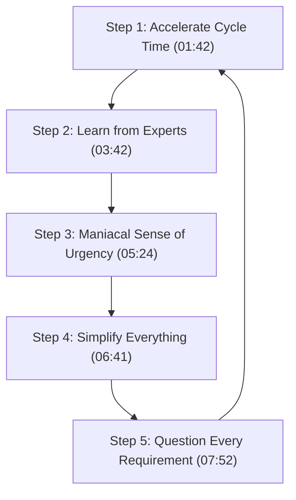

# Detailed Study Notes: How to Learn Anything Faster Than Anyone

## Executive Summary & Metadata

- **Video Title**: how to learn ANYTHING faster than anyone
- **Creator / Channel**: [[GREAT IDEAS GREAT LIFE]] (Hemant Pant)
- **Source Link**: [YouTube Video](https://www.youtube.com/watch?v=yeiFo3vpVAk)
- **Primary Biography Reference**: *Elon Musk* by Walter Isaacson
- **Core Thesis**: Rapid skill acquisition and domain mastery are not products of inherent genius, but of an aggressive 5-step operational framework: rapid failure cycles, expert mentorship, maniacal urgency, ruthless simplification (80/20 rule), and default skepticism toward all requirements.

---

## Key Case Studies: Elon Musk's Rapid Skill Acquisition

### Case Study 1: The Oracle Database Problem (00:00 - 00:35)

- **Context**: 5 of the world's top software engineers were gathered around a computer screen in a room, struggling to solve a critical Oracle database problem. Among them was Max Levchin (PayPal co-founder and Chief Technology Officer).
- **Incident**: Elon Musk walked into the room and asked, *"Hey, what happened? Why are you guys so worried?"*
- **Action**: Max Levchin explained the technical database bug to Elon. Elon casually provided the exact solution on the spot and walked out of the room.
- **Reaction**: The engineers smiled at each other, believing Elon knew nothing about Oracle because he was known strictly as a Windows architecture master.
- **Outcome**: When they actually executed his proposed solution, they looked at each other in disbelief and admitted, *"Oh shit, he's right."*

### Case Study 2: The SpaceX Chief Engineer Disclosure (00:35 - 01:42)

- **Context**: SpaceX's Falcon 1 rocket had failed 3 consecutive launch attempts. The company was on the brink of complete bankruptcy and needed emergency funding for a 4th attempt.
- **Incident**: Elon approached Peter Thiel (PayPal co-founder and venture capitalist) for emergency investment.
- **Dialogue**: Peter Thiel stated, *"Before I invest in SpaceX, I want to talk to SpaceX's Chief Engineer."* Elon replied, *"Yes, you are talking to the Chief Engineer of SpaceX right now."*
- **Reaction**: Thiel initially thought Elon was joking. Years earlier, when co-founding X.com / PayPal, they were building basic internet software, and Thiel knew Elon had no formal aerospace engineering background.
- **Outcome**: Thiel discovered Elon had legitimately assumed the role of Chief Technology Officer / Chief Engineer by devouring aerospace textbooks and interviewing domain experts.
- **Interview Citation** (01:22 - 01:42):
  > **Reporter**: *"How did you get the expertise to be the Chief Technology Officer of a rocket company?"*  
  > **Elon Musk**: *"I read a lot of books and talked to people."*

---

## The 5-Step Accelerated Learning Framework



---

### Step 1: Accelerate Cycle Time (01:42 - 03:42)

#### Core Philosophy
Shorten the feedback loop. Do not fear or avoid failure; instead, fail as rapidly as possible, identify the root cause of the error immediately, and iterate.

#### Military / Traditional Method vs. SpaceX Iterative Approach

| Metric / Aspect | Traditional Military Aerospace Method | SpaceX Accelerated Cycle Method |
|---|---|---|
| **Testing Protocol** | Test raw materials under extreme hot and cold temperatures in isolated chambers for days or weeks before assembling components. | Skip prolonged isolated material testing. Build a prototype engine quickly and place it on a test stand immediately. |
| **Failure Tolerance** | Zero tolerance for public test failures; slow, document-heavy validation cycles. | High tolerance for early test-stand failures to gather real-world empirical data rapidly. |
| **Speed & Learning** | Slow iteration leading to multi-year development delays. | Ultra-fast learning loops derived from real-world testing. |

#### Empirical Case Study: Fuel Tank Lightning & Hammer Repair (02:55 - 03:42)
- **Incident**: Lightning struck a rocket fuel tank overnight, causing the structural metal to buckle and cave inward.
- **Standard Aerospace Proposal**: The lead engineer informed Elon that replacing the entire damaged fuel tank would require several months, forcing a major launch delay.
- **Elon's Alternative Directive**:  
  > *"We are not replacing it. Climb on top of the fuel tank with hammers, hammer out the dent from inside and outside, and weld any hairline cracks."*
- **Execution & Result**: The engineers were astonished by the unorthodox instruction but executed it. When refilled with fuel, the tank held full pressure without leaking. This single decision saved 4 months of delay, allowing SpaceX to launch 4 months ahead of schedule.

---

### Step 2: Learn from Experts (03:42 - 05:24)

#### Core Philosophy
Accelerate domain mastery by devouring foundational literature and extracting practical expertise directly from established specialists.

#### Narrative 1: Russian ICBM Negotiations & Spitting Incident (03:42 - 04:34)
- **Background**: After selling PayPal, Elon checked NASA's official website and discovered no active plans or roadmap for human Mars missions.
- **The Mars Greenhouse Concept**: Elon planned to buy an ICBM rocket from Russia, place a small greenhouse payload containing a plant in growth medium, launch it to Mars, and transmit live video of green life on Mars back to Earth. He believed this would inspire the American public and pressure Congress to increase NASA's budget.
- **Russian Negotiation**: Elon flew to Russia with his team. During the meeting, Elon passionately argued why multi-planetary life was essential for humanity.
- **Rejection**: A Russian official dismissed him: *"We didn't build this rocket for internet millionaires like you to send to Mars. Who is your Chief Engineer?"* Elon replied, *"I am the Chief Engineer."* The Russian official literally spat on Elon, abruptly terminating the meeting.

#### Narrative 2: Flight Home Spreadsheet & Textbook Immersion (04:34 - 05:05)
- **Price Escalation**: In a follow-up meeting, Russians quoted $8 million per rocket. Elon agreed to $18 million for two rockets ($9 million each). The Russian corrected him: *"$18 million for ONE rocket!"* When Elon protested, the Russian mocked, *"Son, you don't have enough money to buy these rockets."*
- **The Flight Epiphany**: Furious, Elon boarded the flight back to America. He sat alone in the front row working continuously on his laptop for hours. Behind him, employees Jim Cantrell and Mike Griffeth wondered what he was working on.
- **The Breakdown**: Elon turned his laptop around and showed them a detailed spreadsheet: *"Guys, look at this. We can build the rocket ourselves, and it will be significantly cheaper than the Russian prices."*
- **Textbook Mastery**: Cantrell was amazed. Elon revealed he had spent the preceding year borrowing and devouring Cantrell's personal rocket science textbooks.

#### Expert Mentorship (05:05 - 05:24)
- Elon hired top domain specialists **Jim Cantrell** and **Tom Mueller**. He utilized them to master rocket dynamics and consulted them prior to making every major technical decision.
- *Broader Pattern*: Every top performer relies on expert mentorship (e.g., Elon Musk was mentored by Oracle founder Larry Ellison, who was mentored by Apple co-founder Steve Jobs).

---

### Step 3: Maniacal Sense of Urgency (05:24 - 06:41)

#### Core Philosophy
Maintain extreme action-orientation. Execution is infinitely more valuable than passive planning or discussion (*"Execution > Idea"*).

#### Case Study: McGregor, Texas Test Site Acquisition (05:24 - 06:41)
- **Discovery**: Elon met a representative from Beal Aerospace (a bankrupt rocket company). An engineer mentioned Beal owned a 26 km testing site near McGregor, Texas with existing test stands and water tanks.
- **Immediate Action**: A SpaceX engineer suggested inspecting the site in a few days. Elon immediately overruled: *"No, right now. We get on the plane right now."*
- **On-Site Inspection**: They flew to Texas immediately and inspected the open facility with the site caretaker.
- **Negotiation Strategy**: Engineer Tom Mueller began praising the facility: *"This is perfect! It has everything!"* Elon quietly pulled Mueller aside: *"Mueller, shut up! You're praising it right in front of the employee—they'll raise the price on us!"*
- **Instant Execution**: While the engineering team planned to coordinate lease negotiations over the coming weeks with corporate management, Elon called the site owner on the spot and signed a 1-year lease for just **$45,000**.

---

### Step 4: Simplify Everything (06:41 - 07:52)

#### Core Philosophy
Ruthlessly eliminate unnecessary steps, components, and process overhead. Apply the Pareto 80/20 Principle.

#### Case Study: Tesla Gigafactory Battery Pin Caps (06:41 - 07:21)
- **Bottleneck**: In 2017 at Tesla's Gigafactory, vehicle production stalled due to battery assembly delays.
- **Investigation**: Elon demanded to know why battery manufacturing was taking so long. Engineers explained that supply ran out of small plastic protective caps used to cover battery pins, halting the assembly line.
- **Questioning**: Elon asked, *"Why are we installing these caps in the first place?"* Engineers answered, *"To prevent the pins from bending or getting damaged during transport."*
- **Elimination**: Elon concluded the caps were non-essential: *"Removing caps won't damage the pins. Delete this step entirely."*
- **Outcome**: The protective cap step was removed. Pins suffered no damage during transport, and Tesla's vehicle manufacturing speed increased significantly.

#### The 80/20 (Pareto) Principle Application (07:21 - 07:52)

```text
100% Total Inputs / Effort
├── 80% Non-Essential / Low-Impact (ELIMINATE)
└── 20% Essential / High-Impact (FOCUS & OPTIMIZE) ──► Produces 80% of Total Results
```

- **Everyday Examples**:
  - 80% of social time is spent with 20% of your friends.
  - 80% of smartphone screen time is spent on 20% of installed applications.
  - 80% of the time you wear 20% of your wardrobe.
- **Actionable Takeaway**: Identify the vital 20% of inputs that drive 80% of results, and aggressively say *"NO"* to the remaining 80% of distraction.

---

### Step 5: Question Every Requirement (07:52 - 09:11)

#### Core Philosophy
Assume by default that every requirement, specification, timeline, or cost estimate is wrong until proven right with rigorous proof.

#### Case Study 1: Industrial Car-Wash Valve Adaptation (07:52 - 08:52)
- **Supplier Quote**: A specialized aerospace supplier quoted **₹1.5 Crore** (~$180,000+ USD equivalent) for a rocket valve.
- **Musk's Breakdown**: Elon inspected the requirement: *"₹1.5 Crore for a simple valve? This looks just like a commercial garage door opener / car-wash valve. Tell the team to build it in-house for ₹1 Lakh ($1,200 USD)."*
- **Implementation**: The engineering team adapted a heavy-duty valve used in commercial car washes, modified its specs, and integrated it into SpaceX rockets.
- **Outcome**: The modified car-wash valve performed reliably at less than **0.67%** of the supplier's quoted cost.

#### Case Study 2: Aluminum Fuel Tank Domes & Vertical Integration (08:52 - 09:11)
- **Extortionate Pricing**: A contractor supplying aluminum fuel tank domes tripled its prices midway through an active contract.
- **In-House Re-engineering**: Elon refused to pay extortion prices and brought aluminum dome manufacturing entirely in-house.
- **Vertical Integration Legacy**: Today, SpaceX is the only aerospace company manufacturing over **70% of its rocket components in-house** (contrasting with NASA, which relies almost entirely on external contractors).

---

## Comprehensive Summary Matrix of the 5 Steps

| Step # | Principle Name | Mindset & Rule | Primary Case Study & Empirical Data | Timestamp Citation |
|---|---|---|---|---|
| **1** | **Accelerate Cycle Time** | Shorten feedback loop; fail fast on test stands; iterate immediately. | Hammering caved-in fuel tank dent vs. 4-month replacement delay. | (01:42 - 03:42) |
| **2** | **Learn from Experts** | Read foundational textbooks; hire and consult domain specialists. | Textbook immersion after Russian spitting incident; hiring Jim Cantrell & Tom Mueller. | (03:42 - 05:24) |
| **3** | **Maniacal Sense of Urgency** | Action over planning; execution > idea; immediate field trips. | On-the-spot flight to McGregor, Texas; leasing test site for $45,000/yr. | (05:24 - 06:41) |
| **4** | **Simplify Everything** | 80/20 Pareto rule; eliminate non-essential steps and parts. | Removing Tesla battery pin plastic caps to unblock vehicle manufacturing. | (06:41 - 07:52) |
| **5** | **Question Every Requirement** | Assume requirements & supplier quotes are wrong until proven necessary. | Adapting ₹1 Lakh car-wash valve to replace ₹1.5 Cr supplier valve; 70%+ in-house manufacturing. | (07:52 - 09:11) |

---

## Notable Quotes & Direct Statements

> *"How did you get the expertise to be the Chief Technology Officer of a rocket company?" — "I read a lot of books and talked to people."* (01:22 - 01:42) — *Elon Musk*

> *"There is only one way to learn anything quickly: don't avoid mistakes, make lots of mistakes, identify them, and fix them quickly."* (02:31) — *Elon Musk*

> *"Execution is greater than an idea."* (09:42) — *Hemant Pant (GIGL)*

---

## Source & Lineage Reference

- **Original Captured File**: [[01_RAW/CAPTURE/how to learn ANYTHING faster than anyone.md]]
- **Video Source**: [YouTube - GREAT IDEAS GREAT LIFE](https://www.youtube.com/watch?v=yeiFo3vpVAk)
- **Primary Source Literature**: *Elon Musk* by Walter Isaacson
