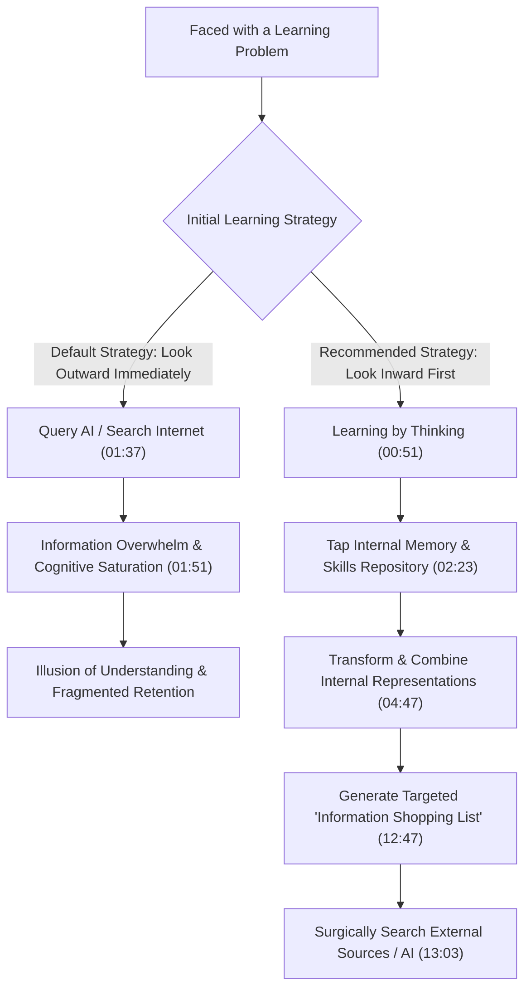
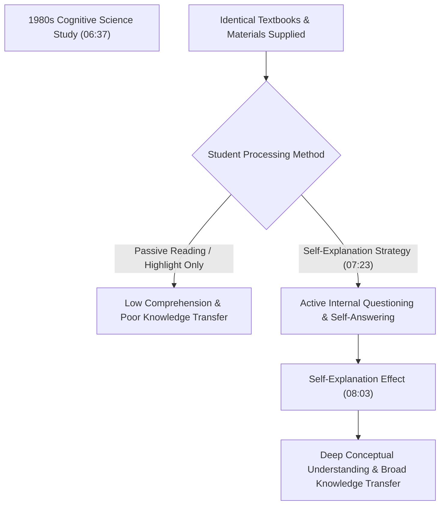
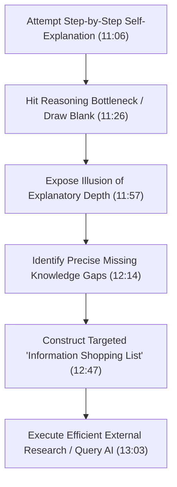

# Detailed Study Notes — How You Can Learn in a World of Information Overload

## Metadata & Executive Overview

- **Title**: How you can learn in a world of information overload
- **Speaker**: Tania Lombrozo (Professor of Psychology & Cognitive Science at Princeton University; Director of the Program in Cognitive Science; Co-lead of the Natural and Artificial Minds Initiative; Author of *Why We Ask Why: The Science of Explanation and the Human Drive to Understand*)
- **Event / Host**: TEDxNewEngland (Independently organized TED event)
- **Channel**: [[TEDx Talks]]
- **Source Link**: [YouTube Video](https://www.youtube.com/watch?v=cbiyPOn-__M&t=772s)
- **Publication Date**: 2026-07-27
- **Ingestion Date**: 2026-07-29

### Executive Summary & Philosophical Thesis

In this TEDx talk, cognitive scientist Tania Lombrozo examines a fundamental paradox of the modern digital age: despite unprecedented access to information via artificial intelligence, search engines, and digital networks, **learning has become more challenging rather than easier**. This difficulty arises because modern learners default to looking *outside* their heads for additional data, which exacerbates cognitive information overwhelm.

Lombrozo asserts that genuine learning does not begin with external information gathering; it begins internally through **"learning by thinking."** Grounded in over 25 years of empirical research at Princeton University, Lombrozo demonstrates that the human mind holds rich, untapped repositories of implicit knowledge stored across visual memories, acoustic sequences, and motor skills. 

By employing cognitive strategies such as **rubber ducking** and **self-explanation**, learners can transform and combine their existing internal knowledge representations into new insights. Crucially, self-explanation shatters the **illusion of explanatory depth**—the false belief that we understand complex mechanisms better than we actually do. Uncovering internal knowledge gaps generates a targeted **"information shopping list,"** equipping learners to navigate information overload, direct external research efficiently, and evaluate AI-generated outputs without falling prey to illusions of understanding.

---

## Comprehensive Glossary & Cognitive Architecture

| Term / Concept | Timestamp | Detailed Definition & Psychological Mechanism | Cognitive Function |
|---|---|---|---|
| **Rubber Ducking** | (00:02) | A software engineering practice where developers explain code line-by-line to an inanimate rubber duck when debugging. | Forces explicit step-by-step externalization of internal logic without receiving external feedback, revealing errors in reasoning. |
| **Learning by Thinking** | (00:51) | The cognitive process of accessing pre-existing internal mental representations (memories, habits, skills) and transforming/combining them to generate new knowledge. | Re-encodes fragmented implicit knowledge into explicit, structured answers without requiring immediate external data retrieval. |
| **Information Overwhelm** | (01:33) | Cognitive saturation resulting from excessive external information inputs (AI, social media, internet search), rendering learning harder by overloading working memory. | Paralyzes effective comprehension when learners seek external data before structuring their internal mental models. |
| **Mental Representation** | (05:02) | The internal cognitive format in which knowledge is encoded (e.g., spatial visual images, auditory song rhythms, kinesthetic muscle maps). | Serves as the raw "ingredients" that can be manipulated, reformatted, and combined to solve new problems. |
| **Self-Explanation Effect** | (08:03) | A robust psychological phenomenon where prompting individuals to construct explanations to themselves significantly improves comprehension, retention, and abstract transfer. | Shifts mental representations from superficial feature-matching (object level) to structural/relational patterns (abstract level). |
| **Relational Matching** | (08:57) | Abstract cognitive reasoning that pairs entities based on higher-order structural similarities ("same relationship") rather than surface-level object attributes. | Represents mature adult reasoning; can be artificially induced in young children through self-explanation prompts. |
| **Illusion of Explanatory Depth** | (11:57) | The cognitive bias wherein people mistakenly believe they understand complex mechanisms (e.g., tornado formation, zipper mechanics) until forced to explain them step-by-step. | Acts as a diagnostic trigger; exposing this illusion reveals exact knowledge gaps and prevents premature closure. |
| **Information Shopping List** | (12:47) | The specific set of precise, targeted questions generated after identifying internal knowledge gaps during self-explanation. | Directs external research and AI queries with surgical precision, eliminating aimless browsing and overwhelm. |

---

## Exhaustive Chronological Breakdown & Narrative Analysis

### 00:00 – 02:30 | Section 1: The Rubber Ducking Phenomenon & Information Overload

#### 1.1 The Software Engineering Practice of "Rubber Ducking" (00:02 – 00:45)
- **Mechanics of Rubber Ducking**: Software engineers encountering broken code or bugs explain their code step-by-step, line-by-line, to a physical rubber duck.
- **The Cognitive Puzzle**: Rubber ducks are inanimate objects that cannot speak back or supply new data. Therefore, the programmer is engaged entirely in self-explanation.
- **Cognitive Paradox**: Despite receiving **zero new external information**, programmers frequently arrive at novel insights and discover bugs simply through the act of explaining.
- **Definition**: Rubber ducking represents a classic real-world demonstration of **learning by thinking**.

#### 1.2 The Paradox of Modern Learning & Information Overwhelm (00:45 – 01:51)
- **Goal of Learning**: Individuals seek to make their minds more effective, informed, and capable.
- **The Modern Environmental Shift**: In the coming years, individuals will have access to an expanding array of tools, AI systems, social media platforms, and digital databases.
- **The Counter-Intuitive Reality**: Access to more information does not automatically facilitate better learning; rather, it often makes learning significantly harder by causing **information overwhelm**.
- **The Core Flaw in Learning Strategy**: Standard learning behavior defaults to looking *outside* the mind for external information at the onset of a problem. This immediate outward search increases cognitive load and exacerbates overwhelm.
- **The Proposed Paradigm**: Learners must shift to **learning by thinking**, commencing the learning process with the information already stored within their own minds.



#### 1.3 The Depth of Internal Mental Repositories (01:51 – 02:30)
- **Scientific Perspective**: Drawing on 25+ years of research as a cognitive scientist, Lombrozo asserts that human minds are far deeper and richer than generally recognized.
- **Internal Knowledge Base**: Human cognition stores vast repositories of knowledge embedded within long-term memories, acoustic traces, spatial maps, and procedural motor skills.
- **Function of Learning by Thinking**: It acts as the key mechanism to unlock and operationalize this latent internal knowledge.

---

### 02:30 – 05:34 | Section 2: Demonstrations of Internal Knowledge & The Baking Analogy

#### 2.1 Three Interactive Cognitive Demonstrations (02:30 – 03:54)
Lombrozo conducts three audience exercises to prove that individuals possess unretrieved knowledge that can be extracted via internal processing:

```text
[Audience Prompt Exercise]
1. "How many windows are along the front of your house or apartment?" (02:42)
2. "What is the fifth letter of the alphabet?" (02:55)
3. "Is the letter Z on the left or the right side of a typical keyboard?" (03:05)
```

#### Detailed Breakdown of Cognitive Mechanisms Tapped:

| Prompt Question | Immediate Recall State | Internal Memory Type Used | Transformation Process Performed |
|---|---|---|---|
| **Front Windows Count** | Not stored as a single pre-computed integer. | **Visual / Spatial Memory** (03:28) | Mentally walking through visual scenes of the home exterior and counting window panes sequentially. |
| **5th Alphabet Letter** | Not stored as an isolated position key-value pair. | **Auditory / Acoustic Memory** (03:34) | Reciting acoustic auditory sequences ("A, B, C, D, E") to locate the item at index position 5. |
| **Keyboard 'Z' Location** | Not stored as a explicit verbal direction rule. | **Motor / Kinesthetic Skills** (03:39) | Simulating motor finger movements on a virtual QWERTY keyboard layout to sense the left-pinky motor execution. |

- **Key Finding**: Participants did not immediately "know" the explicit factual answer, yet possessed all necessary underlying representations to compute the correct answer independently.

#### 2.2 The Culinary Analogy: Baking Chocolate Chip Cookies (03:54 – 04:47)
- **Scenario**: You decide to bake chocolate chip cookies. The recipe explicitly requires **chocolate chips** and **salted butter**, neither of which exists in your pantry.
- **Resource Transformation**:
  - You possess a **bar of chocolate** $\rightarrow$ chop it into chocolate chips.
  - You possess **unsalted butter** and **salt** $\rightarrow$ mix them together to produce salted butter.
- **Principle**: In culinary preparation, we routinely combine and transform existing raw ingredients to create missing required inputs without visiting the grocery store.

#### 2.3 Application of the Transformation Model to Human Learning (04:47 – 05:34)
- **Information Format Transformation**: Mental content is stored in disparate modalities (visual images, acoustic songs, motor movements).
- **Extraction of New Facts**: Prior to the window exercise, the total window count was not stored as a single number. Transforming visual memories into a numerical sum yields genuine **new knowledge**—answering a question previously unanswerable.
- **The Scope Boundary of Thinking**: Lombrozo notes a critical boundary condition: thinking alone cannot invent empirical facts never experienced (e.g., Lombrozo cannot deduce a stranger's window count purely by thinking; she requires external observation).
- **Target Setting**: However, posing the internal question (*"How many windows does X have?"*) defines the exact observation target required when visiting the home.

---

### 05:34 – 08:12 | Section 3: The Self-Explanation Effect & Academic Research

#### 3.1 The Search for Educational Differentiators (05:34 – 06:37)
- **Historical Context**: In the late 1980s, cognitive scientists investigated why student performance varies wildly even when all students are given **identical learning materials** (same textbooks, identical classroom lectures, identical reading passages).
- **Elimination of External Factors**: Because external information inputs were held constant, variance in learning outcomes had to stem from internal cognitive processing—what students did with the information inside their heads.

#### 3.2 Discovery of Self-Explanation Behavior (06:37 – 07:39)
- **Behavioral Identification**: Researchers discovered that top-performing students engaged in systematic **self-explanation** while studying.
- **Internal Dialogue**: As high achievers read text, they continuously asked themselves clarifying questions, attempted detailed answers, reconciled contradictions, and served as their own rubber ducks.
- **Generalization Across Contexts**: Decades of subsequent empirical studies confirmed that self-explanation significantly enhances learning outcomes, conceptual retention, and domain transfer across all age demographics (children to adults).



---

### 08:12 – 10:58 | Section 4: The Relational Matching Experiment in Children (The Duck Task)

Lombrozo presents a landmark experiment from her own cognitive research lab illustrating how self-explanation fundamentally alters how minds represent information.

#### 4.1 Experimental Task Setup
Subjects are presented with a **Reference Card** and asked to select which of two **Choice Cards** best pairs with it:
- **Reference Card**: Contains **2 ducks**
- **Choice Card A**: Contains **2 frogs**
- **Choice Card B**: Contains **1 duck + 1 fox**

```text
[Experimental Card Choices]
  REFERENCE CARD:  [ Duck ] [ Duck ]
                         |
      +------------------+------------------+
      |                                     |
CHOICE CARD A:                       CHOICE CARD B:
[ Frog ] [ Frog ]                    [ Duck ] [ Fox ]
(Relational Match: 2 of Same)        (Feature Match: Contains 1 Duck)
```

#### 4.2 Divergent Adult vs. Child Cognitive Patterns:

| Subject Group | Card Selection | Mental Representation Used | Underlying Cognitive Strategy |
|---|---|---|---|
| **Adults** (08:57) | **Choice Card A** (2 frogs) | **Relational / Structural Representation** | Adults encode cards as *"matching pair goes with matching pair"* (Same with Same), prioritizing relational structure over object identity. |
| **5 & 6-Year-Old Children (Baseline)** (09:34) | **Choice Card B** (1 duck + 1 fox) | **Perceptual / Object-Identity Representation** | Children encode the reference card as *"duck and duck"*, selecting Card B because it shares a surface feature (a duck), despite showing no relational match. |

- **Resilience of Child Pattern**: Children persist in selecting Choice Card B even after being shown numerous adult examples demonstrating that relational matching ("same with same") is the target rule.

#### 4.3 The Experimental Intervention & Transformation (10:09 – 10:58)
- **Intervention Procedure**: Researchers presented 5- and 6-year-old children with examples (e.g., 2 frogs paired with 2 ducks) and prompted half of them to **explain why** those cards belonged together.
- **Control Conditions**: Children were given **no feedback** and **no new external information**.
- **Experimental Outcome**: Children prompted to explain dramatically shifted their behavior. In subsequent trials, they chose Choice Card A (2 frogs), matching cards relationally like adults ("same with same").
- **Scientific Conclusion**: Explaining forced children to transform their internal representation of the data—shifting from surface-level object features to abstract relational structures.

---

### 10:58 – 13:03 | Section 5: Illusion of Explanatory Depth & Information Shopping Lists

#### 5.1 Case Study: Roxana and Tornado Formation (11:06 – 11:40)
- **Background**: Lombrozo's colleague Roxana, who had completed a college course on climate science and natural disasters, was asked by her young son how tornadoes form.
- **Initial Confidence**: Roxana assumed she understood tornado physics well and began describing atmospheric pressure differentials.
- **The Explanatory Breakdown**: Mid-explanation, she drew a complete blank when trying to specify:
  1. *What precise mechanism sets off the funnel formation?*
  2. *How exactly does low atmospheric pressure generate a rotating physical funnel?*
- **Realization**: Roxana realized her functional understanding was virtually zero despite her prior coursework.

#### 5.2 The Illusion of Explanatory Depth (11:46 – 12:03)
- **Psychological Definition**: The widespread cognitive illusion where individuals assume they possess deep, mechanistic understanding of concepts (how zippers work, how tornadoes form, how bicycles steer) until forced to explain them step-by-step.
- **Diagnostic Utility**: The illusion is not a failure; it is an essential diagnostic signal. Attempting explanation forces implicit gaps into explicit awareness.



#### 5.3 Construction of the "Information Shopping List" (12:03 – 13:03)
- **Mechanism**: Transforming existing knowledge into an explanation reveals missing conceptual links.
- **Roxana's Shopping List**: Instead of vaguely researching "tornadoes", Roxana generated a precise query target: *"How does low pressure relate to a tornado's funnel formation?"*
- **Strategic Value**: Creating an information shopping list is the single most effective first step in navigating information overload, converting aimless digital browsing into targeted retrieval.

---

### 13:03 – 15:45 | Section 6: Risks of AI Overload, Cognitive Outsourcing, & Final Directive

#### 6.1 The Temptation of Modern AI Tools (13:03 – 13:38)
- **Emerging Environment**: Artificial intelligence chatbots, automated search summaries, and LLM query engines provide instant external explanations.
- **The Cognitive Temptation**: Learners are increasingly tempted to skip internal thinking and immediately outsource problem-solving to AI-generated answers.

#### 6.2 The Dangers of Cognitive Outsourcing (13:41 – 14:15)
- **Bypassing Mental Transformation**: Turning to AI immediately outsources the critical internal work of transforming and combining knowledge representations.
- **Degradation of Epistemic Boundaries**: Outsourcing impairs a learner's ability to police the boundary between:
  1. *What is genuinely understood inside the head.*
  2. *What is merely accessible on an external screen.*
- **Outcome**: Learners fall prey to severe **illusions of understanding**, mistaking external retrieval for internal mastery.

#### 6.3 Actionable Framework for Modern Learners (14:15 – 15:45)

```text
[ALGORITHMIC LEARNING FRAMEWORK]

Step 1: LOOK INWARD FIRST (15:25)
        Begin every problem by surveying internal memories, skills, and representations.

Step 2: EXPLAIN TO YOURSELF (15:28)
        Engage in self-explanation (be your own rubber duck). Transform existing data into answers.

Step 3: EXPOSE GAPS & BUILD SHOPPING LIST (12:47)
        Identify exact explanatory breakdowns to form targeted research questions.

Step 4: EXECUTE TARGETED EXTERNAL SEARCH / AI (13:03)
        Retrieve external data to fill specific gaps on your shopping list, making sense of new info upon arrival.
```

- **Final Summary Directive**: Learning by thinking does not make learning easy, nor does it eliminate the need for new empirical data. However, it ensures cognitive effort is not wasted, providing a clear path through information overwhelm to genuine insight.
- **Closing Motto**: *"To be a better learner, don't start with the information outside your head. Look inside first. Take a moment to ask yourself questions, to explain to yourself. Be your own rubber duck."* (15:17 – 15:39)

---

## Comparative Analytical Frameworks

### 1. External Search Default vs. Learning by Thinking Model

| Evaluative Dimension | External Search Default (Outward First) | Learning by Thinking Model (Inward First) |
|---|---|---|
| **Initial Action** | Immediately query search engine or AI chatbot. | Survey internal visual, auditory, and motor memories. |
| **Cognitive Load** | High; causes immediate **information overwhelm**. | Structured; builds on existing mental architecture. |
| **Epistemic Boundary** | Blurs difference between screen data and internal knowledge. | Clearly distinguishes known facts from missing knowledge. |
| **Research Efficiency** | Aimless, passive browsing of redundant articles. | Surgical retrieval using a precise **information shopping list**. |
| **Retention & Transfer** | Low; prone to **illusions of understanding**. | High; backed by the **self-explanation effect**. |

---

### 2. Experimental Comparison: Cognitive Matching Strategies

| Feature | Baseline Child Strategy | Adult & Prompted Child Strategy |
|---|---|---|
| **Target Pairing** | Choice Card B (1 duck + 1 fox paired with 2 ducks) | Choice Card A (2 frogs paired with 2 ducks) |
| **Cognitive Encoding** | Feature-based: *"Contains a duck"* (Perceptual match) | Relational-based: *"Same with same"* (Structural match) |
| **Trigger Mechanism** | Default intuitive perception in 5-6 year olds. | Prompting child to **explain why** cards pair together. |
| **External Feedback Given** | None. | **Zero feedback or new information provided.** |
| **Psychological Significance** | Represents raw surface feature recognition. | Demonstrates that self-explanation restructures mental representations. |

---

## Verbatim Quotations & Contextual Significance

1. **On Rubber Ducking & Self-Explanation**:
   > *"Software engineers have a delightful practice called rubber ducking... When they run into a problem with their code, they'll explain it to a rubber duck. They'll work step-by-step, line by line, and some of the time, they'll learn something new... The ducks don't talk back. So, the programmers are explaining to themselves. They're not getting any new information. And yet, something about this process helps them learn."* — **Tania Lombrozo (00:02 – 00:45)**

2. **On Information Overwhelm**:
   > *"In the years ahead, we'll have access to more and more tools and to more and more information through the internet and social media and AI. And more information can make learning harder rather than easier. We run the risk of information overwhelm. Part of the problem is that we tend to approach learning by looking outside of ourselves for more information. But that can just exacerbate the overwhelm."* — **Tania Lombrozo (01:16 – 01:46)**

3. **On Transforming Internal Knowledge**:
   > *"When we're cooking, we often transform and combine the ingredients we have to get the ingredients we need. It's just the same for learning. When we're learning by thinking, we transform and combine the information we already have."* — **Tania Lombrozo (04:38 – 04:56)**

4. **On The Self-Explanation Effect**:
   > *"The scientists found that many of the most successful students had something in common. As they studied, they explained to themselves. They asked themselves questions. And they did their best to offer good replies. They were their own rubber ducks... When children or adults explain to themselves, they tend to learn better and can apply what they learn more broadly than those who don't explain. This is known as the self-explanation effect."* — **Tania Lombrozo (07:16 – 08:06)**

5. **On The Illusion of Explanatory Depth**:
   > *"I suspect that all of us have had an experience like this one... An experience of trying to explain something and realizing in the course of doing so that we understand much less than we thought we did. It's a phenomenon called the illusion of explanatory depth... When we start to transform and combine what we know or what we think we know to craft an explanation, we often uncover gaps that point us to the information we're missing."* — **Tania Lombrozo (11:46 – 12:29)**

6. **On AI Tools & Cognitive Outsourcing**:
   > *"AI-generated responses to our search queries and explanations we can get from chatbots... are incredible tools. But they shouldn't replace learning by thinking. If we don't start with the information we have already, we outsource the process of transforming and combining that information... We become poor at policing the boundaries between what we know inside our heads and what we merely have access to outside them."* — **Tania Lombrozo (13:25 – 14:08)**

7. **On The Final Directive**:
   > *"So to be a better learner, don't start with the information outside your head. Look inside first. Take a moment to ask yourself questions, to explain to yourself. Be your own rubber duck."* — **Tania Lombrozo (15:17 – 15:39)**

---

## Source & Metadata References

- **Source File Path**: `[[01_RAW/SOURCE/How you can learn in a world of information overload  Tania Lombrozo  TEDxNewEngland.md]]`
- **Canonical YouTube URL**: https://www.youtube.com/watch?v=cbiyPOn-__M&t=772s
- **Primary Research Book Reference**: Tania Lombrozo, *Why We Ask Why: The Science of Explanation and the Human Drive to Understand*
- **Academic Institutions**: Princeton University (Department of Psychology, Program in Cognitive Science, Natural and Artificial Minds Initiative)
