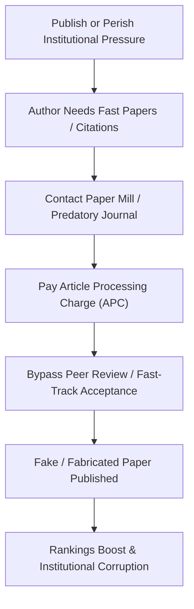

# Detailed Study Notes — I Read 126 Research Papers To Expose A Billion Dollar Fraud

## 📖 Ingestion Overview
This is an exhaustive, highly granular chronological distillation of the documentary-style transcript investigating the black-market economy of academic research. The guide covers corporate study manipulation, paper mills, predatory open-access publishing models, and the policy structures that drive research misconduct.

---

## 📽️ Video Introduction (0:06 - 1:25)
- **The Observation**: The phrase *"research shows"* or *"scientists say"* is widely used in media and advertising to validate claims (e.g., from cancer therapies to bizarre lifestyle advice).
- **The Question**: How many of these research papers can actually be trusted, and who regulates the credibility of the research itself?
- **The Stakes**: Scientific fraud shapes consumer purchases, public beliefs, and patient medical guidelines.

---

## 🥛 Case Study: The "Clinically Proven" Horlicks Trial (1:25 - 3:26)
- **The Advertisement**: Horlicks (a popular malted beverage) claimed to be "clinically proven" to make children *"taller, stronger, and sharper."*
- **The Study Profile**: Cited an National Institute of Nutrition (NIN) study in Hyderabad conducted on **869 school children** over a **14-month supplementation period**.
- **The Investigation**:
  - Independent search for the published paper revealed **no mention of "Horlicks"** in the text.
  - An interview with the former Deputy Director and Head of the Clinical Division at NIN Hyderabad confirmed that the growth observed was primarily due to **milk**, not the micronutrient beverage supplement.
  - The study was funded by **GlaxoSmithKline (GSK)**—the corporate owner of Horlicks at the time.
- **Historical Analogy (Camel Cigarettes)**: A century ago, tobacco companies paid doctors to endorse smoking, leading to the famous campaign: *"More doctors smoke Camels than any other cigarette."*

---

## 🏭 The Paper Mill Industry (3:26 - 12:51)
- **The Concept**: Paper mills are organizations that manufacture completely fabricated research papers (inventing patients, data, and lab photos) and sell authorships to clients.
- **The Whistleblowers**:
  - **Dr. Achal Agrawal**: Founder of *India Research Watch*, dedicated to investigating scientific misconduct.
  - **Dr. Elisabeth Bik**: Prominent science integrity consultant and whistleblower whose work has exposed thousands of fraudulent papers, leading to over **1,200 paper retractions**.
- **Peer Review Exploitation**:
  - Paper mills set up fake Gmail accounts for suggested peer reviewers. These emails redirect back to the author or the paper mill, allowing them to review and approve their own work.
  - **The Template Method**: Mills take a single validated study structure (e.g., testing a compound against colon cancer) and substitute the disease type (e.g., breast cancer, prostate cancer, brain cancer) to mass-produce up to 600 identical, fake papers.

---

## 📞 Verbatim Call with a Paper Mill Representative (12:51 - 17:06)
- **Core Definitions**: "Research writing" is used as a euphemism for full research "implementation" (fabrication).
- **Guaranteed Acceptance**: The representative guarantees 100% acceptance in Q1 or Q2 focus journals due to direct journal collaborations. The Letter of Acceptance (LoA) is sent directly to the editor's email.
- **Financial Breakdown**:
  - **Publication Fee**: 60,000 INR.
  - **Writing/Implementation Charges**: Billed separately.
  - **Payment Terms**: 100% advance payment required upon topic confirmation (no 50% post-publication split accepted).
- **Timeline**: 45 to 60 days from topic selection to publication.
- **Anonymity**: The representative refused to share their name, citing operational security.

---

## 🦖 Predatory Open-Access Publishing (17:06 - 26:28)

- **The Economics of Open Access**:
  - **Closed Access**: Reader/Institution pays (subscription model). Publishing is free for authors.
  - **Open Access**: Free to read. Authors pay an **Article Processing Charge (APC)**, which can run into lakhs of rupees. This aligns journal revenue with publication volume, encouraging predatory behavior.
- **OMICS Publishing Group**:
  - Founded by Srinubabu Gedela, it hosted 700+ journals and 3000+ conferences. Conferences generated ~60% of their revenue.
  - In 2016, the FTC sued OMICS. The US Court ordered OMICS to pay **$50.1 million** in damages.
- **Beall's List**:
  - Created by librarian Jeffrey Beall in 2012 to catalog "predatory publishers."
  - **Exposing the Lack of Review**:
    - A paper consisting entirely of the sentence *"Get me off your mailing list"* repeated 863 times was accepted.
    - A completely gibberish, autotyped abstract on nuclear physics was accepted.
    - A rheumatoid arthritis paper by Jeffrey Curtis was published in an OMICS journal within **two weeks** of submission because the sponsoring company wanted an official citation quickly.
  - **List Removal**: Beall took the list down in 2017 due to a $1 billion lawsuit threat from OMICS and intense administrative pressure from his own university.

---

## 🇮🇳 India's Innovation Metrics and Policy Pressures (26:28 - 30:40)
- **Innovation Rankings**: Under Piyush Goyal (Minister of Commerce & Industry), India rose to 38th on the Global Innovation Index, ranking **3rd in total research volume** behind China and the US.
- **The Structural Incentive**: Indian policies heavily link hiring, promotions, and university ranking metrics to paper volume and citation counts. This "publish or perish" environment forces researchers to buy fake papers to keep their jobs.
- **Retraction Statistics**: Approximately **20% of all fake retracted papers globally** are linked to Indian research publications.
- **The Audit Gap**: Unlike other countries, India lacks a central Research Integrity Office. Investigations are left to the universities themselves, which are disincentivized to report fraud because it lowers their national rankings.
- **Proposed Remedies**:
  - Establish a central, government-backed Research Integrity Office.
  - Provide legal protection and funding for independent science whistleblowers.
  - Transition evaluation metrics from paper counts to long-term quality indicators.
