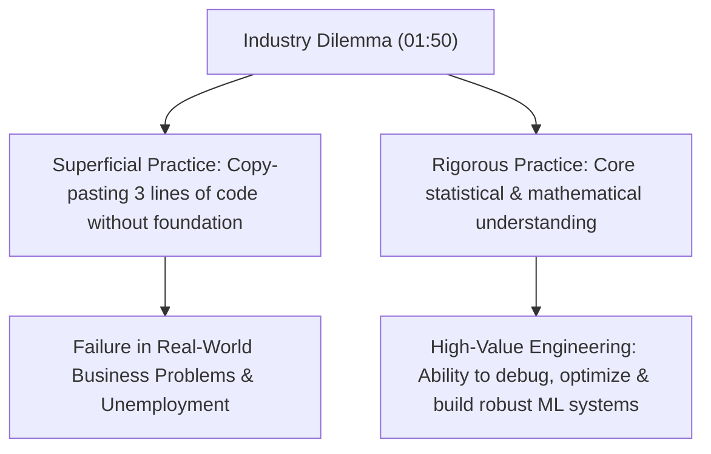
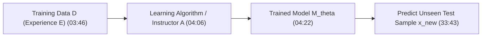
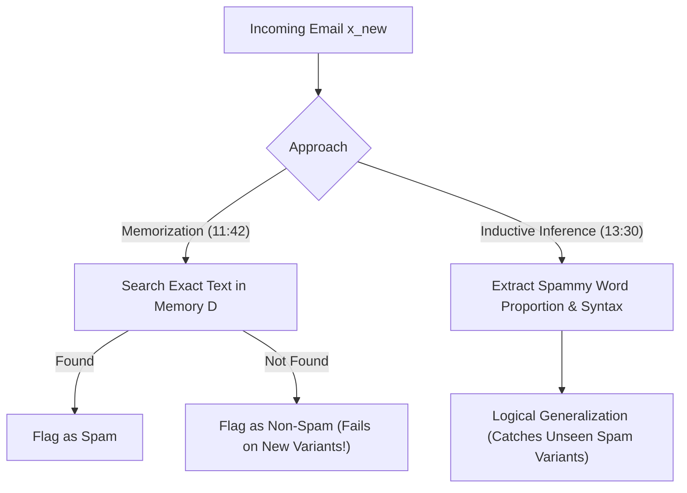
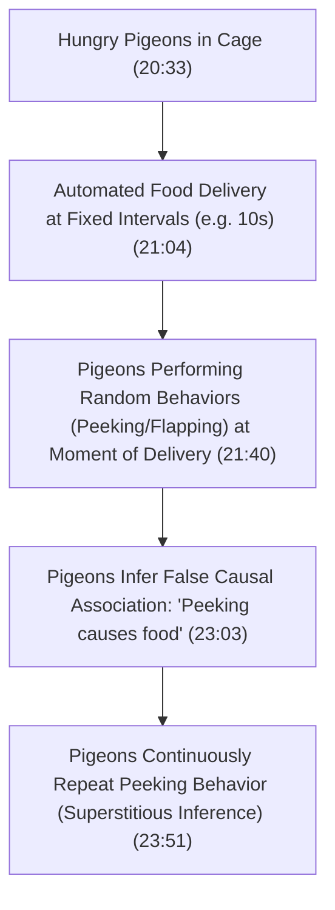

# Learn Core Machine Learning for FREE — Part 01: Foundations & Definitions

> **Source Information**
> - **Course Title**: Learn Core Machine Learning for FREE | Ultimate Course for Beginners
> - **Instructor**: [[Ayush Singh]]
> - **Video Link**: [YouTube Source](https://www.youtube.com/watch?v=0g-XL0WV2xo)
> - **Segment Scope**: `0:00` – `33:00` (Part 1 of 14)
> - **Primary Focus**: Pedagogy Motivation, Learning Black Box Abstraction, Biological Learning Mechanics, Rote Memorization vs. Generalization, Inductive Inference, Pigeon Superstition, Common Sense Filters, and Inductive Bias.

---

## Executive Summary

Part 01 establishes the philosophical, cognitive, and mathematical foundations of Machine Learning. It diagnoses a pervasive industry issue: developers jumping directly into complex deep learning frameworks or running 3 lines of high-level API code without understanding foundational mechanics. Through biological analogies (rats learning to avoid poison), cognitive experiments (Skinner's pigeon superstition), and formal learning theory, this lecture demonstrates why **Inductive Bias** is mathematically indispensable for reliable machine learning generalization.

---

## 1. Pedagogical Motivation & Data Science Reality (0:00 – 2:58)

### 1.1 The Industry Skill Gap
- **The Modern Misconception** `(0:41 - 2:10)`: Rushing into advanced deep neural networks while neglecting core statistical foundations leads to severe career bottlenecks. 
- **Code vs. Thinking**: High-level libraries allow anyone to write three lines of model training code. However, real-world data science engineering requires understanding underlying statistical assumptions to solve complex business problems.

> *"People forget the foundations and basics of data science and jump straight into advanced topics like deep learning. Then they are unable to secure jobs and complain that there are no jobs. In reality, talent is less than the actual job openings because companies won't pay thousands of dollars for writing three lines of API code that anyone can copy."* (01:50) — *Ayush Singh*

---

## 2. Theoretical Abstraction of Learning (2:59 – 10:02)

### 2.1 The Training Black-Box Abstraction
Learning is modeled as a functional transformation from historical experience to an optimized decision algorithm `(3:46 - 4:22)`:

$$\mathcal{D} \xrightarrow{\text{Algorithm } \mathcal{A}} \mathcal{M}_{\theta}$$

Where:

- $\mathcal{D} = \{(x_1, y_1), (x_2, y_2), \dots, (x_m, y_m)\}$ represents training experience drawn from an unknown joint probability distribution $\mathcal{P}(X,Y)$.
- $\mathcal{A}$ represents the learning algorithm (training process).
- $\mathcal{M}_{\theta}$ represents the trained model with learned parameter weights $\theta$.

### 2.2 Biological Paradigms of Learning

- **Rats Avoiding Poisonous Baits** `(4:42 - 6:12)`: When rats consume a novel bait and experience physiological illness, they map taste/smell cues to the negative outcome and refrain from eating that bait in the future. Learning occurs by converting past negative experiences into actionable behavioral decision boundaries.
- **Mentorship & Human Experience** `(6:12 - 7:28)`: Experienced mentors provide superior guidance because they have already navigated failure states, building internal decision heuristics.

### 2.3 Learning Paradigm 1: Rote Memorization ("Ratification")

- **Definition** `(8:09 - 10:02)`: Storing every training instance verbatim in a lookup table.
- **Mathematical Form**:

  $$\mathcal{M}(x) = \begin{cases} y_i & \text{if } x = x_i \in \mathcal{D} \\ \text{Undefined / Fail} & \text{if } x \notin \mathcal{D} \end{cases}$$

- **Failure Mode**: When presented with modified, tweaked, or unseen test points $x_{\text{test}} \notin \mathcal{D}$, memorization fails completely because it lacks abstraction or interpolation capabilities.

---

## 3. Generalization & Inductive Inference (10:03 – 15:44)

### 3.1 Spam Classification Benchmark

### 3.2 Inductive Inference Definition
Inductive inference is the process of generalizing from specific observed training instances $\mathcal{D}$ to broad, unobserved domain rules governing the entire data distribution $\mathcal{P}(X, Y)$ `(13:30 - 15:14)`.

---

## 4. Limits of Unconstrained Generalization: Pigeon Superstition (15:45 – 27:47)

### 4.1 B.F. Skinner's Pigeon Experiment
To demonstrate that unconstrained inductive inference leads to false correlations, the lecture analyzes the **Pigeon Superstition Experiment** `(19:11 - 24:16)`:

### 4.2 Spurious Correlations vs. Crisp ML Principles

- **Core Error**: Food delivery was driven strictly by an independent time clock, completely uncoupled from pigeon actions. The pigeons inferred a causal link from pure coincidence `(24:16 - 25:09)`.
- **Machine Learning Requirement**: Machine learning algorithms lack innate human common sense. Machine learning theory must supply **crisp mathematical principles** (regularization, hypothesis space bounds) to prevent algorithms from learning meaningless noise `(26:23 - 27:48)`.

---

## 5. Inductive Bias: The Mathematical Necessity (27:48 – 32:15)

### 5.1 Why Rats Succeed Where Pigeons Fail

- Rats possess **prior knowledge** (evolutionary genetic traits regarding taste/smell cues for poison) `(28:19 - 29:44)`.
- Pigeons lack prior constraints on food mechanics, leaving them vulnerable to spurious temporal correlation.

### 5.2 Formal Definition of Inductive Bias

- **Inductive Bias** is the set of explicit prior assumptions, structural constraints, and mathematical preferences incorporated into a learning algorithm to favor certain hypothesis functions over others `(29:44 - 30:16)`.
- **No Free Lunch Theorem Connection**: Without an inductive bias, every hypothesis performs identically when averaged across all possible data distributions. Inductive bias is what makes learning possible.

| Algorithm | Inductive Bias / Prior Assumption |
|---|---|
| **Linear Regression** | Assumes target $Y$ is a linear combination of input features $X$. |
| **Nearest Neighbors (KNN)** | Assumes nearby data points in feature space share similar target labels. |
| **Decision Trees** | Assumes feature space can be partitioned via axis-aligned orthogonal splits. |
| **Ridge Regression** | Assumes feature weights should be small and distributed smoothly. |
| **Lasso Regression** | Assumes only a small subset of features are truly relevant (sparsity assumption). |

---

## 6. Formal Definition of Machine Learning (32:16 – 33:00)

> **Definition**: Machine Learning is a subfield of Artificial Intelligence concerned with extracting statistical patterns from data, analyzing underlying distributions, and making accurate predictions on unseen data using learned hypothesis functions `(33:16 - 34:05)`.

---

## Comprehensive Comparative Matrix

| Paradigm | Knowledge Representation | Performance on Training Set | Performance on Unseen Data | Primary Risk |
|---|---|---|---|---|
| **Memorization** `(08:09)` | Exact Lookup Table | $100\%$ | $0\%$ | Overfitting / Zero Generalization |
| **Unconstrained Inference** `(13:30)` | Arbitrary Complex Mapping | $100\%$ | Poor / Unpredictable | Spurious Correlations (Pigeon Superstition) |
| **Inductive Bias Learning** `(29:44)` | Constrained Hypothesis Space $\mathcal{H}$ | High ($\approx 95\%$) | High ($\approx 95\%$) | Underfitting if Bias is Incorrect |

---

## Key Terminology & Glossary

- **Generalization**: The capability of an algorithm to perform accurately on previously unseen inputs sampled from the true data distribution.
- **Inductive Inference**: The process of inferring general universal rules from a finite set of specific observed instances.
- **Inductive Bias**: The set of assumptions a learning algorithm uses to predict outputs for unseen inputs.
- **Spurious Correlation**: An empirical relationship between two variables that appears causal but is driven entirely by coincidence or confounding variables.
