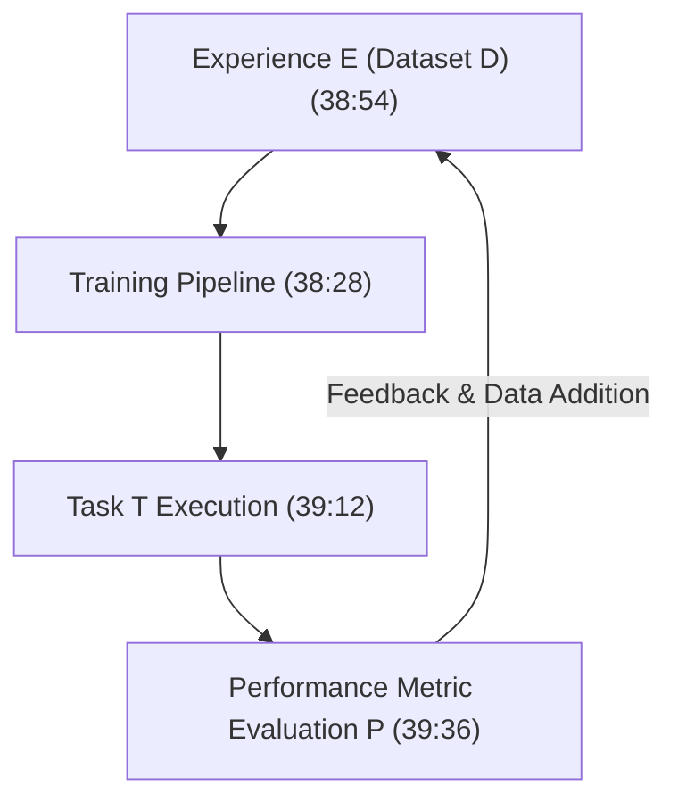
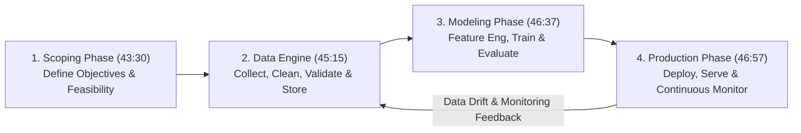
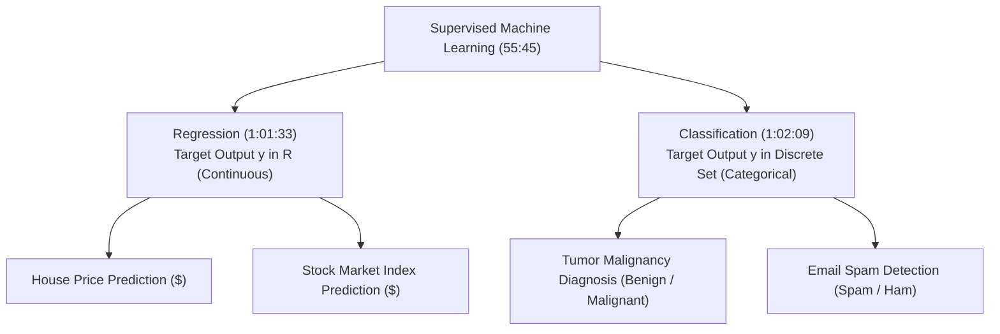

# Learn Core Machine Learning for FREE — Part 02: ML Lifecycle & Learning Types

> **Source Information**
> - **Course Title**: Learn Core Machine Learning for FREE | Ultimate Course for Beginners
> - **Instructor**: [[Ayush Singh]]
> - **Video Link**: [YouTube Source](https://www.youtube.com/watch?v=0g-XL0WV2xo)
> - **Segment Scope**: `33:00` – `1:04:00` (Part 2 of 14)
> - **Primary Focus**: Mitchell's Learning Formalism ($E, T, P$), The 4-Stage MLOps Lifecycle (Scoping, Data Engine, Modeling, Production), Structured vs. Unstructured Data, Supervised vs. Unsupervised Learning, Regression vs. Classification.

---

## Executive Summary

Part 02 transitions from foundational philosophy to system engineering lifecycles and taxonomy. It formalizes Tom Mitchell's classical $E, T, P$ definition of machine learning, presents an enterprise MLOps lifecycle, categorizes datasets into structured tabular versus unstructured formats, and draws clear mathematical boundaries between Supervised Learning (Regression vs. Classification) and Unsupervised Learning.

---

## 1. Tom Mitchell's Learning Formalism (33:00 – 41:05)

### 1.1 Mathematical Definition
A computer program is said to learn from **Experience ($E$)** with respect to some class of **Tasks ($T$)** and **Performance measure ($P$)**, if its performance at tasks in $T$, as measured by $P$, improves with experience $E$ `(38:04 - 39:56)`:

$$P(T, E_{i+1}) > P(T, E_i) \quad \text{where } E_{i+1} = E_i \cup \Delta D$$



### 1.2 Case Study Mappings

| Benchmark Application | Experience ($E$) `(38:54)` | Task ($T$) `(39:12)` | Performance Measure ($P$) `(39:36)` |
|---|---|---|---|
| **Spam Email Classifier** | Dataset of historical spam and ham emails | Classify incoming email $x$ into $\{0: \text{Ham}, 1: \text{Spam}\}$ | Classification Accuracy: $\frac{\text{Correct Predictions}}{\text{Total Emails}}$ |
| **Real Estate Valuation** | Historical database of house sales (size, rooms, location) | Predict continuous dollar market value $\hat{y} \in \mathbb{R}^+$ | Mean Squared Error (MSE): $\frac{1}{m}\sum (y_i - \hat{y}_i)^2$ |
| **Autonomous Vehicle** | Camera feeds & steering angle sensor logs | Predict steering wheel angle $\theta \in [-\pi, \pi]$ | Mean Absolute Error (MAE) relative to expert driver |
| **Credit Card Fraud** | Historical transaction logs & customer profiles | Flag transaction as Fraudulent or Legitimate | Precision-Recall AUC & False Positive Rate |

---

## 2. Enterprise MLOps Lifecycle (41:06 – 48:11)

Building robust machine learning systems follows an iterative 4-stage lifecycle `(42:18 - 47:41)`:



### 2.1 Detailed Stage Breakdown

1. **Scoping Phase** `(43:30 - 44:49)`:
   - Define business problem statement and target SLA/KPI metrics.
   - Resource allocation: compute infrastructure, GPU/CPU scaling, data availability audit, and team roles.

2. **Data Engine Phase** `(45:15 - 46:14)`:
   - Data Ingestion & Provenance Verification: Ensuring data source integrity and compliance.
   - Data Cleaning & Preprocessing: Outlier clipping, missing value median/mode imputation, scaling, and transformation.

3. **Modeling Phase** `(46:37 - 46:56)`:
   - Algorithm Selection & Pattern Extraction: Training baseline and complex models on cleaned features.
   - Hyperparameter Optimization & Cross-Validation Model Selection.

4. **Production & Maintenance Phase** `(46:57 - 47:41)`:
   - Deployment: Containerizing models via Docker / REST microservices for low-latency serving.
   - Continuous Monitoring: Tracking prediction latency, concept drift, and data distribution drift over time.

---

## 3. Data Representation: Structured vs. Unstructured (48:12 – 52:57)

- **Structured Data** `(49:03 - 50:17)`: Data organized in fixed tabular matrices with explicit feature columns $X_1, X_2, \dots, X_p$ and sample rows $i=1 \dots n$.

```
Housing Table Example (Structured Matrix):
+-------------+-------+----------+----------------+---------------+
| Floor Space | Rooms | Lot Size | Housing Type   | Price ($1000) |
+-------------+-------+----------+----------------+---------------+
| 1400 sq ft  | 3     | 5000     | Detached       | 250           |
| 1800 sq ft  | 4     | 6200     | Row House      | 310           |
| 2200 sq ft  | 5     | 7500     | Corner House   | 420           |
+-------------+-------+----------+----------------+---------------+
```

- **Unstructured Data**: Raw sensory logs without predefined tabular schemas (e.g., raw pixel arrays in images, raw audio waveforms, natural language text documents, video streams).

---

## 4. Supervised vs. Unsupervised Learning Taxonomy (52:58 – 1:04:00)

### 4.1 The Mentorship Metaphor
Supervised learning mirrors a student preparing for an examination `(53:46 - 55:24)`:

- **Training Phase**: The student solves exercises containing both **Questions ($X$)** and **Answers/Solutions ($Y$)** under instructor supervision.
- **Exam Phase**: The student answers unseen test questions ($X_{\text{test}}$) without access to solutions.



### 4.2 Comprehensive Mathematical Comparison Matrix

| Dimension | Supervised Regression `(1:01:33)` | Supervised Classification `(1:02:09)` | Unsupervised Learning `(1:03:03)` |
|---|---|---|---|
| **Target Variable ($Y$)** | Continuous numerical ($\mathbb{R}$) | Discrete categorical ($\{0, 1\}$ or $K$ classes) | **None** (No ground truth labels provided) |
| **Primary Goal** | Estimate continuous mapping function $f(X) \rightarrow Y$ | Find decision boundary separating classes | Discover latent cluster structures / density |
| **Primary Algorithms** | Linear Regression, Ridge, Lasso, ElasticNet | Logistic Regression, Decision Trees, SVM | K-Means Clustering, PCA, Autoencoders |
| **Evaluation Metrics** | MSE, MAE, RMSE, $R^2$, Adj $R^2$ | Accuracy, Precision, Recall, F1, ROC-AUC | Silhouette Score, Inertia, Reconstruction Loss |
| **Data Requirements** | Pairs $(x_i, y_i)$ with $y_i \in \mathbb{R}$ | Pairs $(x_i, y_i)$ with $y_i \in \{1 \dots K\}$ | Features $x_i$ only |

---

## Key Terminology & Glossary

- **MLOps**: Operational framework uniting ML model development with automated IT deployment and monitoring.
- **Supervised Learning**: Paradigm where model training is guided by labeled pairs $(X, Y)$.
- **Unsupervised Learning**: Paradigm where algorithms extract patterns from unlabeled features $X$ without target supervision.
- **Continuous Variable**: A quantitative variable capable of taking any infinite real value within a range.
- **Discrete Variable**: A variable restricted to finite countable distinct values.
