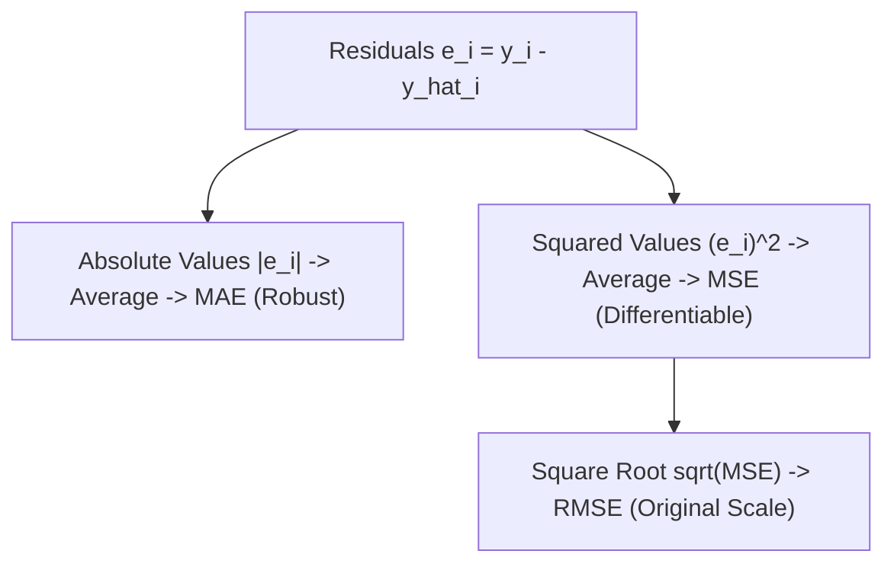
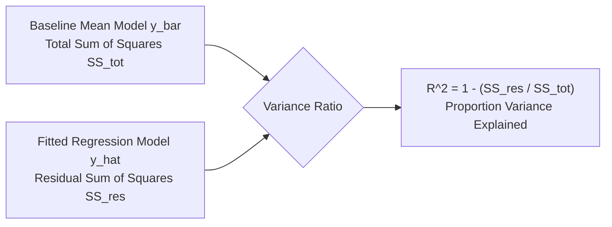
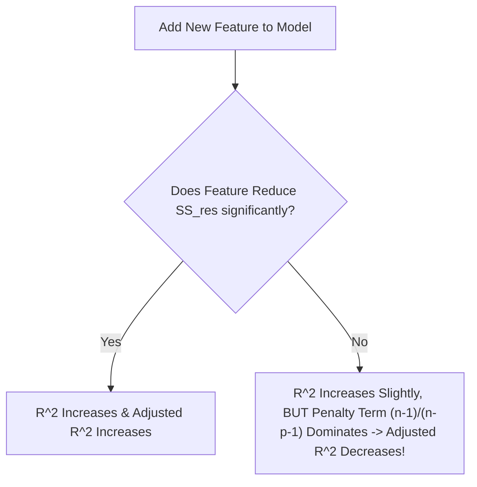

# Learn Core Machine Learning for FREE — Part 05: Regression Evaluation Metrics

> **Source Information**
> - **Course Title**: Learn Core Machine Learning for FREE | Ultimate Course for Beginners
> - **Instructor**: [[Ayush Singh]]
> - **Video Link**: [YouTube Source](https://www.youtube.com/watch?v=0g-XL0WV2xo)
> - **Segment Scope**: `2:15:00` – `2:51:00` (Part 5 of 14)
> - **Primary Focus**: Absolute vs. Squared Error Metrics (MAE, MSE, RMSE), Coefficient of Determination ($R^2$), Total vs. Residual Sum of Squares, The $R^2$ Bloating Flaw, Adjusted $R^2$ Penalty Mechanism.

---

## Executive Summary

Part 05 provides a comprehensive mathematical breakdown of all major regression evaluation metrics. It contrasts absolute versus squared metrics (MAE, MSE, RMSE) and deeply analyzes $R^2$ and Adjusted $R^2$. Crucially, it demonstrates why standard $R^2$ artificially increases when adding irrelevant predictor features and proves how Adjusted $R^2$ penalizes unnecessary model complexity $p$ relative to sample size $n$.

---

## 1. Absolute vs. Squared Error Metrics (2:15:00 – 2:32:00)

### 1.1 Mean Absolute Error (MAE)
MAE measures the average absolute magnitude of residual errors:

$$\text{MAE} = \frac{1}{m} \sum_{i=1}^{m} |y_i - \hat{y}_i|$$

- **Pros**: Robust to extreme outliers; units match the original target $Y$.
- **Cons**: Non-differentiable at $|y_i - \hat{y}_i| = 0$ (sharp V-shape), making it suboptimal for gradient-based solvers.

### 1.2 Mean Squared Error (MSE)
MSE computes the mean of squared residuals:

$$\text{MSE} = \frac{1}{m} \sum_{i=1}^{m} (y_i - \hat{y}_i)^2$$

- **Pros**: Smooth, everywhere-differentiable parabolic function; strongly penalizes large errors.
- **Cons**: Units are squared (e.g., $\text{dollars}^2$), making direct business interpretation difficult.

### 1.3 Root Mean Squared Error (RMSE)
RMSE takes the square root of MSE:

$$\text{RMSE} = \sqrt{\frac{1}{m} \sum_{i=1}^{m} (y_i - \hat{y}_i)^2}$$

- **Pros**: Retains heavy outlier penalties while restoring target scale ($\mathbb{R}$).

---

## 2. Coefficient of Determination ($R^2$ Score) (2:32:01 – 2:42:00)

$R^2$ measures the proportion of variance in target $Y$ explained by features $X$ relative to a naive baseline mean model ($\bar{y}$):

$$R^2 = 1 - \frac{\text{SS}_{\text{res}}}{\text{SS}_{\text{tot}}} = 1 - \frac{\sum_{i=1}^{m} (y_i - \hat{y}_i)^2}{\sum_{i=1}^{m} (y_i - \bar{y})^2}$$

- **Interpretation**:
  - $R^2 = 1.0$: Model explains $100\%$ of target variance ($\text{SS}_{\text{res}} = 0$).
  - $R^2 = 0.0$: Model performs no better than predicting baseline target mean $\bar{y}$.
  - $R^2 < 0.0$: Model performs worse than predicting baseline target mean.

---

## 3. Adjusted $R^2$ Score (2:42:01 – 2:51:00)

### 3.1 The Flaw in Standard $R^2$
Adding **any** feature to a linear model (even pure random noise) will either keep $\text{SS}_{\text{res}}$ constant or decrease it slightly. Thus, standard $R^2$ **never decreases** when features are added, creating false confidence in over-parameterized models.

### 3.2 Adjusted $R^2$ Penalty Formula
Adjusted $R^2$ adjusts for degrees of freedom, penalizing the inclusion of irrelevant predictor features $p$:

$$R^2_{\text{adj}} = 1 - \left[ \frac{(1 - R^2)(n - 1)}{n - p - 1} \right]$$

Where:

- $n$: Total number of samples.
- $p$: Number of independent predictor features.

---

## Comprehensive Metrics Comparison

| Metric | Formula | Target Scale | Outlier Sensitivity | Best Used For |
|---|---|---|---|---|
| **MAE** | $\frac{1}{m}\sum \|y_i - \hat{y}_i\|$ | Same as $Y$ | Low (Robust) | Datasets with acceptable noise/outliers |
| **MSE** | $\frac{1}{m}\sum (y_i - \hat{y}_i)^2$ | $Y^2$ (Squared) | High (Sensitive) | Gradient Descent Optimization Loss |
| **RMSE** | $\sqrt{\text{MSE}}$ | Same as $Y$ | High (Sensitive) | Primary model evaluation benchmark |
| **$R^2$** | $1 - \frac{\text{SS}_{\text{res}}}{\text{SS}_{\text{tot}}}$ | Dimensionless $[-\infty, 1]$ | Medium | Single feature model variance explanation |
| **Adjusted $R^2$** | $1 - \frac{(1-R^2)(n-1)}{n-p-1}$ | Dimensionless $[-\infty, 1]$ | Medium | **Multi-feature model selection & feature pruning** |

---

## Key Terminology & Glossary

- **$R^2$ Score**: Metric representing the proportion of target variance explained by model predictors.
- **Adjusted $R^2$ Score**: Modified $R^2$ version penalizing model complexity $p$ relative to sample size $n$.
- **$\text{SS}_{\text{res}}$**: Sum of Squared Residuals $\sum (y_i - \hat{y}_i)^2$.
- **$\text{SS}_{\text{tot}}$**: Total Sum of Squares $\sum (y_i - \bar{y})^2$.
