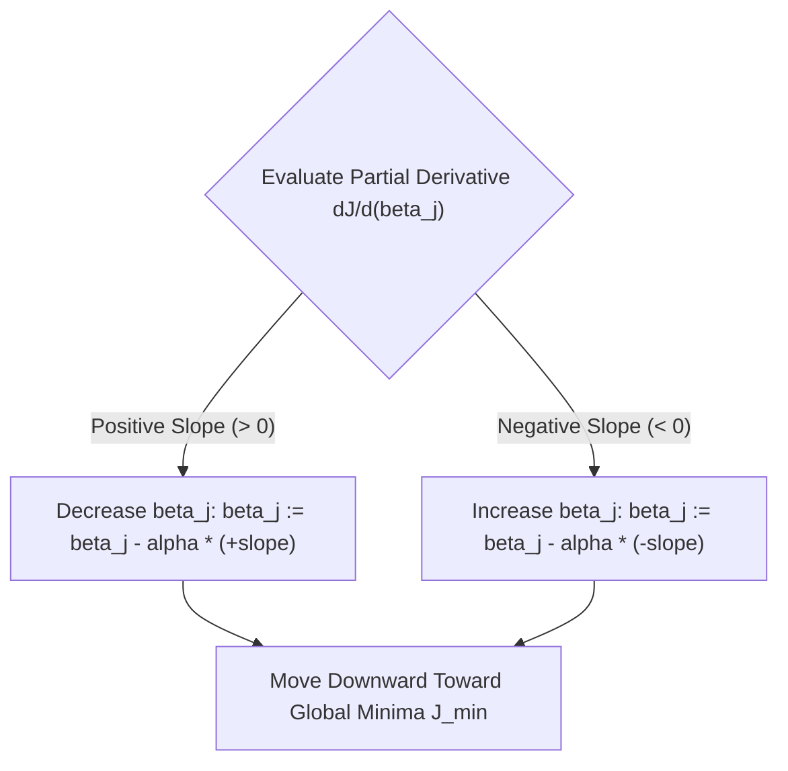
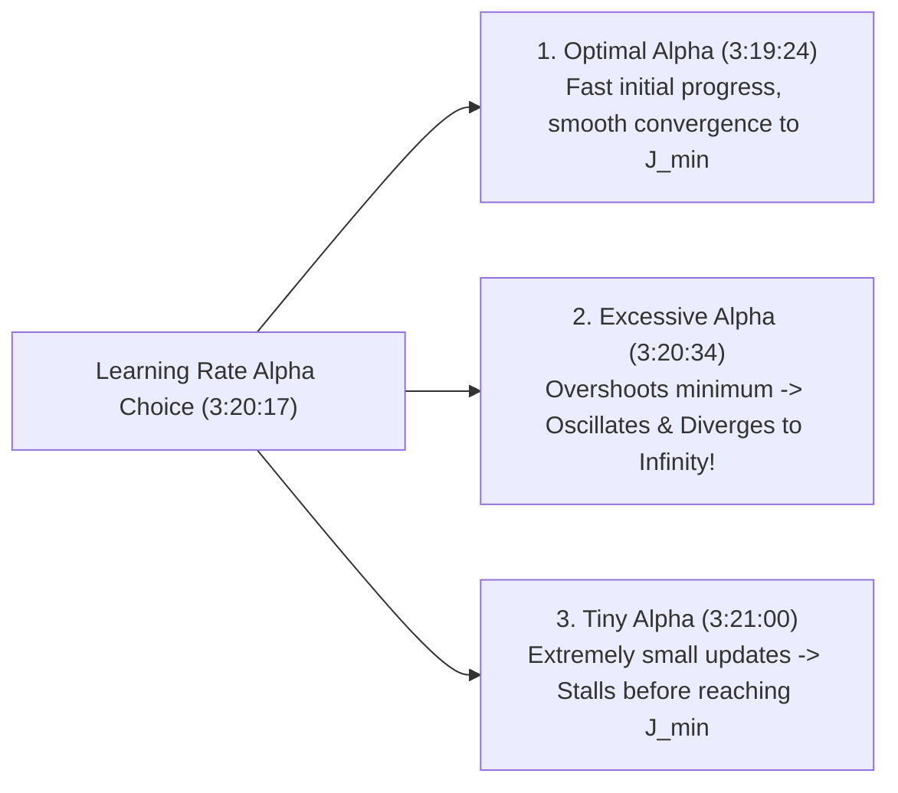

# Learn Core Machine Learning for FREE — Part 06: Gradient Descent Mechanics & Learning Rate Tuning

> **Source Information**
> - **Course Title**: Learn Core Machine Learning for FREE | Ultimate Course for Beginners
> - **Instructor**: [[Ayush Singh]]
> - **Video Link**: [YouTube Source](https://www.youtube.com/watch?v=0g-XL0WV2xo)
> - **Segment Scope**: `2:51:00` – `3:20:00` (Part 6 of 14)
> - **Primary Focus**: Role of Cost Function Derivatives, Slope Sign Directionality, Magnitude Adaptive Steps, Learning Rate $\alpha$ Tuning, Automotive Driving Analogy, Divergence vs. Convergence Mechanics.

---

## Executive Summary

Part 06 explores the mathematical mechanics of Gradient Descent. It details why cost function derivatives are necessary for guiding optimization direction and step sizing, and provides an in-depth analysis of the learning rate hyperparameter $\alpha$. Using an automotive braking analogy, it demonstrates how improper learning rates cause computational stall or catastrophic divergence.

---

## 1. Role of Derivatives in Optimization (2:51:00 – 3:19:23)

### 1.1 Mathematical Information Provided by Derivatives
Computing the partial derivative $\frac{\partial J}{\partial \beta_j}$ provides two vital pieces of optimization information `(3:41:40 - 3:42:46)`:

1. **Direction of Adjustment**:
   - Positive Derivative ($\frac{\partial J}{\partial \beta_j} > 0$): Parameter is on a positive slope. Increasing $\beta_j$ increases cost $J$. Therefore, **decrease** $\beta_j$.
   - Negative Derivative ($\frac{\partial J}{\partial \beta_j} < 0$): Parameter is on a negative slope. Increasing $\beta_j$ decreases cost $J$. Therefore, **increase** $\beta_j$.

2. **Magnitude of Adjustment**: The magnitude of the slope $|\frac{\partial J}{\partial \beta_j}|$ reflects distance from the minimum. Steeper slopes produce larger update steps, while flatter slopes near $J_{\min}$ automatically shrink step sizes `(3:47:01 - 3:47:30)`.

---

## 2. Learning Rate ($\alpha$) Mechanics (3:19:24 – 3:20:59)

### 2.1 The Automotive Braking Analogy `(3:19:46 - 3:20:34)`
Driving a car toward a red stop sign mirrors optimization toward $J_{\min}$:

- **Optimal Driving**: High speed on open highways (large initial steps far from minimum), gradually slowing down as you approach the stop sign (smaller steps near minimum).
- **Excessive Speed ($\alpha$ Excessive)**: Driving at $120 \text{ km/h}$ into a stop sign overshoots the intersection, flips the car, and crashes (divergence).
- **Too Slow ($\alpha$ Tiny)**: Driving at $0.001 \text{ km/h}$ takes days to reach the destination (computational stall).

---

## Learning Rate Impact Comparison

| Hyperparameter Setting | Optimization Trajectory | Computational Cost | Risk / Outcome |
|---|---|---|---|
| **$\alpha$ Optimal** | Smooth monotonic decrease toward $J_{\min}$ | Fast & Minimal Iterations | Efficient Convergence |
| **$\alpha$ Too Large** | Oscillates across valley walls with expanding steps | Infinite / Fails | **Divergence ($\rightarrow \infty$)** |
| **$\alpha$ Too Small** | Microscopic parameter steps per iteration | Extremely Expensive | Timeout / Local Trapping |

---

## Key Terminology & Glossary

- **Gradient Vector ($\nabla J$)**: Vector of all partial derivatives indicating the direction of steepest ascent of cost function $J$.
- **Convergence**: State where iterative updates stabilize near global minimum cost $J_{\min}$.
- **Divergence**: Failure mode where parameter updates overshoot the minimum, causing cost $J$ to increase exponentially.
- **Adaptive Step Sizing**: Natural property of gradient descent where shrinking slopes near the minimum reduce step sizes automatically.
