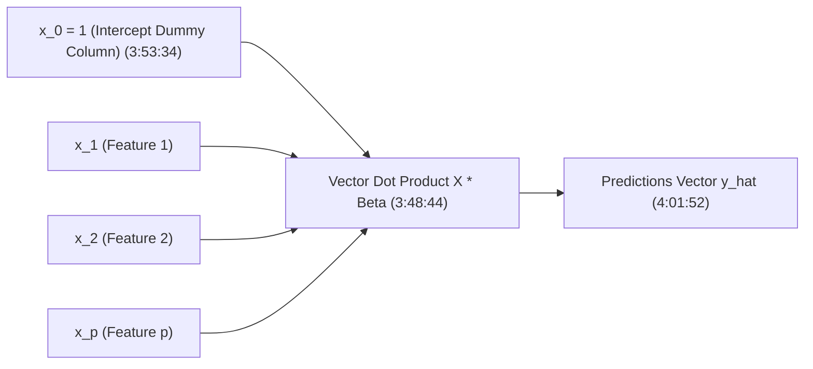
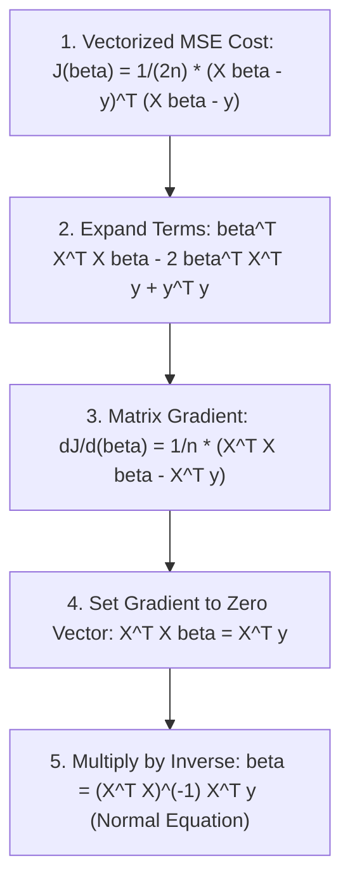

# Learn Core Machine Learning for FREE — Part 08: Multiple Linear Regression & Matrix Algebra

> **Source Information**
> - **Course Title**: Learn Core Machine Learning for FREE | Ultimate Course for Beginners
> - **Instructor**: [[Ayush Singh]]
> - **Video Link**: [YouTube Source](https://www.youtube.com/watch?v=0g-XL0WV2xo)
> - **Segment Scope**: `3:48:00` – `4:20:00` (Part 8 of 14)
> - **Primary Focus**: Multiple Linear Regression (MLR), Design Matrix $X$, Linear Algebra Vectorization, Vectorized Cost Function Derivation, Closed-Form Normal Equation $\beta = (X^T X)^{-1} X^T y$, Normal Equation vs. Gradient Descent Comparison.

---

## Executive Summary

Part 08 extends simple linear regression into **Multiple Linear Regression (MLR)** for $p$ feature variables. It details the linear algebra formulation using the **Design Matrix** $X$, proves why vectorized dot products heavily reduce computational overhead in Python/NumPy, and derives the closed-form analytical solution known as the **Normal Equation**.

---

## 1. Multiple Linear Regression Matrix Formulation (3:48:00 – 3:56:00)

### 1.1 Multi-Feature Hypothesis Equation
When predicting target $Y$ using $p$ independent features $X_1, X_2, \dots, X_p$:

$$\hat{y} = \beta_0 + \beta_1 X_1 + \beta_2 X_2 + \dots + \beta_p X_p$$

### 1.2 Design Matrix $X$ Structure `(3:50:00 - 3:51:49)`
To process $n$ samples across $p$ features simultaneously, we construct the $(n \times (p+1))$ **Design Matrix** $X$ with a leading column of $1$s for intercept $\beta_0$:

$$X = \begin{bmatrix} 
1 & x_{11} & x_{12} & \dots & x_{1p} \\
1 & x_{21} & x_{22} & \dots & x_{2p} \\
\vdots & \vdots & \vdots & \ddots & \vdots \\
1 & x_{n1} & x_{n2} & \dots & x_{np} 
\end{bmatrix}, \quad
\beta = \begin{bmatrix} \beta_0 \\ \beta_1 \\ \vdots \\ \beta_p \end{bmatrix}, \quad
y = \begin{bmatrix} y_1 \\ y_2 \\ \vdots \\ y_n \end{bmatrix}$$

Vectorized hypothesis predictions across all $n$ samples in a single step `(4:01:52)`:

$$\hat{y} = X \beta$$

---

## 2. Vectorized Cost Function & Matrix Derivation (3:56:01 – 4:05:00)

### 2.1 Vectorized Mean Squared Error
Expressed in matrix notation:

$$J(\beta) = \frac{1}{2n} (X\beta - y)^T (X\beta - y)$$

Expanding the matrix multiplication:

$$J(\beta) = \frac{1}{2n} \left( \beta^T X^T X \beta - 2 \beta^T X^T y + y^T y \right)$$

### 2.2 Derivation of the Closed-Form Normal Equation
To find optimal parameters $\beta^*$, compute the matrix gradient $\nabla_\beta J(\beta)$ and set it to the zero vector $\mathbf{0}$:

$$\nabla_\beta J(\beta) = \frac{1}{n} \left( X^T X \beta - X^T y \right) = \mathbf{0}$$

$$X^T X \beta = X^T y$$

Assuming matrix $(X^T X)$ is non-singular ($\det(X^T X) \neq 0$), multiply both sides by inverse $(X^T X)^{-1}$:

$$\beta = (X^T X)^{-1} X^T y$$

---

## 3. Normal Equation vs. Gradient Descent Comparison (4:05:01 – 4:20:00)

| Criterion | Normal Equation ($\beta = (X^T X)^{-1} X^T y$) | Gradient Descent ($\beta := \beta - \alpha \nabla J$) |
|---|---|---|
| **Learning Rate ($\alpha$)** | **No tuning required** | Requires careful tuning |
| **Iterative Loops** | $0$ (Single analytical step) | Requires $k$ iterations |
| **Computational Complexity** | $\mathcal{O}(p^3)$ due to matrix inversion $(X^T X)^{-1}$ | $\mathcal{O}(k \cdot n \cdot p)$ per run |
| **Large $p$ Scalability ($p > 10,000$)** | Extremely slow / Out of Memory | Scales efficiently to large $p$ |
| **Invertibility Requirement** | Fails if $(X^T X)$ is singular / non-invertible | Always functions |

---

## Key Terminology & Glossary

- **Design Matrix ($X$)**: Matrix of shape $n \times (p+1)$ containing all feature observations with a column of ones for intercept.
- **Normal Equation**: Closed-form analytical solution finding optimal parameters $\beta$ in a single matrix inversion step.
- **Non-Singular Matrix**: A square matrix with a non-zero determinant that possesses a valid inverse.
