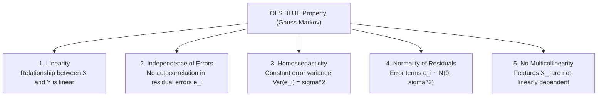
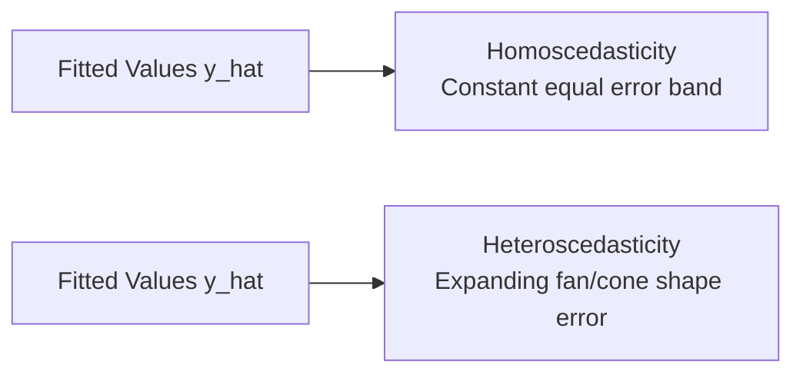

# Learn Core Machine Learning for FREE — Part 09: Assumptions of Linear Regression & Diagnostics

> **Source Information**
> - **Course Title**: Learn Core Machine Learning for FREE | Ultimate Course for Beginners
> - **Instructor**: [[Ayush Singh]]
> - **Video Link**: [YouTube Source](https://www.youtube.com/watch?v=0g-XL0WV2xo)
> - **Segment Scope**: `4:20:00` – `4:51:00` (Part 9 of 14)
> - **Primary Focus**: The 5 Core Gauss-Markov Assumptions of Linear Regression, Homoscedasticity vs. Heteroscedasticity, Multicollinearity, Variance Inflation Factor (VIF), Residual Diagnostics.

---

## Executive Summary

Part 09 presents the statistical foundations and diagnostic requirements for Ordinary Least Squares (OLS) regression under the **Gauss-Markov Theorem**. It covers all five essential assumptions: Linearity, Independence of Errors, Homoscedasticity, Normality of Residuals, and No Severe Multicollinearity. It details residual plots and Variance Inflation Factors ($\text{VIF}$) used to detect and remedy violations in enterprise datasets.

---

## 1. The 5 Core Gauss-Markov Assumptions (4:20:00 – 4:35:00)

### 1. Linearity
- **Assumption**: Target $Y$ is a linear combination of features $X_j$.
- **Diagnostic**: Residuals vs. Fitted Values plot ($\hat{y}$ vs $e$). Curvature indicates non-linearity.

### 2. Independence of Errors (No Autocorrelation)
- **Assumption**: Residual errors $e_i$ and $e_j$ are uncorrelated ($\text{Cov}(e_i, e_j) = 0$).
- **Diagnostic**: **Durbin-Watson Test** statistic $d$:

  $$d = \frac{\sum_{i=2}^{n} (e_i - e_{i-1})^2}{\sum_{i=1}^{n} e_i^2}$$

  - $d \approx 2.0$: Zero autocorrelation (Ideal).
  - $d < 1.5$: Positive autocorrelation.
  - $d > 2.5$: Negative autocorrelation.

### 3. Homoscedasticity vs. Heteroscedasticity
- **Assumption**: Error variance is constant across all predicted values: $\text{Var}(e_i) = \sigma^2$.
- **Violation (Heteroscedasticity)**: Error variance expands or contracts (fan/cone pattern on residual plot).

### 4. Normality of Residual Errors
- **Assumption**: Residual errors follow a normal distribution centered at zero: $e_i \sim \mathcal{N}(0, \sigma^2)$.
- **Diagnostic**: Quantile-Quantile (Q-Q) plot or Shapiro-Wilk statistical test.

---

## 2. Multicollinearity & Variance Inflation Factor (VIF) (4:35:01 – 4:51:00)

### 2.1 Multicollinearity Mechanics
Multicollinearity occurs when two or more predictor features are strongly correlated with each other.
- **Impact**: Causes $(X^T X)$ to become nearly singular ($\det(X^T X) \approx 0$), inflating the standard errors of coefficients $\beta_j$ and making p-values unreliable.

### 2.2 Variance Inflation Factor (VIF) Formula
To measure coefficient variance inflation for feature $X_j$, compute $\text{VIF}_j$:

$$\text{VIF}_j = \frac{1}{1 - R_j^2}$$

Where $R_j^2$ is the $R^2$ score obtained by regressing feature $X_j$ against all other remaining independent features.

| VIF Range | Severity | Recommended Action |
|---|---|---|
| $\text{VIF} = 1.0$ | No correlation | Retain feature as-is |
| $1.0 < \text{VIF} < 5.0$ | Moderate correlation | Acceptable in most applications |
| $\text{VIF} \ge 5.0 - 10.0$ | High multicollinearity | Investigate; consider dropping or combining features |
| $\text{VIF} > 10.0$ | **Severe multicollinearity** | **Must drop feature** or apply Ridge/Lasso regularization |

---

## Key Terminology & Glossary

- **BLUE**: Best Linear Unbiased Estimator property guaranteed by Gauss-Markov assumptions.
- **Homoscedasticity**: Property of equal residual variance across all fitted target values.
- **Heteroscedasticity**: Non-constant residual variance leading to invalid hypothesis tests.
- **VIF**: Metric quantifying coefficient variance inflation due to feature collinearity.
