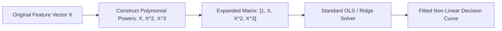
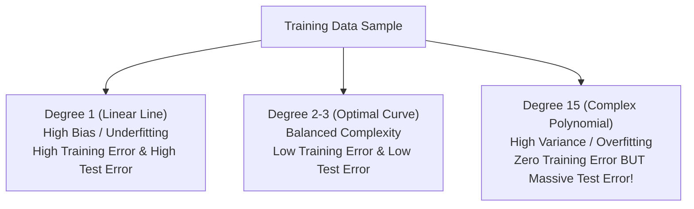
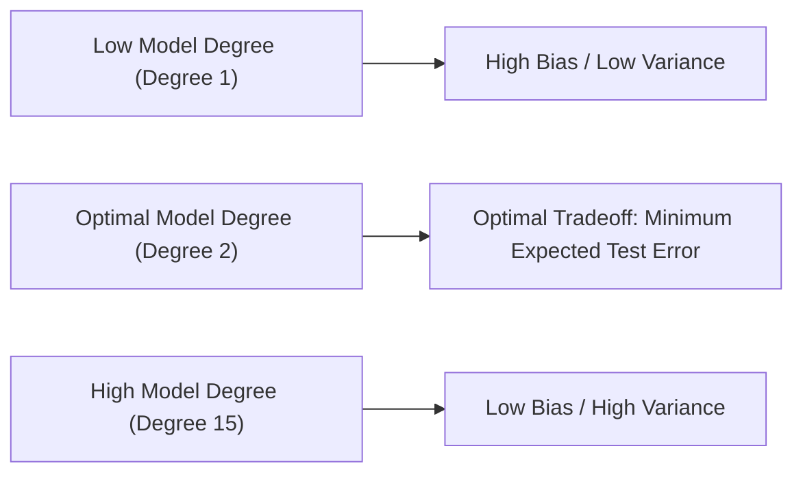

# Learn Core Machine Learning for FREE — Part 10: Polynomial Regression & Bias-Variance Tradeoff

> **Source Information**
> - **Course Title**: Learn Core Machine Learning for FREE | Ultimate Course for Beginners
> - **Instructor**: [[Ayush Singh]]
> - **Video Link**: [YouTube Source](https://www.youtube.com/watch?v=0g-XL0WV2xo)
> - **Segment Scope**: `4:51:00` – `5:40:00` (Part 10 of 14)
> - **Primary Focus**: Polynomial Feature Space Transformations, Non-Linear Relationship Modeling, Underfitting vs. Overfitting Mechanics, Mathematical Decomposition of Bias-Variance Tradeoff.

---

## Executive Summary

Part 10 advances into non-linear relationship modeling using **Polynomial Regression**. It details how linear algorithms model complex curves by transforming feature spaces ($X \rightarrow X, X^2, X^3, \dots$). It establishes the fundamental **Bias-Variance Tradeoff**, contrasting high-bias underfitting with high-variance overfitting, and provides the mathematical error decomposition formula.

---

## 1. Polynomial Feature Transformation (4:51:00 – 5:10:00)

### 1.1 Modeling Non-Linear Relationships
When target $Y$ has a curved non-linear relationship with feature $X$, fitting a straight line results in systemic underfitting. We construct polynomial feature powers of degree $d$:

$$\hat{y} = \beta_0 + \beta_1 X + \beta_2 X^2 + \beta_3 X^3 + \dots + \beta_d X^d$$

Crucially, while the decision curve is non-linear relative to feature $X$, it remains **linear relative to parameters $\beta_j$**. Thus, standard OLS and matrix solvers apply directly!

---

## 2. Underfitting vs. Overfitting Mechanics (5:10:01 – 5:25:00)

| Model Degree | Phenomenon | Training Error | Test Error | Model Diagnosis |
|---|---|---|---|---|
| **Degree 1 (Too Simple)** | Underfitting | High | High | High Bias, Low Variance |
| **Degree 2–3 (Optimal)** | Good Fit | Low | Low | Balanced Bias & Variance |
| **Degree 15 (Too Complex)** | Overfitting | Near Zero ($\approx 0$) | Extremely High ($\rightarrow \infty$) | Low Bias, High Variance |

---

## 3. Mathematical Decomposition of Bias-Variance Tradeoff (5:25:01 – 5:40:00)

Total Expected Error for an unseen test point $x_0$ decomposes into three components:

$$\mathbb{E} \left[ (y_0 - \hat{f}(x_0))^2 \right] = \text{Bias}[\hat{f}(x_0)]^2 + \text{Var}[\hat{f}(x_0)] + \sigma^2$$

Where:

- $\text{Bias}[\hat{f}(x_0)] = \mathbb{E}[\hat{f}(x_0)] - f(x_0)$: Error from simplified assumptions.
- $\text{Var}[\hat{f}(x_0)] = \mathbb{E}\left[ (\hat{f}(x_0) - \mathbb{E}[\hat{f}(x_0)])^2 \right]$: Sensitivity to variations in training set.
- $\sigma^2$: Irreducible noise inherent in true distribution $Y$.

---

## Key Terminology & Glossary

- **Polynomial Regression**: Extended linear model incorporating feature powers to fit curved relationships.
- **Bias**: Error introduced by approximating complex real-world relationships with simplified model forms.
- **Variance**: Amount by which predictions fluctuate across different training set draws.
- **Irreducible Error ($\sigma^2$)**: Noise in target data that cannot be eliminated by any modeling technique.
