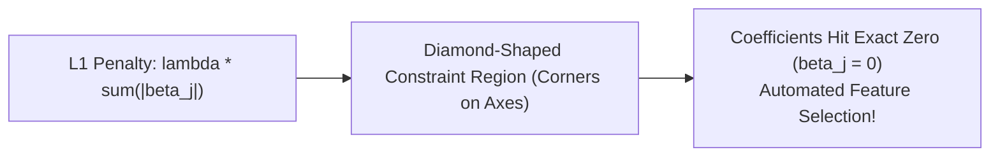

# Learn Core Machine Learning for FREE — Part 11: Regularization Techniques (Ridge, Lasso & ElasticNet)

> **Source Information**
> - **Course Title**: Learn Core Machine Learning for FREE | Ultimate Course for Beginners
> - **Instructor**: [[Ayush Singh]]
> - **Video Link**: [YouTube Source](https://www.youtube.com/watch?v=0g-XL0WV2xo)
> - **Segment Scope**: `5:40:00` – `6:30:00` (Part 11 of 14)
> - **Primary Focus**: Overfitting Mitigation, $L_2$ Regularization (Ridge), $L_1$ Regularization (Lasso & Automated Feature Selection), Geometric Constraint Shapes, ElasticNet Regularization.

---

## Executive Summary

Part 11 introduces **Regularization** techniques to control model complexity and prevent overfitting by incorporating a penalty term $\lambda$ into the MSE cost function. It details $L_2$ Ridge Regression (shrinking coefficients toward zero), $L_1$ Lasso Regression (driving irrelevant coefficients to exact zero for sparse feature selection), and ElasticNet.

---

## 1. Ridge Regression ($L_2$ Regularization) (5:40:00 – 6:00:00)

### 1.1 Objective Function
Ridge regression adds a penalty proportional to the sum of **squared magnitude** of parameters:

$$J_{\text{Ridge}}(\beta) = \frac{1}{2n} \sum_{i=1}^{n} (y_i - \hat{y}_i)^2 + \lambda \sum_{j=1}^{p} \beta_j^2$$

Where $\lambda \ge 0$ is the regularization strength hyperparameter:

- $\lambda = 0$: Standard OLS Regression.
- $\lambda \rightarrow \infty$: All coefficients shrink toward zero ($\beta_j \rightarrow 0$), producing a flat line.

### 1.2 Closed-Form Solution with Ridge
$$\beta_{\text{Ridge}} = (X^T X + \lambda I)^{-1} X^T y$$

Adding $\lambda I$ guarantees matrix $(X^T X + \lambda I)$ is non-singular and invertible, resolving severe multicollinearity!

---

## 2. Lasso Regression ($L_1$ Regularization) (6:00:01 – 6:15:00)

### 2.1 Objective Function
Lasso adds a penalty proportional to the sum of **absolute values** of parameters:

$$J_{\text{Lasso}}(\beta) = \frac{1}{2n} \sum_{i=1}^{n} (y_i - \hat{y}_i)^2 + \lambda \sum_{j=1}^{p} |\beta_j|$$

### 2.2 Feature Selection Property
Unlike Ridge (which shrinks coefficients close to zero but never exactly to zero), Lasso's diamond constraint region forces irrelevant feature coefficients to **exactly zero ($\beta_j = 0$)**, producing sparse models!

---

## 3. ElasticNet Regularization (6:15:01 – 6:30:00)

ElasticNet combines $L_1$ and $L_2$ penalties using a mixing ratio $r \in [0, 1]$:

$$J_{\text{ElasticNet}}(\beta) = \text{MSE} + \lambda \left[ r \sum_{j=1}^{p} |\beta_j| + \frac{1 - r}{2} \sum_{j=1}^{p} \beta_j^2 \right]$$

- $r = 1.0$: Pure Lasso.
- $r = 0.0$: Pure Ridge.
- $0 < r < 1$: Hybrid combination balancing feature selection and group feature stability.

---

## Comprehensive Regularization Comparison Matrix

| Property | OLS Regression | Ridge ($L_2$) | Lasso ($L_1$) | ElasticNet ($L_1 + L_2$) |
|---|---|---|---|---|
| **Penalty Term** | None | $\lambda \sum \beta_j^2$ | $\lambda \sum \|\beta_j\|$ | $\lambda r \sum \|\beta_j\| + \lambda \frac{1-r}{2} \sum \beta_j^2$ |
| **Constraint Shape** | None | Circular / Spherical | Diamond / Polyhedral | Hybrid smooth-cornered |
| **Coefficient Shrinkage** | No | Shrinks toward zero | Shrinks to exact zero | Shrinks to exact zero |
| **Feature Selection** | No | No | **Yes (Sparse Models)** | **Yes (Sparse Models)** |
| **Collinearity Resilience** | Poor | Excellent | Selects one arbitrarily | Excellent (Groups correlated features) |

---

## Key Terminology & Glossary

- **Regularization**: Technique adding a penalty to loss functions to reduce model variance and prevent overfitting.
- **$L_2$ Norm (Euclidean)**: Penalty based on sum of squared weights ($\sum \beta_j^2$).
- **$L_1$ Norm (Manhattan)**: Penalty based on sum of absolute weights ($\sum |\beta_j|$).
- **Sparsity**: Model state where multiple coefficients equal exactly zero.
