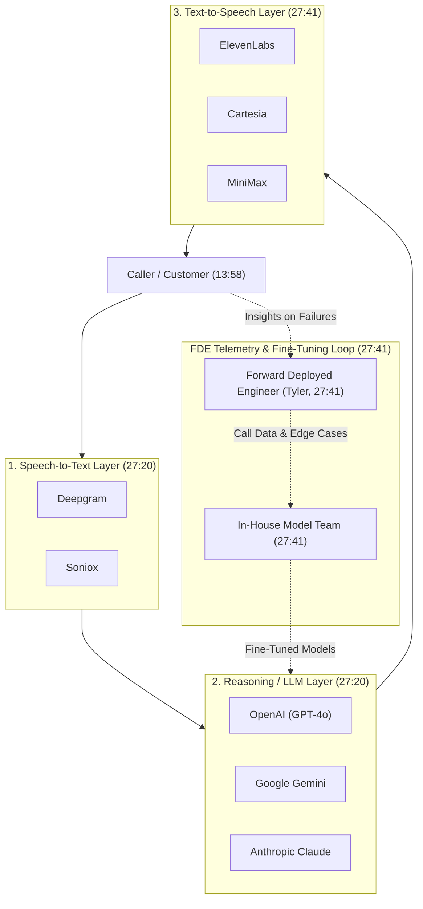

# Detailed Study Notes — Meet Forward Deployed Engineer! (Hottest Job in Silicon Valley)

Executive study guide synthesized from the interview between Harnoor Singh ([[Singh in USA]]) and Tyler D'Silva (Founding Forward Deployed AI Engineer at Retell AI).

---

## 1. Overview & Source Metadata

- **Title**: Meet Forward Deployed Engineer! (Hottest Job in Silicon Valley)
- **Host / Channel**: Harnoor Singh ([[Singh in USA]])
- **Guest**: Tyler D'Silva (Founding Forward Deployed AI Engineer & 2nd full-time hire at Retell AI; ex-Safety Kit)
- **Watch Link**: [YouTube Source](https://www.youtube.com/watch?v=ShBKC675DB4)
- **Published Date**: 2026-07-18
- **Core Domain**: Software Engineering / Forward Deployed Engineering / Voice AI / Applied AI

---

## 2. Chronological Topic Breakdown & Analysis

### 2.1 The Rise of the Forward Deployed Engineer (00:00 - 01:23)
- **Industry Trend**: Major cloud providers including Google Cloud, AWS, and Microsoft are aggressively hiring Forward Deployed Engineers (FDEs).
- **Core Difference from Traditional SE**:
  - Traditional Engineers spend their first few months onboarding to learn internal technologies and then become narrow domain experts.
  - Forward Deployed Engineers encounter new tech stacks, legacy client architectures, and custom workflows with every new deployment.
- **Pay Scale Range**: Base pay ranges from **$150K to $320K+** (reaching up to **$360K base at xAI**), with total compensation packages ranging from **$300K to $800K+**.

### 2.2 Guest Background & Career Path (01:23 - 05:41)
- **Undergraduate Studies**: Systems Design Engineering at the University of Waterloo ("Cali or Bust" culture). Specialized in computing and artificial intelligence.
- **Co-op Experience**: 6 co-op terms spanning Front-end, Back-end, Full-stack, and DevOps to master the full Software Development Life Cycle (SDLC).
- **Graduate Studies**: Master's in Computer Science (Machine Learning & Big Data) at the University of British Columbia (UBC), including a co-op in Computer Vision.
- **First Role Out of College (2024)**: Product Engineer / Trust & Safety AI Automation Engineer at Safety Kit (2nd employee), building marketplace content safety monitoring tools.
- **Pivot to Forward Deployed Engineering**: Inbound recruiter outreach from Retell AI. Completed a 2-day work trial where he had to learn the product stack on the fly, build a custom integration, and deliver a live client demo.

### 2.3 Work Trials & Fast-Paced Startup Onboarding (07:09 - 09:28)
- **Work Trial Dynamics**: 2-day hands-on evaluation. Tyler was pushed directly into client-facing scoping and demo building.
- **Perspective on Unpaid/Free Work Trials**: While controversial on developer forums, Tyler views work trials as vital mutual evaluations for high-velocity startup environments to assess speed of learning, ownership, and client communication skills.

### 2.4 Mechanics & Responsibilities of Forward Deployed Engineering (09:28 - 14:15)
- **Learning How to Learn**: FDEs must master both their own company's product and the client's internal stack (e.g. Java, Microsoft Azure, custom databases).
- **Incremental Value Delivery**: Enterprise AI adoption succeeds by targeting "low-hanging fruit" first rather than attempting overnight end-to-end automation.
- **Low-Hanging Fruit Case Study (Debt Collection)**:
  - *Problem*: Human call center agents spend excessive hours dialing numbers and following repetitive script flows for debt collection.
  - *Solution*: Deploy voice AI agents for payment reminders and identity verification. Clear call flows, high ROI, and immediate operational relief.

### 2.5 Pre-Sales, Post-Sales & Commission Model (14:15 - 17:15)
- **Pre-Sales Responsibilities**:
  - Partnering with sales teams to resolve deep technical architecture questions.
  - Building bespoke proof-of-concept (POC) pilots and custom demos.
  - Scoping required token volume, infrastructure capacity, and scaling requirements.
- **Post-Sales Responsibilities**:
  - End-to-end system integration with client engineering teams.
  - Multi-stakeholder project management and resource creation.
  - Iterative feature expansion after initial POC validation.

### 2.6 Compensation Breakdown & Industry Demand (19:33 - 22:39)
- **Role Multi-Threading**: FDEs operate as Project Manager, Product Manager, System Architect, Builder, and QA Automation Engineer simultaneously.
- **Compensation Structure**:
  - **Base Salary**: $150,000 – $320,000 (up to $360K base).
  - **Equity**: $200,000 – $300,000 (lower bound) up to $800,000 – $1,000,000+ (top tier / early stage).
  - **Commissions / Performance Bonuses**: Typically structured around ~10% revenue commission or performance-linked bonuses.

### 2.7 Key Skills & Modern Technical Stack (22:39 - 27:20)
- **The DSLR vs. iPhone Analogy**:
  - Prompting in natural language (English) is like taking a photo on an iPhone (accessible, quick).
  - Learning to code is like operating a DSLR camera (provides complete control over aperture, lighting, and internal mechanics).
- **Core Concepts Shaping Modern AI Careers**:
  1. **RAG & Vector/Graph Databases**: Structured data retrieval and ingestion pipeline design.
  2. **Prompt Engineering & Skill Collections**: Structuring prompts as agentic skills to guide multi-step execution.
  3. **Systems Design & Software Architecture**: Building scalable, robust multi-agent systems.
  4. **Code Review Mastery**: With AI generating bulk code, the critical human skill shifts from writing code line-by-line to evaluating, reviewing, and auditing code for anomalies.
- **Retell AI 3-Layer Voice Architecture**:
  - **Speech-to-Text (STT)**: Deepgram, Soniox.
  - **Reasoning / LLM Layer**: OpenAI (GPT models), Google Gemini, Anthropic Claude.
  - **Text-to-Speech (TTS)**: ElevenLabs, Cartesia, MiniMax.

---

## 3. Structural Data & Visual Architecture

### 3.1 Compensation & Job Role Comparison Matrix

| Metric / Dimension | Traditional Software Engineer | Forward Deployed AI Engineer (FDE) |
| :--- | :--- | :--- |
| **Primary Focus** | Internal codebase & feature development (00:00) | Client integration, pre-sales, post-sales & architecture (01:03) |
| **Tech Stack Horizon** | Static / Internal stack (10:23) | Dynamic / Adapts to client stack (Java, Azure, MS) (10:46) |
| **Base Salary Range** | $120,000 – $220,000 | $150,000 – $320,000+ (360K at xAI) (00:30, 20:28) |
| **Total Compensation** | $180,000 – $350,000 | $300,000 – $800,000+ (00:34) |
| **Equity Grant Scale** | Standard vesting schedules | $200,000 to $1,000,000+ top tier (20:40) |
| **Commission Split** | Typically 0% | ~10% revenue volume or sales bonus (21:08) |
| **Key Skillset** | Deep domain coding, unit testing | Systems design, code review, client comms, rapid learning (18:41) |

### 3.2 Retell AI 3-Layer Voice Infrastructure Architecture

---

## 4. Key Takeaways & Notable Quotes

- **On Learning How to Learn**:
  > *"As a forward deployed engineer, every new deployment has new technology... You're not learning about your own product itself; you're learning about the client's product as well as your product and intersecting them to make it AI native."* — **Tyler D'Silva** (00:00, 11:15)

- **On Scope Expansion**:
  > *"As a forward deployed engineer... your shrunk scope of just being an engineer has now expanded into project manager, product manager, system architect, and builder."* — **Tyler D'Silva** (18:41)

- **On the DSLR vs. iPhone Analogy for Coding**:
  > *"Learning to code is like learning a DSLR... typing in English is like using an iPhone. The DSLR gives you full control over aperture, lighting, and balance."* — **Harnoor Singh** (23:34)

- **On Code Review as the Core Skill in the AI Era**:
  > *"Being able to know how to review code is very, very important. You need to learn to code to review the code. When AI writes code, you need to know when anomalies happen."* — **Tyler D'Silva** (23:56)

---

## 5. 💡 Downstream Atomic Concept Candidates

The following concepts are identified for downstream extraction into permanent atomic notes in `02_NODES/`:

- `[[NODES/forward-deployed-engineer|Forward Deployed Engineer]]`: Definition, responsibilities, and operational workflow of client-facing AI engineers.
- `[[NODES/three-layer-voice-ai-architecture|Three-Layer Voice AI Architecture]]`: STT, LLM, and TTS pipeline design for real-time conversational voice agents.
- `[[NODES/code-review-as-ai-core-skill|Code Review as AI Core Skill]]`: The shift from manual code writing to code auditing in the generative AI era.
- `[[NODES/dslr-vs-iphone-coding-analogy|DSLR vs. iPhone Coding Analogy]]`: Metaphor comparing deep code control (DSLR) to natural language prompting (iPhone).
- `[[NODES/pre-sales-technical-scoping|Pre-Sales Technical Scoping]]`: Evaluation of client capacity, token throughput, and low-hanging fruit POC pilots.

---

## 6. Vault Integration & References

- **Raw Source Archive**: [[01_RAW/SOURCE/Meet Forward Deployed Engineer! (Hottest Job in Silicon Valley).md]]
- **Parent Navigation MOC**: [[03_MOC/yt-moc|YouTube Map of Content]]
