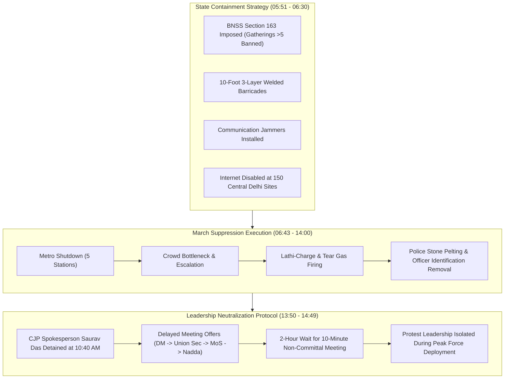
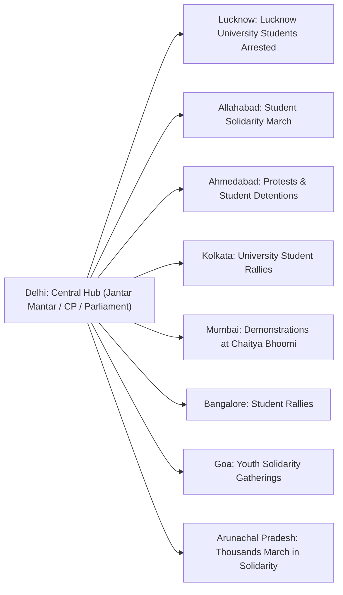

# Detailed Study Notes — Modi's WAR Against Indians | What happened at Jantar Mantar? | Dhruv Rathee

## 📌 Overview & Source Metadata
- **Video Title**: Modi's WAR Against Indians | What happened at Jantar Mantar? | Dhruv Rathee
- **Creator / Channel**: [[Dhruv Rathee]]
- **Watch URL**: [YouTube Link](https://www.youtube.com/watch?v=l-6Pm-112io)
- **Publication Date**: 2026-07-24
- **Primary Focus**: Detailed chronological reconstruction and investigative breakdown of the 20 July 2026 Student Parliament March in New Delhi. Examines the origins of the Jantar Mantar sit-in, Sonam Wangchuk's 20-day hunger strike, covert police sabotage, administrative command changes, communications blackouts, state violence against peaceful protesters and journalists, and the resulting nationwide uprising.

---

## 💡 Executive Summary (00:00 - 02:30)
On 20 July 2026, a massive student-led protest march toward Parliament in New Delhi escalated into a major confrontation over democratic rights and government accountability. Originating from a 30-day peaceful sit-in at Jantar Mantar demanding the resignation of Union Education Minister Dharmendra Pradhan over medical exam leaks and seat irregularities, the movement gained national momentum following social activist Sonam Wangchuk's indefinite hunger strike. 

In response, state authorities deployed extensive physical blockades, communications jammers, internet shutdowns across 150 sites, metro station closures, administrative re-assignments, and covert sabotage (planting damaged vehicles and bricks to frame protesters). When hundreds of thousands of students marched toward Parliament, security forces launched aggressive lathi-charges, fired tear gas into peaceful crowds, detained key spokespersons under false negotiation pretexts, assaulted doctors and independent journalists, and physically dismantled the protest stage. Despite the crackdowns, protesters re-occupied Jantar Mantar that evening while solidarity demonstrations erupted in universities and cities across India.

---

## 📊 Diagram 1: Timeline of Event Escalation & Suppression Tactics

```mermaid
flowchart TD
    subgraph Phase1 ["Phase 1: Peaceful Sit-In & Escalation (20 June - 17 July 2026)"]
        A1["20 June: CJP Sit-in begins at Jantar Mantar (03:11)"] --> A2["28 June: Sonam Wangchuk joins Indefinite Fast (03:40)"]
        A2 --> A3["17 July: Sudden Removal of Police Commissioner Satish Golcha (04:25)"]
        A3 --> A4["IPS Anurag Kumar (IB Special Director) takes charge (04:49)"]
    end

    subgraph Phase2 ["Phase 2: Stage Clearing & Pre-March Isolation (18 July - 19 July 2026)"]
        B1["18 July (06:30 AM): Sonam Wangchuk forcibly taken to Safdarjung Hospital (05:00)"] --> B2["19 July (07:00 PM): BNSS Section 163 imposed by DCP New Delhi (05:51)"]
        B2 --> B3["10-ft Welded Barricades + Jammers + Internet Shutdown across 150 sites (06:08)"]
        B3 --> B4["20 July (04:40 AM): Planted damaged vehicles & stone truck discovered; Security check posts removed (00:23)"]
    end

    subgraph Phase3 ["Phase 3: Crackdown on March & Resistance (20 July 2026)"]
        C1["09:00 AM: 5 Key Metro Stations Closed; Students Jump Barriers (06:43)"] --> C2["10:40 AM: Pretext Distraction Negotiations with JP Nadda (13:55)"]
        C2 --> C3["10:51 AM: Mandi House Lathi-Charge & Tear Gas on Sansad Marg (07:37)"]
        C3 --> C4["01:30 PM - 03:30 PM: Parliament Lockdown, Civilian Assaults & Jantar Mantar Stage Demolition (09:40)"]
        C4 --> C5["Evening: Protesters Re-occupy Jantar Mantar & Nationwide Spillovers (15:27)"]
    end

    style A1 fill:#e1f5fe,stroke:#0288d1
    style B3 fill:#fff3e0,stroke:#f57c00
    style C3 fill:#ffebee,stroke:#d32f2f
    style C5 fill:#e8f5e9,stroke:#388e3c
```

---

## 📊 Diagram 2: State Containment Architecture & Pretext Protocol

---

## 🗓️ Chronological Timeline of Events (20 June 2026 – 20 July 2026)

| Date / Time | Event / Milestone | Operational Context | Timestamp Citation |
| :--- | :--- | :--- | :--- |
| **20 June 2026** | Start of Jantar Mantar Sit-In | Cockroach Janta Party (CJP) demands resignation of Education Minister Dharmendra Pradhan over medical exam integrity. | `(03:11)` |
| **28 June 2026** | Sonam Wangchuk Fast Begins | Social activist Sonam Wangchuk starts an indefinite hunger strike at Jantar Mantar in solidarity. | `(03:40)` |
| **17 July 2026** | Sudden Removal of Police Commissioner | Home Minister Amit Shah removes Delhi Police Commissioner Satish Golcha prior to retirement; IPS Anurag Kumar appointed. | `(04:25)` |
| **18 July 2026 (06:30 AM)** | Wangchuk Abducted & Hospitalized | RAF and police raid stage, cover Wangchuk in a sheet, and forcibly transfer him to Safdarjung Hospital. | `(05:00)` |
| **19 July 2026 (07:00 PM)** | Prohibitory Orders Tweeted | DCP New Delhi announces BNSS Section 163; 10-ft welded barricades, jammers, and 150 internet site shutdowns prepared. | `(05:51)` |
| **20 July 2026 (04:40 AM)** | Planted Sabotage Discovered | Protesters find damaged van, stone-filled truck, broken car near Sansad Marg, and removal of security metal detectors. | `(00:23)` |
| **20 July 2026 (09:00 AM)** | 5 Metro Stations Closed | Janpath, Rajiv Chowk, Patel Chowk, Central Secretariat, and Seva Tir closed; students jump station turnstiles. | `(06:43)` |
| **20 July 2026 (10:40 AM)** | Pretext Distraction Tactics | CJP Spokesperson Saurav Das detained for meeting; forced to wait 2 hours for brief meeting with JP Nadda. | `(13:55)` |
| **20 July 2026 (10:51 AM)** | Mandi House Lathi-Charge | Police launch force against marching students near Mandi House station. | `(07:37)` |
| **20 July 2026 (11:05 AM)** | Wangchuk Release Letter Denied | Wangchuk writes to Safdarjung Hospital Director demanding discharge to join march; request ignored. | `(07:56)` |
| **20 July 2026 (11:05 - 12:00 PM)** | Tear Gas Fired on Sansad Marg | Police fire at least 25 tear gas canisters into seated, peaceful crowds marching toward Parliament. | `(08:20)` |
| **20 July 2026 (12:00 - 01:30 PM)** | ITO Roadblock & RAF Violence | ITO development route blocked; RAF beats protesters; students driven off India Gate lawns with police vehicles. | `(08:51)` |
| **20 July 2026 (01:30 - 03:00 PM)** | Parliament Lockdown & CP Skirmishes | Security forces take firing positions at Parliament gates; PM evacuates; police pelt stones at Connaught Place. | `(09:40)` |
| **20 July 2026 (03:00 - 03:30 PM)** | Jantar Mantar Stage Demolished | Police raid remaining setup at Jantar Mantar, assault journalists/YouTubers, and destroy Wangchuk's stage. | `(12:27)` |
| **20 July 2026 (Evening)** | Resurgence & National Spillovers | Protesters re-occupy Jantar Mantar and rebuild stage; protests spread to Lucknow, Kolkata, Mumbai, Bangalore, Goa, Arunachal. | `(15:27)` |

---

## 🕵️ Section 1: Pre-Dawn Sabotage & Covert Staging (00:23 - 02:09)

### 1.1 Discovery of Planted Evidence (00:23 - 01:34)
At 04:40 AM on 20 July 2026, student protesters conducting routine perimeter checks around Jantar Mantar observed unusual activity:
- **Damaged Van**: A heavily damaged van was found parked on an adjacent road where no vehicle had been present earlier.
- **Truck Loaded with Stones**: Directly outside Jantar Mantar, a commercial truck filled with bricks and heavy stones was parked under cover of darkness `(00:41)`.
- **Damaged Vehicle on Sansad Marg**: Near Sansad Marg, a second vehicle with shattered windshields and structural damage was spotted.
- **Police Perimeter Control**: Protesters pointed out that all access roads leading to Sansad Marg had been completely barricaded and controlled by Delhi Police, making it physically impossible for unauthorized damaged vehicles or stone trucks to enter without police authorization `(01:12)`.
- **Protester Counter-Measure**: Recognizing a setup designed to frame the protest as violent, students attached a handwritten note to the damaged vehicle stating:
  > *"This has been planted by the government to discredit the protest."* `(01:29)`

### 1.2 Removal of Security & Metal Detectors (01:34 - 02:09)
During the same pre-dawn hours, Delhi Police removed all metal detectors, security checkpoints, and screening equipment from the entrances of Jantar Mantar `(01:34)`:
- Protesters recorded video evidence documenting the absence of security screening despite an expected surge of thousands of incoming demonstrators.
- Protesters explicitly questioned police motives:
  > *"Look, the Delhi Police has stopped all checking, there's no checking at all. No metal detectors; everything is open. People are freely moving in and out... If something happens tomorrow, who will take responsibility?"* `(01:41 - 02:06)`

---

## 📜 Section 2: Historical Context & Origin of the Movement (03:11 - 04:21)

### 2.1 The Cockroach Janta Party Sit-In (03:11 - 03:40)
The protest movement commenced on **20 June 2026** when members of the Cockroach Janta Party (CJP) established a permanent sit-in at Jantar Mantar:
- **Core Demand**: Immediate resignation of Union Education Minister Dharmendra Pradhan.
- **Underlying Grievance**: Widespread allegations of medical exam paper leaks (NEET), seat reduction controversies (where medical seats dropped or failed to meet candidate demand), and corruption in national testing agencies `(03:21 - 03:30)`.

### 2.2 Sonam Wangchuk's Indefinite Hunger Strike (03:40 - 04:21)
On **28 June 2026**, social activist Sonam Wangchuk joined the Jantar Mantar demonstration and initiated an indefinite fast `(03:40)`:
- For the first 17 days, the sit-in remained entirely peaceful with routine interactions between police personnel and demonstrators `(03:51)`.
- Wangchuk lost approximately **8 kilograms** over 17 days, leading to public concern as images of his deteriorating physical condition circulated widely across social media platforms `(04:05 - 04:18)`.

---

## 🔄 Section 3: Strategic Leadership Swap & Sonam Wangchuk's Abduction (04:25 - 05:43)

### 3.1 Unscheduled Removal of Police Commissioner Satish Golcha (04:25 - 04:52)
On **17 July 2026**, Union Home Minister Amit Shah abruptly removed Delhi Police Commissioner Satish Golcha from his post `(04:27)`:
- **Anomaly**: Golcha was scheduled for routine retirement in April 2027. His premature removal occurred despite no formal misconduct charges.
- **Replacement**: IPS officer **Anurag Kumar**, former Special Director of the Intelligence Bureau (IB), was immediately appointed as the new Delhi Police Commissioner `(04:49)`.
- **Analytical Assessment**: The leadership change indicated a shift from conventional public order maintenance (tolerating peaceful sit-ins) to an intelligence-led containment strategy aimed at dismantling the demonstration.

### 3.2 Forcible Abduction of Sonam Wangchuk (05:00 - 05:43)
On **18 July 2026 at 06:30 AM**, during minimum crowd presence at Jantar Mantar:
- Security forces from the Delhi Police and Rapid Action Force (RAF) boarded the main stage.
- Officers wrapped Sonam Wangchuk in a white sheet, removed him from the venue, placed him into an ambulance, and forcibly admitted him to Safdarjung Hospital in New Delhi `(05:05)`.
- Key organizer Abhijeet Deep was isolated in a nearby guesthouse during the operation `(05:00)`.

---

## 🚧 Section 4: Pre-March Blockade, Internet Blackout & Legislative Controls (05:46 - 06:40)

### 4.1 Invocation of Section 163 BNSS (05:51 - 06:02)
At 07:00 PM on **19 July 2026**, the Twitter/X account of DCP New Delhi announced the enforcement of **Section 163 of the Bharatiya Nagarik Suraksha Sanhita (BNSS)** across Central Delhi:
- Prohibited assemblies of more than five individuals in public spaces.
- Warned citizens that participation in the scheduled 20 July Student March would result in criminal prosecution.

### 4.2 Physical Barriers & Communications Jamming (06:08 - 06:40)
- **Barricading**: Authorities installed **10-foot-high 3-layer steel barricades** along all routes leading to Parliament, which were subsequently welded together to prevent physical breaches `(06:12 - 06:15)`.
- **Signal Jammers**: Electronic signal jammers were activated throughout Sansad Marg and Jantar Mantar `(06:19)`.
- **Internet Blackout**: Cellular data and internet service were cut across **150 designated mobile tower sites** in Central Delhi to block live streaming and coordination `(06:25)`.

---

## 🚇 Section 5: Metro Shutdown & Crowd Surge (06:40 - 07:34)

### 5.1 Closure of Key Metro Stations (06:43 - 06:58)
At 09:00 AM on **20 July 2026**, Delhi Metro Rail Corporation (DMRC) announced the immediate closure of five major transit hubs on the march route due to "security reasons":
1. **Janpath**
2. **Rajiv Chowk**
3. **Patel Chowk**
4. **Central Secretariat**
5. **Udyog Bhawan / Seva Tir**

### 5.2 Station Overflow & Barrier Breaches (07:04 - 07:34)
- Incoming students were trapped inside station concourses, leading to massive overcrowding and spontaneous anti-government chanting `(07:06)`.
- By 10:00 AM, overflowing crowds breached automatic fare collection (AFC) turnstiles and security barriers, exiting stations on foot toward Jantar Mantar `(07:17 - 07:31)`.

---

## 🛡️ Section 6: Hour-by-Hour Breakdown of 20th July Student March (07:34 - 14:54)

### 6.1 Mandi House Lathi-Charge (10:51 AM) (07:37 - 07:50)
At 10:51 AM, as hundreds of students assembled near Mandi House Metro Station to walk toward Jantar Mantar, police units deployed batons (lathi-charge) without prior audible dispersal warnings `(07:37)`. Protesters were struck indiscriminately before reaching the primary assembly area.

### 6.2 Wangchuk's Hospital Discharge Request (11:05 AM) (07:56 - 08:10)
At 11:05 AM, Sonam Wangchuk submitted a formal written statement to the Medical Director of Safdarjung Hospital:
> *"I want to tell you that I'm feeling absolutely fine today, and I should be allowed to leave the hospital so that I can participate in the march."* `(08:02)`
Hospital administration and attending police escorts denied the request, keeping him isolated.

### 6.3 Tear Gas Firing on Sansad Marg (11:05 AM - 12:00 PM) (08:12 - 08:44)
As crowd numbers expanded to hundreds of thousands marching toward Parliament (`"March! March! March!"`):
- Delhi Police fired at least **25 tear gas canisters** along Sansad Marg `(08:20)`.
- Video evidence showed tear gas canisters launched directly into groups of seated, non-violent demonstrators and bystanders `(08:32 - 08:44)`.

### 6.4 ITO Roadblock & India Gate Lawn Clearing (12:00 PM - 01:30 PM) (08:51 - 09:59)
- **ITO Arterial Blockade**: At ~12:00 PM, police blocked the ITO development route, severing access from East Delhi to Parliament Street `(08:51)`.
- **RAF Assaults**: Rapid Action Force personnel engaged marching groups with baton charges outside local police stations `(09:09)`.
- **India Gate Lawns**: Dispersed students regrouped on the lawns of India Gate. Police officers drove motorcycles and police vans directly onto the grass lawns to flush out sitting students `(09:47 - 09:59)`.

### 6.5 Parliament Lockdown & Firing Positions (01:30 PM) (09:38 - 10:35)
- **Multi-Tier Security Lockdown**: By 01:30 PM, security personnel physically barricaded and held the iron gates of the Parliament complex `(10:24)`.
- **Combat Positions**: Video footage documented armed security personnel taking tactical firing positions along Parliament perimeter walls `(10:08)`.
- **PM Departure**: Prime Minister Narendra Modi departed the Parliament complex under heavy escort while gates remained locked `(10:28)`.

### 6.6 Connaught Place Central Park Assembly & Covert Police Action (10:35 - 12:25)
With direct routes to Jantar Mantar blocked, thousands of students gathered at Connaught Place Central Park and Janpath `(10:41)`:
- **Police Stone-Pelting**: Students interviewed by YouTuber Sarthak Goswami reported that police officers threw stones at demonstrators `(10:50 - 11:05)`. Video footage confirmed officers hurling loose rocks.
- **Anonymized Police Officers**: Police personnel removed their fabric nameplates, obscured vehicle license numbers, and wore handkerchiefs over their faces during baton charges `(11:37 - 11:51)`.
- **Civil-Clothed Personnel**: Unidentified men in plain clothes accompanied uniformed officers, actively participating in beating demonstrators `(12:00 - 12:25)`.
- **Medical Assistance Blocked**: Volunteer doctors attempting to treat injured protesters were beaten by police officers `(11:26 - 11:31)`.
- **Child Assault**: Video evidence documented a police officer choking a minor during transport in a police vehicle `(11:33 - 11:37)`.

### 6.7 Pretext Negotiations with Union Health Minister (10:40 AM - 02:30 PM) (13:50 - 14:49)
To neutralize protest leadership during active operations:
- At 10:40 AM, CJP Chief Spokesperson **Saurav Das** was taken to the Deputy Commissioner's office by DCP Sachin Sharma `(13:55)`.
- Government representatives offered sequential meeting tiers: District Magistrate -> Union Secretary -> Minister of State -> Cabinet Minister `(14:06 - 14:17)`.
- After CJP refused lower-tier meetings, an appointment was set with Union Health Minister **J.P. Nadda** `(14:24)`.
- Spokespersons were kept waiting for **2 hours** for a meeting that lasted only **10 minutes**, during which Nadda stated he would "discuss demands internally" `(14:30 - 14:38)`.
- **Strategic Impact**: The prolonged negotiation kept primary student representatives isolated in government offices while ground forces cleared the streets `(14:42 - 14:49)`.

### 6.8 Stage Demolition at Jantar Mantar (03:00 PM - 03:30 PM) (12:27 - 13:09)
At approximately 03:00 PM, police units entered the primary Jantar Mantar site:
- Forced out remaining sit-in participants.
- Demolished the wooden stage and canopy structure used during Sonam Wangchuk's 3-week fast `(12:42)`.

---

## 🎥 Section 7: Media Blackout & Targeting of Independent Journalists

### 7.1 Independent Media Assault Matrix
Due to cellular jammers and internet site shutdowns, mainstream broadcast networks provided minimal live coverage. Independent creators and ground reporters documented the events despite targeted physical interference `(13:32 - 13:47)`:

| Journalist / Creator | Platform / Channel | Reported Incident / Physical Assault | Timestamp Citation |
| :--- | :--- | :--- | :--- |
| **Shyam Meera Singh** | Independent Journalist | Recorded RAF baton charges and tear gas firing outside Parliament Street police station. | `(09:11)` |
| **Sarthak Goswami** | Independent Reporter | Pushed and slapped by an unidentified individual in civil clothing; struck with a chair. | `(10:48, 12:53)` |
| **Sandeesh Bhatia** | Independent Creator | Pushed and slapped by police officers after asking why plainclothes men lacked nameplates. | `(12:08, 13:09)` |
| **Ramit Verma** | *Being Human* Channel | Sustained severe head lacerations from police batons; struck again on the jaw while visibly bleeding. | `(13:18 - 13:31)` |

---

## 🇮🇳 Section 8: Resurgence at Jantar Mantar & Nationwide Student Uprising (15:00 - 16:10)

### 8.1 Re-occupation of Jantar Mantar (15:27 - 16:10)
By the evening of 20 July 2026, following the police clearance:
- Protesters returned to Jantar Mantar, re-erected the wooden stage, and resumed public speeches `(15:27 - 15:58)`.

### 8.2 Summary of Regional Solidarity Demonstrations (15:03 - 15:47)
Solidarity protests and student marches erupted across multiple states:

1. **Lucknow (Uttar Pradesh)**: Lucknow University students staged demonstrations; several arrested by UP Police `(15:23)`.
2. **Allahabad (Uttar Pradesh)**: Mass student rallies organized through university campuses `(15:28)`.
3. **Ahmedabad (Gujarat)**: Protesters detained following street marches `(15:30)`.
4. **Kolkata (West Bengal)**: Student unions organized rallies across the city `(15:34)`.
5. **Mumbai (Maharashtra)**: Demonstrations convened at Chaitya Bhoomi `(15:36)`.
6. **Bangalore (Karnataka)**: Student assemblies held in major academic zones `(15:39)`.
7. **Goa**: Youth groups organized solidarity marches `(15:41)`.
8. **Arunachal Pradesh**: Thousands of students conducted long-distance marches `(15:44)`.

---

## ⚖️ Section 9: Core Demands, Historical Analogy & Political Critique (16:13 - 17:34)

### 9.1 Core Demands Summary (16:31 - 16:41)
The student movement maintained two explicit demands:
1. Complete institutional reform of exam administration to prevent NEET paper leaks.
2. Immediate resignation of Union Education Minister Dharmendra Pradhan.

### 9.2 The "West India Company" Historical Analogy (16:13 - 16:21)
The commentary draws a historical parallel between colonial rule and contemporary governance:
- **Historical Reference**: 18th-century resistance against the British East India Company.
- **Contemporary Analogy**: Framing current corporate-political state collusion as the "West India Company" waging economic and administrative war against Indian youth `(16:17)`.

### 9.3 Closing Political Statement (16:44 - 17:04)
- **Direct Address**:
  > *"I just want to say this to the Prime Minister, Shame on you, Narendra Modi. The government that is beating up the children, it's time for them to leave."* `(16:44 - 16:52)`
- **Warning on Authoritarian Escalation**:
  > *"Don't test the limits of the people, to what extent people can tolerate this violence... The more the Tana Shahs [dictators] in history thought themselves to be great, the more terrifying their end would be."* `(16:53 - 17:04)`

---

## 💬 Key Takeaways & Notable Direct Quotes

### Key Takeaways
1. **Systemic Pre-Meditation**: The removal of metal detectors, presence of stone-laden trucks, and premature replacement of the Delhi Police Commissioner demonstrate pre-planned state suppression rather than ad-hoc crowd control.
2. **Multi-Layered Suppression**: Physical welded barricades were reinforced with electronic warfare tactics (jammers) and localized internet shutdowns across 150 cell tower sites to suppress real-time reporting.
3. **Targeting of Independent Media**: Ground reporters and YouTubers faced direct physical violence (baton strikes, slaps, head injuries) to prevent video dissemination during broadcast network blackouts.
4. **Decentralized Resurgence**: State force failed to extinguish the movement; Jantar Mantar was re-occupied within hours while student protests spread to 8+ states nationwide.

### Verbatim & Translated Direct Quotes with Timestamps
- > *"India is the mother of democracy."* `(00:00)` — *Opening Quote*
- > *"What kind of police are you? You are hitting us, tearing our clothes! You think your uniform gives you the right to mistreat others?"* `(00:02 - 00:09)` — *Protesting Student*
- > *"Protect your country, or else, 75 years from now, some fool will tear apart this country in the name of religion."* `(00:13)` — *Demonstrator*
- > *"The truck you see here, it has stones in it, bricks."* `(00:47)` — *Eyewitness Protester*
- > *"This has been planted by the government to discredit the protest."* `(01:29)` — *Handwritten Note on Planted Vehicle*
- > *"Look, the Delhi Police has stopped all checking, there's no checking at all. No metal detectors; everything is open... If something happens tomorrow, who will take responsibility?"* `(01:41 - 02:06)` — *Jantar Mantar Protester*
- > *"I want to tell you that I'm feeling absolutely fine today, and I should be allowed to leave the hospital so that I can participate in the march."* `(08:02)` — *Sonam Wangchuk (Letter to Safdarjung Hospital Director)*
- > *"We are doctors! We came to help you... They said, who called you? They beat us up."* `(11:26 - 11:31)` — *Volunteer Medical Doctor*
- > *"Why are your men in civil clothing? Why don't you have a nameplate? Tell me. We are citizens of your country."* `(12:16 - 12:25)` — *Sandeesh Bhatia (Interrogating Police Officer)*
- > *"5-7 minutes ago, my head was broken. Even after 5-7 minutes, when the policeman saw that he was bleeding, he still turned around and hit me on my jaw."* `(13:24 - 13:31)` — *Ramit Verma (Being Human Channel)*
- > *"In a time, Indians were against the East India Company. And today, these Indians are against the West India Company."* `(16:13 - 16:17)` — *Dhruv Rathee*
- > *"I just want to say this to the Prime Minister, Shame on you, Narendra Modi. The government that is beating up the children, it's time for them to leave."* `(16:44 - 16:52)` — *Dhruv Rathee*

---

## 🔗 Metadata Links
- **Raw Transcript Source**: [[01_RAW/SOURCE/Modi's WAR Against Indians  What happened at Jantar Mantar  Dhruv Rathee.md]]
- **Parent MOC**: [[yt-moc]]
