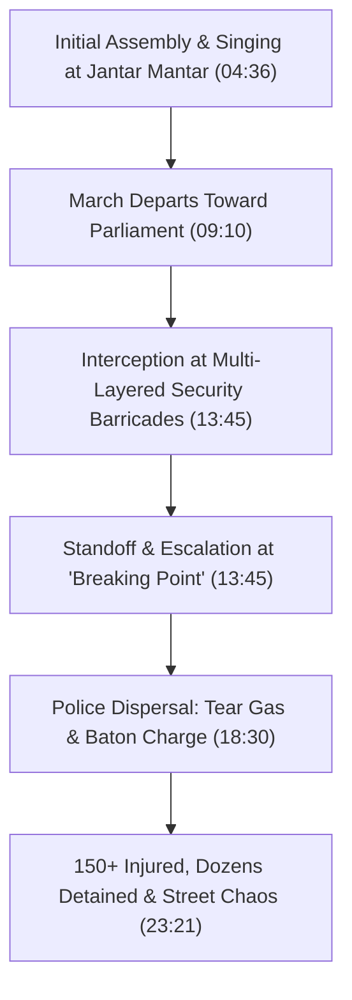

# Detailed Study Notes — Reality of 20th July Protest

## 📖 Ingestion Overview

This detailed study note distills the ground-level documentary video **"Reality of 20th July Protest"** produced and presented by **Sarthak Goswami** (*Sarthak Documentaries*), published on July 23, 2026. The documentary captures the events of July 20, 2026—referred to as "Black Monday"—when thousands of students and youth under the banner of the **Cockroach Janta Party (CJP)** marched toward the Indian Parliament on the opening day of the Monsoon Session to protest against systemic examination failures and youth unemployment.

- **Video Title**: Reality of 20th July Protest
- **Channel / Creator**: Sarthak Documentaries (Host: Sarthak Goswami)
- **Watch Link**: [YouTube Watch Link](https://www.youtube.com/watch?v=0j0vUAo52PM)
- **Primary Subject**: On-ground documentation of the July 20, 2026 Sansad Chalo march, police response, Sonam Wangchuk's hunger strike, media coverage contrasts, and youth demands regarding the NEET-UG 2026 paper leak and national unemployment.

---

## 📽️ Section 1: Introduction & Background (00:00 - 04:36)

### 1. Overview & Context of "Black Monday" (00:00 - 02:14)
- **Event Significance (00:00)**: July 20, 2026, coincided with the opening day of Parliament's Monsoon Session. Thousands of young demonstrators assembled at Jantar Mantar and attempted to march toward Parliament.
- **Movement Origins (00:00)**: Formed under the moniker **Cockroach Janta Party (CJP)**—a political branding adopted directly from a public insult directed at youth concerns—the movement represents a student-led response to recurring exam leaks and economic uncertainty.
- **Primary Demands (00:00)**:
  - Concrete state accountability and systemic resolution following the **NEET-UG 2026 exam paper leak**.
  - Urgent policy measures to address widespread youth unemployment.
  - Safeguarding democratic avenues for youth representation and peaceful assembly.

### 2. Escalation & Background Triggers: "Storm Brewing" (02:14 - 04:36)
- **Sonam Wangchuk's Hunger Strike (02:14)**: Climate activist and social reformer Sonam Wangchuk engaged in a 21-day hunger strike, culminating in his hospitalization due to deteriorating health.
- **Handwritten Plea (02:14)**: From his hospital bed, Wangchuk issued a handwritten letter urging students and citizens to join the July 20th Sansad Chalo march peacefully.
- **Mounting Tension (02:14 - 04:36)**: Dissatisfaction among aspirants accumulated over weeks, transforming isolated sit-ins into a unified national march targeting the parliamentary session.

---

## 🏛️ Section 2: Mobilization & The Parliament March: "New Dawn" (04:36 - 13:45)

### 1. Morning Atmosphere & Assembly at Jantar Mantar (04:36 - 09:10)
- **Initial Tone (04:36)**: The early hours of July 20th began with widespread optimism, cultural expression, group singing, and rhythmic slogan chanting.
- **Demographics (04:36)**: A diverse assembly comprising medical entrance aspirants (NEET-UG), university students, youth organizations, and independent citizens.
- **Key Demands & Grievance Matrix**:

| Category | Key Issue / Trigger | Target Entity | Primary Demand (MM:SS) |
| :--- | :--- | :--- | :--- |
| **Examination Integrity** | NEET-UG 2026 Paper Leak Case | Ministry of Education / NTA | Structural overhaul, probe, and systemic accountability (00:00, 02:14) |
| **Employment** | Chronic youth unemployment | Central Government | Clear job creation roadmap and transparent exam calendars (00:00) |
| **Civic Rights** | Democratic suppression & dismissive rhetoric | State Leadership | Institutional respect for student voices and peaceful assembly (00:00, 04:36) |

### 2. The March Towards Parliament (09:10 - 13:45)
- **Advance from Jantar Mantar (09:10)**: Demonstrators began moving in unified columns from Jantar Mantar along Parliament Street towards the Parliament building.
- **On-Ground Documentation (09:10 - 13:45)**: Independent documentary crews (*Sarthak Documentaries*) operated within the moving crowd to capture real-time developments, participant testimonials, and evolving security responses.

---

## 💥 Section 3: Police Intervention & Confrontation: "Breaking Point" (13:45 - 23:21)

### 1. Barricade Interception & Security Response (13:45 - 18:30)
- **Security Deployment (13:45)**: Multi-layered police barricades and security forces halted the march before reaching Parliament.
- **Standoff & Escalation (13:45 - 18:30)**: As the crowd pressed against police barriers, security personnel initiated forcible dispersal measures.

### 2. Deterioration into Force (18:30 - 23:21)
- **Crowd Control Tactics (18:30)**: Use of tear gas shells and sustained lathi (baton) charges against marching students.
- **Casualties & Detentions (18:30 - 23:21)**:
  - Over **150 reported injuries** sustained by student protesters.
  - Dozens of student organizers and participants detained by police.
- **Shift in Atmosphere**: Transition from peaceful assembly to physical confrontation, panic, and chaos in the streets of Central Delhi.

---

## 🩸 Section 4: Media Contrasts & Victim Impacts: "The Damned" (23:21 - 27:45)

### 1. The Human Cost & Ground Realities (23:21 - 25:30)
- **Injuries and Detentions (23:21)**: Ground cameras documented injured students receiving emergency assistance, alongside accounts of detained youth separated from peers.
- **Emotional Arc (23:21)**: The trajectory of July 20th shifted dramatically from early hope and celebration to distress, fear, and disillusionment.

### 2. Mainstream Media vs. Independent Coverage (25:30 - 27:45)

| Metric / Dimension | Mainstream Television Coverage | Independent Ground Journalism |
| :--- | :--- | :--- |
| **Narrative Framing** | Minimized protest scale; emphasized security protocol adherence | Highlighted student grievances, NEET leak, and peaceful origins (25:30) |
| **Footage Focus** | Distant shots of perimeter control | Direct, embedded camera work among student marches and barricades (00:00, 23:21) |
| **Reporting on Dispersal** | Sanitized reporting on crowd control | Explicit documentation of tear gas, 150+ injuries, and lathi charges (18:30, 23:21) |

---

## 🌄 Section 5: Aftermath & Long-Term Trajectory (27:45 - End)

### 1. Post-Dispersal Realities (27:45 - 28:30)
- **Clearance of Parliament Street (27:45)**: Dispersed crowds left behind tear gas canisters, abandoned signs, and heavy security presence along Delhi corridors.
- **Resilience of Aspirants (27:45)**: Despite force and detentions, student participants asserted that the core issues of examination integrity and unemployment remain unresolved.

### 2. Future Direction of the Movement (28:30 - End)
- **Broadening Support (28:30)**: Social media amplification and independent documentation continue to draw national attention to student demands.
- **Historical Record (28:30)**: The documentary serves as an unedited record of youth civic engagement and state interaction during the 2026 Parliament Monsoon Session.

---

## 📌 Section 6: Key Takeaways & Core Direct Quotes

### Key Takeaways
1. **Origin in Systemic Grievances**: The July 20 Sansad Chalo march emerged directly from student anger over the NEET-UG 2026 paper leak and systemic youth unemployment.
2. **Reclaiming Insults (CJP)**: The movement organized under the "Cockroach Janta Party" label, turning public disparagement into a collective youth identity.
3. **Sonam Wangchuk's Catalyst**: Wangchuk's 21-day hunger strike and hospital handwritten letter provided moral backing for student mobilization.
4. **Dramatic Tactical Escalation**: A peaceful march starting with music and banners ended in tear gas dispersal, leaving 150+ injured and dozens detained.
5. **Divergence in Media Narrative**: Independent creators provided raw, unedited ground footage of police actions, contrasting sharply with mainstream news coverage.

### Core Direct Statements & Quotes

> *"On July 20, 2026 — a day many now call Black Monday — thousands of young Indians marched toward Parliament under the banner of the Cockroach Janta Party, demanding answers on the NEET-UG 2026 exam paper leak and unemployment."* (00:00) — **Sarthak Goswami**

> *"By evening, Delhi's streets told a different story: tear gas, lathi charges, more than 150 reported injured, dozens detained."* (00:00) — **Sarthak Goswami**

> *"Sonam Wangchuk completed a 21-day hunger strike, leading to his hospitalization, from where he issued a handwritten plea to join the march."* (02:14) — **Sarthak Documentaries Report**

> *"This is not just a protest story. It's a record of a generation demanding to be heard."* (27:45) — **Sarthak Goswami**

---

## 🔗 Related & Source Metadata

- **Source Captured File**: `[[01_RAW/SOURCE/Reality of 20th July Protest.md]]`
- **Primary MOC**: `[[03_MOC/yt-moc|YouTube MOC]]`
