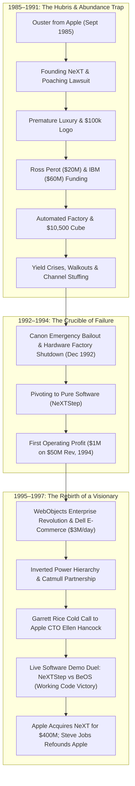

# Steve Jobs in Exile — Comprehensive Study Note

## 📺 Overview & Metadata

- **Podcast**: *Founders Podcast* (Hosted by David Senra)
- **Primary Subject**: *Steve Jobs in Exile: The Untold Story of NeXT and the Remaking of an American Visionary* by Geoffrey Cain
- **Source Video**: [YouTube Link](https://www.youtube.com/watch?v=JjV1uikElgs&t=2748s)
- **Source File**: `[[01 raw/Steve Jobs in Exile.md]]`
- **Timeframe Covered**: September 1985 (Ouster from Apple) – December 1996 / 1997 (Acquisition of NeXT & Return to Apple)
- **Primary Domain**: Business Strategy, Startup Leadership, Operational Transformation, Product Design

---

## 🎯 Executive Summary & Analytical Thesis

This study note provides an exhaustive analysis of the 12-year period of "exile" (1985–1997) between Steve Jobs's humiliating expulsion from Apple and his triumphant return to orchestrate the most dramatic corporate turnaround in technological history. 

Drawing from Geoffrey Cain’s definitive account and historical commentary from Michael Moritz (*The Return to the Little Kingdom*), Ken Kocienda (*Creative Selection*), and Ed Catmull (*Creativity, Inc.*), this study examines how one of history's greatest entrepreneurs made catastrophic mistake after mistake—burning through tens of millions of dollars, alienating corporate allies, micromanaging factory operations, and nearly going bankrupt—before undergoing the painful personal and managerial transformation necessary to build modern Apple.

---

## ⏱️ Chronological Section Breakdown

### 1. The Ouster from Apple & The Summer in Paris (00:00 – 03:44)
- **00:00 – 01:28**: The episode opens framing the 12-year exile as an extraordinary masterclass on failure, persistence, and self-reinvention. Michael Moritz observes in *The Return to the Little Kingdom*: *"It is not too much of a stretch to say that Steve founded Apple not once but twice and the second time he was alone."*
- **02:00 – 02:47**: In September 1985, after being stripped of all operational authority by John Sculley and the board, Jobs resigns. He describes the emotional blow: *"You probably had somebody punch you in the stomach, and it knocks the wind out of you. If you relax, you'll start to breathe again. That's how I felt all summer long."*
- **02:47 – 03:44**: Spending the summer in Paris with his girlfriend Tina, she writes a poignant letter on a bridge over the Seine urging him to leave Silicon Valley behind and live a quiet, anonymous life. Jobs realizes he cannot stay away from creation; building is his non-negotiable identity.

### 2. Founding NeXT, The Apple Lawsuit & The Hiring Crucible (03:44 – 07:06)
- **03:44 – 04:23**: Jobs decides to build a workstation computer specifically for university researchers and academics. He poaches five key Apple employees (including Bud Tribble, George Crow, Rich Page, Susan Barnes, and Daniel Lewin). Apple immediately sues Jobs for breach of fiduciary duty. NeXT starts with no business plan, no product, no name, and a poisoned reputation.
- **04:23 – 05:18**: Jobs hires documentarian John Nathan to film NeXT’s inaugural company retreat, creating the PBS documentary *Entrepreneurs*. Jobs establishes an aggressive 18-month timeline to build a computer and an entirely new object-oriented operating system from scratch.
- **05:18 – 06:36**: **The Permanent Ensemble vs. "Blow Them Out"**: While observing George Lucas sell Lucasfilm's computer division due to a $35M divorce, Jobs rejects Lucas’s model of assembling a team for a single movie and then dissolving it. Jobs demands a permanent ensemble with "grokking"—full-body absorption of company DNA.
- **06:36 – 07:06**: **Combat-Driven Culture**: Jobs demands combative, articulate thinkers who push back. NeXT employees are conditioned for intense intellectual warfare. Ed Catmull later notes that Jobs once fired two Apple board members simply because *"they didn't ever disagree with me."*

### 3. Design Obsession, Paul Rand & The "Millie Logo" Currency (07:06 – 11:38)
- **07:06 – 08:30**: **The Perfect Cube**: Jobs fixates on building a computer in the exact shape of a cube. A European design firm brings him a prototype shaped like a human head; Jobs instantly fires them and hires Hartmut Esslinger of Frog Design (*"Form follows emotion"*).
- **08:30 – 09:45**: **Paul Rand and the $100,000 Logo**: Jobs hires iconic designer Paul Rand (creator of IBM, UPS, Westinghouse, and ABC logos). Rand demands $100,000 upfront with zero alternative options (*"I will solve your problem and you will pay me"*).
- **09:45 – 11:38**: **The Capital Abundance Trap**: Flushed with personal wealth and institutional backing, Jobs abandons startup frugality. NeXT leases luxury offices, buys $10,000 designer sofas, $2,000 chairs, and hires a high-pedigree receptionist to memorize visitors' names. The staff coins a new currency unit: the **"Millie Logo"** ($100). A high-end monitor costs 20 millie logos; a sofa costs 80. Jobs overhears the joke and is furious.

### 4. Volatility, Revenge Motives & The Ferrari Showroom Delusion (11:38 – 16:29)
- **11:38 – 13:38**: **The Hero-Shithead Roller Coaster**: Jobs exhibits extreme mood volatility, tearing employees apart publicly. Paul Rand warns him: *"Between now and when you have a product, you are the product, my friend."* Jobs criticizes his team for lacking startup hustle, oblivious to his own lavish spending.
- **13:38 – 15:45**: **Revenge on Apple**: Jobs runs full-page *Wall Street Journal* ads declaring that the PC industry had shifted *"from the builders to the caretakers,"* expending capital attacking Apple before NeXT even had a prototype. Jobs acknowledges his self-concept: *"My self-identity does not revolve around being a businessman... I think of myself more as a person who builds neat things."*
- **15:45 – 16:29**: **The Fremont Automated Factory**: Jobs builds a dedicated, highly automated manufacturing facility in Fremont, California. He envisions customers flying to California to pick out their computer directly off the assembly line, exactly like wealthy Ferrari buyers in Italy.

### 5. Ross Perot's $20M Investment & The Engineering Walkout (16:29 – 21:06)
- **16:29 – 17:53**: **Ross Perot Joins NeXT**: In November 1986, billionaire Ross Perot sees the PBS documentary *Entrepreneurs*, calls Jobs, and invests $20M for a 16% stake (requiring Jobs to invest another $5M). Perot promises to leverage his government network and Perot Systems salesforce.
- **17:53 – 19:41**: **The Perfectionism Trap & Blame Shifting**: Jobs micromanages every millimeter of the motherboard and casing, continuously pushing deadlines back. When the schedule slips, Jobs fires VP of Manufacturing Linda Wilin. Engineers realize telling the truth is dangerous and start answering *"one more month"* to every question.
- **19:41 – 21:06**: **The "Deep Shit List" & The Two Daves**: Jobs creates a list of existential engineering blockers and threatens engineers "Big Dave" and "Little Dave" with company bankruptcy. When they announce the chip design is ready for Japan, Jobs awards them $25,000 bonuses each. They take the checks, pack their desks, and walk out forever. Three months later, the chips arrive from Japan and are completely non-functional, delaying the computer launch by a full year.

### 6. The 18-Page Logo Brochure, IBM $60M Deal & Magnesium Yield Crises (21:06 – 26:54)
- **21:06 – 22:39**: **The Academic Advisory Council**: University advisors reiterate that the machine cannot exceed $3,000. Jobs reveals zero hardware prototypes and instead distributes an exquisite 18-page full-color brochure explaining the logo's geometry. NeXT burns $1M/month.
- **22:39 – 24:06**: **IBM’s $60M Windfall**: Seated next to IBM's CEO at a dinner, Jobs negotiates a $60M licensing deal ($30M upfront, $30M on shipment + royalties) to license NeXTStep OS for IBM machines.
- **24:06 – 25:44**: **The Daniel Lewin Memo & "Go North" Joke**: Co-founder Daniel Lewin memos Jobs warning that the machine is crashing constantly, taking 5+ minutes to boot, and running out of time. Salesmen describe Jobs’s management as the "Go North" command—driving salespeople until they reach the Arctic Circle, then exploding at them.
- **25:44 – 26:54**: **The $10,500 Launch & Manufacturing Collapse**: The NeXT Cube launches in late 1988 at $10,500 to $12,500 (300%+ over target). Only 205 machines ship in all of 1988. Jobs's insistence on a matte-black finish over magnesium reveals microscopic air bubbles; daily yields drop to 8 computers per day. Returned defective machines pile up in warehouses with zero failure-tracking infrastructure.

### 7. Canon’s $100M, The Clammed-Up Board & Advertising Fiascos (26:54 – 32:20)
- **26:54 – 29:48**: **Optical Drives & Canon’s $100M**: Jobs rejects floppy drives in favor of slow, buggy magneto-optical drives purchased from Canon. He convinces Canon to invest $100M for a 16.67% stake.
- **29:48 – 31:14**: **The HR Silence Meeting**: NeXT hires HR manager Phil to investigate internal dysfunction. In a closed meeting, executives vent bitter frustrations about Jobs. When Jobs unexpectedly walks in and asks *"Well, everybody feels free to tell me what's on their mind?"*, the entire room freezes in total silence.
- **31:14 – 32:20**: **The Demotion Spin & Custom Envelopes**: Jobs demands 25,000 units ordered; Daniel Lewin refuses to sign the reckless purchase order. Jobs takes over marketing, forcing Lewin to publicly explain his demotion as a "promotion" to the press before stripping him of press relations as well. NeXT runs an ad offering a life-sized cube brochure, receives 5,500 requests, and realizes the brochure does not fit in standard envelopes—triggering expensive custom envelope and special postage charges.

### 8. The Dallas Airport Walkout, Killing Ross Perot’s Deal & Purity over Survival (32:20 – 36:17)
- **32:20 – 34:04**: **The Dallas Airport Walkout**: In 1990, en route to pitch 800 IBM engineers on the second $30M licensing phase, salesman Mark mentions they only have one slide deck for dual projection screens and suggests going straight to a live demo. Jobs snaps: *"What you're telling me is I don't have the tools I need... I'm just really busy and I'm not going to go."* Jobs walks out of the airport, leaving the salesman alone. IBM cancels the deal. Ed Catmull notes Jobs learned a lifelong lesson: *"Never overplay your hand."*
- **34:04 – 35:48**: **Refusing Ross Perot’s Government Contract**: Perot Systems CEO Pat Her arrives with a signed multi-million dollar government sales contract. Jobs looks up and refuses to sign (*"I don't want to do business with the government"*). Ross Perot calls furious, realizing his fundamental mistake: *"I gave Steve too much dang money."*
- **35:48 – 36:17**: Geoffrey Cain summarizes Jobs's mindset: **"He was choosing purity over survival."**

### 9. Andy Grove’s Audit, Channel Stuffing & The Dec 1992 Hardware Shutdown (36:17 – 40:50)
- **36:17 – 37:18**: **Andy Grove’s Diagnostic**: Intel co-founder Andy Grove attends a 1991 NeXT retreat and asks each executive: *"What business are you in?"* Nobody can agree.
- **37:18 – 38:24**: **Channel Stuffing Scandal**: To hide abysmal sales from Jobs, NeXT booked machines delivered to distributors on credit as completed revenue. When distributors failed to sell the cubes, NeXT was stuck with $10M in unpaid debts. Canon injects an emergency $40M loan.
- **38:24 – 40:50**: **The December 1992 Hardware Surrender**: Facing imminent liquidation after burning through $140M+, Jobs calls Canon with an ultimatum: send $20M by Monday or NeXT shuts down. Canon buys the hardware operations and factory; NeXT lays off its manufacturing staff and becomes a pure software company. Daniel Lewin quotes Hemingway's *The Sun Also Rises*: Bankruptcy happens *"Gradually, then suddenly."*

### 10. The Software Pivot, WebObjects & The Michael Dell Triumph (40:50 – 45:38)
- **40:50 – 42:40**: **Stepping Back & 1994 Profitability**: Stripped of hardware design, Jobs becomes bored and stops micromanaging. The engineering team focuses on enterprise software (NeXTStep). In 1994, NeXT posts its first operating profit: **$1M net profit on $50M revenue** after 9 years of losses.
- **42:40 – 43:51**: **Larry Ellison's Playbook**: Oracle founder Larry Ellison joins the board and advises NeXT to build a high-margin professional services consulting group.
- **43:51 – 45:38**: **WebObjects & Michael Dell**: In 1995, NeXT invents **WebObjects**, an application server that dynamically generates web pages from databases (solving the static HTML bottleneck). Jobs tells the company: *"The internet is going to be the most important technology transformation... We're going to burn the boats."* Michael Dell uses WebObjects to build Dell's custom PC online store in **1 week** (IBM had quoted 2 years). Dell's WebObjects store hits **$3M/day** in e-commerce sales.

### 11. Ed Catmull’s Influence, The Inverted Hierarchy & Apple’s Crisis (45:38 – 48:22)
- **45:38 – 47:05**: **The Ed Catmull Partnership**: Over a 24-year partnership at Pixar, Ed Catmull develops a method to manage Jobs without yelling: present facts, avoid ego escalation, and wait for Jobs to process logic. By November 1995 (following the release of *Toy Story* and Pixar’s blockbuster IPO), Jobs is transformed.
- **47:05 – 48:22**: **The Inverted Power Hierarchy**: Jobs articulates his mature leadership philosophy:
  > *"If you don't treat talented workers right, they can go get another job in 10 minutes. So a strange thing happens which is the sort of the hierarchy of power inverts and the CEO is actually at the bottom. So I sort of feel like I work for most of these people because they're the ones that are doing all the brilliant work."* [47:10]
- **48:05 – 48:22**: Meanwhile, Apple under Gil Amelio is collapsing, unable to ship a modern OS (Copland failure) and drowning in mediocre, unfocused products (Cyberdog, OpenDoc, PowerPC).

### 12. Garrett Rice’s Cold Call, The Pitch Duel & The Return (48:22 – 53:26)
- **48:22 – 49:37**: **"Why Don't We Just Freaking Call Apple?"**: NeXT Product Manager Garrett Rice reads that Apple is preparing to buy BeOS (built by Jean-Louis Gassée). Rice leaves a voicemail for Apple CTO Ellen Hancock pitching NeXTStep. Hancock admits: *"I hadn't even thought about that."* Jobs calls Gil Amelio directly.
- **49:37 – 51:27**: **The Presentation Duel (Working Code vs Entitlement)**:
  - **Steve Jobs & Avie Tevanian**: Deliver a precise, pragmatic presentation. Avie demonstrates live multitasking with 4 simultaneous QuickTime movies, 3D graphics, games, and developer tools without stuttering. Jobs calmly addresses engineer concerns as solvable technical trade-offs.
  - **Jean-Louis Gassée (BeOS)**: Arrives alone with no team, no laptop, and no slides, assuming his past reputation would carry the deal.
- **51:27 – 53:26**: **The Kitchen Negotiation**: Jobs invites Gil Amelio to his house in Palo Alto. In 5 minutes of kitchen haggling, they settle on $10/share ($400M total). When Apple insiders warn Amelio that Jobs will end up taking over the company, Amelio ignores them. Jobs returns to Apple at age 41 with world-class product taste forged by 12 years of executive crucible.

---

## 📊 Summary Tables

### 1. Chronological Timeline Table (1985–1997)

| Year / Date | Milestone | Financial / Operational Event | Critical Strategic Consequence |
|---|---|---|---|
| **Sept 1985** | Ouster from Apple | Board confrontation with John Sculley | Jobs leaves Apple, spends summer in Paris, commits to starting NeXT. |
| **Late 1985** | NeXT Founded | Poaches 5 key Apple leaders | Apple files lawsuit; NeXT starts with no business plan or prototype. |
| **1986** | Team Retreat & Logo | John Nathan films *Entrepreneurs*; buys Pixar ($5M) | Hires Paul Rand ($100k fee); sets lavish corporate spending habits. |
| **Nov 1986** | Ross Perot Investment | Perot invests $20M + $5M from Jobs (16% stake) | Influx of capital fuels premature scaling and luxury expenditures. |
| **1987** | Factory Construction | Builds automated factory in Fremont, CA | Magnesium cube casing yields collapse due to air bubble paint defects. |
| **Late 1988** | NeXT Cube Launch | Hardware ships at $10,500–$12,500 | Ships only 205 machines in 1988; cash reserves drop below survival line. |
| **1988–1989** | IBM & Canon Deals | IBM licenses OS ($60M); Canon invests $100M | Massive capital injections mask chronic operational dysfunction. |
| **1990** | Strategic Blunders | Jobs walks out on Dallas IBM pitch; rejects Perot | IBM deal dies; Ross Perot resigns from board in frustration. |
| **1991** | Andy Grove Audit | Channel stuffing scandal exposed ($10M debt) | Canon injects $40M emergency loan; Grove asks *"What business are you in?"* |
| **Dec 1992** | Hardware Shutdown | Canon injects $20M to buy hardware operations | Fremont factory closed; NeXT pivots exclusively to software. |
| **1994** | First Operating Profit | NeXTStep enterprise software focus | Generates $1M net profit on $50M revenue after 9 years of losses. |
| **1995** | WebObjects Launch | WebObjects launched; Dell online store built | Dell e-commerce hits $3M/day; Pixar IPO makes Jobs a billionaire. |
| **Late 1996** | Garrett Rice Pitch | Rice pitches Apple CTO Ellen Hancock | NeXTStep enters OS competition against BeOS for Apple’s next-gen OS. |
| **Dec 1996** | The Pitch Duel | Live code demo by Jobs & Avie Tevanian | Apple acquires NeXT for $400M; Jobs returns to Apple as advisor/iCEO. |

---

### 2. Comparative Analysis: NeXT vs. Return to Apple

| Operational Dimension | NeXT Wilderness (1985–1992) | Mature Leadership at Apple (1997–2011) |
|---|---|---|
| **Capital Allocation** | Lavish vanity spending ($10k sofas, custom envelopes, factory). | Extreme discipline, ruthless product matrix pruning (350 → 4 products). |
| **Management Style** | Hero-shithead roller coaster, public berating, micromanagement. | Direct, clear product feedback, empowerment of world-class leaders. |
| **Talent Retention** | Constant turnover of co-founders, CFOs, and manufacturing heads. | Enduring leadership ensemble (Ive, Cook, Tevanian, Schiller) for 10+ years. |
| **Power Dynamics** | Top-down authoritarian control and blame shifting. | Inverted power hierarchy (CEO serves and clears obstacles for creators). |
| **Product Strategy** | Complex, multi-year feature creep without customer validation. | Rapid iterative prototypes, working code verification, tight focus. |
| **Manufacturing** | Insisting on owning custom local factory in Fremont. | Strategic outsourcing via Tim Cook and global supply-chain leverage. |

---

## 💬 Verbatim Quotes & Contextual Signposts

1. **On Refounding Apple Alone**:
   > *"It is not too much of a stretch to say that Steve founded Apple not once but twice and the second time he was alone."*  
   — Michael Moritz (*The Return to the Little Kingdom*) [01:28]

2. **On Personal Identity as a Creator**:
   > *"Whenever you do one thing intensely over a period of time, you have to give up other lives you could be living. You have to have a real single-minded kind of tunnel vision if you want to get anything significant accomplished. Especially if the desire is not to be a businessman, but to be a creative person... My self-identity does not revolve around being a businessman, though I recognize that this is what I do. I think of myself more as a person who builds neat things."*  
   — Steve Jobs (1986 Interview) [14:49–15:18]

3. **On Product Reality vs. Brand Illusion**:
   > *"Between now and when you have a product, you are the product, my friend. And so, you better be nice to people."*  
   — Paul Rand to Steve Jobs [12:59]

4. **On The Capital Abundance Trap**:
   > *"You know what my mistake was? I gave Steve too much dang money. When you have too much money, you just don't have that hunger and you start spending money on floating staircases and $10,000 chairs..."*  
   — Ross Perot [35:16]

5. **On Sudden Bankruptcy**:
   > *"How did you go bankrupt? Two ways. Gradually, then suddenly."*  
   — Daniel Lewin quoting Ernest Hemingway (*The Sun Also Rises*) [41:36]

6. **On The Inverted Power Hierarchy**:
   > *"If you don't treat talented workers right, they can go get another job in 10 minutes. So a strange thing happens which is the sort of the hierarchy of power inverts and the CEO is actually at the bottom. So I sort of feel like I work for most of these people because they're the ones that are doing all the brilliant work."*  
   — Steve Jobs (1995 Interview) [47:10]

7. **On The Hard-Won Wisdom of Exile**:
   > *"Next executives thought Gil failed to grasp what Steve's 12 years in the wilderness had given him. Steve came away not only with better skills for building technology, but better strategies for getting exactly what he wanted."*  
   — Geoffrey Cain (*Steve Jobs in Exile*) [52:59]

---

## 🏛️ Entity Glossary

| Entity | Type | Role in the Narrative |
|---|---|---|
| **Steve Jobs** | Person | Co-founder of Apple, founder of NeXT, CEO of Pixar, transformed leader. |
| **Geoffrey Cain** | Person / Author | Author of *Steve Jobs in Exile: The Untold Story of NeXT*. |
| **David Senra** | Person / Host | Host of *Founders Podcast* analyzing entrepreneurial biographies. |
| **Ross Perot** | Person / Investor | Billionaire founder of EDS and Perot Systems; invested $20M in NeXT in 1986. |
| **Paul Rand** | Person / Designer | Legendary graphic designer who created the NeXT logo for $100,000. |
| **Hartmut Esslinger** | Person / Designer | Founder of Frog Design; coined *"Form follows emotion"*. |
| **Daniel Lewin** | Person / Executive | Co-founder and Head of Marketing at NeXT; frequent truth-teller to Jobs. |
| **Andy Grove** | Person / Mentor | Co-founder of Intel; challenged NeXT leadership on their core business model in 1991. |
| **Ed Catmull** | Person / Executive | Co-founder and President of Pixar; 24-year close collaborator with Jobs. |
| **Larry Ellison** | Person / Executive | Founder of Oracle, NeXT board member; advised creating professional services. |
| **Avie Tevanian** | Person / Engineer | Head of Software Engineering at NeXT; architect of Mach kernel & NeXTStep demo. |
| **Garrett Rice** | Person / Product Mgr | NeXT product manager who cold-called Apple CTO Ellen Hancock in 1996. |
| **Ellen Hancock** | Person / Executive | CTO of Apple in 1996 who initiated talks with NeXTStep. |
| **Gil Amelio** | Person / Executive | CEO of Apple (1996–1997) who acquired NeXT for $400M. |
| **Jean-Louis Gassée** | Person / Founder | Founder of BeOS; lost the Apple OS acquisition duel to Jobs. |
| **NeXTStep** | Software / OS | Object-oriented OS built by NeXT; became the direct foundation for macOS and iOS. |
| **WebObjects** | Software / Server | Dynamic application server created by NeXT in 1995; powered early Dell e-commerce. |

---

## 💡 Downstream Atomic Concept Candidates

- [[NODES/Capital Abundance Trap]]: When excessive upfront capital destroys operational frugality and causes premature vanity scaling.
- [[NODES/Perfectionism Execution Trap]]: The operational failure where endless aesthetic revisions delay market release until the product becomes obsolete.
- [[NODES/Inverted Power Hierarchy]]: The management paradigm where executive leadership acts as a support and obstacle-removal layer for high-leverage knowledge workers.
- [[NODES/Working Code Paradigm]]: The technical evaluation standard where working, executable software instantly defeats reputation and speculative claims.
- [[NODES/Channel Stuffing Vulnerability]]: The dangerous accounting trick of booking distributor shipments as finalized sales to conceal demand collapse.

---

## 🔗 Related Notes & Graph Connections

- **Source File**: `[[01 raw/Steve Jobs in Exile.md]]`
- **Primary Map of Content**: `[[03_MOC/steve-jobs-moc.md|🚀 Steve Jobs Map of Content]]`
- **Parent Navigation MOCs**:
  - `[[03_MOC/people-moc.md|👥 People Map of Content]]`
  - `[[03_MOC/yt-moc.md|📺 YouTube Map of Content]]`
  - `[[03_MOC/study-moc.md|📚 Study Map of Content]]`
- **Atomic Nodes in Graph**:
  - `[[NODES/Capital Abundance Trap.md]]`
  - `[[NODES/Inverted Power Hierarchy.md]]`
  - `[[NODES/Perfectionism Execution Trap.md]]`
  - `[[NODES/Working Code Paradigm.md]]`
  - `[[NODES/Channel Stuffing Vulnerability.md]]`

