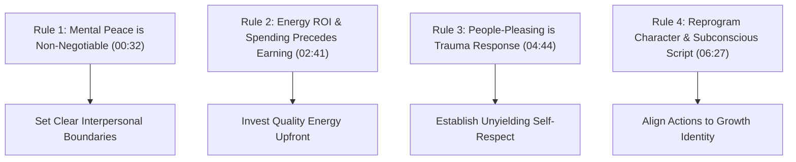
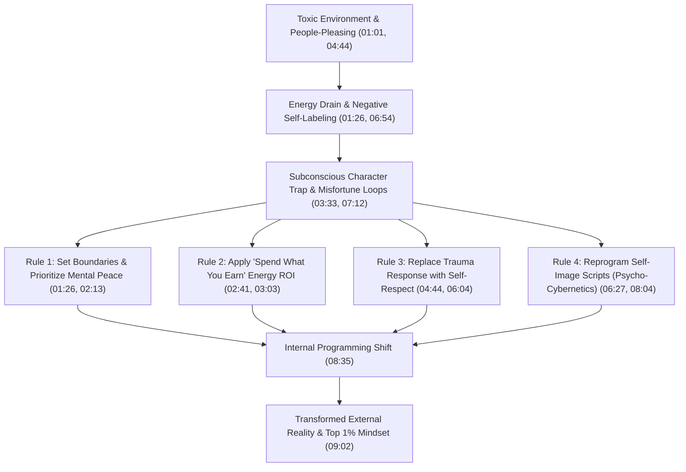

# Detailed Study Notes — This Video is Equal to Reading 10 Books

## Executive Summary & Metadata

- **Speaker / Author:** Radhika Chopra
- **Source Video:** [This video is equal to reading 10 books (YouTube)](https://www.youtube.com/watch?v=9ZoFOyccP6c)
- **Primary Source File:** [[01_RAW/SOURCE/this-video-is-equal-to-reading-10-books.md|Raw Transcript Source]]
- **Parent Navigation MOC:** [[03_MOC/yt-moc|YouTube Map of Content]]
- **Core Thesis:** Synthesizing the core actionable principles of 10 foundational self-help and psychological works into 4 operational life rules. The guide strips away motivational fluff and toxic positivity, establishing clear frameworks for mental peace, energy ROI, boundary enforcement, trauma response detachment, and subconscious identity reprogramming.

---

## Operational Comparison Matrix: The 4 Core Life Rules

The table below summarizes the key psychological mechanisms, underlying literary foundations, and actionable imperatives across all 4 core rules (01:01 - 09:54):

| Rule # | Core Operational Rule | Underlying Book / Framework Foundations | Key Psychological Mechanism | Primary Action Imperative |
| :--- | :--- | :--- | :--- | :--- |
| **Rule 1** | **You Cannot Heal in the Same Environment That Broke You** (01:01) | Boundary Setting & Emotional Attachment Theory | Energy Drain vs. Mental Peace Asset (01:26) | Enforce strict personal boundaries; release toxic validation & unpayable expectations (02:13) |
| **Rule 2** | **What You Spend Is What You Earn** (02:41) | Energy Conservation & ROI Investment Laws | Mechanical ROI & Gratitude Loops vs. Misfortune Loops (03:33, 04:03) | Invest initial capacity (confidence, energy, wealth) to generate return (03:03) |
| **Rule 3** | **People-Pleasing is a Trauma Response, Not Kindness** (04:44) | *Not Nice* (Aziz Gazipura), *The Courage to Be Disliked* (Kishimi & Koga) | Conflict Avoidance & Door-Mat Perception (05:13, 05:40) | Trade shallow external approval for authentic self-respect (06:04) |
| **Rule 4** | **You Are Trapped by the Character You Are Playing** (06:27) | *Psycho-Cybernetics* (Maxwell Maltz) | Subconscious Self-Image Protection & Behavioral Alignment (06:54, 07:12) | Rewrite internal identity scripts; align habits with target self-concept (08:04) |

---

## Visual Architecture: Mindset Transformation Pipeline

---

## Detailed Section Breakdown with Timestamp Anchors

### 📽️ Introduction & Scope (00:00 - 01:01)
- **Context (00:00):** Distillation resulting from reading dozens of major self-help books over a full year, designed specifically for individuals constrained by time or struggling with reading habits.
- **Strategic Goal (00:15):** Accelerate the viewer's psychological maturity and operational mindset by 10 years.
- **Methodology (00:44):** Stripping out motivational hype and toxic positivity to deliver 4 practical, real-world execution rules.

---

### 🧠 Rule 1: You Cannot Heal in the Same Environment That Broke You (01:01 - 02:41)
- **The Value of Mental Peace (01:26):** Your mental health and inner peace represent your highest-value asset—far outranking physical property, financial holdings, or superficial social circles.
- **The Energy Drain Trap (01:26 - 01:51):** Most individuals squander their emotional bandwidth on two critical errors:
  1. Trying to "fix" or change people who do not believe they are wrong.
  2. Striving to satisfy people who do not value them and will not offer support during a crisis.
- **Boundary Setting & Conflict Release (02:13):**
  - Establish hard limits on acceptable behavior from relatives, friends, and colleagues.
  - Understand that not every argument needs to be won, and not every critic deserves a response.
- **Detachment from Approval (02:41):** Accept that setting boundaries will cause temporary disappointment or cause toxic relationships to dissolve. You were not born to satisfy others or seek validation.

---

### 🧠 Rule 2: What You Spend Is What You Earn (02:41 - 04:44)
- **The Energetic Law of ROI (02:41 - 03:03):** The universe operates on mechanical, transactional energy laws. Output requires upfront investment of the target quality:
  - **Wealth:** Requires investing/spending capital on high-ROI assets.
  - **Physical Energy:** Requires expending physical effort to build endurance.
  - **Confidence:** Requires spending whatever micro-confidence you currently possess to generate cumulative momentum.
- **Lucky Person Syndrome vs. Misfortune Loops (03:33 - 04:03):**
  - **Misfortune Loop:** Chronic complaining and dwelling on bad luck programs the brain's focus filters to notice and attract negative outcomes.
  - **Gratitude Loop / Lucky Person Syndrome:** Actively affirming gratitude ("I am so blessed") programs subconscious filters to identify positive opportunities and blessings.
- **Mechanical Impartiality (04:27):** The universe does not operate on emotional favoritism or empty ritual; it responds strictly to behavioral energy inputs and environmental rules.

---

### 🧠 Rule 3: People-Pleasing is Not Kindness (It is a Trauma Response) (04:44 - 06:27)
- **The Fallacy of "Being Nice" (04:44):** The conventional advice to "be nice to get nice things" is fundamentally flawed.
- **The Trauma Response Mechanism (05:13):** People-pleasing is a subconscious coping strategy used to avoid the immediate discomfort of conflict or fear of abandonment.
- **Literary Foundations (04:44):** Supported by psychological principles from *Not Nice* by Dr. Aziz Gazipura and *The Courage to Be Disliked* by Ichiro Kishimi & Fumitake Koga.
- **The Respect Loop & Door-Mat Effect (05:40 - 06:04):**
  - Repeatedly breaking your own boundaries to accommodate others does not earn gratitude; it signals a lack of self-respect, causing others to treat you as a "door mat."
  - **Law of Mirroring:** *"You never get what you expect, you always get what you are."* Self-respect must be established internally before external respect can manifest.

---

### 🧠 Rule 4: You Are Trapped by the Character You Are Playing (06:27 - 09:54)
- **The Self-Image Mechanism (06:27 - 07:12):**
  - Based on Maxwell Maltz's *Psycho-Cybernetics*, the human brain relies on a subconscious self-image to govern behavior.
  - The brain automatically aligns actions and choices to protect and validate your internal identity labels.
- **The Negative Label Trap (06:54 - 07:31):** Habitually identifying as "an overthinker," "shy," or "unlucky" forces the subconscious mind to create or attract situations that confirm those negative self-assessments.
- **Reprogramming the Subconscious Script (08:04 - 08:35):**
  - Replace restrictive identity statements with constructive scripts ("I am focused", "I am healthy", "I am wealthy").
  - Channel thoughts and actions into high-ROI growth habits to transform external outcomes.
- **The Top 1% Reality (09:02):** High achievers differ only in their consistent daily adherence to these fundamental operational rules.

---

## Notable Verbatim & Translated Quotes

> *"Your mental peace is your biggest asset... You are not born to satisfy people. You are not sent here to seek validation."* (01:26, 02:41) — **Radhika Chopra**

> *"What you want to earn in life, you need to spend it first... The universe doesn't run on favoritism; it works strictly on mechanical rules of energy."* (03:03, 04:27) — **Radhika Chopra**

> *"People-pleasing is not kindness. It is a trauma response... You never get what you expect; you always get what you are."* (04:44, 06:04) — **Radhika Chopra**

> *"You are trapped by the character you are playing... If you change your internal programming, your external reality changes automatically."* (06:27, 08:35) — **Radhika Chopra**

---

## Related Vault Knowledge & Atomic Nodes

- [[NODES/healing-environment-and-boundaries|Healing Environment and Boundaries]] — Structural principles for protecting mental peace and setting interpersonal limits.
- [[NODES/spending-precedes-earning-principle|Spending Precedes Earning Principle]] — The mechanical law requiring upfront energy investment to yield return.
- [[NODES/people-pleasing-as-trauma-response|People Pleasing as Trauma Response]] — Psychological analysis of conflict-avoidance behaviors and boundaries.
- [[NODES/self-image-reprogramming|Self-Image Reprogramming]] — Psycho-cybernetic frameworks for updating identity scripts.
- [[03_MOC/yt-moc|YouTube Map of Content]] — Parent navigation index.
