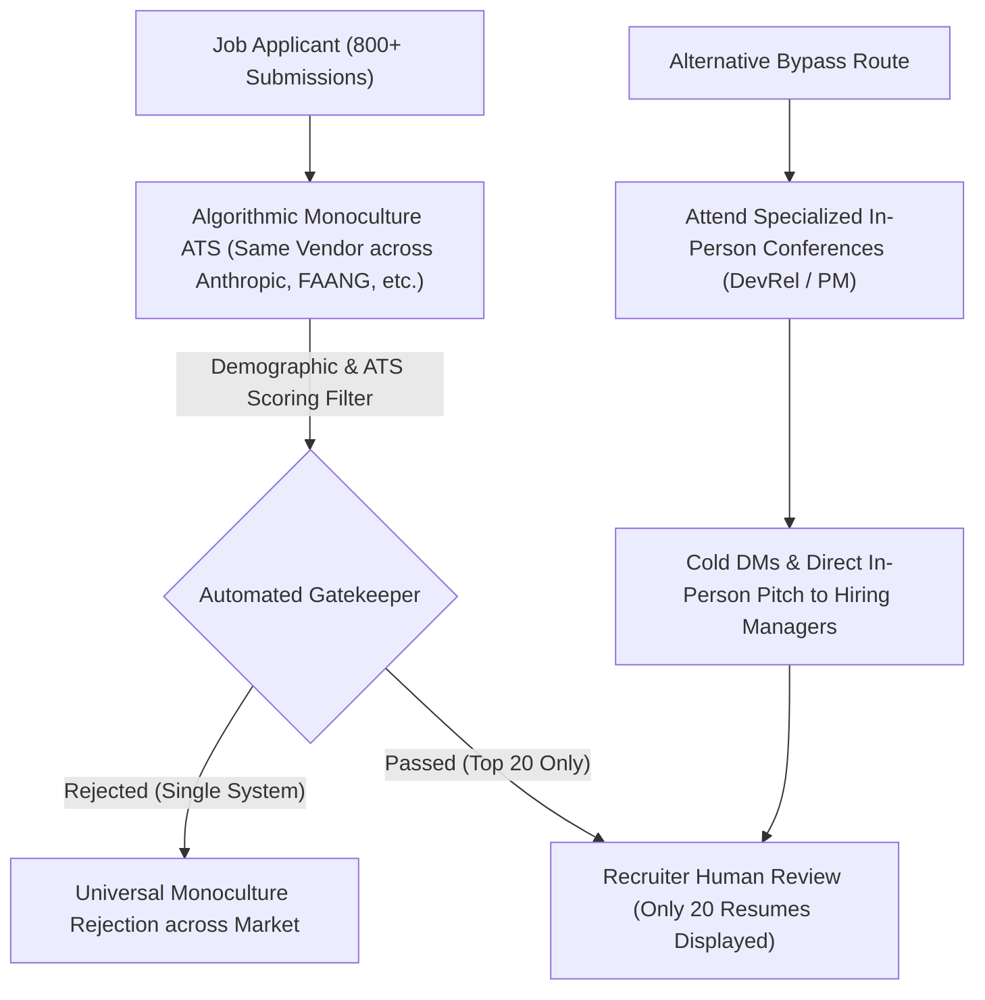

# Detailed Study Notes — Why I Don't Agree With My Tech Rejections (Stanford Report Explains)

## 📖 Ingestion Overview
This note represents an exhaustive, maximum-fidelity study note created from the YouTube video titled *"Why I Don't Agree With My Tech Rejections (Stanford Report Explains)"* by **Singh in USA** ([YouTube Watch Link](https://www.youtube.com/watch?v=CtLI8PzpPoo)).

The video provides an in-depth breakdown of the speaker's personal experience with software engineering interviews, the friction between modern AI-assisted engineering and legacy hiring practices, four contrarian "hot takes" on coding abstractions and computer science education, and the empirical findings of a Stanford Digital Economy Lab research paper titled *"Algorithmic Monocultures in Hiring"*.

---

## 📽️ Section 1: Personal Tech Interview Failure Analysis & Ability Boundaries (0:00 - 2:26)

### 1. Speaker Background & Personal Metrics (0:00 - 1:00)
- **Vulnerable Retrospective (0:00)**: The speaker (an ex-Microsoft software engineer) shares an honest analysis of failing tech interviews. While maintaining full respect for recruiters, he explicitly disagrees with the technical grounds of many of his rejections based on how AI has transformed modern software development.
- **Track Record & Historical Data (0:45)**:
  - *Previous Application Wave*: 200 total applications, 25+ callbacks, 10 post-interview rejections, and 1 final job offer (currently holding multiple offers).
  - *Contextual References*: Referenced previous video content and a podcast interview with Mary discussing the reality of tech job searches.

### 2. Skill Inventory & Technical Ceiling (1:00 - 2:01)
- **Primary Strengths**: Native mobile software engineering (Android and iOS development).
- **Front-End Gap & AI Leverage**:
  - Has zero formal background or manual experience in web front-end development (JavaScript, HTML, CSS) over the past 6 years.
  - Successfully uses generative AI to build full web applications, launch products, and drive user growth via Twitter.
- **Interview Failure Triggers**:
  1. *Line-by-Line Code Interrogation*: Rejections occurred when interviewers demanded line-by-line explanations of AI-assisted / "vibe-coded" JavaScript code.
  2. *LeetCode Ceiling*: Proficient up to LeetCode Medium algorithms (which was sufficient to pass Microsoft hiring bars). Stumbles on LeetCode Hard algorithms that extend beyond standard Breadth-First Search (BFS), Depth-First Search (DFS), and Topological Sort.
- **Shift in Interview Bar (2:01 - 2:26)**:
  - *2022 Hiring Bar*: Interviewers (often with ~2 years of experience) accepted an 8/10 technical execution.
  - *2026 Hiring Bar*: For candidates with 5+ years of experience (YOE), an 8/10 answer results in immediate rejection. Interviewing today requires full-time prep (citing Alyssa, who completed 47 interviews to secure an OpenAI Research role).

| Parameter / Metric | 2022 Tech Market Standard | 2026 Tech Market Standard | Speaker Capability Ceiling |
| :--- | :--- | :--- | :--- |
| **Solution Threshold** | 8 / 10 Acceptable | 10 / 10 Flawless Execution Required | 8 / 10 (LeetCode Medium max) |
| **Code Explanation Scope** | System design & general logic | Line-by-line syntax & compilation mechanics | High-level architectural & prompt level |
| **Preparation Commitment** | Part-time review | Full-time job commitment (47+ interview loops) | 5+ YOE Senior Engineer |
| **Front-End Execution** | Manual syntax knowledge | AI-prompted execution + manual line-by-line audit | AI-assisted building (0 manual JS in 6 yrs) |

---

## 📽️ Section 2: Four Contrarian Hot Takes on AI, Abstractions, and CS Fundamentals (2:26 - 7:58)

### 1. Hot Take 1: English as the New Higher-Level Abstraction (2:26 - 3:57)
- **Core Assertion (2:35)**: Citing Andrej Karpathy's principle that *"English is the new programming language"*, technical comprehension at the English prompt level should be treated as a valid engineering capability.
- **Historical Abstraction Analogy (2:55)**:
  - Python libraries (e.g., PyTorch, NumPy) are written and compiled in underlying C++. Python developers in production do not need to explain C++ pointers, compiler logic, or machine code to be effective software engineers.
  - 10 to 15 years ago, Python was the high-level abstraction over C++. Today, English natural language is the next high-level abstraction over Python and JavaScript.
- **Hiring Conflict (3:43)**: Tier-1 companies (e.g., Apple asking low-level compiler questions) reject candidates who understand systems at the English/architectural level rather than the compiler/syntax level.

### 2. Hot Take 2: Product Taste & Prompting vs. Raw Algorithmic Syntax (3:57 - 5:11)
- **Core Assertion (3:51)**: Developers with superior product taste, marketing awareness, user empathy, and design aesthetics are objectively better developers for modern companies than engineers who only possess deep syntax/algorithmic knowledge.
- **Interview Disconnect (4:07)**: Interview processes remain fixated on testing linked lists, manual algorithm execution, and line-by-line syntax verification.
- **Industry Infrastructure Evidence (4:15 - 5:11)**:
  - **Entire (Startup by ex-CEO of GitHub)**: Building infrastructure to replace standard GitHub commits with "checkpoints" that record how code was *prompted* rather than how it was manually written.
  - **GitHub Rewind**: Open-source tool allowing users to input any GitHub repository URL to analyze the prompt sequence used to generate the codebase.

### 3. Hot Take 3: Code Reviewing & Taste Over Code Writing (5:11 - 5:48)
- **Core Assertion (5:11)**: Reading, evaluating, auditing, and reviewing code is a more vital daily engineering skill than handwriting code.
- **Evaluation Priority (5:30)**: Because AI handles code generation and initial infrastructure setup, an interviewer should prioritize candidate code review taste and system evaluation over syntax writing speed.

### 4. Hot Take 4: Obsolescence of Legacy CS Fundamentals & Tier-1 Hiring Realities (5:48 - 7:58)
- **Core Assertion (5:48)**: Years spent memorizing specific programming languages (e.g., JavaScript syntax) or low-level mechanics (compilers, OS internals) are becoming obsolete for product creation.
- **Personal Case Study (6:05)**: Speaker studied Operating Systems in university but has never used that knowledge once in 6 years of professional engineering.
- **DevRel Field Reality (6:35)**: Serving in Developer Relations at HydraDB for 4 months, the speaker instructs hackathon builders to integrate skills using Claude Code. When technical edge cases arise, he utilizes Claude to explain API differences.
- **Tier-1 Enterprise Reality (7:14 - 7:58)**: Despite these shifts, top-tier tech companies (Anthropic, OpenAI, FAANG / MANG / "Mangos") will continue to test candidates strictly on core fundamentals, compiler internals, and line-by-line code writing.

| Hot Take # | Core Thesis | Real-World AI Reality | Interview Loop Reality |
| :--- | :--- | :--- | :--- |
| **Hot Take 1** | English is the new high-level abstraction | Python abstracts C++; English abstracts JS/Python | Apple & FAANG ask compiler-level mechanics |
| **Hot Take 2** | Product taste > Algorithmic syntax | Tools like *Entire* and *GitHub Rewind* track prompts | Loops evaluate linked lists & manual syntax |
| **Hot Take 3** | Code review taste > Code writing speed | AI generates code & infra decisions | Loops evaluate manual code writing execution |
| **Hot Take 4** | Legacy CS knowledge is becoming waste | DevRel & builders rely on Claude Code | Tier-1 firms demand line-by-line manual mastery |

---

## 📽️ Section 3: The Stanford Report & Algorithmic Monocultures in Hiring (7:58 - 11:14)

### 1. The Monoculture Effect & Automated Rejections (7:58 - 9:05)
- **Stanford Paper (7:58)**: Cites research from the Stanford Digital Economy Lab titled *"Algorithmic Monocultures in Hiring"*.
- **Shared Vendor Monoculture (8:11)**: Major technology companies and AI startups rely on the same third-party ATS screening vendors and algorithms. A rejection by one automated system leads to automatic rejections across all companies utilizing that identical algorithm.
- **Demographic Bias Filtering (8:35)**: The Stanford paper reveals algorithmic filtering based on candidate demographic categories (Asian, Black, Hispanic, White) across major job boards (LinkedIn, Glassdoor, Jobs Bash). Visualized data shows highest rejection rates for Black and Asian candidates.

### 2. Recruiter Visibility & Application Math (9:05 - 10:16)
- **The Top-20 Recruiter Bottleneck (9:05)**: When a candidate submits 800+ applications via LinkedIn Quick Apply, ATS algorithms filter the candidate pool so recruiters only see the top 20 pre-screened applications.
- **Daily Application Volume Requirement (9:35)**:
  - Submitting 20–22 applications/day keeps candidate probability in the "red" zone.
  - Submitting **25 customized applications per day** shifts probability into the "green" zone (~0.08 hiring probability).
  - Requires a custom resume tailored to every single job description.

### 3. AI Job Application Tooling (10:16 - 11:14)
- **Claude Career Ops (10:16)**: Custom tool developed by the speaker using Claude Code to generate tailored resumes and locate hiring manager emails.
- **Tsenta (YC-Backed Automation) (10:35 - 11:14)**:
  - Y Combinator-backed job application platform designed to automate tailored applications to 1,500+ jobs.
  - Price: $40/month standard subscription ($30/month with 25% discount link).
  - Features mobile swiping interface to apply to thousands of positions in minutes, meeting the 25+ application daily threshold.

---

## 📽️ Section 4: Tactical Networking & Bypassing Algorithmic Gates (11:14 - 11:41)

### 1. Specialized In-Person Conferences (11:14 - 11:41)
- **Domain Alignment Principle (11:14)**: To bypass ATS monoculture filters, candidates must physically attend events directly related to their target discipline (e.g., Developer Relations conferences for DevRel roles, Product Management events for PM roles).
- **Databricks Case Study (11:25)**: Speaker secured a Developer Relations interview at Databricks by attending a DevRel-specific conference and pitching the hiring team in person.
- **Tactical Imperative (11:35)**: Combining targeted social outreach (cold DMs on X/Twitter and LinkedIn) with in-person event interactions provides the highest conversion rate in the 2026 tech hiring market.

---

## 🎯 Key Takeaways & Direct Quotes

> *"English is the new programming language... My understanding of a lot of things I work on has become on an English level, but not much on a deeper level."* **(2:35 / 6:05)**

> *"If you have better product skills, marketing skills, and better taste, you're a better developer than someone who knows more technical skills. This is my hot take, but for an interview point of view, that's not okay."* **(3:51)**

> *"Whether you applied to Anthropic or Claude, if you get rejected once, you are rejected from all of them automatically because everyone is using the same vendor algorithm."* **(8:11)**

> *"Recruiters only see top 20 applications of your 800 applications... to have a 0.08 probability of getting hired, you need a different resume for each position plus at least 25 applications a day."* **(9:05 / 9:51)**

---

## 🔗 Related & Source Metadata
- **Source Captured File**: `[[01_RAW/SOURCE/Why I Don't Agree With My Tech Rejections (Stanford Report Explains).md]]`
- **Primary MOC**: `[[03_MOC/yt-moc|YouTube MOC]]`
