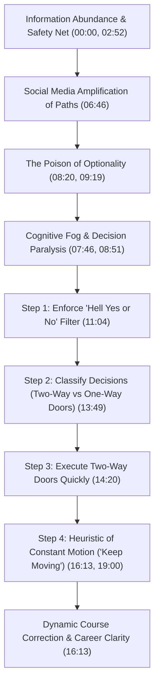

# Detailed Study Notes — Why You Are Feeling STUCK In Your 20s

## Executive Summary & Metadata

- **Speaker / Author:** Ankur Warikoo
- **Source Video:** [Why You Are Feeling STUCK In Your 20s (YouTube)](https://www.youtube.com/watch?v=06aGxheLHAQ)
- **Primary Source File:** [[01_RAW/SOURCE/why-you-are-feeling-stuck-in-your-20s|Raw Transcript Source]]
- **Parent Navigation MOC:** [[03_MOC/why-you-are-feeling-stuck-in-your-20s-moc|Map of Content — Why You Are Feeling STUCK In Your 20s]]
- **Core Thesis:** The widespread anxiety and paralysis experienced by young adults (aged 20–28) is not caused by a lack of ability, ambition, or information, but rather by an overwhelming abundance of unanchored choices, safety net cushions, and social media amplification. Overcoming this state requires recognizing "optionality as poison," enforcing high selection standards, distinguishing reversible from irreversible decisions, and adopting a continuous motion heuristic.

---

## Data Comparison: Survival Urgency vs. Safety Net Optionality

The table below contrasts how financial safety nets transform choice architecture and decision clarity between demographic segments in India (01:43 - 03:43):

| Metric / Dimension | Illiterate / Unskilled Laborers | Educated Graduates (Bachelor's+) |
| :--- | :--- | :--- |
| **Unemployment Rate** | ~0% (Near zero) (01:43) | ~13% (01:43) |
| **Safety Net Availability** | None; survival depends on daily wage labor (02:31) | Family-sponsored rent, food, and living expenses (02:52) |
| **Option Architecture** | Zero optionality (manual labor, delivery, driving) (02:31) | High optionality (UPSC, Master's, startups, job hunt) (03:43) |
| **Psychological State** | Absolute survival clarity; zero choice confusion (04:07) | Chronic choice paralysis, anxiety, and FOMO (00:00) |
| **Action Imperative** | Immediate daily execution out of necessity (02:31) | Delayed commitment disguised as "evaluating options" (03:43) |

---

## Complete Causal Chain & Unstucking Framework

---

## Detailed Section Breakdown with Timestamp Anchors

### 1. The Roots of Career Confusion (00:00 - 01:43)
- **The Paradox of Modern Young Adulthood (00:00):** Individuals aged 20–28 possess formal degrees, access to AI tools (ChatGPT), search engines, and an unprecedented volume of career advice. Despite these assets, they experience persistent morning anxiety and a sense of lagging behind peers.
- **The Misdiagnosis of Incompetence (00:00):** Anxiety in this demographic does not indicate laziness or lack of intelligence; rather, it is a psychological byproduct of information overload without a decision-making framework.
- **The Most Confused Generation (01:05):** Having interviewed, mentored, and invested in thousands of young professionals, Warikoo identifies this cohort as historically the most confused, driven by an artificial inflation of choices.

### 2. The Unemployment Optionality Paradox (01:43 - 06:46)
- **Empirical Disparity (01:43):** India’s national unemployment rate stands at ~3%. However, unemployment among illiterate citizens is near 0%, while graduate unemployment reaches 13%.
- **The Safety Net Cushion (02:52):** Graduates have access to safety nets (parents funding housing, meals, or educational prep). This buffer transforms urgent action into prolonged deliberation over multiple paths (e.g., UPSC exams, higher education, startups, entry-level jobs).
- **The Mouse and Cat Metaphor for Clarity (04:07):** A mouse trapped in a corner facing a predator experiences extreme fear, but zero confusion. It has complete clarity because survival demands a single immediate escape route. Conversely, feeling "stuck" is a luxury born of having surplus choices.

### 3. Social Media and Options Amplification (06:46 - 08:20)
- **Subjective Advice Presented as Universal Truth (06:46):** Online content creators broadcast contradictory blueprints ("quit your job", "get a government job", "launch a startup", "never do a job"). While often grounded in personal truth, these inputs create cognitive noise when consumed uncritically.
- **Disruption of Baseline Intent (07:46):** Constant exposure to high-yield outcome highlights destabilizes an individual's personal trajectory, replacing focused execution with chronic reassessment.

### 4. The Poison of Optionality vs. True Diversification (08:20 - 11:04)
- **The Flaw in "Keeping Options Open" (08:20):** Traditional advice advocates retaining maximum optionality. Warikoo argues that uncommitted optionality acts as psychological poison, preventing 100% investment in any single path.
- **The Dating App Analogy (09:52):** Remaining active on dating apps while in a committed relationship prevents deep relationship investment due to the persistent illusion of better alternatives. Similarly, pursuing 5 uncommitted career tracks (e.g., CFA + UPSC + job search + side gig) guarantees mediocrity across all.
- **Diversification Requires an Anchor (08:51):** True diversification operates from a stable baseline option. Accumulating uncommitted, floating options leads directly to action paralysis.

### 5. Greg McKeown's Essentialism — The "Hell Yes or No" Filter (11:04 - 13:49)
- **High Threshold for Acceptance (11:04):** Derived from Greg McKeown's *Essentialism*, opportunities must not be accepted merely because they are mildly interesting or low-risk.
- **The Filter Rule (11:58):** Unless a prospective opportunity triggers an enthusiastic **"Hell Yes!"** (an absolute imperative for growth), the default answer must be a firm **"No"**.
- **Cognitive Energy Protection (11:26):** Rejecting mediocre opportunities frees energy to pursue high-conviction paths fully.

### 6. Jeff Bezos's Decision Framework — Reversible vs. Irreversible Doors (13:49 - 16:13)
- **One-Way Doors (Irreversible Decisions) (13:49):** Decisions where entry locks the door behind you (e.g., quitting a career in anger, destroying key professional relationships). These require deliberate reflection, consensus, and caution.
- **Two-Way Doors (Reversible Decisions) (14:20):** Decisions that can be effortlessly undone if outcomes prove unsatisfactory (e.g., enrolling in an online course, joining a community, trying a new tool, testing a low-cost subscription).
- **The Reversibility Paradigm (14:49):** 99% of daily career choices are Two-Way Doors. Over-analyzing reversible decisions wastes cognitive bandwidth and creates artificial bottlenecks.

### 7. The Heuristic of Constant Motion — "Keep Moving" (16:13 - 20:49)
- **Motion Precedes Directional Correction (16:13):** A stationary vessel cannot be steered. Course corrections are only possible while in motion. Taking an imperfect step yields real-world data, enabling rapid iteration.
- **Ankur Warikoo's 21-Year Personal Case Study (18:15):** 
  - Returned from the US at age 24 after walking away from a 100% scholarship without a master plan.
  - Personal wordplay heuristic: Inverting "Ankur" phonetically yields "Rukna" (to stop). Therefore, "Ankur" represents continuous motion.
  - Spent 21 years operating without a rigid 10-year goal, relying instead on the single operational rule: *Keep Moving*.
- **The Real Enemy (20:49):** The primary obstacle preventing career progress is self-talk that frames choice abundance as being "stuck."

---

## Notable Verbatim & Translated Quotes

> *"If I were to give this generation a title, I would say this is perhaps the most confused generation ever... You are not confused because you have too few options — you are confused because you have too many."* (01:05, 03:43) — **Ankur Warikoo**

> *"Optionality creates a false sense of security... Keeping dating apps active while in a relationship prevents you from ever giving 100% devotion. It's the same in your career."* (09:19, 09:52) — **Ankur Warikoo**

> *"Unless an option makes you say 'Hell Yes!', the default answer must be 'No'."* (11:58) — **Greg McKeown / Ankur Warikoo**

> *"A mouse trapped in a corner with a cat in front has zero confusion. Feeling stuck is a luxury of having choices."* (04:07, 17:04) — **Ankur Warikoo**

> *"Directional correction is only possible when you are in motion. You cannot steer a stationary car. Keep moving."* (16:13, 19:00) — **Ankur Warikoo**

---

## Related Vault Knowledge & Atomic Nodes

- [[NODES/unemployment-optionality-paradox|Unemployment Optionality Paradox]] — The structural mechanism by which safety nets convert survival urgency into choice paralysis.
- [[NODES/poison-of-optionality|Poison of Optionality]] — How maintaining multiple uncommitted choices degrades focus and performance.
- [[NODES/hell-yes-or-no-filter|Hell Yes or No Filter]] — The essentialist decision threshold for screening opportunities.
- [[NODES/two-way-vs-one-way-doors|Two-Way vs One-Way Doors]] — Jeff Bezos's framework for decision velocity and reversibility.
- [[NODES/keep-moving-heuristic|Keep Moving Heuristic]] — The imperative of continuous action to generate feedback for directional correction.
- [[03_MOC/why-you-are-feeling-stuck-in-your-20s-moc|Map of Content — Why You Are Feeling STUCK In Your 20s]] — Central navigation map for all extracted concepts.
