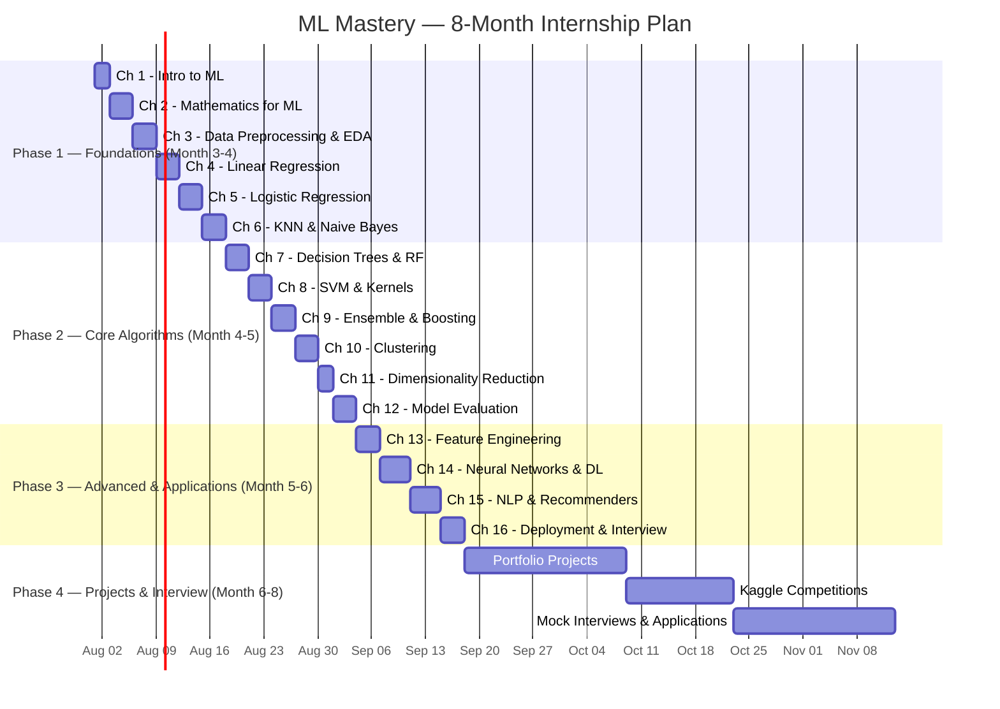
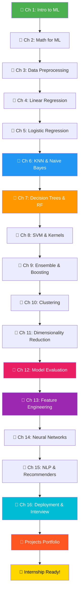
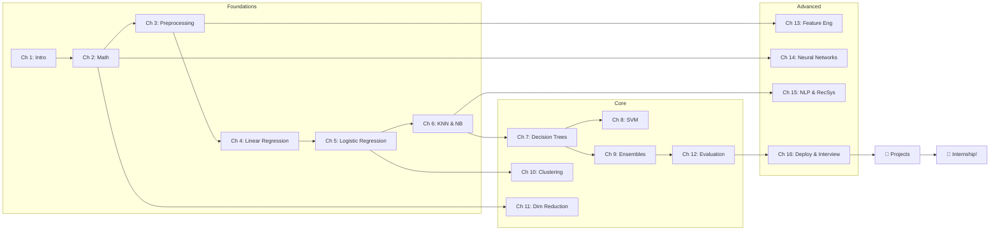

# 🧠 Machine Learning Mastery — Map of Content

> **Mission**: Master Machine Learning from zero to internship-ready in 8 months.
> **Audience**: 2nd-year BCA student (AI/ML + Full Stack) with Python mastery.
> **Strategy**: Theory → Code → Projects → Interview Prep → Deploy.

---

## 📋 Learning Roadmap

---

## 🗺️ Chapter Index

### 📘 Phase 1: Foundations

| # | Chapter | Key Topics | Difficulty |
|---|---------|-----------|------------|
| 1 | [[ml-chapter-01-introduction-to-machine-learning\|Introduction to Machine Learning]] | What is ML, types (supervised/unsupervised/RL), ML workflow, Python ecosystem, first model | ⭐ |
| 2 | [[ml-chapter-02-mathematics-for-ml\|Mathematics for ML]] | Linear algebra, calculus, probability, statistics, information theory | ⭐⭐ |
| 3 | [[ml-chapter-03-data-preprocessing-and-eda\|Data Preprocessing & EDA]] | Missing data, outliers, scaling, encoding, pipelines, Titanic walkthrough | ⭐⭐ |
| 4 | [[ml-chapter-04-linear-regression\|Linear Regression]] | OLS, gradient descent, polynomial regression, Ridge/Lasso, evaluation metrics | ⭐⭐ |
| 5 | [[ml-chapter-05-logistic-regression-and-classification\|Logistic Regression & Classification]] | Sigmoid, decision boundary, confusion matrix, ROC-AUC, imbalanced classes | ⭐⭐ |
| 6 | [[ml-chapter-06-knn-and-naive-bayes\|KNN & Naive Bayes]] | Distance metrics, choosing K, Bayes' theorem, text classification | ⭐⭐ |

---

### 📗 Phase 2: Core Algorithms

| # | Chapter | Key Topics | Difficulty |
|---|---------|-----------|------------|
| 7 | [[ml-chapter-07-decision-trees-and-random-forests\|Decision Trees & Random Forests]] | Entropy, Gini, information gain, pruning, bagging, feature importance | ⭐⭐⭐ |
| 8 | [[ml-chapter-08-svm-and-kernel-methods\|SVM & Kernel Methods]] | Hyperplanes, margins, kernel trick, RBF, soft/hard margin, SVR | ⭐⭐⭐ |
| 9 | [[ml-chapter-09-ensemble-methods-and-boosting\|Ensemble Methods & Boosting]] | AdaBoost, Gradient Boosting, XGBoost, LightGBM, CatBoost, stacking | ⭐⭐⭐ |
| 10 | [[ml-chapter-10-unsupervised-learning-clustering\|Unsupervised Learning — Clustering]] | K-Means, DBSCAN, hierarchical, GMM, silhouette score, customer segmentation | ⭐⭐⭐ |
| 11 | [[ml-chapter-11-dimensionality-reduction\|Dimensionality Reduction]] | PCA, t-SNE, UMAP, LDA, curse of dimensionality, Eigenfaces | ⭐⭐⭐ |
| 12 | [[ml-chapter-12-model-evaluation-and-selection\|Model Evaluation & Selection]] | Bias-variance, cross-validation, GridSearch, learning curves, nested CV | ⭐⭐⭐ |

---

### 📕 Phase 3: Advanced & Applications

| # | Chapter | Key Topics | Difficulty |
|---|---------|-----------|------------|
| 13 | [[ml-chapter-13-feature-engineering\|Feature Engineering]] | Transformations, encoding strategies, text features, time features, pipelines | ⭐⭐⭐ |
| 14 | [[ml-chapter-14-neural-networks-and-deep-learning-intro\|Neural Networks & Deep Learning]] | Perceptron, MLP, backpropagation, activation functions, TensorFlow/Keras, CNN/RNN intro | ⭐⭐⭐⭐ |
| 15 | [[ml-chapter-15-nlp-and-recommender-systems\|NLP & Recommender Systems]] | Text processing, TF-IDF, Word2Vec, sentiment analysis, collaborative filtering | ⭐⭐⭐⭐ |
| 16 | [[ml-chapter-16-ml-deployment-and-interview-prep\|ML Deployment & Interview Prep]] | Flask API, Docker, MLOps, 50 interview questions, case study framework, 8-month roadmap | ⭐⭐⭐⭐ |

---

### 🛠️ Projects & Practice

| # | Resource | Description |
|---|----------|------------|
| 🔨 | [[ml-projects-portfolio\|ML Projects Portfolio — 10 Hands-On Projects]] | 10 progressive projects from Iris classification to end-to-end deployment |

---

## 📈 Learning Path Flowchart

---

## 📊 Topic Dependencies

---

## 🎯 Study Strategy

### Daily Routine (Recommended)

| Time | Activity | Duration |
|------|---------|----------|
| Morning | Read 1 chapter section + understand theory | 1.5 hours |
| Afternoon | Run all code examples, modify them, break them | 2 hours |
| Evening | Solve practice exercises from the chapter | 1 hour |
| Night | Review interview questions + revise weak spots | 30 min |

**Total**: ~5 hours/day

### Weekly Milestones

- **Week 1-2**: Chapters 1-6 (Foundations)
- **Week 3-4**: Chapters 7-12 (Core Algorithms)
- **Week 5-6**: Chapters 13-16 (Advanced + Applications)
- **Week 7-10**: Build all 10 projects from the portfolio
- **Week 11-12**: Interview prep, mock interviews, applications

---

## 🔗 Related MOCs

- [[python-dsa-ml-mastery-moc|Python + DSA + ML Mastery MOC]]
- [[ai-ml-moc|AI & Machine Learning MOC]]
- [[study-moc|Study MOC]]

---

> *"In God we trust. All others must bring data."* — W. Edwards Deming
