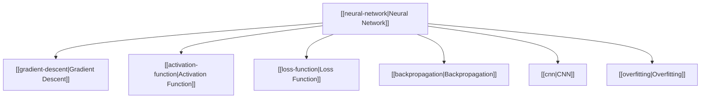

# Neural Network Map of Content

## Overview
This Map of Content (MOC) indexes the core concepts and techniques related to neural networks and deep learning. It details the fundamental building blocks (activation and loss functions), optimization techniques (gradient descent and backpropagation), network variants (CNN), and training phenomena (overfitting).

## Conceptual Architecture

## Core Nodes
- [[neural-network|Neural Network]] — Central concept and network architecture
- [[gradient-descent|Gradient Descent]] — Weight optimization algorithm
- [[activation-function|Activation Function]] — Introduction of non-linearity
- [[loss-function|Loss Function]] — Discrepancy measurement
- [[backpropagation|Backpropagation]] — Gradient calculation algorithm
- [[overfitting|Overfitting]] — Generalization error handling
- [[cnn|CNN]] — Spatial grid-structured neural network

## Related MOCs
- [[ai-ml-moc|🤖 AI & Machine Learning MOC]]
- [[prompt-engineering-moc|🧠 Prompt Engineering MOC]]
- [[tools-moc|🛠️ Tools MOC]]
