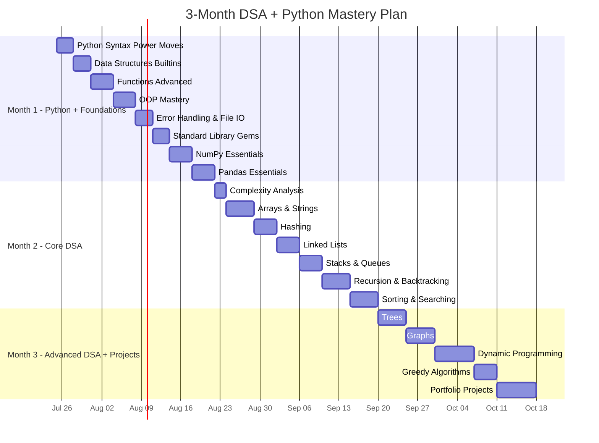
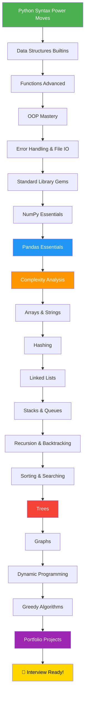
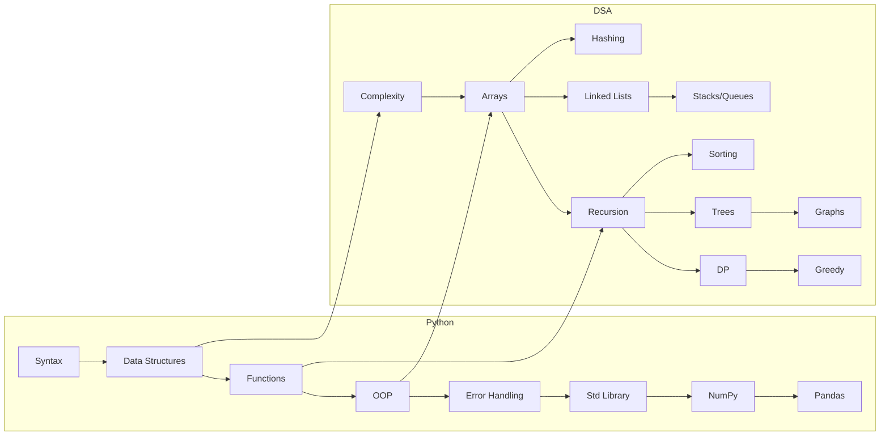

# 🐍 Python + DSA + ML Mastery MOC

> **Mission**: Master Python and core DSA in 3 months to crack an ML engineering internship.
> **Audience**: 2nd-year BCA student with Python basics (class 11/12 level).
> **Strategy**: Code-first learning → Interview problems → Portfolio projects.

---

## 📋 3-Month Study Schedule

---

## 🐍 Part 1: Python Core (Advanced)

| # | Note | Key Topics | Est. Days |
|---|------|-----------|-----------|
| 1 | [[Python Syntax Power Moves]] | f-strings, unpacking, walrus `:=`, type hints, slicing, Pythonic patterns | 3 |
| 2 | [[Python Data Structures Builtins]] | Lists, dicts, sets, tuples, deque, heapq, comprehensions | 3 |
| 3 | [[Python Functions Advanced]] | First-class functions, closures, decorators, generators, iterators, functools | 4 |
| 4 | [[Python OOP Mastery]] | Dunder methods, inheritance, abstract classes, dataclasses, design patterns | 4 |
| 5 | [[Python Error Handling and File IO]] | Custom exceptions, context managers, JSON/CSV, pathlib, logging | 3 |
| 6 | [[Python Standard Library Gems]] | collections, itertools, functools, heapq, bisect, regex, datetime | 3 |

---

## 🤖 Part 2: Python for ML

| # | Note | Key Topics | Est. Days |
|---|------|-----------|-----------|
| 7 | [[Python NumPy Essentials]] | Arrays, broadcasting, vectorization, linear algebra, random | 4 |
| 8 | [[Python Pandas Essentials]] | DataFrames, groupby, merge, pivot, apply, feature engineering | 4 |

---

## 📊 Part 3: Data Structures & Algorithms (3-Month Core)

### Month 2: Foundations

| # | Note | Key Topics | Difficulty | Est. Days |
|---|------|-----------|-----------|-----------|
| 9 | [[DSA Complexity Analysis]] | Big O, time/space complexity, Python operation costs | ⭐ | 2 |
| 10 | [[DSA Arrays and Strings]] | Two pointers, sliding window, prefix sum, Kadane's, matrix ops | ⭐⭐ | 5 |
| 11 | [[DSA Hashing]] | Hash maps, frequency counting, Two Sum, Group Anagrams, LRU Cache | ⭐⭐ | 4 |
| 12 | [[DSA Linked Lists]] | Singly/doubly LL, fast/slow pointers, reversal, merge | ⭐⭐ | 4 |
| 13 | [[DSA Stacks and Queues]] | Monotonic stack, min stack, priority queue, sliding window max | ⭐⭐ | 4 |
| 14 | [[DSA Recursion and Backtracking]] | Memoization, subsets, permutations, N-Queens, Sudoku solver | ⭐⭐⭐ | 5 |
| 15 | [[DSA Sorting and Searching]] | Merge/Quick sort, binary search mastery, search in rotated array | ⭐⭐ | 5 |

### Month 3: Advanced

| # | Note | Key Topics | Difficulty | Est. Days |
|---|------|-----------|-----------|-----------|
| 16 | [[DSA Trees]] | BST, traversals, LCA, Trie, heap, serialization | ⭐⭐⭐ | 5 |
| 17 | [[DSA Graphs]] | BFS, DFS, topological sort, Dijkstra's, Union-Find | ⭐⭐⭐ | 5 |
| 18 | [[DSA Dynamic Programming]] | 1D/2D DP, knapsack, LCS, LIS, coin change, state machine DP | ⭐⭐⭐⭐ | 7 |
| 19 | [[DSA Greedy Algorithms]] | Activity selection, interval scheduling, Huffman, jump game | ⭐⭐⭐ | 4 |

---

## 🛠️ Part 4: Projects

| # | Note | Projects |
|---|------|---------|
| 20 | [[Python ML Projects Portfolio]] | Custom DS Library, TF-IDF Search Engine, ML Pipeline from Scratch, Maze Solver, Data Dashboard |

---

## 📈 Learning Path Flowchart

---

## 🎯 Weekly Milestones

### Month 1: Python Mastery
- **Week 1**: Python Syntax + Data Structures → Can write Pythonic code
- **Week 2**: Functions + OOP → Can build classes and use decorators
- **Week 3**: Error Handling + Standard Library → Can write production-quality code
- **Week 4**: NumPy + Pandas → Can manipulate data for ML

### Month 2: DSA Foundations
- **Week 5**: Complexity + Arrays/Strings → Can analyze and solve array problems
- **Week 6**: Hashing + Linked Lists → Can use hash maps and pointer manipulation
- **Week 7**: Stacks/Queues + Recursion → Can solve stack-based and recursive problems
- **Week 8**: Sorting + Searching → Can implement and apply binary search

### Month 3: Advanced DSA + Projects
- **Week 9**: Trees → Can traverse and solve tree problems
- **Week 10**: Graphs → Can implement BFS/DFS and shortest path
- **Week 11**: DP → Can identify and solve DP problems
- **Week 12**: Greedy + Projects → Portfolio-ready for internship applications

---

## 📊 Topic Dependencies

---

## 🔥 Daily Study Routine (Recommended)

| Time | Activity | Duration |
|------|---------|----------|
| Morning | Read theory + code examples from notes | 1.5 hours |
| Afternoon | Solve 3-5 practice problems from the note | 2 hours |
| Evening | Implement 1 concept from scratch (no reference) | 1 hour |
| Night | Review + revise yesterday's weak areas | 30 min |

**Total**: ~5 hours/day

---

## 🔗 Related MOCs

- [[ai-ml-moc]]
- [[python-for-ai-beginner-course-moc]]
- [[study-moc]]

---

> *"The best way to learn to code is to code. Read the theory, then immediately write code. Don't just read — build."*
