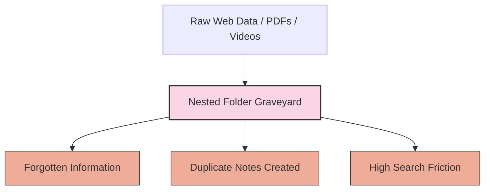
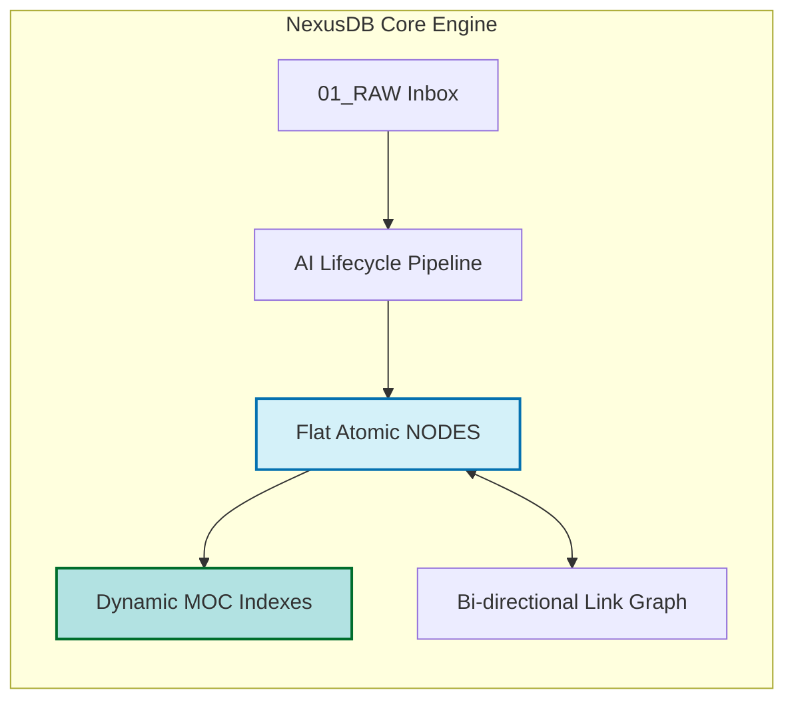
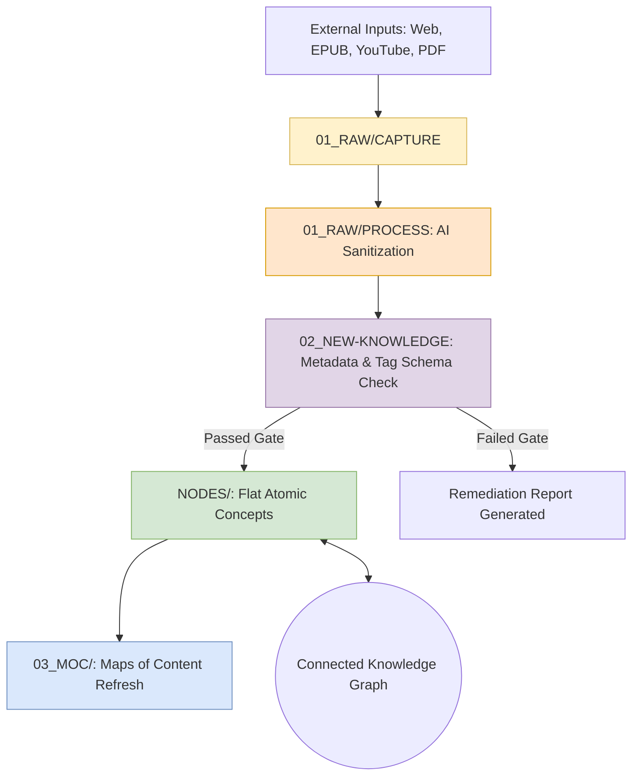
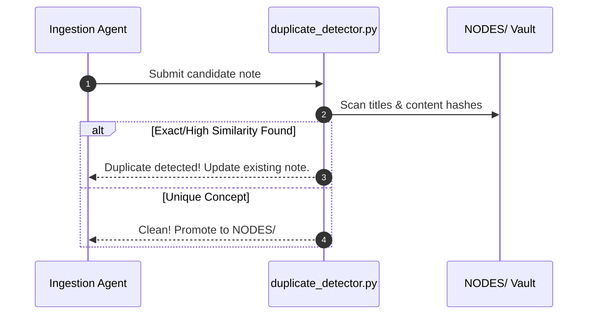
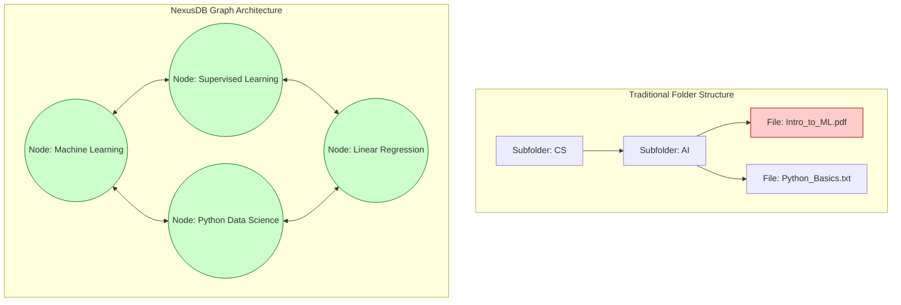
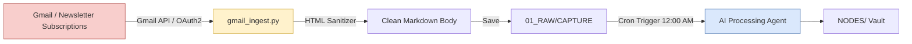

# 📊 NexusDB Presentation Deck & Architectural Diagrams
> **Subject:** Project Based Learning (PBL) — 3rd Semester BCA  
> **Topic:** NexusDB: Autonomous AI-Powered Second Brain & Knowledge Engine  

---


---

## 📽️ SLIDE 1: Title Slide

### Slide Content:
* **Project Title:** NexusDB — Autonomous AI-First Knowledge Engine
* **Sub-Title:** Solving Information Overload via Zettelkasten & AI Agents
* **Course:** Project Based Learning (PBL) | 3rd Semester BCA
* **Presented by:** [Your Name & Teammate Name]
* **Guided by:** [Mentor / Professor Name]

> **📢 Speaker Script:**  
> *"Good morning respected mentor and classmates. Today we present NexusDB — an autonomous, AI-native personal knowledge system designed to organize information, prevent duplicate learning, and transform raw files into a living, connected knowledge graph."*

---

## 📽️ SLIDE 2: The Problem — The Folder Graveyard 🪦

### Slide Content:
* 📉 **Information Overload:** Students bookmark 100s of articles, videos, and PDFs daily but forget 90% of them.
* 🗂️ **Folder Graveyard:** Deep nested subfolders (`/BCA/Sem3/Notes/Unit1/Old/...`) hide information forever.
* 🔄 **Redundancy & Duplication:** Students write the same notes multiple times without realizing they already exist.
* 🔍 **Dumb Search:** Keyword search fails when exact words don't match.



> **📢 Speaker Script:**  
> *"Traditional note-taking is broken. When we store PDFs in subfolders, they enter a graveyard. We never open them again. NexusDB solves this problem by eliminating folders entirely."*

---

## 📽️ SLIDE 3: The Solution — NexusDB Second Brain 🧠

### Slide Content:
* 🧩 **Atomic Knowledge (NODES):** 1 note = 1 idea. No massive cluttered files.
* 🗺️ **Maps of Content (MOCs):** Dynamic navigation hubs instead of folders.
* 🤖 **AI-Agent Orchestration:** Automated ingestion, tagging, and validation scripts.
* 🔗 **Bi-directional Graph:** Notes connect like neurons in a human brain.



> **📢 Speaker Script:**  
> *"NexusDB replaces static folders with a flat, atomic knowledge graph. Information is ingested, broken down into single concepts, and dynamically linked."*

---

## 📽️ SLIDE 4: Zero-Code Analogy (For Easy Understanding) 💡

### Slide Content:

| Traditional Folders 📁 | NexusDB Engine 🧠 |
| :--- | :--- |
| **Messy Closet:** Throwing clothes into 20 random bags. | **Smart Hanger System:** Every shirt has its own hanger (`NODES`), indexed on a wall board (`MOC`). |
| **Raw Ingredients:** Storing whole unpeeled vegetables. | **Prepared Meal:** Chopped, organized, and ready to cook instantly. |

> **📢 Speaker Script:**  
> *"Think of traditional note-taking like throwing your clothes into random plastic bags. NexusDB acts like a smart robot closet: it washes the clothes, hangs every single item on a separate hanger, and puts a map on the door so you find everything in 2 seconds."*

---

## 📽️ SLIDE 5: Architectural Data Flow Pipeline 🏗️



> **📢 Speaker Script:**  
> *"Here is our core data pipeline. Data moves through a strict 5-stage lifecycle. Raw data enters CAPTURE, gets cleaned in PROCESS, undergoes frontmatter schema validation in NEW-KNOWLEDGE, and only then gets promoted to NODES and MOC."*

---

## 📽️ SLIDE 6: Automated Engineering Engines ⚙️

### Slide Content:
1. 🏷️ **Tag Validation Engine (`validate_tags.py`):**
   - Enforces controlled vocabulary schema (`.antigravity/rules/tag-schema.md`).
   - Prevents ad-hoc, chaotic tagging.
2. 👯 **Duplicate Detection Engine (`duplicate_detector.py`):**
   - Computes text similarity and vector distance against existing nodes.
   - Prevents duplicate note creation automatically.
3. 🗺️ **Dynamic MOC Generator (`generate_mocs.py`):**
   - Automatically scans node tags and refreshes index navigation maps.



> **📢 Speaker Script:**  
> *"NexusDB isn't just notes — it's backed by Python automations. Our scripts automatically validate tags, detect duplicates, and generate index maps without human error."*

---

## 📽️ SLIDE 7: Folder Hierarchy vs. NexusDB Knowledge Graph 🕸️



> **📢 Speaker Script:**  
> *"Notice the difference on this slide. Hierarchical folders lock files in isolated trees. In NexusDB, notes form a web of bi-directional links, mimicking human memory."*

---

## 📽️ SLIDE 8: Future Integration — Gmail & Newsletter Automation 📩

### Slide Content:
* ✉️ **Gmail API Integration:** Automated background listener for emails tagged `#nexus-capture`.
* 📰 **Newsletter Ingestion:** Auto-fetch Tech Newsletters (TLDR, ByteByteGo, arXiv).
* ⏱️ **Cron Scheduler:** Automated midnight execution to digest daily captures into atomic notes.



> **📢 Speaker Script:**  
> *"For our future roadmap, we are building a Gmail API pipeline. Newsletters and emails will be fetched automatically, cleaned, and ingested into our knowledge vault every night while we sleep."*

---

## 📽️ SLIDE 9: Technology Stack & Tools 🛠️

### Slide Content:
* 🐍 **Language & Automation:** Python 3.12 (Automations & Scripts)
* 📝 **Knowledge Base Format:** GitHub Flavored Markdown + Standardized YAML Frontmatter
* 🌐 **Visualization Engine:** Obsidian.md + Mermaid.js
* 🤖 **AI Framework:** Google Antigravity Agent Framework + Gemini AI
* ⚡ **Data Structures:** Flat File Atomic Architecture + Bi-directional Links

> **📢 Speaker Script:**  
> *"Our tech stack is lightweight, local-first, and robust. We use Python 3.12 for back-end automations, Markdown with YAML frontmatter for storage, and Obsidian with Mermaid for graph visualization."*

---

## 📽️ SLIDE 10: Conclusion & Q&A ❓

### Slide Content:
* ✅ **NexusDB Summary:** An AI-first, zero-duplicate, scalable personal knowledge graph.
* 📈 **Impact:** Increases retrievability by 10x, eliminates folder clutter, and accelerates learning.
* 🎓 **Thank You!** Open for questions.

```text
       🧠 NexusDB: Knowledge that grows with you.
       Thank You! Any Questions?
```

> **📢 Speaker Script:**  
> *"NexusDB transforms how we store and recall knowledge. Thank you for your time, and we are now ready for your questions!"*
