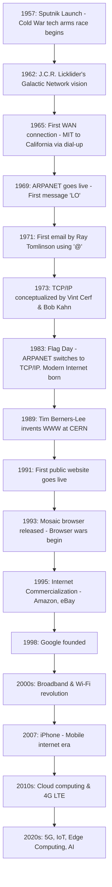
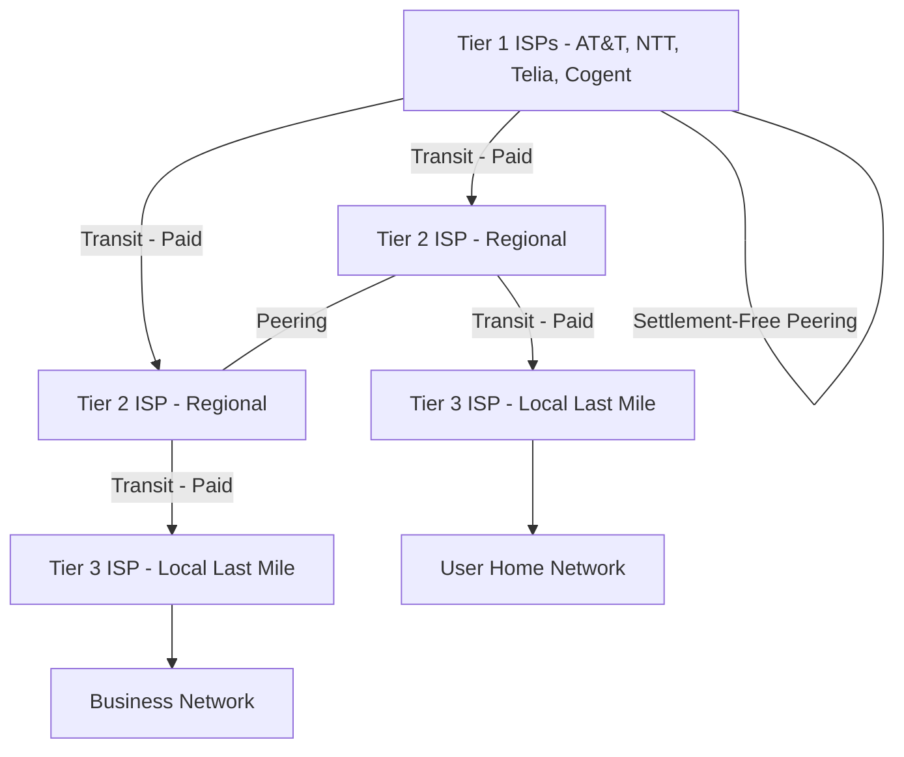

# Chapter 01: Foundations & Internet History

## BEGINNER SECTION: Core Concepts

### What is a Computer Network?
A computer network is a collection of interconnected devices (like computers, printers, servers, and smartphones) that communicate with one another to share resources and data. 

**Analogy:** Think of a computer network like a **postal system**. In a postal system, houses (devices) are connected by roads (cables or wireless signals). To send a package (data) from one house to another, you put it in a box (packet), write the destination address (IP address), and hand it to a postal worker (router). The postal worker determines the best route to deliver your package to the destination. 

### What is the Internet?
The Internet is not a single entity or "the cloud." It is a **network of networks**. It connects millions of private, public, academic, business, and government networks worldwide. When you connect to the internet, your home network connects to your Internet Service Provider's network, which connects to other ISPs, creating a global web of interconnected systems.

### Why Do We Need Networks? (5 Primary Goals)
1. **Resource Sharing:** Allowing multiple devices to use a single hardware or software resource. 
   * *Example:* An office with 50 computers sharing a single high-performance printer.
2. **Reliability:** Providing multiple points of failure so if one system crashes, another takes over.
   * *Example:* A database replicated across multiple servers; if one server burns down, data remains intact elsewhere.
3. **Cost Savings:** Centralizing resources and using cloud-based infrastructure reduces hardware investments.
   * *Example:* Using a central file server instead of buying 1TB hard drives for 100 individual employees.
4. **Communication:** Enabling real-time collaboration.
   * *Example:* Zoom video conferencing or sending an email instantly across the globe.
5. **Scalability:** The ability to add or remove resources effortlessly based on demand.
   * *Example:* Adding more web servers to a website cluster on Black Friday to handle traffic spikes.

### Autonomous Device Characteristics
A device must be "autonomous" to be considered a **host** on a network. This means it must have its own computing power and operating system capable of initiating or terminating communication independently. A dumb terminal (a monitor and keyboard hooked directly to a mainframe) is *not* a host. A smartphone or a laptop *is* a host.

### Real-World Use Cases by Sector
- **Banking:** ATM networks use highly secure, leased-line private networks to instantly verify balances and process transactions.
- **Education:** Learning Management Systems (LMS) like Canvas or Blackboard allow students to access coursework and submit assignments centrally.
- **Military:** Secure communications networks (like the SIPRNet in the US) isolate classified information from the public internet.
- **Healthcare:** Telemedicine and PACS (Picture Archiving and Communication Systems) allow doctors to view heavy MRI scans securely over the network from anywhere.
- **Entertainment:** Netflix uses CDNs (Content Delivery Networks) to cache movies in local ISP data centers so you can stream 4K video without buffering.

### Internet vs. World Wide Web
They are **NOT** the same thing.
- **The Internet** is the physical infrastructure and the protocols (TCP/IP) that connect devices globally. It is the roads and highways.
- **The World Wide Web (WWW)** is a service that runs *on top of* the Internet. It consists of linked documents (HTML pages) accessed via HTTP. It is the trucks and cars driving on the highways. Email, FTP, and multiplayer gaming use the Internet, but they are *not* the Web.

### What is a Protocol?
A protocol is a strict set of rules governing how data is formatted, transmitted, and received across a network. 
**Analogy:** Imagine two people meeting. One speaks only Japanese, the other only Spanish. Without a common language (protocol), they cannot communicate. A protocol dictates the "language," how to say "hello," how to ask for data, and how to say "goodbye."

### Basic Definitions
- **Node:** Any device connected to a network that can send, receive, or forward data (e.g., switches, routers, computers).
- **Host:** An end-system on the network (e.g., your laptop, a web server). All hosts are nodes, but not all nodes are hosts (a switch is a node, not a host).
- **Client:** A host that requests a service or data.
- **Server:** A powerful host that listens for requests and provides services or data.
- **Peer:** A device that acts as both a client and a server simultaneously in a decentralized network.

---

## INTERMEDIATE SECTION: Architecture & Evolution

### Historical Timeline

### Technological Evolution Phases
1. **Perimeter Computing:** Mainframes accessed by dumb terminals in the same building.
2. **Ubiquitous Internet:** Always-on broadband, smartphones, and global interconnectivity.
3. **IoT Era (Internet of Things):** Smart appliances, sensors, and vehicles constantly communicating without human intervention.

### Key Organizations
- **DARPA (Defense Advanced Research Projects Agency):** Funded the original ARPANET.
- **IETF (Internet Engineering Task Force):** Develops and promotes voluntary Internet standards (RFCs).
- **ICANN (Internet Corporation for Assigned Names and Numbers):** Manages IP address allocation and the global Domain Name System (DNS) root.
- **IEEE (Institute of Electrical and Electronics Engineers):** Defines hardware standards (like 802.11 for Wi-Fi and 802.3 for Ethernet).
- **W3C (World Wide Web Consortium):** Develops Web standards (HTML, CSS).
- **ISO (International Organization for Standardization):** Created the OSI model for networking.

### Network Architectures Comparison

| Feature | Client-Server | P2P (Peer-to-Peer) | Distributed |
| :--- | :--- | :--- | :--- |
| **Concept** | Central server handles requests from clients. | Every device is both client and server. | Workload spread across multiple nodes globally. |
| **Advantages** | Centralized control, easy to secure, easy to back up. | Highly resilient, no single point of failure, scales naturally. | Combines decentralization with high performance. |
| **Disadvantages** | Single point of failure, bottlenecks under heavy load. | Hard to secure, inconsistent speeds, difficult to manage. | Highly complex to implement and maintain synchronization. |
| **Examples** | Web browsing (HTTP), Email (SMTP/IMAP) | BitTorrent, early Napster | CDNs, Blockchain networks |

### Submarine Optical Fiber Cables
99% of all international internet traffic travels through undersea optical fiber cables, not satellites. 
- **Why undersea cables?** They offer vastly higher bandwidth and lower latency than satellite links.
- **Total Internal Reflection (TIR):** Light travels through the glass core of the fiber without escaping because the core's refractive index ($n_1$) is higher than the cladding's refractive index ($n_2$). The light hits the boundary at an angle greater than the critical angle. 
  - *Formula:* $\sin(\theta_c) = \frac{n_2}{n_1}$
- **Major Routes:** Trans-Atlantic (US to Europe), Trans-Pacific (US to Asia), and cables wrapping the African continent.
- **Cable Landing Stations:** Strategic coastal facilities where marine cables connect to terrestrial networks. They are highly secure due to their critical nature.
- **Speeds:** Modern cables utilize DWDM (Dense Wavelength Division Multiplexing) to achieve speeds over 100+ Tbps.

### ISP Architecture Hierarchy

- **Tier 1:** Global backbone providers. They own the submarine cables and don't pay anyone for internet access (settlement-free peering).
- **Tier 2:** Regional providers. They peer with each other to save money but pay Tier 1 ISPs for global reach (transit).
- **Tier 3:** Local "last-mile" providers (like your local cable company). They buy bandwidth from Tier 2 and sell it to consumers.

**Data Flow Example:** When you request a website hosted in Germany from your home in the US, your request goes from your router -> Tier 3 ISP -> Tier 2 ISP -> Tier 1 Backbone (via submarine cable) -> German Tier 1 -> German Tier 2/3 -> Web Server.

### Internet Exchange Points (IXPs) & CDNs
- **IXPs:** Physical buildings where different ISPs and CDNs connect their networks directly to exchange local traffic. This avoids sending traffic all the way up to a Tier 1 network and back down, reducing latency and costs. Examples: DE-CIX (Frankfurt), LINX (London).
- **CDNs (Content Delivery Networks):** Systems deployed by companies like Netflix or Cloudflare. They place cache servers directly inside Tier 3 ISPs or IXPs. When you request a movie, it streams from a server 5 miles away, not from a central server across the ocean.

### Switching Techniques Comparison

| Feature | Circuit Switching | Packet Switching | Message Switching |
| :--- | :--- | :--- | :--- |
| **Concept** | Dedicated physical path established before transmission. | Data broken into chunks (packets), routed independently. | Entire message sent from node to node (store and forward). |
| **Path** | Fixed path for duration of connection. | Packets take dynamic, varying paths. | Dynamic path, but whole message stays intact. |
| **Resource Usage**| Bandwidth reserved, inefficient if idle. | Shared bandwidth, highly efficient. | Shared, but requires large storage at intermediate nodes. |
| **Example** | Traditional telephone networks (PSTN). | The Internet (IP). | Early telegraph systems. |

---

## ADVANCED SECTION: Governance, Economics & Future

### The RFC Process (Request for Comments)
The Internet runs on standards defined by the IETF through RFC documents. An engineer submits a draft, and through rigorous peer review, it may become an RFC. 
- **Standards Track:** Official protocols (e.g., HTTP, TCP).
- **Informational:** General information, best practices.
- **Experimental:** New protocols being tested but not ready for production.
- **Historic:** Protocols that are obsolete and deprecated.

### BGP and Autonomous Systems (AS)
The internet is divided into thousands of **Autonomous Systems (AS)**—large networks operated by single organizations (ISPs, universities, large tech companies). Each AS has a unique ASN (Autonomous System Number). **BGP (Border Gateway Protocol)** is the "glue" of the internet. It is the routing protocol that allows one AS to advertise which IP addresses it knows how to reach to other ASes, enabling global routing. 

### ISDN (Integrated Services Digital Network)
Before broadband, ISDN was an early attempt to digitize the "last mile" over traditional copper phone lines, allowing simultaneous voice and data transmission. While it offered 128 kbps (a massive upgrade over 56k dial-up), it was complex and expensive. It served as the crucial evolutionary stepping stone to modern DSL and broadband technologies.

### Economics of Internet Infrastructure
- **Transit:** When a smaller ISP pays a larger ISP for access to the rest of the internet.
- **Peering:** When two networks agree to exchange traffic directly. 
- **Settlement-Free Peering:** When two networks of roughly equal size agree to exchange traffic for free, as it mutually benefits their customers.

### Network Neutrality
The principle that ISPs must treat all internet traffic equally, without discriminating or charging differently by user, content, website, or application. Without net neutrality, an ISP could theoretically slow down Netflix to force users to use the ISP's own streaming service, or charge extra for "fast lanes."

### Future of Internet Infrastructure
- **IPv6 Adoption:** Moving from 32-bit (IPv4) to 128-bit addresses to solve IP exhaustion.
- **5G/6G:** Acting not just as cellular networks, but as primary home broadband replacements.
- **Satellite Internet (Starlink):** LEO (Low Earth Orbit) satellite constellations providing low-latency internet to remote areas where laying fiber is uneconomical.
- **Edge Computing:** Pushing computational processing out of central cloud datacenters and placing it closer to the user (the "edge") to achieve near-zero latency for AI and IoT.

### Security Perspective: Why ARPANET Had No Security
The Internet was fundamentally built on **trust**. The original ARPANET connected a small group of trusted academic and military researchers. The goal was resilience against nuclear attacks (hence decentralized routing), not protection from hackers. As a result, core protocols (like IP, BGP, DNS, HTTP) were designed with zero encryption or authentication. Modern internet security (TLS, DNSSEC, IPsec) is entirely "bolted on" as an afterthought to patch these inherent design flaws.

---

## Exam Tips & Common Traps

### Exam Tips
- **Always remember TIR (Total Internal Reflection):** In fiber optics, remember that the core MUST have a higher refractive index than the cladding. 
- **OSI vs TCP/IP:** When asked about the historical standard, know that TCP/IP won the "protocol wars" over OSI because it was pragmatic and already working.
- **ISP Tiers:** Tier 1 = Global/No transit fees. Tier 3 = Local/Pays for everything. 

### Common Exam Traps
> [!WARNING]
> **TRAP:** "The World Wide Web is another name for the Internet."
> **FACT:** False. The Web (HTTP) is just one of many services running *on* the Internet.

> [!WARNING]
> **TRAP:** "Packet switching establishes a dedicated path before sending data."
> **FACT:** False. That is *Circuit Switching*. Packet switching routes each packet independently.

> [!WARNING]
> **TRAP:** "Satellites carry the vast majority of international internet traffic."
> **FACT:** False. Undersea fiber optic cables carry over 99% of international data.

---

## Key Terms Glossary
- **ARPANET:** The first wide-area packet-switched network, predecessor to the Internet.
- **Bandwidth:** The maximum rate of data transfer across a given path.
- **CDN (Content Delivery Network):** A geographically distributed network of proxy servers and their data centers.
- **Datagram/Packet:** A formatted unit of data carried by a packet-switched network.
- **Latency:** The time it takes for data to pass from one point on a network to another.
- **Multiplexing:** Combining multiple signals into one over a shared medium.
- **RFC (Request for Comments):** Formal documents that define internet standards.
- **Topology:** The physical or logical layout of a network.
