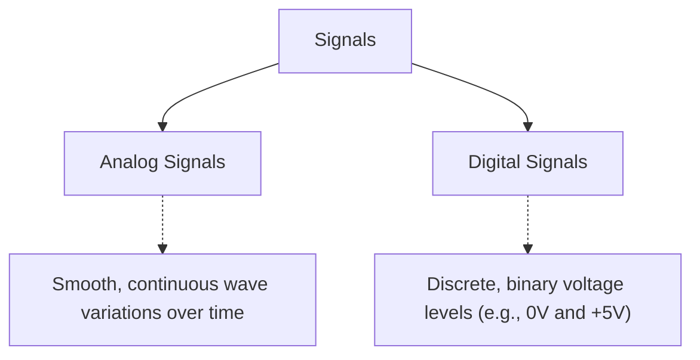
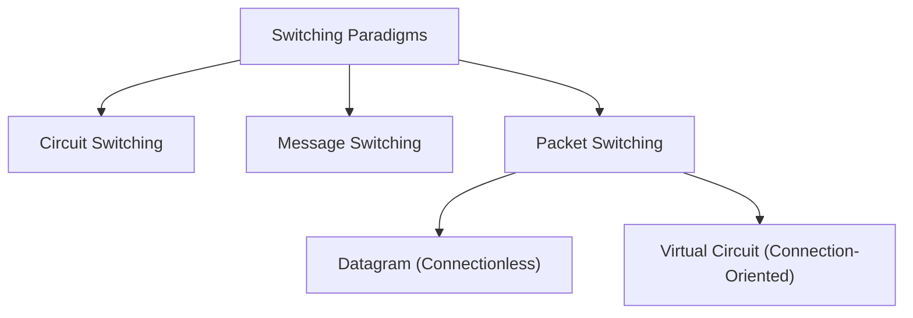

# Chapter 02: Data Communication and Transmission Fundamentals

## 1. BEGINNER SECTION

### 1.1 What is Data Communication?
Data communication is the exchange of data between two autonomous nodes (devices) across a physical or wireless transmission medium. The goal is to facilitate seamless communication, centralized data management, cost efficiency, and high reliability.

### 1.2 The 5 Components Model of Data Communication
Every successful data communication requires five distinct elements. 

**Analogy:** Consider writing a physical letter. The *message* is the content of the letter. The *sender* is you writing it. The *receiver* is your friend. The *transmission medium* is the postal network (trucks, planes, postal workers). The *protocol* dictates that you write in a mutually understood language, put a stamp on the top right, and format the address correctly.

```mermaid
flowchart LR
    Sender["Sender Node\n(Origin)"] -->|Message (Payload)| Medium["Transmission Medium\n(Guided/Unguided)"]
    Medium --> Receiver["Receiver Node\n(Destination)"]
    Protocol1["Protocol Suite\n(Rules)"] -.->|Governs| Sender
    Protocol2["Protocol Suite\n(Rules)"] -.->|Governs| Receiver
```

1. **Message**: The actual data or payload being transmitted. Types include text, numbers, images, audio, and video.
2. **Sender**: The node or device that initiates and transmits the data.
3. **Receiver**: The target node or device that receives the transmitted data.
4. **Transmission Medium**: The physical or wireless path (Twisted-pair, Coaxial, Fiber Optic, Radio waves) over which the data travels.
5. **Protocol**: The mutually agreed-upon set of rules governing the syntax, semantics, and timing of communication.

### 1.3 Why Protocols Matter
Protocols are essential. Without them, two devices might be connected physically but unable to communicate logically. 
**Analogy:** Two people who speak entirely different languages (e.g., one speaking only French, the other only Japanese) cannot communicate effectively even if standing right next to each other. Protocols provide a common, standardized language (syntax and semantics) so that bits on a wire are interpreted identically by both sides.

### 1.4 What is a Signal?
A signal is the physical representation of data as electrical voltages over copper wires, pulses of light over fiber, or electromagnetic radio waves over the air. It is how data physically traverses the medium.

#### Analog vs Digital Signals

- **Analog Signals**: Smooth continuous waves. They have infinite possible values within a range.
- **Digital Signals**: Discrete binary levels (0 and 1). Much more resilient to noise, easier to regenerate and process with modern digital computers.

### 1.5 Data Representation Basics
- **Text**: Represented using character encoding standards like ASCII (7/8-bit) and Unicode (UTF-8, up to 32-bit).
- **Numbers**: Represented in binary base-2 format.
- **Images**: Composed of a matrix of pixels. In a color image, each pixel is represented by RGB (Red, Green, Blue) values, typically 8 bits per color (24-bit total).
- **Audio**: Continuous sound waves are digitized via sampling. The quality depends on the *sampling rate* (samples per second) and *bit depth* (bits per sample).
- **Video**: Represented as a sequence of discrete images called frames, played at a specific *frames per second* (FPS) to create the illusion of motion.

---

## 2. INTERMEDIATE SECTION

### 2.1 Effectiveness Criteria for Data Communication
Four critical metrics define the effectiveness of a network communication system:

1. **Delivery**: Data must reach the correct destination. *Real-world impact:* Delivering data to the wrong destination constitutes a data breach or privacy violation.
2. **Accuracy**: Data must remain completely unaltered. *Real-world impact:* A single flipped bit (bit error) can corrupt a software executable, crash a system, or alter a financial transaction amount.
3. **Timeliness**: Data must be delivered within an acceptable time window. *Real-world impact:* Real-time video calls require instant delivery; otherwise, the conversation breaks down. Batch operations like email are more forgiving.
4. **Jitter**: The variation in packet arrival times. *Real-world impact:* Crucial for Voice over IP (VoIP). If voice packets arrive with wildly varying delays, the audio becomes choppy, robotic, and unintelligible.

### 2.2 Transmission Modes
Transmission mode determines the direction of signal flow between two linked nodes.

| Transmission Mode | Flow Direction | Technical Mechanics & Analogies | Real-World Examples |
|---|---|---|---|
| **Simplex** | Unidirectional | One node is a permanent sender; the other is a permanent receiver. Cannot reverse direction. Simple hardware. <br>**Analogy:** Television broadcast or a one-way street. | Keyboard to PC, Television/Radio Broadcast |
| **Half-Duplex** | Bidirectional (Alternating) | Both nodes can send and receive, but only one at a time. Must wait for the other to finish; collisions possible if both send simultaneously. <br>**Analogy:** Walkie-Talkies ("over") or a single-lane bridge. | Walkie-Talkies, CB Radio, Early Ethernet Hubs |
| **Full-Duplex** | Bidirectional (Simultaneous) | Both nodes can send and receive simultaneously over dual channels or separate frequencies. Doubles effective bandwidth. <br>**Analogy:** A modern telephone call or a dual-carriageway highway. | Telephone Call, Modern Full-Duplex Ethernet Switches |

### 2.3 Physical Media Deep Dive (Guided vs Unguided)

#### Guided (Wired) Media
**1. Twisted Pair Cable**
Consists of insulated copper wires twisted together. Twisting reduces electromagnetic interference (EMI) and crosstalk because the equal and opposite currents induced in the twisted pairs cancel each other out.
- **UTP (Unshielded Twisted Pair)**: Common, cheap, flexible.
  - *Cat3*: 10 Mbps
  - *Cat5*: 100 Mbps
  - *Cat5e*: 1 Gbps up to 100m
  - *Cat6*: 10 Gbps up to 55m
  - *Cat6a*: 10 Gbps up to 100m
  - *Cat7*: 10 Gbps with improved shielding
  - *Cat8*: 25-40 Gbps for short data center runs
- **STP (Shielded Twisted Pair)**: Contains a metallic foil shield for harsh EMI environments.
- **RJ45 Connector**: Used for terminating twisted pair. T568A and T568B are the wiring pinout standards.
- **Straight-Through vs Crossover Cables**: Straight-through connects unlike devices (PC to Switch). Crossover connects like devices (PC to PC, Switch to Switch), though modern Auto-MDIX renders crossover cables mostly obsolete.

**2. Coaxial Cable**
Structure: Inner copper conductor + solid insulator + outer braided metal shield + outer jacket.
- Features higher bandwidth and better shielding than twisted pair.
- **Types**: RG-58 (thinnet, 10BASE-2), RG-8 (thicknet, 10BASE-5).
- **Use Cases**: Cable TV networks, older legacy bus topology LANs.

**3. Fiber Optic Cable**
Transmits data as rapid pulses of light through a glass or plastic core using the principle of **Total Internal Reflection** (light stays inside the core if the injection angle exceeds the critical angle).
- **Single-mode fiber (SMF)**: Very narrow core (~9μm). Uses laser diodes. Light travels straight. Very long distance (km to hundreds of km). Expensive. Used in WAN backbones and submarine cables.
- **Multi-mode fiber (MMF)**: Wider core (50-62.5μm). Uses cheaper LED light sources. Light bounces around the core (multiple modes). Shorter distance (<2km). Used in campus/building networks.
- **Advantages**: Completely immune to EMI, extremely low attenuation, near-infinite bandwidth potential, highly secure (difficult to tap without detection).
- **Connectors**: SC, LC, ST, FC, MPO. Small Form-factor Pluggable (SFP) transceivers convert electrical signals to optical pulses.

#### Unguided (Wireless) Media
Data is transmitted through the air/vacuum via electromagnetic waves without physical boundaries.
- **Radio Waves**: 3 kHz to 1 GHz. Omnidirectional, easily penetrates walls. Wi-Fi (2.4/5/6 GHz), Bluetooth, AM/FM radio, Cellular.
- **Microwave**: 1 GHz to 300 GHz. Unidirectional, strictly line-of-sight. Used for point-to-point links and satellite uplinks.
- **Infrared**: 300 GHz to 400 THz. Very short range, strict line-of-sight, cannot penetrate solid objects (e.g., TV remotes, old IrDA ports).
- **Propagation Effects**: Attenuation (signal weakens over distance), Reflection (bouncing off surfaces), Diffraction (bending around edges), Multipath Interference (signals taking multiple paths and arriving out of phase).

#### Comprehensive Media Comparison Table

| Feature | Twisted Pair (UTP) | Coaxial Cable | Fiber Optic | Wireless (Radio/Wi-Fi) |
|---|---|---|---|---|
| **Medium Type** | Guided (Copper) | Guided (Copper) | Guided (Glass/Plastic) | Unguided (Air/Space) |
| **Signal Form** | Electrical Voltages | Electrical Voltages | Light Pulses | Electromagnetic Waves |
| **Bandwidth** | Low to High (up to 40G) | Moderate | Extremely High (Tbps+) | Moderate to High |
| **Max Distance** | 100 meters | ~500 meters | 100+ kilometers | Varies (10m to miles) |
| **EMI Immunity** | Low/Moderate | Moderate | **Total Immunity** | Highly Susceptible |
| **Security** | Low (easy to tap) | Low | High (hard to tap) | Very Low (open air) |
| **Cost** | Very Low | Moderate | High | Low (no cabling) |

### 2.4 Switching Paradigms
Switching is the mechanism used to route data across intermediate nodes from source to destination.



#### 1. Circuit Switching
- **Mechanism**: A dedicated physical path is established between sender and receiver before any communication begins. This path is held exclusively for the entire duration of the session.
- **Phases**: Connection Setup $\rightarrow$ Data Transfer $\rightarrow$ Connection Teardown.
- **Advantages**: Guaranteed dedicated bandwidth, perfectly predictable latency, zero queuing delay during transmission.
- **Disadvantages**: Inefficient bandwidth utilization (wastes capacity during silent periods), slow initial setup time, scales poorly.
- **Example**: Traditional PSTN (Public Switched Telephone Network) voice calls.
- **Calculation**: If a 1 Mbps link is shared by 10 circuit-switched users, each user gets exactly 100 kbps guaranteed, regardless of whether they are actively sending data.

#### 2. Message Switching
- **Mechanism**: Complete message is stored entirely at each intermediate node before being forwarded to the next node (Store-and-Forward). No dedicated path.
- **Disadvantages**: High latency/delay, requires massive storage buffers at every router, completely unsuitable for real-time traffic.
- **Historical Example**: Old telegraph systems, early email relay systems.

#### 3. Packet Switching
- **Mechanism**: The data payload is chopped into discrete, fixed or variable-sized chunks called packets. Each packet gets a header (containing source/destination IPs, sequence numbers) and is routed independently.
- **Advantages**: Highly resilient, highly efficient bandwidth utilization via statistical multiplexing.
- **Sub-types**:
  - *Datagram (Connectionless)*: Every packet routed independently. Packets may arrive out of order. Standard IP routing uses this.
  - *Virtual Circuit (Connection-Oriented)*: A logical path is set up first, and all packets follow that identical path in order. (Examples: ATM, Frame Relay, MPLS).
- **Calculation**: If a 1 Mbps link has 10 users, but each user only actively transmits 10% of the time, packet switching can theoretically support all 10 users seemingly getting the full 1 Mbps simultaneously due to statistical multiplexing gain.

#### Switching Paradigm Comparison Table

| Property | Circuit Switching | Message Switching | Packet Switching |
|---|---|---|---|
| **Path Reservation** | Dedicated physical circuit established. | No dedicated path. | No dedicated path (except in VC). |
| **Data Unit** | Continuous bitstream. | Entire whole message. | Discrete small packets. |
| **Delay Characteristics** | High setup delay; zero queuing delay. | High store-and-forward delay. | Low setup; variable queuing delay. |
| **Bandwidth Usage** | Inefficient; reserved even if idle. | Efficient (shared). | Highly efficient (statistical multiplexing). |
| **Order of Arrival** | Guaranteed in-order. | Guaranteed in-order. | Out-of-order possible (Datagram). |

---

## 3. ADVANCED SECTION

### 3.1 Network Performance Metrics & Mathematical Treatment

Understanding the mathematical physics of network communication is crucial for capacity planning and troubleshooting.

#### Bandwidth ($B$) and Throughput
- **Bandwidth ($B$)**: The theoretical maximum data transfer rate of a link, measured in bits per second (bps). It is the physical "width of the pipe."
- **Throughput**: The actual, measured, real-world rate of successful data delivery. Due to protocol overhead (headers), error retransmissions, and media collisions, Throughput $\le$ Bandwidth always.

#### Latency Components
Latency (Delay) is the total time required for a packet to travel from source to destination. It comprises four distinct components:
$T_{total} = T_t + T_p + T_{queue} + T_{process}$

1. **Transmission Delay ($T_t$)**: The time required for the sender's network interface to push all the bits of the packet onto the physical wire.
   $$T_t = \frac{L}{B}$$
   *(where $L$ = packet length in bits, $B$ = bandwidth in bps)*
2. **Propagation Delay ($T_p$)**: The time it takes for a single bit to physically travel through the medium from sender to receiver.
   $$T_p = \frac{d}{v}$$
   *(where $d$ = distance in meters, $v$ = propagation speed. $v \approx 2 \times 10^8$ m/s in copper/fiber, $3 \times 10^8$ m/s in a vacuum)*
3. **Queuing Delay ($T_{queue}$)**: The time a packet spends sitting in a router's buffer waiting for its turn to be transmitted. Highly variable based on network congestion.
4. **Processing Delay ($T_{process}$)**: The time a router takes to inspect the packet header, determine the routing table match, and perform checksum error verification. Usually measured in microseconds.

#### Round Trip Time (RTT) & Bandwidth-Delay Product (BDP)
- **RTT**: The time for a small packet to reach the destination and for the acknowledgment to return. Ignoring queuing/processing, $RTT \approx 2 \times T_p$.
- **Bandwidth-Delay Product (BDP)**: The maximum amount of unacknowledged data that can be "in flight" inside the network pipe at any given microsecond. Critical for tuning TCP Window sizes.
  $$BDP = B \times RTT$$
  *Worked Example*: A 1 Gbps ($10^9$ bps) link across the country with a 100ms ($0.1$ s) RTT.
  $BDP = 10^9 \text{ bps} \times 0.1 \text{ s} = 10^8 \text{ bits}$.
  Convert to Bytes: $10^8 / 8 = 12.5$ Megabytes.
  *Meaning:* The sender must have a TCP send window of at least 12.5 MB to fully saturate this link; otherwise, it will stall waiting for ACKs.

#### Jitter Mathematical Definition
Jitter is the absolute variance in arrival delays between consecutive packets.
$$J = |T_{arrival,i} - T_{arrival,i-1} - T_{expected}|$$
*Impact on VoIP*: To combat jitter, endpoints use a "jitter buffer" that artificially delays incoming packets slightly to play them back at a smooth, constant rate. However, a buffer that is too large introduces excessive overall latency, hurting conversational flow.

### 3.2 Network Performance Calculations (Exam Math)

**1. Transfer Time Calculation**
*Question*: How long will it take to transfer a 5 MB file over a 10 Mbps link? (Ignore propagation and overhead).
*Solution*:
- File Size $L = 5 \text{ MB} = 5 \times 10^6 \text{ Bytes} = 40 \times 10^6 \text{ bits}$.
- Bandwidth $B = 10 \text{ Mbps} = 10 \times 10^6 \text{ bps}$.
- Time $T_t = \frac{L}{B} = \frac{40 \times 10^6}{10 \times 10^6} = 4 \text{ seconds}$.

**2. Link Efficiency Calculation (Stop-and-Wait ARQ)**
*Question*: A 1000-byte packet is sent over a 1 Mbps link spanning 10,000 km. Signal speed is $2 \times 10^8$ m/s. What is the link efficiency?
*Solution*:
- $L = 1000 \times 8 = 8000 \text{ bits}$.
- $B = 1,000,000 \text{ bps}$.
- $T_t = \frac{L}{B} = \frac{8000}{10^6} = 0.008 \text{ seconds} = 8 \text{ ms}$.
- $d = 10,000 \text{ km} = 10^7 \text{ meters}$.
- $v = 2 \times 10^8 \text{ m/s}$.
- $T_p = \frac{d}{v} = \frac{10^7}{2 \times 10^8} = 0.05 \text{ seconds} = 50 \text{ ms}$.
- $a = \frac{T_p}{T_t} = \frac{50}{8} = 6.25$.
- Efficiency $\eta = \frac{1}{1 + 2a} = \frac{1}{1 + 12.5} = \frac{1}{13.5} \approx 0.074 \text{ or } 7.4\%$.
*(The sender spends 92.6% of the time just waiting for acknowledgments!)*

### 3.3 Integrated Services Digital Network (ISDN)
**Historical Context**: ISDN was an early effort to transmit fully digital voice, video, and data over existing copper PSTN telephone lines before the advent of modern broadband.
- **BRI (Basic Rate Interface)**: Aimed at homes and small businesses. Consisted of 2 Bearer (B) channels and 1 Data/Control (D) channel (2B+D).
  - B-Channels: $2 \times 64 \text{ kbps} = 128 \text{ kbps}$ for user payload.
  - D-Channel: $1 \times 16 \text{ kbps}$ for signaling.
  - Total bandwidth: $144 \text{ kbps}$.
- **PRI (Primary Rate Interface)**: Aimed at enterprises and PBX trunks.
  - US/Japan (T1 standard): 23B+D ($23 \times 64\text{k} + 64\text{k} = 1.544 \text{ Mbps}$).
  - Europe (E1 standard): 30B+D ($30 \times 64\text{k} + 64\text{k} = 2.048 \text{ Mbps}$).
- **Why ISDN Failed**: It was rapidly superseded by ADSL and Cable Modems, which were cheaper to deploy and offered significantly higher asynchronous download bandwidths.

### 3.4 Power over Ethernet (PoE)
PoE (IEEE 802.3 standard) allows electrical DC power to be transmitted alongside data over standard twisted-pair Ethernet cables. This eliminates the need for separate electrical wall outlets for remote networking hardware.
- **How it works**: Power is injected either over the spare/unused wire pairs (Mode B) or multiplexed directly over the data pairs using common-mode voltage transformers (Mode A / 4PPoE).
- **Standards Evolution**:
  - **802.3af (PoE)**: Up to 15.4W at the switch (guarantees 12.95W at the device due to cable resistance). Used for basic IP phones and small 802.11g/n access points.
  - **802.3at (PoE+)**: Up to 30W. Used for advanced dual-band Access Points and basic motorized video cameras.
  - **802.3bt (PoE++)**: Type 3 (up to 60W) and Type 4 (up to 100W). Uses all 4 pairs (4PPoE). Powers massive multi-radio APs, Pan-Tilt-Zoom (PTZ) security cameras with heaters, and even entire thin-client PC workstations.

---

## 4. EXAM TIPS & COMMON TRAPS

- **Trap 1: Confusing Bandwidth with Throughput.**
  Bandwidth is theoretical capability; throughput is actual achieved speed. Bandwidth is always greater than or equal to throughput.
- **Trap 2: Ignoring units in Latency math.**
  Remember that packet size $L$ is usually given in Bytes, but Bandwidth $B$ is in bits per second. You MUST multiply Bytes by 8 before dividing by Bandwidth. ($T_t = L / B$).
- **Trap 3: RTT vs One-Way Delay.**
  If a problem gives you $T_p$ (one-way propagation delay) and asks for RTT, remember $RTT \approx 2 \times T_p$.
- **Trap 4: Circuit vs Packet Switching Efficiency.**
  Circuit switching is highly inefficient for bursty data traffic but highly efficient for maintaining fixed-delay continuous streams (like old voice). Packet switching is the opposite.
- **Trap 5: MMF vs SMF Use Cases.**
  Single-Mode Fiber (SMF) has a smaller core and goes further distances (WANs). Multi-Mode Fiber (MMF) has a wider core and is for shorter distances (LANs). Do not mix them up.

---

## 5. KEY TERMS GLOSSARY
- **Attenuation**: The gradual loss of signal strength as it travels through a transmission medium.
- **Baseband**: A transmission technique where the entire capacity of the medium is used by a single unmodulated digital signal.
- **Broadband**: A transmission technique that multiplexes multiple signals onto a single medium using different analog frequency bands.
- **Crosstalk**: Electromagnetic interference caused when signals on one wire induce a magnetic field that corrupts the signal on an adjacent wire.
- **Multiplexing**: The process of combining multiple logical data streams into one physical signal over a shared medium.
- **Transceiver**: A hardware component that can both transmit and receive signals (e.g., an SFP module).
